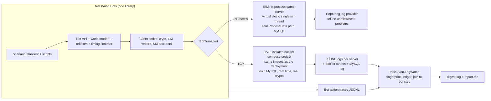

# End-to-end player simulation plan

**Goal.** Test the whole server the way a player uses it (log in, create a character, move, fight, quest,
gather, craft, trade, group, run instances) with no human in the loop, fast enough to run before every commit, and with
every server error surfaced the moment it happens, attributed to the bot action that caused it.

**Status.** Implementation in progress. Written 2026-09-17 against `main` at `488763e0c`;
every claim in §1, §7 and the appendices was re-checked against the code by an independent review pass.
The maintainer's decisions (§6) were applied the same day: no hosted CI and no schedulers; test runs are
local scripts. The `docker/` compose stack stays: it is how the emulator is deployed and run, and LIVE bot
runs use their own isolated compose project.

**Deferred continuous-play goal.** [Natural Ishalgen Journey](natural-ishalgen-journey.md)
records the later goal of an ordinary player bot progressing from character creation through implemented
content without GM assistance, visible alongside human players. Review readiness after Phase 10 and the
broader game journey after Phase 11. This is additional bot-policy work; completing the scenario phases
alone does not prove autonomous progression. It does not authorize adding unimplemented quests or content.

## How to use this document

- Phases are ordered by dependency. Inside a phase, TODOs run in order unless marked otherwise; explicit
  `Depends on` lines point across phases.
- **Deferred is not done.** At the end of the non-deferred work, review all deferred items with the
  maintainer and return to them only when ready (D18). Keep their checkboxes open and original acceptance
  criteria visible; this checkpoint does not automatically authorize deferred execution or lift limits.
- Each TODO has an id (`P3-06`), a mode tag and a size. When one lands, tick the box and append the commit
  SHA: `- [x] P1-04 ... (a1b2c3d)`.
- Modes: **[SIM]** means in-process on a virtual clock. **[LIVE]** means real processes, sockets and MySQL in
  real time. **[BOTH]** means shared code or a fix both need.
- Sizes: **S** is under a day, **M** is 1–3 days, **L** is 1–2 weeks, **XL** is more.
- File and line references were correct at `488763e0c`. Re-grep before editing.
- Record decisions in [§6](#6-decision-log). Java ↔ C# divergences found along the way go in [§7](#7-parity-bugs-found-during-research)
  and are fixed the normal way: read the Java first, cite it in the commit.
- **The Java spec for this work is `upstream/4.8` at `lastCompletedJavaCommit`**
  (`docs/upstream-port-state.json`, currently `ce54b7931`). The local `../aion-server` branch `4.8` was
  fast-forwarded to it on 2026-09-17 (D8); keep it there as ports advance, because
  `scripts/parity/check_fidelity.py` and anyone reading Java side by side use that working tree.
- **Do not create branches or worktrees in this repo.** Ordinary branches in `../aion-server` are allowed when a
  TODO genuinely needs one (D12, for example P0-05). The later global AGENTS.md policy prohibits worktrees there too.
- **No hosted CI, no schedulers** (D9). Every test run is a local script. The `docker/` compose stack is how
  the emulator is deployed and run; LIVE test runs use a separate compose project and never disturb it (D13).

---

## 1. Where we are today

### What already exists and will be reused

| Asset | Where | What it gives us |
|---|---|---|
| Boss AI harness | `tests/Aion.GameServer.Tests/Ai/BossAiHarness.cs` | One-map headless world on real static data and the real spawn path. It is an **NPC-decision** harness: its player has no connection, is invulnerable, has no DB, geo is off and movement is bypassed. |
| Virtual scheduler | `tests/Aion.GameServer.Tests/Ai/VirtualThreadPool.cs` | Replaces `ThreadPoolManager`; `Advance()` runs due timers synchronously. Needs hardening before a whole server can run on it (`P1-10`, `P5-00`). |
| Clock hook | `src/Aion.GameServer/Utils/SystemClock.cs` | AsyncLocal-over-process-wide overridable wall clock; mixed-clock pairs plus shared server, scheduler and quest time are routed through it. |
| Full in-process boot | `GameServerBootstrapTests.GameServerBootstrap_DbBackedFullBoot_RunsRealStartAsyncAgainstLiveMySql` | Real `StartAsync` against MySQL and real static data. Env-gated (`AION_GAMESERVER_DB_INTEGRATION=1`); runs only when that is set. |
| Login-server client | `tests/Aion.LoginServer.Tests/SocketServerSmokeTests.cs` | Blowfish frame crypto, first-packet decrypt, `CM_AUTH_GG`/`CM_LOGIN`/`CM_SERVER_LIST`/`CM_PLAY`/`CM_UPDATE_SESSION` builders, full handshake. Test-private. |
| Game bot codec | `tests/Aion.Bots/Protocol/GamePacketCodec.cs` | Stateful client encryption/server decryption, both opcode transforms, validated headers and u16 framing; interoperability is pinned against production crypt. |
| Chat client builders | `tests/Aion.ChatServer.Tests/Integration/ChatConnectionSmokeTests.cs` | Chat auth, channel join, channel message. |
| Socketless connection trick | `ChatAuthenticationBridgeTests.QueuedClientConnection`, `OutboundLinkLifecycleTests.RecordingAionConnection` | An `AionConnection` built by reflection over an unconnected socket. Brittle but proves the idea. |
| Golden server packets | `parity-artifacts/golden/packets/` | 181 Java-generated SM fixtures (364 cases; `payloadHex` is the body only): decoder test vectors. |
| Packet capture hook | `AionServerPacket.SetCaptureObserver` | Sees every serialized server packet (object and clear bytes). No callers today. C#-only. |
| Docker deployment | `docker/docker-compose.yml`, `docker/deploy.ps1`, `docker/.env` | MySQL 8.4 plus login, chat and game servers: the maintainer's only way of running the emulator. Test runs never touch its `aion` compose project, containers, images, databases or `aion_aion-mysql-data` volume; LIVE runs use their own compose project (P3-02). |
| Development MySQL | A MySQL 8.4 in Docker (the stack's `aion-mysql`, or `scripts/start-mixed-mode-db.ps1`) | SIM runs may freely create and drop their own throwaway databases (`aion_gs_sim_<run>_<shard>`). |
| GM commands | `src/Aion.GameServer/Handlers/AdminCommands` (101) | Fast scenario setup: `//add`, `//set level`, `//moveto`, `//quest`, `//kill`, `//siege`, `//rift`, `//instance`, ... |
| Account auto-create | `loginserver.accounts.autocreate` (default true) | Bots need no account seeding except GM access levels. |
| Admin HTTP API | `src/Aion.GameServer/Services/Admin/AdminHttpService.cs` | Token-protected player and storage state; a LIVE assertion oracle. C#-only. |
| Twin channels in starter zones | `world_maps.xml` (Poeta, Ishalgen `twin_count=5`), `CM_CHANGE_CHANNEL` | Isolates concurrent scenarios that would otherwise fight over the same mobs and nodes. |
| Open live journeys | `docs/Deep-Port-Audit-Remediation-Tracker.md` (release gates 1–2) | Five code-complete findings (two-GS transfer, chat auth, login bans, siege, hardware ban) that only a multi-process run can close (`P10-11`). |

### What blocks the goal

| # | Finding (verified 2026-09-17) | Why it matters | Evidence |
|---|---|---|---|
| B1 | **Resolved through P5-09.** P1 established scoped logging, stable fingerprints and the shared owner/reason/expiry allowlist; P5-09 added the previously named but not-yet-implemented in-memory capture provider and the SIM end-of-scenario failure policy. | A green instrumented run can no longer hide logged problems. | `CapturingLoggerProvider.cs`; `LogFingerprint.cs`; `LogProblemAllowlist.cs`; `SimulationLogPolicy.cs` |
| B2 | **Resolved in P1-04.** Each periodic iteration now runs through the Java-style `ExecuteWrapper`, so failures are logged without killing the schedule; deadlines advance at a fixed rate and pooled work emits Java's slow-task warning. | One bad NPC no longer stops all NPC movement for the rest of a LIVE run. | `ThreadPoolManager.cs`; `ExecuteWrapper.cs` |
| B3 | **Resolved through P4-10.** P4-01 put every identified mixed-clock pair on `SystemClock`; P4-02 added host-wide control and routed server-zone time, scheduled-task due metadata and quest timestamps; P4-03/P4-04 inventoried and migrated the remaining gameplay clocks and made direct `DateTime` wall-clock access an RS0030 error; P4-10 moved the last deferred retail-AI deadline comparison onto the shared clock. | Virtual combat, movement, item/effect expiry, services, persistence timestamps, shared time services and retail-AI timer ordering now advance together; the 20-read floor is reviewed infrastructure. | `SystemClock.cs`; `BannedSymbols.txt`; `check-clock-reads.ps1` |
| B4 | **Partly resolved through P5-00.** The virtual scheduler now surfaces faults, rejects backward time, reports virtual delay correctly, orders work through a due-time/insertion-order priority queue, guards re-entrant/concurrent advancement and cross-thread scheduling during advancement, and has strict disposal enabled throughout the existing boss-AI harness. Deterministic mode routes movement sequentially, periodic-manager rearming, `NetFlusher`, shutdown countdowns and cron jobs through it; the housing cron singletons construct under bounded wall time with a zero-delay drain and immediate fault propagation between each one. The earlier P4-08 text incorrectly claimed backward-time rejection before it was implemented; P5-00 added and pinned it. `PacketProcessor` still bypasses the deterministic path. | Whole-server SIM still needs the remaining deterministic-thread routing in Phase 5. | `VirtualThreadPool.cs`; `ThreadPoolManager.cs`; `MoveTaskManager.cs`; `NetFlusher.cs`; `ShutdownHook.cs`; `CronService.cs`; `SimulationCronTaskInitialization.cs` |
| B5 | **Resolved through P2-05; expanded since.** `Aion.Bots` owns the real client crypt, framing, opcode transforms, all Appendix B CM writers and currently 113 structured SM decoders (P10-11 runtime inventory; 45 at P2-05). `AionXorCipher` is explicitly marked as an unrelated legacy helper. | Bots can now form actions and perceive the packet bodies needed by their world model. Decoder availability is not exercised coverage, and raw fallback packets are not structured decodes. | `tests/Aion.Bots/Protocol/`; `BotGameClientPacketWriterTests.cs`; `BotServerPacketDecoderTests.cs` |
| B6 | **Resolved in P2-00.** A protected socketless connection path runs packets and disconnect cleanup inline without a selector, dispatcher, alive-check timer or eager packet-processor threads. | SIM can host an in-process game connection and exercise quit/drop cleanup. | `AConnection.cs`; `AionConnection.cs`; `SocketlessAionConnectionTests.cs` |
| B7 | **Persistence is 56 static MySQL DAOs with no seam** (244 public static methods), plus six C#-only `I*Repository` DI interfaces of which only `IUsedIdRepository`, `IServerVariablesRepository` and `ICharacterSelectionRepository` are consumed. Character create, enter world, recipes and mail only work after a DB write succeeds; failures are swallowed. | SIM needs a database; a DB-less SIM silently loses state. | `DatabaseFactory.cs:151-157`; `RecipeList.cs:26,37`; `Program.cs:115-120` |
| B8 | **Resolved in Phase 9.** Real meshes, placements, PNG terrain/materials, material zones and collision preload load in production. The starter zones load 9,513 entities; all maps load 420,626, with about 455 MiB additional retained managed memory. All 29,817 starter geo queries match Java. | P9-04 pins geo-on SIM/LIVE profiles; checked navigation, C9 and wall displacement controls pass. Full SIM/LIVE breadth was rerun with documented harness corrections and targeted evidence recovery, not a clean single full-run invocation. Natural travel and dynamic LIVE obstacle synchronization remain separate work. | `GeoEngine/GeoWorldLoader.cs`; `docs/e2e-geodata-measurements.md`; `docs/e2e-geodata-validation.md`; `parity-artifacts/golden/geo/` |
| B9 | **Partly resolved through P4-06.** `Rnd` accepts execution-context and process-wide deterministic seeds while its production default remains thread-local. Deterministic mode also orders the replay-sensitive movement, world, known-list, aggro and nearby-message object maps by object id. | The S0-shaped core can replay, but scenarios touching the recorded effect/economy/social/siege/rift/base/housing/autogroup collection surfaces remain non-replayable until their scenario work adds stable packet and state ordering. | `Rnd.cs`; `DeterministicIteration.cs`; `KnownList.cs`; `AggroList.cs`; `WorldMapInstance.cs` |
| B10 | **Process-global state.** 93 `GetInstance` singletons (58 never-reset `SingletonHolder`s), a once-only `CronService`, a static `DatabaseFactory`, a static capture observer, and a bootstrap that changes the process CWD. | One world per test process; scenarios need isolation by account, channel and ordering (`P5-12`). | `CronService.cs:41-52`; `GameServerBootstrapService.cs:72` |
| B11 | **Resolved for Phase 1.** Env-gated DB/artifact tests report visible skips, and the real-time shutdown/socket suite passed ten consecutive local solution runs after stabilization. LIVE still needs its isolated compose project (P3-02) and SIM its Docker database script (P5-06). | Missing prerequisites and flakes are now distinguishable from regressions. | `Skip.IfNot`; `ShutdownHookTests.cs`; Phase 1 completion record |
| B12 | **Java reference drift partly fixed; fixture-generator drift resolved.** Local `../aion-server` `4.8` was fast-forwarded to `lastCompletedJavaCommit` (`ce54b7931`) on 2026-09-17 and falls behind again as ports land. The Java golden-fixture generators were forward-ported from `feature/object-spine-bigbang` onto that exact revision on ordinary branch `codex/e2e-fixture-generators`; the bot-perception generator and corrected NPC metadata bring the branch to `7d8cf6ab2`. | Side-by-side reading and `check_fidelity.py` still require keeping `4.8` at `lastCompletedJavaCommit`; new fixtures can now be generated from the dedicated branch without using the stale feature branch. | `git -C ../aion-server rev-list --count 4.8..upstream/4.8` |

### Useful baselines (re-measure as phases land)

| Metric | Value | How measured |
|---|---|---|
| Null-logger uses (game server + commons, outside `AionLog.cs`) | 0 after P1-02 (298 before) | `pwsh -NoProfile -File scripts/ci/check-null-loggers.ps1` |
| Direct wall/monotonic clock reads (game server) | 21 in 14 files after P4-05 (237 in 118 files before slice D): 8 `DateTime*`, 3 `TickCount64`, 10 `Stopwatch` | `scripts/ci/check-clock-reads.ps1`; direct `DateTime*` reads also enforced by RS0030 |
| `ThreadPoolManager.GetInstance()` call sites | 895 | `grep -rhoE "ThreadPoolManager\.GetInstance\(\)" src` |
| Registered client opcodes / server opcodes | 186 / 238 (same sets as `upstream/4.8`) | factory tables |
| Quests | 8043 in `quest_data.xml`; 5219 with a handler (4184 XML templates + 1035 C# = Java); 2824 with none | parse `quest_data.xml` and `quest_script_data/*.xml` |
| Obtainable quests a data-driven planner can run | 2,964 (69% of 4,315 obtainable handled quests); another 424 XML-template quests have unresolved item sources, and 927 use custom handlers | `P7-02` checked-in classifier plus `P7-08` generic-source audit; excludes disabled, unreachable and no-handler quests |
| Game-server tests / test run time | 3060 / ~1.5 min | last hosted CI run, 2026-09-17 |
| Full static-data load | Cold merge + parse **11.30 s**, warm parse **8.29–9.05 s**; test-host peak working set **~515 MiB** | `P0-03`, measured on i7-14700K / 64 GiB / .NET 10.0.301 |
| Full DB-backed `StartAsync` / `SpawnAll` | **4.00–4.72 s** / **2.04–2.41 s**; **104,308** world objects; **1.57 GiB** test-host working set, **1.74 GiB** peak process tree | `P0-03`, Docker MySQL 8.4 on the same host |
| Booted-world periodic cost | Over 30 s idle: process CPU **35.9 ms/wall-s**; `MoveTaskManager` **1.331 ms/wall-s** (127 movers at sample end), `ZoneUpdateService` **0.582 ms/wall-s** (8,950 calls), AI think **<0.001 ms/wall-s** | `P0-03`; stopwatch instrumentation was measurement-only and removed |
| Extrapolated cost of one virtual minute | Named movement/zone/think work **~0.115 wall-s**; whole-process idle CPU upper bound **~2.16 CPU-s** before P5 deterministic-thread cleanup | `P0-03`; use the upper bound for the initial Fast-tier budget |

---

### System-to-scenario matrix (P10-11)

This is the current **implemented test surface**, not a claim that all these scenarios
passed together on the current revision or that each system is fully covered. Scenario selection
comes from `parity-artifacts/e2e/scenarios.json`; the completed phase entries and their linked
validation documents retain runtime receipts. Fresh acceptance comes from each run's journal,
watcher, coverage and resource evidence. "Not selected" means there is no corresponding mode in
the manifest, not that the system is absent from the production server. D17 still applies to
every future run, including director/setup accounts.

| System | Scenario ids | SIM status | LIVE status |
|---|---|---|---|
| Bootstrap, game entry, channels and protocol | S0, L0, connect | S0/L0 implemented; latest Fast passes | L0/connect implemented; latest P10-11 L0 passes |
| Watcher canaries | canaries | Separate policy/unit controls; not a SIM manifest scenario | Implemented (P3/P10); deliberate scoped diagnostics |
| Movement, flight, teleport and visibility | M1, M2, M3, M4, M5, M6, M7 | Implemented (P6/P9) | M1/M6 implemented; M2–M5/M7 not selected |
| Combat, healing, skills, aggro and resurrection | C1, C2, C3, C4, C5, C6, C7, C8, C9, C10, C11, C12, C13, C14, C15 | Implemented (P6/P9); Fast covers C1–C3 | C1 implemented; C2–C15 not selected |
| Collision-aware forced displacement | GEO-FEAR, GEO-KNOCKBACK | Implemented (P9), isolated reset processes | Not selected |
| Quest progression, planner and persistence | Q1, Q2, Q3, Q4P, Q4I, Q5 | Implemented (P7); Q4P/Q4I/Q5 isolated | Q1/Q2/Q3/Q4P/Q4I implemented; Q5 not selected |
| Ascension and capital ceremony | CAPITAL | Implemented (P8-01), GM-prepared focused journey | Implemented; not the deferred natural journey |
| Gathering and refusal/interruption | E1, E2 | Implemented (P8-01) | Implemented (P8-01) |
| Vendor buy/sell/repurchase and trade-in limits | E3, E11 | Implemented (P8-01/P8-06) | Implemented (P8-01/P8-06) |
| Cooking, profession learning and work orders | E4, E5 | Implemented (P8-01) | Implemented (P8-01) |
| Direct exchange and mail | E6, E7 | Implemented (P8-01) | Implemented with inventory/persistence oracles |
| Warehouses, broker and private stores | E8, E9, E10 | Implemented (P8-06) | Implemented with inventory/persistence oracles |
| Gear upgrades, socketing, binding and inventory utilities | G1, G2, G3, G4, G5, G6 | Implemented (P8-05) | Implemented (P8-05) |
| Group/legion, PvP, friends, alliance/league, loot, quest sharing and recruitment | S1, S2, S3, S4, S5, S6, S7 | Implemented (P8-02) | Implemented (P8-02); population and director admission still required |
| Character creation/deletion/restoration across classes and races | L1 | Twelve sequential race/class cases, not twelve concurrent sessions (§7/132) | Same sequential orchestrator; one connected subject, no director; D17 still applies across simultaneous runs |
| Character settings/switching, passkey, pets and sell limits | L2, L3, L4, L5, L7 | Implemented (P8-07) | Implemented (P8-07) |
| Passport, event calendars and event commands | L6, L8, L8C | Implemented (P8-07); isolated virtual epochs | Not selected |
| Shipped skill, vendor, travel, bind, recipe and gatherable catalogs | SWEEP-SKILL, SWEEP-TRADE, SWEEP-TELEPORT, SWEEP-BIND, SWEEP-CRAFT, SWEEP-GATHER | Implemented (P8-08), isolated per-row coverage; inactive catalogs remain separate | Not selected as exhaustive sweeps |
| Chat authentication/gag, Chat crash recovery, account controls and hardware bans | B2, B2F, B3, B4 | Not selected | B2 passes after D19's scoped Chat-gag correction (§7/119); B2F/B3/B4 accepted checkpoints in P10-09 |
| Two-game-server character transfer | No current manifest scenario | Not selected | P10-09 diagnostic reaches the real scheduler but remains blocked (§7/118); no accepted BA-001 journey |
| Save/crash/relogin and duplicate-session lifecycle | O1 | Component/DAO tests, not a SIM manifest scenario | Implemented and accepted (P10-03) |
| Sustained mixed activities and scale | SOAK | Not selected | Workload exists; small-population evidence is not the deferred larger-capacity acceptance (D17) |
| Whole-instance, scheduled siege/housing and broader journey | No current manifest scenario | Phase 11 remains future work | Siege/housing deferred (D7); natural journey remains separate policy work |

## 2. Target design



### Principles

1. **Two modes, one bot library.** Every scenario is declared once in a manifest and written once against
   `IBotTransport`.
   - **SIM** runs the game server in-process on a hardened virtual scheduler, on one sim thread. Bots feed
     real, client-encrypted bytes through the production `ProcessData` path, and every server packet is
     serialized and decoded by the same codec LIVE uses, so every SIM run tests the LIVE codec for free. A
     Fast tier runs before committing gameplay changes; the Full tier runs on demand.
   - **LIVE** runs the same Dockerfiles the emulator is deployed with, as an isolated docker compose project
     with its own MySQL (D13). Headless bots speak the real protocol over TCP in real time. All three servers write JSONL logs, and a watcher streams new
     problems as they happen. Full tier and soak, both run on demand.
2. **Fast-forward means deterministic discrete-event stepping, not time dilation.** Dilation breaks the
   `CM_PING` timer-cheat kick, Quartz cron, the other server processes and MySQL's own clock, and it stays
   non-deterministic. SIM jumps to the next bot action or next due timer, whichever is sooner.
3. **SIM and LIVE use a real MySQL, not fake DAOs.** SIM creates a throwaway database per run and shard on a
   Docker MySQL; LIVE gets a fresh MySQL inside its compose project. Fake DAOs or SQLite would be an XL rewrite that
   stops testing the real SQL.
4. **Problems are the primary oracle.** Any Error, swallowed exception, protocol or audit Warning, unexpected
   refusal system message, bot timeout or unexpected disconnect fails the scenario unless its
   **fingerprint** is allowlisted with a reason, an owner and an expiry. LIVE's completed P3-14 adds the
   recorded exception for ordinary tracked problems: report them as KNOWN without failing solely on
   that classification. Known heartbeat and declared-crash-window problems still fail. SIM remains strict.
5. **Bots behave like a real client.** Honest movement speed, the client timing contract, and the acks a
   real client sends. A server "too early" or audit line is a bot bug until proven otherwise.
6. **Setup may use GM powers; subjects may not be staff.** A GM *director* account sets state; subject bots
   are access level 0. Staff accounts auto-run `//invis //invul //enemy none //see` on login and hit 77
   staff-only branches, so they are never the subject of combat, PvP, trade or chat tests. Per-command
   `//access` grants do not work in Java either, so power is granted only through account access levels.
   P10-09's account-control test alone temporarily grants/revokes access on its subject to verify that
   protocol: no gameplay or login occurs while elevated, and level 0 is checked before resuming play.
7. **Production changes are either parity fixes or gameplay-neutral seams.** Parity fixes cite
   `upstream/4.8`. Seams (logging bridge, clock routing, socketless connection, login-link interface, RNG
   seed, deterministic-mode switches) default to today's behaviour. See D4.
8. **Bot and scenario code never lives under `src/`.** An architecture test enforces it (no `src/**` project
   references `tests/` or `tools/`, no `src/` file declares `Aion.Bots` or `Aion.Simulation` namespaces).
   Seams added under `src/Aion.GameServer` must also avoid the tokens `scripts/parity/check_fidelity.py`
   bans in new file names (Plan, Bridge, Adapter, Composition, Outcome, Integration, Owner, Policy, Executor,
   Projection, Snapshot, Preview, Fact). New projects build with zero warnings so the baseline cannot grow.
9. **Ports keep landing during this work.** Before each codemod, record the new mapping in
   `docs/upstream-porting.md` and add a ratchet script to the pre-commit checks in `CLAUDE.md` (next to the
   warning baseline), so ported Java commits cannot reintroduce the old pattern.
10. **Everything runs locally** (D9). No hosted CI, no schedulers. The Fast and Full
    tiers are scripts under `scripts/e2e/`, started by hand or by a Claude Code session.

### Project layout

| Path | Contents | In `AionServer.slnx` |
|---|---|---|
| `tests/Aion.Bots/` | Codec, transports, world model, reflexes, timing, navigation, GM facade, scenario manifest and scripts | yes |
| `tests/Aion.GameServer.TestKit/` | `VirtualThreadPool`, `RealStaticData`, `TestAiEngine`, shared by both test projects | yes |
| `tests/Aion.Simulation.Tests/` | SIM host fixture, log policy, scenario test classes (own test process) | yes; DB scenarios report **Skipped** without MySQL |
| `tools/Aion.LiveBots/` | LIVE runner console app | yes (build only) |
| `tools/Aion.LogWatch/` | LIVE log watcher, problem ledger, run report | yes (build only) |
| `docker/docker-compose.bots.yml` | Isolated LIVE compose project: same Dockerfiles, own images, MySQL, ports and log mounts | n/a |
| `docker/bots/overlay/` | Bot-run `.properties` overlay mounted read-only into each server (P3-00) | n/a |
| `parity-artifacts/e2e/` | Shared allowlist, known-problem ledger, flaky ledger, coverage baselines | n/a |
| `scripts/sim/`, `scripts/live/` | Create and drop SIM databases; bring the LIVE compose project up and down, run the bots and the watcher | n/a |
| `scripts/e2e/run-fast.ps1`, `scripts/e2e/run-full.ps1` | Fast tier (before committing gameplay changes); Full tier (on demand) with the run report | n/a |
| `run/` (gitignored) | Local run output | n/a |

---

## 3. Phases

Phases 1 → 2 → 3 give a thin LIVE vertical slice with live error watching early. Phases
4 → 5 build the fast SIM mode. Phases 6–8 add breadth in both modes. Phase 9 is geodata. Phase 10 is scale,
operations and coverage. Phase 11 is group and scheduled content.

### Phase 0 — Decisions and ground truth

- [x] **P0-01** [BOTH] S — Walk through the decision log (§6) with the maintainer and set each status. Done
  2026-09-17. If D7 is revisited and approved, move P10-05 into Phase 5 before P5-13 so the SIM baseline is
  taken on the Java boot shape.
- [x] **P0-02** [BOTH] S — Settle the Java reference (D8). Done 2026-09-17 in `../aion-server` (no commit here):
  `4.8` fast-forwarded from `6ffedcd4f` to `lastCompletedJavaCommit` `ce54b7931`; its three stale worktrees and
  two `copilot/*` branches deleted. Keep `4.8` at `lastCompletedJavaCommit` as ports land, because
  `check_fidelity.py` and side-by-side reading use that working tree.
- [x] **P0-03** [SIM] S — Measure what SIM will cost: cold and warm `RealStaticData.LoadAsync` time and peak
  memory; `StartAsync` plus `SpawnAll` time and `World` object count; on a booted world, CPU per wall second
  spent in periodic managers (`MoveTaskManager`, `ZoneUpdateService`, AI think) and the number of moving
  creatures. Extrapolate the wall cost of one virtual minute. Put the numbers in §1; they size the Fast tier
  budget. (`fdef20696`)
- [x] **P0-04** [BOTH] S — Remove the two `update.sql` steps from `RUNNING.md` (lines 28-29). Verified:
  `aion_gs.sql` already has both columns `game-server/sql/update.sql` adds, and `aion_ls.sql` lacks the
  `toll` column and `account_rewards` table that `login-server/sql/update.sql` drops, so both fail on a fresh
  database. `docker/mysql/init/00-init.sh` also keeps going after a schema error, so LIVE readiness (P3-04) must
  verify the tables exist, and `new-sim-db.ps1` (P5-06) must stop on the first SQL error. (`f08bf4c5a`)
- [x] **P0-05** [BOTH] M — Bring the Java golden-fixture generators to the spec revision (D12 approved). They live
  only on `feature/object-spine-bigbang`, based at `f2f77fefe`, 87 commits behind `lastCompletedJavaCommit`.
  Carry the generator tests onto a branch or worktree of `../aion-server` at `lastCompletedJavaCommit` and
  confirm they reproduce today's fixtures byte for byte before generating new ones. P2-05, P6-01 and P9-02
  depend on this. The eleven generators now live on ordinary Java branch `codex/e2e-fixture-generators`, rooted
  at exact spec revision `ce54b7931`; their 42 test methods pass and regenerate all 211 packet/formula fixtures
  with zero Git-canonical byte differences from today's corpus. The harness uses JDBC proxies only—no local or
  Docker database is required. Java branch commit: `016bd7624`. Commit: `4f22e198c`.

### Phase 1 — See every server error

Nothing else is trustworthy until errors are visible. This phase restores Java's logging behaviour, makes
failures loud, and gets the test suite to a trustworthy green.

- [x] **P1-00** [BOTH] S — Stabilize the real-time tests behind recent red runs: `ShutdownHookTests`,
  `GameServerBridgeConnectorTests`, `OutboundLinkLifecycleTests` (inject delay sources or move into the
  `LoopbackSockets` collection). Done when `dotnet test AionServer.slnx` passes 10 times in a row locally.
  `ShutdownHookTests` now drives the existing delay seam with zero time and awaits a completion signal; the two
  socket classes were already in the non-parallel `LoopbackSockets` collection. Ten consecutive local solution
  runs passed on 2026-09-17. P1-03's later full-suite validation exposed the same class of race around
  `AdminConfig.NAME_TAGS`; the serialisation ratchet now covers that global too. (`82d810b7a`; follow-up in
  `25a65f3ac`)
- [x] **P1-01** [BOTH] S — Static logger bridge, `src/Aion.Commons/Logging/AionLog.cs`: `For(category)` returns
  a forwarding logger that resolves the factory **at call time** (safe in static initializers that run
  before the host exists); `SetFactory(ILoggerFactory)`; an AsyncLocal override for parallel tests (same
  pattern as `SystemClock`); caller type and member captured for fingerprints. Unit tests: a logger created
  before `SetFactory` still forwards; two parallel flows stay isolated. (`1936446b3`)
- [x] **P1-02** [BOTH] M — Codemod every null logger to `AionLog.For(...)`. First record
  `LoggerFactory.getLogger(X) → AionLog.For(...)` in `docs/upstream-porting.md` and add a ratchet script to the
  pre-commit checks in `CLAUDE.md` that fails on any new `NullLogger`/`NullLoggerFactory` under `src/`. Keep Java logger names as categories
  (`GAMECONNECTION_LOG`, `CRAFT_LOG`, `ITEM_LOG`, ...); `AuditLogger` becomes `AUDIT_LOG`. Done when the
  §1 baseline grep returns 0 outside `AionLog.cs`, the warning baseline holds and the suite is green.
  Depends on P1-01. (`2f12235a2`)
- [x] **P1-03** [LIVE] S — Bind the bridge in all three `Program.cs` files after `Build()`. Add
  `AionFileLoggerProvider` to the game server so `game-server/log/server_{console,warnings,errors}.log` exist,
  plus the per-category files Java's `logback.xml` routes (`craft.log`, `exchange.log`, `mail.log`,
  `kill.log`, `tampering.log`, `item.log`, `adminaudit.log`). (`25a65f3ac`)
- [x] **P1-04** [BOTH] S — Parity fix (B2): in `ThreadPoolManager.RunFixedRateAsync` catch and log **per
  iteration**, keep running, and schedule at a fixed rate (Java `RunnableWrapper(catchAndLogThrowables=true)`).
  Also port `ExecuteWrapper`'s slow-task warning (`MAXIMUM_RUNTIME_IN_MILLISEC_WITHOUT_WARNING`), which Java
  applies to every pooled `schedule`/`scheduleAtFixedRate`/`execute`. Test: a body that throws once still
  runs next period. (`b11a2416a`)
- [x] **P1-05** [LIVE] S — Install `AppDomain.UnhandledException` and `TaskScheduler.UnobservedTaskException`
  handlers in all three servers, mirroring Java's `UncaughtExceptionHandler` ("Critical Error - Thread ...
  terminated abnormally"). (`90991f317`)
- [x] **P1-06** [BOTH] S — Fix sites that lose exception detail. (`923f7ea14`)
  - (a) `CM_TELEPORT_ANIMATION_DONE` logs `e.InnerException`, but `ScheduledTask.Get` rethrows the original
    exception unwrapped, so nothing useful is logged. Log `e`, and correct the false "wrapped" comment at
    `ThreadPoolManager.cs:278-279`.
  - (b) Parity: `Dispatcher.Parse` drops Java's `, content: <hex>` (`Dispatcher.java:212`).
  - (c) Parity: the login `AionClientPacketFactory` swallowed read exceptions that Java logs as "Reading failed
    for packet" with a hex dump (`BaseClientPacket.java:89-95`), while the live `LoginClientConnection` also
    constructed its packet buffer with `strictReads: false`, preventing truncated reads from throwing at all.
    It then reported parse failures and unknown opcodes alike as "Unknown login packet" without Java's opcode,
    state and data.
  - (d) Infrastructure only: `Dispatcher`'s `LogError(e, "")` and `NetFlusher`'s `Console.Error` match Java
    (`log.error("", e)`, `printStackTrace()`); route them through the bridge with context as documented
    deviations.
- [x] **P1-07** [BOTH] S — Log scopes. (`f402ba4c0`) In `AionConnection.ProcessData`, open a scope (connection, account,
  player name and object id) around decrypt, `TryCreatePacket`, the flood check and `pck.Read()`, adding
  packet class and opcode once the packet exists: read-path errors such as `CM_EMOTION`'s unknown type and
  "was not fully read" happen there, not in `Run`. Open it again in `AionClientPacket.Run` (packet-processor
  thread), in the login `LoginClientConnection` and in the chat client handler. `ThreadPoolManager` opens a
  `timer` scope around every scheduled body with schedule time and kind. Scope values are strings, never
  live objects.
- [x] **P1-08** [BOTH] M — JSON-lines logger provider (`src/Aion.Commons/Logging/JsonLinesLoggerProvider.cs`), (`45753994c`)
  enabled by `AION_LOG_JSONL_DIR`. One JSON object per line with a fixed key order (§5), scopes included,
  flushed on Warning+. Writes `<srv>.events.jsonl` (everything) and `<srv>.problems.jsonl` (Warning+).
- [x] **P1-09** [BOTH] S — Log fingerprints (`LogFingerprint.cs`): (`09fc31bc2`) hash of exception type, normalized message
  template (object dumps → `<Type>`, digit runs → `#`, hex dumps stripped; 346 Warning/Error calls build
  messages by concatenation), and a stable code location. For exceptions, use the top in-repo frame with
  compiler-generated names normalized (`<>c__DisplayClass#_#`, `<Method>b__#`, `d__#` resolved to the
  enclosing method); without an exception, use the caller captured by `AionLog`. Unit tests on real messages,
  including "adding a lambda above the throwing one leaves the fingerprint unchanged".
- [x] **P1-10** [SIM] S — `VirtualThreadPool` first hardening: (`614f6f884`) record one-shot and fixed-rate faults without
  aborting `Advance` and report them through `AionLog`; a `Strict` flag (off for existing harness tests, on for
  SIM) fails the owning test on dispose if any were recorded; throw when `MaxTicksPerAdvance` is exhausted
  instead of moving the clock; give handles their virtual due time (a `Deferred(body, dueTime)` overload) so
  `GetDelay` is right.
- [x] **P1-11** [BOTH] S — Replace silent early returns with visible skips: (`91e5c078d`) add `Xunit.SkippableFact` and convert
  the 10 env-gated DB facts and the two artifact-guarded readers (`PetJavaVectorArtifactReaderTests`,
  `PlayerProtectionActiveTaskStopTriggerJavaTraceArtifactReaderTests`) to `[SkippableFact]` + `Skip.IfNot`.
  A move to xUnit v3 is out of scope.
- [x] **P1-12** [BOTH] M — Record-only boot baseline: boot the game server against a local MySQL with logs on,
  no client, idle for 5 minutes. Triage every Warning+ fingerprint as a bug (§7 or a fix) or an allowlist
  entry (P1-13). Completed 2026-09-17 against Docker MySQL 8.4 only: 5.59 minutes from application start
  through shutdown produced 169 valid event records and six problem records in three fingerprints. `2c206aaf`
  (one quest-handler source scan error) is §7 #18/P7-01; `f802a125` (one unimplemented geo-loader warning) and
  `39050e81` (four missing door-geometry warnings normalized across door ids) are §7 #22/P9-01. No fingerprint
  qualifies for the P1-13 allowlist. The run also exposed and fixed incomplete JSONL tails by flushing every
  event record and disposing all three server hosts. `game-server/log/server_errors.log` was written on boot.
  (`c0ec6d07c`)
- [x] **P1-13** [BOTH] S — Shared problem allowlist `parity-artifacts/e2e/log-allowlist.json`:
  `{fp, reason, owner, tracking, modes, servers, scenarios?, maxCount, expires}`. Optional `scenarios` scopes a
  SIM entry to exact scenario ids; LIVE keeps its separate per-run process boundary. The loader lives beside
  `LogFingerprint` and is used by P3-06 and P5-09. A check rejects entries with no owner or reason, expired
  entries, and entries that matched nothing in the last Full run. The checked-in list is deliberately empty:
  every P1-12 fingerprint is a tracked bug. `LogProblemAllowlist` rejects malformed, ownerless, unexplained,
  expired, duplicate and stale entries; the solution tests validate both the policy and the checked-in file.
  `PhaseOneLoggingAcceptanceTests` exercises the scoped throwing-CM path in this phase's acceptance contract.
  Depends on P1-09. (`2c033e6f9`)

**Done when:** a test runs a CM whose `RunImpl` throws through `AionClientPacket.Run` on a reflection-built
connection with an account, and asserts exactly one Error record with packet, opcode and account scope through
`AionLog` and `JsonLinesLoggerProvider`; the game server writes `game-server/log/server_errors.log` on boot; a
fixed-rate task survives a throw; a throwing one-shot timer is recorded by `VirtualThreadPool` and fails its
test in `Strict` mode; the solution test run has passed 10 times in a row locally.

Phase 1 completed 2026-09-17: all acceptance checks above pass, including 10 consecutive local solution runs
(102 Commons, 34 Chat + 1 visible skip, 128 Login + 5 visible skips, 3060 Game + 7 visible skips per run).

### Phase 2 — Bot protocol library (`tests/Aion.Bots`)

- [x] **P2-00** [BOTH] M — Socketless connection seam (infrastructure; needs D4). A protected `AConnection`
  constructor without a socket; a protected virtual enqueue hook replacing the `InterestOps`/`Selector.Wakeup`
  calls; `IsConnected`, `Close(T)` and `Disconnect` routed through the seam so a close clears the queue, marks
  the connection closed and runs `OnDisconnect` on the calling thread; `connectionAliveChecker` null-safe in
  `OnDisconnect`; an `AionConnection` constructor that does not arm the alive checker; an overridable
  `ExecutePacket` so SIM runs packets inline; the static `packetProcessor` made lazy so subclasses do not
  start threads. Add `InternalsVisibleTo` for the new projects. Tests: quit and abrupt drop both reach
  `PlayerLeaveWorldService`.
  Completed with a selector-free protected transport constructor, virtual packet enqueue/execution hooks,
  synchronous socketless close/drop cleanup, lazy packet-processor creation and an unarmed alive checker.
  `SocketlessAionConnectionTests` prove `CM_QUIT` and abrupt drop both reach the leave-world boundary on the
  calling thread while close discards earlier queued packets. Commit: `db9605e07`.
- [x] **P2-01** [BOTH] S — Create the project (`net10.0`, `TreatWarningsAsErrors`), add it to the solution, and
  add the `src/` isolation architecture test from Principle 8.
  Added `tests/Aion.Bots` as a warning-free `net10.0` library and solution project. Architecture tests now
  reject production project references outside `src/` and bot/simulation namespace declarations under `src/`.
  Commit: `79610c103`.
- [x] **P2-02** [BOTH] S — Client game crypt: key recovery from `SM_KEY`, client-encrypt and server-decrypt with
  per-packet key rotation, opcode encode/decode, the `0x65`/`~opcode` client header and `0x44` server header,
  u16 framing. Lift from `GameCryptTests.cs` and `GamePacketFrameCodec.cs`; test against the live
  `Crypt`/`EncryptionKeyPair`. Then delete or quarantine the unreferenced
  `GameCrypt.cs`/`GameEncryptionKeyPair.cs`/`GamePacketFrameCodec.cs` and mark `AionXorCipher` as not the game
  cipher.
  Added a stateful client codec with SM_KEY recovery, both opcode transforms and validated client/server
  headers inside u16 frames. Two rotating packets in each direction interoperate with production `Crypt` and
  its live `EncryptionKeyPair`; the three dead production mirrors were deleted and `AionXorCipher` is labeled
  as a legacy non-game helper. Commit: `6c7a9b026`.
- [x] **P2-03** [BOTH] S — Generate the bot's opcode and valid-state table by reflecting over
  `AionClientPacketFactory` and `ServerPacketsOpcodes`. A test fails when they drift or when a bot sends a
  packet in a state the table does not allow. This table is authoritative; do not hand-copy opcodes.
  `GamePacketRegistry` reflects immutable client/server definitions directly from both production tables;
  typed client encoding checks the reflected valid-state set before touching cipher state, and decoded server
  packets resolve their production type through the same registry. Tests pin table counts and exact reflected
  contents and prove invalid-state sends fail before a subsequent valid send. Commit: `10edce609`.
- [x] **P2-04** [BOTH] M — CM writers for the packets in Appendix B, plus `CM_EMOTION` (jump, sit, arbitrary type
  byte), `CM_FRIEND_STATUS` (arbitrary status byte), `CM_CHAT_AUTH` and `CM_CHANGE_CHANNEL`. Note
  `CM_L2AUTH_LOGIN_CHECK` is six int32s (24 bytes). Each writer round-trips through `TryCreatePacket` + `Read()`
  on a P2-00 connection with zero bytes left over and the expected fields. Depends on P2-00, P2-03.
  Added typed writers for all 56 Appendix B game-client packets, including conditional movement, spell,
  item, crafting, character-appearance and legion payloads. Fifty-eight representative bodies (separate
  jump/sit/arbitrary emotion cases) encrypt through the bot codec, decrypt through production `Crypt`, and
  round-trip through `TryCreatePacket`/`Read` on a socketless connection with exact fields and no bytes left.
  Commit: `abd3019f4`.
- [x] **P2-05** [BOTH] L — SM decoders for the packets bots perceive (~45; partial decoders are fine, item blobs
  are length-prefixed). Test against every golden fixture for a decoded packet (`payloadHex` is body only).
  Packets without fixtures: `SM_CASTSPELL_RESULT`, `SM_DIALOG_WINDOW`, `SM_LOOT_ITEMLIST`, `SM_DIE`,
  `SM_CHARACTER_LIST`, `SM_TRADELIST`, `SM_KEY`, `SM_VERSION_CHECK`, `SM_L2AUTH_LOGIN_CHECK`,
  `SM_PLAYER_SPAWN`, `SM_PLAY_MOVIE`, `SM_MAIL_SERVICE`, `SM_GROUP_INFO`. Generate their Java fixtures from the
  P0-05 branch before adding their decoder cases; do not use `JavaFixturePending`. Include an
  `SM_SYSTEM_MESSAGE` decoder with an id → `STR_` name table generated from `SM_SYSTEM_MESSAGE.cs` (4,115
  factories); a test fails when it drifts.
  Added bounds-checked little-endian body reading and a 45-packet decoder inventory covering login/world entry,
  objects and movement, stats, inventory, skills/combat, quests, loot/trade/group and mail. Item decoders consume
  Java's length-prefixed `ItemInfoBlob` boundary. Every Java fixture case for every decoded type is exercised;
  thirteen previously missing fixtures were generated on `codex/e2e-fixture-generators` (`f01bb5d1e`), and the
  fixture-wide test exposed and corrected `SM_NPC_INFO` metadata to its actually serialized live position
  (`7d8cf6ab2`). The generated system-message table covers all 4,115 factories (4,110 unique IDs) and its source
  hash test fails on catalog drift. Commit: `b6cf4242f`.
- [x] **P2-06** [LIVE] M — Login client: move the Blowfish, first-packet XOR undo and the existing
  `CM_AUTH_GG`/`CM_LOGIN`/`CM_SERVER_LIST`/`CM_PLAY`/`CM_UPDATE_SESSION` builders out of
  `SocketServerSmokeTests.cs`. Implement `UnscrambleModulus` (inverse of `LoginRsaKeyPair.ScrambleModulus`):
  the tests never needed it because they read the RSA key straight from `FixedLoginKeyGenerator` (fixed
  Blowfish key, random RSA pair) instead of from `SM_INIT`. Test against `LoginClientSocketServer` with the
  real `LoginKeyGenerator`.
  Added a reusable stateful login codec and all five packet writers to `Aion.Bots`; `SM_INIT` now supplies
  the session, negotiated Blowfish key and an unscrambled RSA modulus used to encrypt credentials. The main
  loopback handshake uses the real random `LoginKeyGenerator`, while the inverse transform has a direct
  generated-key round-trip test and the existing smoke suite exercises every moved writer. Commit: `7d0b1ef3a`.
- [x] **P2-07** [LIVE] S — Chat client (`CmChatIni`, `CmPlayerAuth`, channel request and message), lifted from
  `ChatConnectionSmokeTests.cs`, driven by `SM_CHAT_INIT`.
  Added an `SM_CHAT_INIT`-bound chat protocol with framed writers for initialization, player authentication,
  channel requests and channel messages. All four writers round-trip through the production chat packet
  factory, and the existing socket tests now use them for channel join and two-client broadcast. Commit:
  `dc88fe219`.
- [x] **P2-08** [BOTH] S — `IBotTransport`: send CM bytes, receive decoded SMs, close, crash (drop without
  `CM_QUIT`). Implementations arrive in P3-05 (TCP) and P5-07 (in-process).
  Defined the async transport boundary for complete framed/encrypted CM bytes, wire-ordered decoded SMs,
  graceful close and abrupt no-`CM_QUIT` crash. The interface deliberately leaves TCP and in-process behavior
  to their scheduled phases, and a contract test locks its operation types. Commit: `de005ad0f`.
- [x] **P2-09** [BOTH] M — Bot world model built only from decoded SMs: known objects (players, NPCs,
  gatherables, statics), self stats/HP/exp/level/flight time, inventory and kinah, skills and cooldowns, quest
  states, open dialog/question/loot/trade windows, system messages by `STR_` name. Depends on P2-05.
  Added a decoded-packet-only client world view covering object discovery/movement/removal, self resources and
  death state, inventory/kinah, skills/cooldowns, active and completed quests, interaction windows and named
  system-message history. The decoder now exposes Java's general item-blob count/mask/creator fields and the
  gatherable/static-door state word, with focused decoder and state-transition tests. Commit: `2ad907db8`.
- [x] **P2-10** [BOTH] S — Reflexes: `SM_PLAYER_SPAWN` → `CM_LEVEL_READY`; `SM_TELEPORT_LOC` →
  `CM_TELEPORT_ANIMATION_DONE`; `SM_PLAY_MOVIE` → `CM_PLAY_MOVIE_END` (every new character's first quest plays
  a movie and blocks movement until acked); `SM_DIE` → revive policy; `SM_QUESTION_WINDOW` → answer policy.
  LIVE only: `CM_PING` every 180–183 s, never under 178 s (three early pings get the client kicked).
  Added decoded-SM reflex dispatch for the three mandatory acknowledgements plus explicit death/question policy
  delegates whose safe defaults make no unsolicited choice. A wall-clock-only LIVE scheduler emits `CM_PING`
  on a validated 180–183 s cadence and never enters the Java server's under-178 s failure window. Commit:
  `74d96cfac`.
- [x] **P2-11** [BOTH] M — Client timing contract, one table keyed to the ported Java commit:
  - `CM_ATTACK` no faster than weapon attack speed minus 300 ms (`PlayerController.cs:420-426`).
  - `CM_TARGET_SELECT` before `CM_CASTSPELL` (the server uses the current target).
  - Next cast no sooner than 350 ms after cast start, and no sooner than the animation's last hit after
    `SM_CASTSPELL_RESULT`. Compute `clientHitTime` from `motion_times.xml` via `MotionData`.
  - Cooldowns from `SM_SKILL_COOLDOWN`; item use delays from item templates.
  - No `CM_MOVE` while casting, gathering or crafting (all three abort).
  - No `CM_ENTER_WORLD` within `gameserver.character.reentry.time` of leaving (10 s configured, 20 s code
    default), and after a crash also wait out the delayed leave-world (up to 10 s).
  - When `97927c65a` (today only on `upstream/attack-motion-gate`) reaches `upstream/4.8` and is ported,
    update the table in that port commit.
  Added a stateful timing gate and immutable rule table keyed to `ce54b7931`, covering attack/cast spacing,
  target ordering, decoded skill cooldowns, item-template use delays, movement-blocking activities and normal or
  crashed reentry. Client first-hit and post-result last-hit timings load `motion_times.xml` through the production
  `MotionData` XML model and mirror Java's speed/race/gender/weapon formulas. Commit: `c57ff09b6`.
- [x] **P2-12** [BOTH] M — Bot API facade (Appendix B maps each call to packets): `Login`, `ListCharacters`,
  `CreateCharacter`, `DeleteCharacter`, `RestoreCharacter`, `EnterWorld`, `ChangeChannel`, `Quit`, `Crash`,
  `MoveTo`, `Jump`, `Fly`, `Land`, `Glide`, `Rest`, `Emote`, `Target`, `Attack`, `Cast`, `SummonCommand`,
  `SummonAttack`, `SummonCast`, `UseItem`, `Equip`, `Loot`, `TalkTo`, `SelectDialog`, `CloseDialog`, `Answer`,
  `Teleport`, `Gather`, `Craft`, `Buy`, `Sell`, `Trade*`, `InviteToGroup`, `Say`, `Whisper`, `Duel`, `Revive`.
  Depends on P2-04, P2-05, P2-11.
  Added one intent-level facade over the login protocol, game-packet writers, decoded world model, reflexes and
  timing contract. Its lifecycle, movement, combat, item, dialog, gathering/crafting, economy, trade, social and
  revive methods expose every planned action name, while observation feeds decoded SMs through state, timing and
  automatic-response handling. Tests pin every intent name and representative packet mapping. Commit: `d0b27e52f`.
- [x] **P2-13** [BOTH] S — Per-bot action trace, JSONL: `{ts, vt, run, bot, account, step, dir, packet, fields}`
  for every action, sent CM and decoded SM; system messages carry the `STR_` name and parameters. This is what
  the watcher joins problems to.
  Added a fixed-order, immediately flushed per-bot JSONL writer for action, outgoing (`>`) and incoming (`<`)
  records. It accepts semantic CM fields with a body-hex fallback, preserves every decoded SM field, requires
  system-message `STR_` names and parameters, and records nullable virtual elapsed time alongside wall time.
  Tests pin the schema, values and live-tail visibility. Commit: `167a94879`.

**Done when:** every golden fixture for a packet the bot decodes decodes to its recorded inputs, every CM writer
round-trips with no leftover bytes, and the login client completes a handshake against an in-process login
server.

Phase 2 completed 2026-09-17: `BotServerPacketDecoderTests` covers every recorded input in every golden fixture
for all 45 decoded packet types, `BotGameClientPacketWriterTests` round-trips all Appendix B writers through the
production packet factory with no unread bytes, and `SocketServerSmokeTests` completes the encrypted handshake
against the in-process login server using the real random key generator.

### Phase 3 — LIVE walking skeleton and live log watching

The fastest route to "watch server logs and find errors as they happen", and it proves the codec on real
sockets before the large clock migration.

- [x] **P3-00** [LIVE] S — Entrypoint overlay: each `docker/*/entrypoint.sh` appends the `*.properties` files from an
  optional mounted overlay directory after the `my*.properties` it generates, so a bot run can change settings
  without editing the entrypoints. With no overlay mounted, the deployment behaves exactly as today.
  All three entrypoints now append lexically ordered `*.properties` files from
  `${AION_CONFIG_OVERLAY_DIR:-/app/config-overlay}` after their generated configuration. Disposable image tests
  verified the unchanged no-mount path and effective ordered overrides for login, chat and game. Commit:
  `9c8b9507e`.
- [x] **P3-01** [LIVE] S each — Parity fixes that break restarts and soaks:
  - [x] Call `PlayerDAO.SetAllPlayersOffline()` at boot (Java `GameServer.java:222`). Without it, a killed server
    leaves `players.online=1` and every re-login gets `REENTRY_TIME`. Production now calls the DAO through a
    DB-independent bootstrap seam before used object IDs load; a focused test pins that ordering. Commit:
    `1716e128c`.
  - [x] Stop `ThreadPoolManager._scheduledTasks` growing forever (C#-only leak). The append-only bag is now an
    active-task map: synchronous completion continuations remove finished one-shots and cancelled fixed-rate
    loops while shutdown still awaits a snapshot. A 100-task retention test returns the count to zero. Commit:
    `172bea01e`.
  - [x] Make `SocketChannel` read/write return 0 on `WouldBlock` as `java.nio` does, instead of throwing
    `IOException` and disconnecting. A deterministic slow-reader loopback test fills the nonblocking send
    window, observes zero progress and then verifies a distinct 1 MB burst byte-for-byte. Commit: `516e799ad`.
  - [x] Add Java's `if (GameServer.isShuttingDownSoon()) { safeLogout(); return; }` to
    `AionConnection.OnDisconnect` (`AionConnection.java:240-243`). A socketless regression test verifies that
    a final-countdown disconnect leaves the world synchronously rather than scheduling delayed cleanup. Commit:
    `7a56e31a5`.
  - [x] Replace the `List` + `Contains` dedupe in `AbstractFIFOPeriodicTaskManager.cs:14,39-40` with
    insertion-ordered set semantics (Java `LinkedHashSet`); today it is O(n²) per tick for `MovementNotifyTask`
    and `ZoneUpdateService`. The replacement couples a hash set with a first-insertion list; focused tests pin
    order, uniqueness, clearing and hash-scale lookup work across 10,000 tasks. Commit: `a7590ae18`.
- [x] **P3-02** [LIVE] M — Isolated bot stack (D13): `docker/docker-compose.bots.yml`, run as
  `docker compose -p aion-bots-<run>`. It builds the same Dockerfiles as `docker/docker-compose.yml` but tags the
  images `aion-bots-*`, sets no `container_name`, runs MySQL on tmpfs, publishes non-default host ports (admin API
  on `127.0.0.1` only), mounts `docker/bots/overlay/` read-only (P3-00) and bind-mounts per-run log directories.
  The maintainer's `aion` project, its containers, `aion-*` images, databases and `aion_aion-mysql-data` volume are
  never touched. Overlay: unknown and ignored packet logging on; domain logs on (`gameserver.log.craft`,
  `.player.exchange`, `.broker.exchange`, `.kill`, `.mail`, `.item`); gather and craft fail chance 0
  (deterministic profile, with a separate default-rates soak profile); captcha off; login-server brute-force
  protector off (bot connections arrive from the docker gateway, not 127.0.0.1); login/logout announcements
  off; admin HTTP API on with a token; `AION_LOG_JSONL_DIR` per run; custom XP/drop events off. Everything else,
  security checks included, stays at production defaults (D6). Depends on P3-00.
  The isolated compose contract and a disposable `aion-bots-p302` full-stack boot verified bot-only image and
  container names, tmpfs schema initialization, non-default ports, loopback-only admin access, read-only overlay
  precedence, per-run text/JSONL logs, the default-rate soak overlay and no interaction with the maintainer's
  containers or `aion_aion-mysql-data` volume. Commit: `7eb2f0f29`.
- [x] **P3-03** [LIVE] S — Seeds: the `gameservers` row; a director account with access level 9. Subject accounts
  are auto-created at level 0 with names that encode run and bot (`b01r0917`), which is how server log scopes
  join to bot traces without extra traffic. The bot compose project mounts its own idempotent MySQL seed after
  the shared schema initializer, creating game server 1 and `director` / `aion-bots` without changing the
  maintainer stack. Both bot profiles explicitly enable account auto-creation; the login service test pins new
  accounts to access level 0, and the compose contract pins the seed, hash and overlay settings. A fresh
  tmpfs-backed MySQL 8.4 container verified the registration, director row and account-time row. Commit:
  `f99a15085`.
- [x] **P3-04** [LIVE] S — Readiness: port Java's `Game server started in N seconds` line (`GameServer.java:186`).
  The bots project is ready when its ports answer, that line has been logged, the login server has logged that
  game server 1 registered, and the schema tables exist (P0-04). The compose file's login and chat healthchecks
  are 15-second pacing timers, not readiness checks. `scripts/live/wait-ready.ps1` now gates the four published
  ports, the Java startup and registration log lines, seven schema anchor tables, both post-migration game
  columns, and the absence of the obsolete login column/table. Its MySQL query runs only inside the isolated
  compose container. A rebuilt four-service `aion-bots-p304` stack passed the gate in 7.7 seconds after game
  service launch (`Game server started in 15 seconds.`), then was removed with its tmpfs database. Commit:
  `2390c1461`.
- [x] **P3-05** [LIVE] M — TCP transport and `tools/Aion.LiveBots`: per-bot async loop, ping scheduler,
  reconnect, manifest-driven scenario selection (P5-12 defines the manifest; until then a simple list), per-bot
  traces, non-zero exit on failure. Every step has a real-time timeout; a timeout, automatic reconnect or
  unexpected quit response is a problem record joined to bot and step. `TcpBotTransport` implements the shared
  contract over a real socket with exact-length u16 framing, the P2 game crypt, one ordered receive loop,
  decoded-or-raw known server packets, graceful close and RST crash. `Aion.LiveBots` supplies the temporary
  `connect` scenario list, parallel per-bot loops, 180-183-second in-world ping scheduling, bounded connect and
  step execution, one recovery attempt after unexpected disconnect, immediate JSONL traces/problems, required
  run provenance and failure exit codes. Loopback tests cover fragmented reads, key recovery, both encrypted
  directions, graceful EOF and unexpected EOF. Against `aion-bots-p305`, two bots each ran two sequential real
  connect/key/close scenarios (10 trace records apiece, no problems); a forced connect timeout exited 1 with one
  problem joined to `b01`/`s01`. The disposable stack was removed. Commit: `c1b2079ec`.
- [x] **P3-06** [LIVE] M — `tools/Aion.LogWatch`: tail `gs/ls/cs.problems.jsonl` from the run's start offset, the
  bot traces, the bots project's container logs, `docker compose events` (die, oom, restart) and the MySQL
  container's log. Fingerprint and
  consult the allowlist (P1-13) and ledger (P3-14). Join each problem to the latest bot step for the same
  account; mark it `inherited` when its `timer` scope is fixed-rate or was scheduled more than 30 s earlier.
  Also report as problems: server exit, stderr `Unhandled exception.`, a missing heartbeat (P3-12),
  unexpected bot disconnects, and system messages on a scenario's unexpected-refusal list (for example
  `STR_SKILL_NOT_READY` outside C2 and C4). Append one line per problem to `run/<id>/digest.log` (§5). Exit
  non-zero on anything new or regressed. Depends on P1-08, P1-09, P1-13, P3-12. Implemented the file and Docker
  followers, time-correct bot-step join, inherited-timer marker, allowlist count enforcement, optional ledger
  classification, unexpected-refusal/bot-failure/process/MySQL detection, malformed-input reporting and
  record/enforce summaries. Missing-heartbeat detection arms only after the server's first heartbeat, so it is
  ready for the P3-12 producer without treating its current absence as a failure. Focused tests cover NEW/KNOWN/
  REGRESSED, allowlisting, attribution, refusal, malformed input and heartbeat expiry. A Docker-only validation
  against `aion-bots-p306` captured the existing boot fingerprints and a forced login-server `die`/`restart`;
  the disposable stack was removed. Commit: `23e42fb35`.
- [x] **P3-07** [LIVE] S — Optional server-side packet tap behind `AION_PACKET_TAP`: register a
  `ServerPacketCaptureObserver` that copies clear frames **synchronously** (the buffer is encrypted in place
  right after the callback) into a bounded channel written as JSONL. Fix the false "Java parity" comments in
  `Capture/ServerPacketCaptureObserver.cs` and `Capture/NoOpServerPacketCaptureObserver.cs`: they are C#-only
  infrastructure, and fidelity cleanup must not delete them. The opt-in observer copies the complete clear frame
  before returning to the in-place encryptor, queues owned frames without blocking, records bounded-channel drops,
  flushes on host shutdown and is forwarded by the bots Compose stack. A focused test mutates the source buffer
  after capture and verifies the JSONL retained the original bytes. With Docker-only `aion-bots-p307`, a real bot
  connect produced one 11-byte clear `SM_KEY` record in the mounted packet tap; the disposable stack was removed.
  Java `ce54b7931` confirms there is no capture package and `AionServerPacket.write` goes directly from framing to
  encryption. Commit: `1bc7a5d0e`.
- [x] **P3-08** [LIVE] S — `scripts/live/run-live.ps1`: `docker compose -p aion-bots-<run> up -d --build` (P3-02) →
  wait ready (P3-04) → bots → watcher → collect container logs into `run/<id>/` → `down -v` on the bots project
  only (`-Keep` leaves it running for inspection). Runs go under `$AION_E2E_RUN_ROOT` (default `run/`, ignored
  since P3-02); keep the last 20 local runs; `events.jsonl` and the packet tap roll at 200 MB and are gzipped
  at run end; `problems.jsonl`, `digest.log` and `report.*` never roll. The runner builds the two local tools,
  propagates the run id, brings up and checks the isolated Docker/MySQL stack, watches while bots run, stops the
  watcher before intentional shutdown, gracefully stops the servers, collects all four container logs and Docker
  events, rolls/gzips only the large streams, removes only its exact Compose project, and retains 20 runs. `-Keep`
  leaves the project and live packet tap intact; `-WatcherMode record` supports pre-ledger baselines. Docker Desktop's
  `compose events --until` returns its complete stream with exit 1 plus `EOF`, so the collector accepts only that
  exact benign terminal pair. A Docker-only `p308-runner2` connect run passed, carried its run id in GS JSONL and the
  packet tap, produced validated gzip artifacts, and left no containers or volumes. Commit: `297ae87e8`.
- [x] **P3-09** [LIVE] S — Scenario **L0 walking skeleton**: login → game auth → create Elyos warrior → enter
  world → `CM_CHAT_AUTH` → `SM_CHAT_INIT` → chat-server auth → join the region channel → a second bot receives a
  channel message → walk 10 m → ping → quit → wait the re-entry time → log in again → character list shows the
  character, position persisted, `online=0` after quit. `Aion.LiveBots` now drives the complete coordinated
  two-player flow, decodes the full create/list character summaries, verifies offline and position state through
  the admin endpoint and relogin packet, and safely drains an in-flight receive during timeout cleanup. The bot
  overlay enables and authenticates the real game/chat bridge. The run exposed and fixed two production defects:
  concurrent chat joins could create duplicate region channels (§7 #26), and a nullable godstone LEFT JOIN aborted
  character-list equipment loading (§7 #27). Docker-only `p309-l0e` completed both bots with no bot problems and
  no recurrence of the inventory fingerprint; record-mode logging contained only the already scheduled §7 #18
  and #22 fingerprints. Commit: `efddb7a7b`.
- [x] **P3-10** [LIVE] S — Watcher canaries, one per server (a silent watcher looks identical to a broken one):
  `CM_FRIEND_STATUS` with undefined status 2 produces exactly one Warning; `CM_EMOTION` with type `0xFF` produces
  exactly one `NEW` error line with bot and step (it logs from `ReadImpl`, so it proves the read-path scope);
  a `CM_LOGIN` with a bad checksum produces exactly one `ls` problem; an unknown chat opcode produces exactly one
  `cs` problem; an allowlist entry suppresses each. The coordinated `canaries` LIVE scenario authenticates and
  enters one player, proves the GS run/read paths at `b01/s04` and `b01/s05`, confirms a corrupted encrypted login
  frame is rejected by closing the socket, and sends an unknown connected-state chat opcode. Docker-only
  `p310-canary2` recorded exactly fingerprints `834ce942`, `cf736122`, `e4a90da9` and `fd539a24`; `p310-canary3`
  matched and suppressed exactly those four through fingerprint-specific LIVE entries with owner, reason,
  tracking, `maxCount: 1` and a 2027-09-17 expiry. A focused watcher test proves a second occurrence exceeds the
  allowance and still fails. Commit: `7b0f1c13d`.
- [x] **P3-11** [LIVE] S — Document the local loop in `docker/README.md`: run `scripts/live/run-live.ps1`, then watch `digest.log`
  (§5 has the Claude Code Monitor recipe). The guide now covers Docker-only database isolation, L0 and canary
  commands, record versus enforce mode before P3-14, PowerShell and Claude Code digest monitoring, exact-project
  cleanup and `-Keep`, image rebuilds, the artifact layout, failure collection and 20-run retention. Commit:
  `5090e6b31`.
- [x] **P3-12** [LIVE] S — A 10-second heartbeat Information line in all three servers with connection count,
  packet-queue depth and armed-timer count (via the `ThreadPoolManager` schedule observer). A shared hosted service
  now emits the structured line immediately and every ten seconds; login and chat aggregate their two socket
  listeners and correctly report zero for their inline packet/timer paths, while game exposes the faithful packet
  processor backlog and counts live scheduled tasks through completion-aware schedule observations. Focused tests
  pin the log contract and one-shot/fixed-rate timer lifecycle. Docker-only L0 run `p312-heartbeat` passed with all
  three cadences observed and no missed heartbeat. Commit: `af6cb074c`.
- [x] **P3-13** [LIVE] S — Record-only login baseline: run L0 with the watcher in record mode and triage every new
  fingerprint as in P1-12. Depends on P3-09. Docker-only run `p313-baseline` at `6169e0d67` passed both L0 bots
  and recorded six problem records in the same three fingerprints as the Phase 1 boot baseline: `2c206aaf`
  (one quest-handler source scan error) remains §7 #18/P7-01; `f802a125` (one deferred geo-loader warning) and
  `39050e81` (four normalized missing-door-geometry warnings) remain §7 #22/P9-01. All are tracked bugs, so none
  belongs in the allowlist. All three server heartbeats were present and the isolated Docker stack was removed.
  Commit: `048b55138`.
- [x] **P3-14** [LIVE] M — Known-problem ledger and triage. `tools/Aion.LogWatch` maintains
  `parity-artifacts/e2e/known-problems.json` with `{fp, firstSeenSha, lastSeenSha, lastSeenRun, count, status:
  new|tracked|fixed, tracking}`, where `tracking` is a `docs/Full-Parity-Backlog.md` id or an issue URL.
  `digest.log` prints `NEW` only for fingerprints not in the ledger, `KNOWN` for tracked ones and `REGRESSED` for
  ones marked fixed. For each NEW problem the watcher writes `run/<id>/problems/<fp>/`: full stack, 200 lines of
  server log context, the bot's last 50 trace steps, seed, git SHA, config profile, and a draft backlog entry. A
  fix commit carries a `Fixes-Fingerprint: <fp>` trailer; the next green Full run marks it fixed. Tracked problems
  do not fail a run; new and regressed ones do. The ledger is validated and atomically replaced; run occurrences
  advance its last-seen provenance and cumulative count. Focused tests cover NEW bundle contents, tracked/fixed
  disposition, allowlist ordering and exact trailer parsing. Docker-only enforce run `p314-ledger` passed both L0
  bots, classified all three boot fingerprints as `KNOWN`, updated their ledger records, emitted no NEW bundle and
  removed its isolated stack. Commit: `00387df8d`.
- [x] **P3-15** [LIVE] S — `scripts/e2e/run-full.ps1` (LIVE part): one command that runs L0 and the canaries through
  `run-live.ps1` and leaves `run/<id>/` for inspection. Started by hand; there is no scheduler (D9). The command
  runs both child stacks in enforce/full-run mode, reuses the first child's images, and keeps their artifacts under
  one parent run directory. Docker-only run `p315-full3` passed L0 and all four canaries: the L0 watcher reported
  three tracked fingerprints plus their repeats, and the canary watcher reported those same tracked findings plus
  exactly four fingerprint-specific `ALLOWLISTED` lines. The `CM_EMOTION 0xFF` action at `b01/s05` appeared in the
  digest 266 ms later with the same bot and step; the game warning, login checksum rejection and chat unknown-opcode
  canaries each also appeared exactly once. Commit: `dde4b1ff3`.

**Done when:** `run-live.ps1 -Scenario L0` and `run-full.ps1` pass locally; the `CM_EMOTION 0xFF` canary
appears in `digest.log` within about 2 seconds attributed to its bot and step; each server's canary produces
exactly one problem.

### Phase 4 — One controllable clock and deterministic time

Production-neutral: `SystemClock`'s default is the same call Java makes (`System.currentTimeMillis()`).

- [x] **P4-01** [BOTH] S — Fix the mixed-clock pairs first (a C#-only defect of the partial migration):
  `SimpleAttackManager.cs:36,100`; `SkillAttackManager.cs:157,237`; `NpcSkillTemplateEntry.cs:73,232`;
  `NpcSkillEntry.cs:35`; `CM_CASTSPELL.cs:18,105`; `CM_USE_CHARGE_SKILL.cs:28`; `ChargeSkill.cs:41`;
  `CreatureMoveController.cs:18,78` and its elapsed-time readers in `NpcMoveController.cs:265`,
  `PlayableMoveController.cs:81,128`, `SiegeWeaponMoveController.cs:76`; `Creature.cs:43`;
  `Player.Part2.cs:338`; `Player.Part3.cs:370,407`;
  `SummonsService.cs:79`; `SkillCooltimeResetEffect.cs:28,36,37`; `ItemEquipmentListener.cs:45`;
  `AhserionAI.cs:51,191`; `CustomInstanceBossAI.cs:159,205,230`. All listed Java sites read
  `System.currentTimeMillis()`; their C# counterparts now use `SystemClock.CurrentMillis()`. Validation exposed
  that the movement inventory omitted three elapsed-time readers: leaving those on wall time made a virtual
  `LastMoveUpdate` produce enormous movement deltas and broke the Yamennes encounter pin, so the inventory and
  implementation now include them. The isolated regression and full game-server suite pass. Commit: `33ebe056c`.
- [x] **P4-02** [BOTH] S — Extend `SystemClock` (do not add a new type): `UtcNow()`, `CurrentSeconds()`, and a
  process-wide override beneath the AsyncLocal one. Route `ServerTime.Now/GetOffset/GetDaylightSavings`
  (39 current callers: quest resets, passports, events, arenas, housing), `ScheduledTask` due time and `GetDelay`, and
  `QuestState` through it. Scoped overrides now win over a volatile process-wide fallback, with the real UTC clock
  unchanged beneath both. Tests pin precedence across a suppressed execution context, UTC/seconds derivation,
  server-zone DST transitions, virtual scheduled-task delays and quest completion timestamps; all 39 `ServerTime`
  callers inherit the seam. Commit: `4cee6341e`.
- [x] **P4-03** [BOTH] S — Stop regressions before the codemod: record
  `System.currentTimeMillis() → SystemClock.CurrentMillis()` in `docs/upstream-porting.md`; add
  `scripts/ci/check-clock-reads.ps1` to the pre-commit checks in `CLAUDE.md` as a ratchet (count may only shrink). After P4-04 reaches its floor,
  switch to `Microsoft.CodeAnalysis.BannedApiAnalyzers` with RS0030 as an error and pragma allowlist entries only
  in `SystemClock`, `ThreadPoolManager` and infra files. The checked-in per-API baseline starts at 374 direct
  reads across 187 game-server files; both individual API counts and the total may only decrease. P4-04 owns the
  final analyzer switch after its codemod slices reach the infrastructure floor. Commit: `d3091cec7`.
- [x] **P4-04** [BOTH] L — Codemod the remaining gameplay reads, one commit per slice:
  - [x] **A** combat: `SkillEngine` (effects, chain and charge skills), `Controllers/Attack`, `Controllers/Effect`,
    cooldowns, item use delay, godstones. All 23 remaining direct reads in this slice now use `SystemClock`;
    the ratchet fell from 374 to 351 reads and a focused test advances chain and cooldown expiry through the
    virtual clock. Commit: `a2e44a070`.
  - [x] **B** movement, connection and lifecycle: `Controllers/Movement/*`, `PositionUtil`, `AntiHackService`,
    `FlyController`, the `AionConnection` idle checker, `CM_PING`, `FloodManager`, `PlayerEnterWorldService` and
    `PlayerLeaveWorldService` (re-entry time), `PlayerService` deletion. All 29 direct reads in this slice now
    use `SystemClock`; the ratchet fell from 351 to 322 reads, and a socketless connection test pins virtual
    connection and ping timestamps. Commit: `8477dad7f`.
  - [x] **C** content: `Handlers/Instance/*`, `Handlers/AI/*`, `InstanceService`, `WorldMapInstance`, instance
    cooldowns, `Taskmanager/Tasks/*` (item expiry), `IExpirable`, `Item*`, `RVController`, `CraftService`.
    The 85 direct reads in these content and expiration paths now use `SystemClock`, lowering the ratchet from
    322 to 237 reads. A timed-item test proves both expiration dispatch paths expire a one-minute item after
    `VirtualThreadPool.Advance(61 s)`. Commit: `01148e16b`.
  - [x] **D** the rest: services, `AbstractCronTask`, housing tasks, DAO cooldown filters and persistence
    timestamps. Gameplay/state reads now use `SystemClock`; six operation-duration/watchdog paths use monotonic
    `Stopwatch`. The direct-read inventory fell from 237 to its reviewed floor of 22 reads across 15 files, and
    `Microsoft.CodeAnalysis.BannedApiAnalyzers` makes new direct `DateTime` wall-clock access an RS0030 error.
    The floor retains NIO close/shutdown, process uptime/startup and capture-log timestamps, monotonic duration
    sources and the P4-10 `PatternAi` timer. A focused test pins housing registration and
    expiration helpers to the virtual clock. Commit: `266a83938`.

  Leave genuine infrastructure on real time and allowlist it: the NIO shutdown loop, `Stopwatch` durations,
  `PeriodicSaveService` `TickCount64`, logging timestamps. Depends on P4-03.
- [x] **P4-05** [BOTH] S — `Rnd` seed seam (AsyncLocal or process-wide; print the seed on failure; production
    default unchanged). Replace `Random.Shared` in `SpawnGroup.cs:157` with `Rnd` so the seed reaches it (Java
    uses `Rnd.get(list)`); review the other `new Random`/`Random.Shared` sites.
    Added execution-context and process-wide seed sources with scoped precedence, synchronized seeded access for
    flowed work, a seed diagnostic for failures, and the unchanged production `ThreadLocal<Random>` fallback.
    `SpawnGroup`, item bonus rolls and `FastMath` now use `Rnd`; Java's independent CAPTCHA `Math.random`, admin-only
    `Collections.shuffle` equivalent and injectable LIVE ping jitter remain independent after review. Replay tests
    pin the process fallback and seeded spawn-pool choices. Commit: `7ccce49bc`.
- [x] **P4-06** [SIM] M — Deterministic-mode switches, each a documented infrastructure deviation active only
  when the registered `ThreadPoolManager` reports deterministic: `MoveTaskManager.Run` sequential in object-id
  order instead of `AsParallel` (Java's `parallelStream` order is also unspecified); seedable periodic-manager
  initial delay; `NetFlusher` and `ShutdownHook` countdown scheduled through `ThreadPoolManager`; a rearm hook
  so `AbstractPeriodicTaskManager` singletons bind to the sim's pool. List gameplay loops that enumerate
  string-keyed or concurrent collections (8 `ConcurrentDictionary<string, …>`, 169 field-like `ConcurrentDictionary`
  fields in total); where order affects packets or target choice, sort in deterministic mode or record the
  scenario as non-replayable. Test: a harness world driven twice with the same seed records identical events (the full S0 replay check is in P5-13).
  Added the pool capability flag and SIM-only paths for sequential object-id movement, seed-driven periodic
  startup/rearming, fixed-rate network flushing and virtual-time shutdown countdowns. Central world, map,
  player, region, known-list, aggro and nearby-message traversals now sort by object id only in deterministic
  mode; production retains Java's unordered/parallel behavior. The earlier 12/309 estimate was stale: a current
  declaration inventory finds 8 string-keyed maps and 169 field-like concurrent dictionaries. The eight string
  maps are lookup/registry state (`ZoneName`, player-name index, spawn variables/server flags, runnable stats,
  effect force types, cron expressions and rift anchors), not packet/target enumeration. Remaining effect-map
  ordering and economy/social/siege/rift/base/housing/autogroup packet/state loops are explicitly non-replayable
  until the scenarios that exercise them add stable ordering. Focused tests replay the same seeded virtual trace,
  rebind an existing periodic manager, and prove net flush/shutdown work advances only with virtual time. Commit:
  `d3de0a7c8`.
- [x] **P4-07** [SIM] M — Virtual cron path in `CronService`: when the pool is virtual, skip Quartz and arm
  self-rearming one-shots at `CronExpression.GetTimeAfter(SystemClock now)` in the configured time zone. Keep
  the public API for its 25 callers (sieges, rifts, vortex, raids, abyss ranking, passports, events).
  Deterministic construction now starts no Quartz scheduler. Virtual jobs retain ordinary Quartz job/trigger
  objects and the existing schedule, cancel, lookup, trigger and next-fire APIs, while a private job store arms
  one virtual-pool one-shot at each configured-zone `GetTimeAfter` result and re-arms after every fire. The normal
  `RunnableRunner` contract remains intact, including pool versus current-thread and long-running dispatch. A
  UTC+02 daily-cron test pins the UTC conversion, initial boundary, trigger metadata, next-day rearm, default
  pool runner, public queries and both cancellation paths without creating Quartz. Commit: `ae14b07e8`.
- [x] **P4-08** [SIM] S — `AbstractCronTask` deadlocks on a virtual pool when a second cron singleton is built
  before `Advance` (a faithful Java structure that only a real pool releases). Construct `AuctionEndTask`,
  `AuctionAutoFillTask` and `MaintenanceTask` eagerly in SIM, draining zero-delay work between them, each with a
  wall-time timeout: a body that throws before `semaphore.Release()` (no `finally`, as in Java) must fail the
  fixture, not hang the next construction. `VirtualThreadPool.InitializeAndDrainAsync` now bounds singleton
  construction and the zero-delay drain independently and turns any newly recorded scheduled fault into an
  immediate fixture failure. The SIM initializer constructs the three real housing tasks in Java order; an
  execution-context-scoped deterministic `CronService` keeps that test isolated from the process singleton.
  A fault-injection task preserves Java's no-`finally` semaphore behavior and proves the next factory is never
  entered after its startup body throws. Commit: `01b2c8cff`.
- [x] **P4-09** [BOTH] S — Parity fix: wire game-hour consumers. `GameTimeService.HourChanged` has no subscribers,
  `TemporarySpawnEngine.OnHourChange` and `WeatherService.CheckWeathersTime` have no callers, and
  `SetWorldBroadcaster` is only called from a test, so day/night spawns, weather changes and the periodic
  `SM_GAME_TIME` never happen (Java `GameTime.java:150-154`, `GameTimeService.java:54-56`). `GameTimeService`
  now owns and returns Java's live mutable `GameTime`, whose callback seam preserves the exact order: refresh
  temporary spawns at every reached hour boundary, then schedule weather only when a natural one-minute tick
  changes daytime. Bootstrap wires both consumers once and supplies the production `PacketSendUtility` world
  broadcaster. The live clock also fixes the adjacent `//time` no-op divergence; a regression test pins live
  mutation, callback order and the admin-jump weather guard. Commit: `8df3cde9f`.
- [x] **P4-10** [BOTH] S — `PatternAi.cs:1374` reads `Environment.TickCount64` while its timer runs on the pool.
  Route it through `SystemClock`, and record the change in `docs/retail-ai-fidelity.md` (retail-AI code).
  `ArmTimer` now compares pending deadlines in the same `SystemClock` domain that the virtual pool advances;
  production retains the real-clock default. A regression pin advances eight virtual seconds between a ten-second
  arm and a five-second re-arm and proves the earlier ten-second deadline still wins. The retail fidelity log
  records that this is clock alignment, not a change to the measured take-the-shorter rule, and the clock-read
  baseline fell from 21 reads across 14 files to 20 across 13. Commit: `73cc314f5`.

**Done when:** on a `VirtualThreadPool` an NPC covers speed × virtual seconds; a recast after cooldown is accepted
and an early recast is rejected; a one-minute timed item (`100000895`) expires after `Advance(61 s)`; the
clock-read ratchet has reached its allowlist floor; the same-seed replay test passes.

Phase 4 completed 2026-09-17: the virtual movement/cooldown and timed-item checks pass, the direct-clock ratchet
is at its reviewed 20-read infrastructure floor, and `DeterministicModeTests.SameSeedAndVirtualTimelineReplayTheSameHarnessTrace`
replays the same seeded trace.

### Phase 5 — SIM host

- [x] **P5-00** [SIM] M — `VirtualThreadPool` second hardening: priority queue, owner-thread assertion,
  re-entrancy guard. Then turn `Strict` on for the existing ~276 harness test files and triage what turns red:
  AI bugs go to `docs/retail-ai-backlog.md`; an entry in `docs/retail-ai-fidelity.md` only when a fix makes a
  retail-data decision. Depends on P4-06. The scheduler now uses deterministic due-time/insertion-order priority,
  rejects backward time, serializes ownership acquisition with idle scheduling, rejects nested/concurrent
  advancement and cross-thread scheduling while an advance owns the clock, and retains bounded initializer
  support across successive worker threads. `BossAiHarness` now enables `Strict` for all 275 files that reference
  it. The full game-server suite passed with 3,186 tests and seven intentional skips; no scheduler faults surfaced,
  so no retail AI backlog or fidelity entry was needed. (`5b40fb9c4`)
- [x] **P5-01** [SIM] M — Login-link seam: an interface behind `LoginServer.SendPacket`, `IsAuthed`,
  `GetGameServerCount` and `OnDisconnect`, with a SIM link that answers account auth synchronously via
  `AccountAuthenticationResponse` with per-bot access level. Construct the `ChatServer` singleton too:
  `SM_VERSION_CHECK.WriteImpl` calls `ChatServer.GetInstance()` (so the first handshake packet throws without it)
  and `LeaveWorld` calls it before saving. The MAC address must match `^([0-9A-F]{2}-){5}[0-9A-F]{2}$`.
  `ILoginServerLink` now sits behind the four Java-shaped facade operations while the production connector remains
  their default implementation. `SimulationLoginServerLink` is always authenticated, records outbound LS packets,
  rejects unregistered accounts and invokes the real `AccountAuthenticationResponse` synchronously with each
  registered bot's access level and membership. Focused tests pin synchronous response ordering, facade delegation,
  unknown-account rejection, the exact uppercase-hyphen MAC shape and construction of both login and chat singleton
  bridges without starting either socket transport. (`5c2de8ecb`)
- [x] **P5-02** [SIM] S — Extract `Program.cs` composition into a reusable `AddGameServer(...)` extension and move
  `DatabaseFactory.Initialize` out of `ConfigureServices`, so the SIM host cannot drift from production.
  `GameServerServiceCollectionExtensions.AddGameServer` now owns the shared production/SIM object graph, including
  a concrete bootstrap registration that SIM can start without starting the NIO and outbound-link hosted services.
  Production loads the same options and calls that extension; it initializes `DatabaseFactory` only after the host
  is built. A descriptor-level regression test pins the complete hosted-service set and proves service registration
  accepts deliberately invalid database options without trying to initialize a pool. (`d1dbac475`)
- [x] **P5-03** [BOTH] S — Parity fix, config order: move `Config.Load()` to the top of `StartAsync`, before
  `LoadUsedIdsAsync` and the static-data load (Java `GameServer.java:219`). Today C# merges static data with the
  default `GSConfig.SERVER_COUNTRY_CODE` (`XmlMerger.cs:127`), builds world maps and inits `GameTimeService`
  before config applies. Correct the comment at `GameServerBootstrapService.cs:137-143`: `EventService` has no
  active events before `Start()`, so `Config.Load` does not need `DataManager`. Add a config-root override so
  SIM never reads a developer's gitignored `mygs.properties`, and a post-load override hook.
  `GameServerBootstrapService` now loads config before stale-online cleanup, used IDs and static data, matching
  Java's initialization order. Hosts can select an exact isolated config root and apply deterministic overrides
  after property processing; regression tests pin both ordering and checkout isolation. (`16350158f`)
- [x] **P5-04** [BOTH] S — Fix the static-data cache race: `XmlMerger` writes the 150 MB merged cache in place to a
  shared path. Use a per-process cache directory for SIM or write-temp-then-move under a mutex.
  `XmlMerger` now serializes rebuilds across processes by canonical cache path, rechecks freshness while holding
  the mutex, and atomically publishes complete same-directory cache and metadata temp files. Concurrent-writer and
  failed-rebuild regressions prove one complete publication and preservation of the last good pair. (`3c93e5a86`)
- [x] **P5-05** [SIM] M — Create `tests/Aion.GameServer.TestKit` with `VirtualThreadPool`, `RealStaticData`,
  `TestAiEngine`; update `SingletonIsolationTests` and extend its scan to `IDFactory.RegisterInstance`,
  `SetCaptureObserver` and config-static writes.
  The reusable TestKit project now owns those three public helpers; `RealStaticData` lets the first caller select
  a process-isolated cache directory. The existing tests consume the project, and the expanded isolation scan
  caught and serialized an unguarded `SecurityConfig` write in `GoldenPacketFixtureTests`. (`8e61d2ac6`)
- [x] **P5-06** [SIM] L — `tests/Aion.Simulation.Tests` (its own test process, so the 278 `GoldenDataManager` test
  classes and the assembly-wide "sieges disabled" module initializer cannot leak in). A collection fixture boots
  **one world per process**:
  - `scripts/sim/new-sim-db.ps1`: start the development MySQL container if it is stopped, create
    `aion_gs_sim_<run>_<shard>`, apply the schema (stop on the first error), drop it when the process ends.
  - `RealStaticData` (own cache directory), `VirtualThreadPool` in `Strict` mode, `SystemClock` at a fixed epoch
    and time zone (for example a Wednesday 08:59 so daily 09:00 resets and weekly jobs are reachable; only valid
    after P4-01).
  - `GameServerBootstrapService.StartAsync` without the NIO and outbound-link hosted services; virtual cron;
    `GSConfig.ANALYZE_QUESTHANDLERS=false` until P7-01; `gameserver.network.logging.unknown_packets` and
    `ignored_packets` on via the P5-03 hook; `DataManager` registered before anything touches `TradeService`
    (it captures holders statically).
  - No MySQL available → scenarios report **Skipped**, never Passed.

  Depends on P5-01..P5-05, P4-07, P4-08.
  The dedicated test assembly now owns one collection-fixture world, a strict virtual clock fixed at Wednesday
  08:59 UTC, an isolated real-static-data cache and config tree, and a bootstrap-only service provider with the
  NIO/outbound hosted services removed. Its database helper uses only Docker commands to start/create the
  development MySQL container, imports `aion_gs.sql` without `--force`, creates a per-run schema and drops it on
  fixture or process exit. The default solution run reports a visible skip unless Docker integration is enabled;
  an enabled Docker run boots the full world and passes. Runtime config scopes preserve the P5-03 root and hook
  across Java-shaped event reloads. (`8489e418f`)
- [x] **P5-07** [SIM] M — In-process transport: client-encrypted CM bytes → `AionConnection.ProcessData` (decrypt,
  fake-packet check, `lastClientMessageTime`, flood check, `TryCreatePacket`, `Read`) → the P2-00 `ExecutePacket`
  override runs `Run` inline on the sim thread. After every CM and every clock advance, drain the send queue
  through `AionServerPacket.Write` (this **serializes**, which matters because `SM_PLAY_MOVIE.WriteImpl` sets
  player state) and decode with the bot codec. Strict mode fails on an undecodable frame, leftover bytes or a bad
  header. Depends on P2-00, P2-08.
  `InProcessBotTransport` now consumes complete encrypted client frames through the faithful socketless
  connection, executes CMs inline, and drains all resulting server packets through `AionServerPacket.Write` into
  the bot decoder after each CM or injected virtual-clock advance. Its strict path rejects length/header failures
  and unread client bytes; graceful close and crash retain the `IBotTransport` semantics, with crash dropping
  queued output. Tests pin crypt establishment, CM ping/PONG, serializer-side movie state, strict failures and
  abrupt-drop behavior. (`69d16272e`)
- [x] **P5-08** [SIM] M — Sim driver: advance to `min(next bot action, next due timer)`; timeouts in virtual
  milliseconds; a wall-time budget per scenario, excluding the once-per-process boot. Fail a scenario whose
  virtual-minute cost exceeds the P0-03 budget and print the top periodic tasks by time.
  The driver now steps one virtual pool to the next bot/timer deadline, drains every in-process transport after
  each advance, and reports timeouts in virtual milliseconds. Scenario wall timing starts inside `RunUntilAsync`
  and resets the pool's callback metrics, excluding the process fixture boot. A 10 s absolute scenario ceiling
  and the P0-03 2.16 s/virtual-minute ceiling both fail with ranked fixed-rate callback timing. Focused tests pin
  deadline order, virtual timeout, completion-time budget enforcement and periodic-task diagnostics.
  (`da0754eb3`)
- [x] **P5-09** [SIM] M — Log policy: a capturing provider bound through the AsyncLocal override; scenario context
  `{run, scenario, bot, step}`; fail at scenario end on anything not in the shared allowlist (P1-13) for mode SIM:
  Error/Critical, `VirtualThreadPool` faults, and (opt-in per scenario) protocol Warnings, `AUDIT_LOG` entries and
  unexpected-refusal system messages. Failure output prints full exception text and the bot's last packets.
  Added a structured in-memory provider, scoped SIM policy, shared-allowlist enforcement, recent-packet diagnostics
  and explicit coverage for unconditional errors/timer faults plus opt-in warnings, audit and refusal messages.
  The B1 evidence had named `CapturingLoggerProvider.cs` before it existed; this TODO added it and corrected that
  stale completion claim. (`acc7ca8c6`)
- [x] **P5-10** [SIM] S — Reset hook for `BaseClientPacket`'s once-per-process "not fully read" set, so each
  scenario sees its own warnings. Added an internal clear hook invoked when a SIM log-policy scope starts; a
  regression runs the same partially read opcode in two consecutive scenarios and requires both scopes to fail on
  their own warning while production retains Java's once-per-process suppression. (`6791c731d`)
- [x] **P5-11** [SIM] S — Harness self-test: a probe AI that throws in `HandleSpawned`, plus a truncated `CM_MOVE`,
  must **fail** the scenario with full stack text; a non-throwing probe passes. The failure pin dispatches the real
  AI `Spawned` event through the virtual scheduler and drives `CM_MOVE` through its Java-shaped scalar readers; the
  policy reports both the timer fault's complete stack and the swallowed under-read logs. A matching passing probe
  and complete movement body stay clean. (`eeac8cd1f`)
- [x] **P5-12** [BOTH] M — Scenario manifest and isolation. Every scenario declares `{id, modes, tier:
  Fast|Full|Soak, race, map, channelNeeds, bots, virtualDuration, consumes: [npc/gatherable ids],
  requires: [geo, D7, chat, db], expectedFail: reason}`. The SIM xUnit theory source and `tools/Aion.LiveBots`
  both enumerate it, so the SIM and LIVE sets cannot drift. Scenarios on twin maps get their own channel via
  `CM_CHANGE_CHANNEL`; scenarios on maps without twins (capitals) run one at a time. In one SIM process scenarios
  run in a fixed order, and the driver advances past the longest respawn among consumed objects before the next
  starts; scenarios needing the reset epoch get their own process. The Full tier shards the manifest across N
  processes, each with its own database and cache directory. Added the strict shared JSON manifest and loader,
  cumulative tier/mode enumeration, deterministic process/channel/respawn planning, reset-epoch process boundaries,
  and per-shard database/cache identities. SIM's theory data and LiveBots now read that same source; LIVE validates
  mode membership and bot counts, records the resolved definitions, and sends `CM_CHANGE_CHANNEL` for dedicated
  scenarios. The deterministic Docker profile exposes five ordinary twins with FastTrack disabled. A rebuilt,
  Docker-only L0 run moved both bots to channel 1 (`worldChannel 210010001`) and completed with no new or regressed
  log fingerprints. (`503a0c3a6`)
- [x] **P5-13** [SIM] S — Scenario **S0 boot smoke** (world up, known NPCs present, zero unallowlisted problems
  after 60 virtual seconds) and **L0** in SIM, using the same script as LIVE (without the chat-server steps, which
  are LIVE-only). Run S0 twice with the same seed and assert identical SM streams. Depends on P5-06..P5-12.
  LIVE and SIM now execute one shared intent-level L0 script; the SIM actor drives the production encrypted packet
  path through authentication, character create, entry, channel isolation, movement, ping, quit persistence,
  virtual re-entry cooldown and relogin while omitting only the LIVE chat steps. S0 validates the booted world and
  known Poeta NPC, advances two same-seed 60-second windows and compares their serialized SM type streams under the
  shared zero-problem policy. The Docker-only integration run passed in 28.6 s including database creation, static
  data and boot; the combined S0/L0 test body reported 1 s, below the 10 s scenario budget. (`d20447be2`)
- [x] **P5-14** [SIM] S — `scripts/e2e/run-fast.ps1`: the Fast manifest tier in SIM, keeping transcripts and logs under
  `run/<id>/` on failure. Once it runs in a few minutes, add it to the pre-commit checks in `CLAUDE.md` for
  gameplay changes. The runner validates Docker up front, assigns an isolated SIM run/shard and deterministic
  seed, invokes the Fast scenario test, and preserves the console log, PowerShell transcript, TRX, Docker
  diagnostics and contract metadata under the guarded run directory on both success and failure. Its Docker-only
  validation run `p514-dev-20260917` passed S0 and L0 in 37.3 s and left no simulation database behind;
  `CLAUDE.md` now requires it before gameplay-change commits. (`ac9ad1078`)
- [x] **P5-15** [SIM] S — Add the SIM Full tier (sharded) to `scripts/e2e/run-full.ps1`. The combined runner now
  resolves fixed process keys from the cumulative SIM Full manifest, gives each process its own Docker database,
  cache, transcript, TRX, console log and run metadata, then runs the existing LIVE L0 and canary legs. The SIM
  scenario host reads the tier/process/shard contract and checks boot history in the first scenario of every
  process. L0 also emits its received-packet artifact; the Full run compares normalized per-bot SM multisets with
  LIVE, excluding login/auth setup, `SM_PONG`, LIVE-only chat setup, unsolicited known-list refreshes and decoded
  broadcasts about other object ids. Docker-only run `p515-full2-20260917` passed two SIM shards (S0 and L0), LIVE
  L0, the packet-multiset gate and all canaries, then removed every throwaway database and compose stack.
  (`898a2d0ab`)

**Done when:** L0's scenario body (boot excluded, boot time recorded in §1) finishes in under 10 s wall time in
SIM; the multiset of SM types answering the bot's own game-server CMs matches LIVE's, excluding login-server
packets, `SM_PONG` and broadcasts about other objects; the self-test proves a swallowed error fails the run;
`run-fast.ps1` passes. **Done 2026-09-17:** P5-13's Docker run measured the combined S0/L0 test body at 1 s;
P5-11 pins swallowed scheduler and packet-read failures; `p515-fast-regression-20260917` passed the Fast entry
point; and `p515-full2-20260917/l0-packet-parity.json` recorded the normalized SIM/LIVE SM multiset match.

### Phase 6 — Movement and combat

- [x] **P6-00** [BOTH] M — GM facade: SIM calls the same command classes' `Execute()` or the services directly;
  LIVE uses the director account sending `//...` chat and waiting for the reply. Subjects stay level 0. The shared
  contract now accepts structured commands and regular-player subjects. SIM resolves the registered handler,
  validates director access and invokes `Execute()` directly; LIVE only accepts the seeded `director`, sends target
  selection plus the real public-chat command and waits for a matching decoded `SM_MESSAGE`. Tests pin both paths,
  reject privileged subjects and validate the message decoder against the existing Java golden fixture; the SIM
  login link now exposes the same access-9 director identity as the Docker LIVE seed. (`734fa9ab5`)
- [x] **P6-01** [BOTH] S — Parity fix: `SM_MOVE.cs:68` tests `mc is PlayableMoveController<Creature>`, which is never
  true for players or summons (C# generics are invariant), so observers get the absolute target instead of the
  movement vector and lose glide and vehicle fields (Java uses `instanceof PlayableMoveController`). Add golden
  cases for player masks `0xC0`, `0xE0`, glide and vehicle. Java fixtures depend on P0-05. Java's erased wildcard is
  now represented by `IPlayableMoveController`, implemented by the generic player/summon base, so both concrete
  controllers reach the playable wire branches. Generator commit `8e4513d63` produced four new Java payloads for
  relative-vector `0xC0`, absolute-target `0xE0`, geyser glide and vehicle data; the C# golden test reconstructs the
  same player/controller state and matches every payload byte for byte. (`5ba44084e`)
- [x] **P6-02** [BOTH] M — Navigation: per-map waypoint graph from spawn spots, walker route steps, gather spots,
  portals, bind points and quest NPCs; edges up to 20 m; A*. Z comes from nodes until Phase 9. Take live NPC
  positions from `SM_NPC_INFO`/`SM_MOVE`, not spawn XML: more than 6,000 NPC templates (5,297 `passive_pattern`,
  881 `aggressive_pattern`, plus named `PatternAi` subclasses) run retail pattern AI and can move. The shared graph
  factory now consumes the loaded spawn, walker, gatherable, portal and bind-point holders, tags supplied registered
  quest NPCs, builds spatially indexed per-map edges at the inclusive 20 m limit and routes deterministically with
  A*. Route positions keep their source Z; live NPC endpoints come only from the bot world model's decoded
  `SM_NPC_INFO`/`SM_MOVE` state. Unit coverage pins source tagging, edge/map boundaries and packet retargeting, and
  an integration test builds Ishalgen from the checked-in real static data. (`ae5f69606`)
- [x] **P6-03** [BOTH] M — `BotMover`: realistic `CM_MOVE` streams (start with target, periodic position updates,
  stop; fall and jump), `CM_MOVE_IN_AIR` for flight, paced at or below speed from `SM_PLAYER_INFO` and
  `SM_EMOTION` (not `SM_STATS_INFO`, which the Java source shows does not carry movement speed). The mover emits
  Java-parity target/start, periodic position, and stop frames for ground, jump, and fall movement; produces paced
  `CM_MOVE_IN_AIR` flight samples; tracks the latest positive server-reported movement speed; and supports injectable
  LIVE wall-clock or SIM virtual delays. Decoder, world-model, stream-shape, pacing, and execution-order tests cover
  the contract. (`d7ae04e34`)
- **P6-04** — Dropped: no anti-cheat checks in bot runs (D6).
- [x] **P6-05** [BOTH] L — Movement scenarios (ids in Appendix A):
  - **M1** Ishalgen first steps: prologue movie (quest 2000), walk to Asak, report to Vandar (2101).
  - **M2** Out-of-region move (Java quirk: one `New MapRegion ... doesn't exist` Warning with stack; the player
    is despawned and repositioned to bind point or start but not respawned or told; later `CM_MOVE`s are ignored
    until relog). Allowlist that fingerprint for M2 only with `maxCount 1`.
  - **M3** Fall damage rules and bind revive to the start location.
  - **M4** NPC walker route observation near the Ishalgen start; `AIConfig.ACTIVE_NPC_MOVEMENT=false` stops it.
  - **M5** Teleport statue 730532 via `CM_DIALOG_SELECT` 10000 (Anturoon Crossing) and 10001 (Aldelle Village);
    teleporter 203679 refuses a level-1 player (`CM_DIALOG_SELECT` 44 → `SM_DIALOG_WINDOW` page 27, NO_RIGHT).
  - **M6** Fly up, flight-time drain (`SM_FLY_TIME`), land, glide off a ledge, pass a fly ring, ride a windstream.
  - **M7** Resting regeneration; walk and run toggles.
  Implemented M1-M7 in fixed manifest order with real packet ingress, bot-world assertions and scenario-scoped
  log enforcement. M1 is Fast in SIM and LIVE; M2-M7 are Full, with M6 also LIVE and exclusive. The shared mover
  now emits ground, jump, fall, flight and glide streams from explicit client positions; the decoder/world model
  cover windstreams and abnormal-state effects; LIVE M1 completes quests 2000/2101 and LIVE M6 uses the seeded
  director to validate flight drain, landing, fly-ring skill 265 and windstream entry/exit. M2's exact Java warning
  is limited to that scenario, and Java's valid-`START_GLIDE` logger quirk is limited to one M6 occurrence. The work
  also fixed §7 #29/#30, channel-reload object-id invalidation, and the observer-side class-change oracle. Docker-only
  LIVE runs `p605-m1b-dev-20260917` and `p605-m6c-dev-20260917` passed under enforce mode; the unsharded SIM Full
  M1-M7 run passed. (`22916f84d`)
- [x] **P6-06** [BOTH] L — Combat scenarios:
  - **C1** On a fresh level-1 warrior (only the 1 XP prologue; no quest turn-ins or gathering), kill Sprigg
    Workers to level 2: exactly 80 XP per kill (raw 343, capped at 20% of the 400 XP level-1 requirement),
    level 2 on kill 5. Deterministic despite damage rolls.
  - **C2** Cast cooldown gate: Ferocious Strike rejected until 10 s after the first cast.
  - **C3** Auto-attack rate gate (regression pin for `985992cdc`): a second swing within 1 s refused, a swing after
    1400 ms accepted, a skill in between does not reset the gate.
  - **C4** Mage Flame Bolt timing plus negatives: early recast gives `STR_SKILL_NOT_READY` and an audit line;
    moving cancels the cast.
  - **C5** Aggro on sight and leash (Paruru Slowlegs, Poeta).
  - **C6** Death at level 1 and bind revive: no exp loss at level ≤ 4, 25% HP/MP, soul sickness.
  - **C7** Potion use delay (30 s).
  - **C8** Kill, corpse decay (including decay after looting), respawn on schedule.
  - **C9** NPC keeps chasing after the target jumps. P9-04 removes its expected failure and replaces the
    post-aggro setup teleport with a real, ground/collision-checked retreat before jumping. The former test
    cleared aggro by despawning the player; it did not isolate a geo defect.
  - **C10** Loot flow: `SM_LOOT_STATUS` → `CM_START_LOOT` → `SM_LOOT_ITEMLIST` → `CM_LOOT_ITEM`.
  - **C11** One bot per remaining starting class (scout, priest, engineer, artist) casts every autolearned skill
    once with zero problems.
  - **C12** Spiritmaster summon: spawn, attack, skill, dismiss, summon death.
  - **C13** Revive types: a priest resurrects a dead bot (skill), item self-revive, kisk placement and kisk
    revive, obelisk binding and obelisk revive.
  - **C14** Death at level 6 (Java's first loss level; level 5 is still exempt): exp loss, then recovery at the
    soul healer.
  - **C15** Class change at level 9, and learning from a skill book.
  Implemented C1-C15 in manifest order through real client-packet ingress and bot-world assertions. C1-C3 are in
  Fast; C1 is also LIVE and kills five distinct Sprigg Workers for exactly 80 XP each before reaching level 2;
  C4-C15 are Full, with C9 retained as the declared expected failure. Coverage includes cast/attack/item gates,
  aggro/leash, death/revive/recovery paths, corpse/loot/respawn, all remaining starter classes, spirit summons,
  kisk/obelisk resurrection, class change and skill-book learning. The Java XP-loss table corrected C14 from the
  plan's original "above level 4" wording to level 6. The longer LIVE combat path also exposed and fixed §7 #31:
  C# imposed a 30-second idle read timeout on persistent game-server links while Java's selector waits
  indefinitely. Docker-only combined run `p606-full-final2-20260917` passed unsharded SIM Full plus LIVE L0, M1,
  M6, C1 and canaries; `p606-fast-final-20260917` passed SIM Fast. (`3a18ef178`)
- [x] **P6-07** [BOTH] S — Deterministic profile disables the "Beyond Aion Server Buffs" custom event (random +100%
  XP day, drop buff) and bonus-item randomness. Production and soak retain Java's event and random quest-bonus
  behavior; deterministic SIM/LIVE profiles disable both through production-default-on configuration. Docker-only
  Fast run `p607-fast-20260917` passed. (`43cc2de5c`)
- [x] **P6-08** [SIM] S — `BossAiHarness.Kill` runs `OnDie` twice (`ReduceHp` to 0 already calls it); fix it before
  reusing it for reward or drop assertions. The helper now relies on Java's lethal-damage dispatch path, with a
  persistent death-observer regression pin proving one notification. (`b736fad55`)

**Done when:** M1–M7 and C1–C15 pass in the SIM Full tier (C9 expected-fail until Phase 9); C1, C2, C3 and M1 are in
the Fast tier; C1, M1 and M6 pass in the LIVE Full tier.

### Phase 7 — Questing

The quest engine is one of the most faithful parts of the port (all 1035 Java handlers exist; quest data is
byte-identical), so bots will mostly find bugs elsewhere through it.

- [x] **P7-01** [BOTH] S — Parity fix: `QuestSpawnAnalyzer` scans `*.java` under `./data/handlers/*`, which do not
  exist in C#, so `Directory.EnumerateFiles` throws and the analysis aborts. Scanning C# sources at runtime cannot
  work either: handlers are compiled, call PascalCase `Spawn(` (the Java regex matches none), and published server builds
  ship no `src/`. Generate the handler-spawned NPC id set at build time (a checked-in list produced from
  `Handlers/{Instance,Quest,AI}/**/*.cs`, verified by a test), feed it to the analyzer, log through the bridge, and
  expose the unreachable-quest list for the planner. The compiled table currently contains 821 IDs; analyzer results
  expose both administratively unobtainable and missing-spawn-unreachable quest sets. Docker-only Fast run
  `p701-fast-20260918` passed. (`782f63dae`)
- [x] **P7-02** [BOTH] M — Quest plan compiler (tool), with the obtainable-quest classifier checked in:
  `quest_data.xml` + `quest_script_data/*.xml` + `npc_templates.xml` + spawns + gatherables → per-quest JSON
  (gates, start trigger, start/end NPCs and positions, steps with item sources, rewards). The compiler also folds in
  NPC factions, event/town spawns, custom-handler identity and the P7-01 handler-spawn table. Its drift-tested
  classifier separates 4,315 obtainable, 3,008 disabled, 280 unreachable and 440 enabled/no-handler quests, then
  identifies 2,964 complete XML-template plans, 424 with unresolved item sources, and 927 custom handlers. P7-08's
  generic-source audit corrected the original 3,002 / 386 split without changing the obtainable total.
  (`492c4fb06`)
- [x] **P7-03** [BOTH] M — Template dialog protocol table from `QuestEngine/Handlers/Template/*`: the exact action →
  page sequences for `report_to`, `monster_hunt`, `item_collecting`, `report_to_many`, `item_order`,
  `kill_in_world`, `kill_in_zone`, `kill_spawned`, `work_order`, `skill_use`, `report_on_levelup`. The checked-in
  table pins 67 state/target/action transitions plus the shared base/start/end helpers to Java commit
  `ce54b7931`; its typed bot-side loader validates all action ids against `DialogAction`, the exact template set,
  reward pages, states, targets and response kinds. (`4d460392a`)
- [x] **P7-04** [BOTH] S — Echo-fallback detector: when no handler takes an action, `DialogService` answers
  `SM_DIALOG_WINDOW` with page = action id. That is the normal next-page path for page-navigation actions
  (1011–9999 `SELECT*`), but for quest-control actions (31, 1002, 1003–1009, 39, 8–23, 10000+ `SETPRO`/`SET_SUCCEED`)
  with a non-zero quest id it means the handler rejected or threw. Fail the step only in that case. `BotApi`
  now records only that exact quest-control set and correlates the next matching dialog response by target and
  quest, while navigation echoes, zero-quest dialogs and unrelated dialog traffic remain non-failures. (`84f668015`)
- [x] **P7-05** [BOTH] M — Scenario **Q1 Poeta chain**: 1000 → 1101 → 1102 → 1103 → 1104 → 1100 (locked at level 2,
  starts at 3) → 1105 → 1106. Assert the `SM_QUEST_ACTION` status sequence per quest, items consumed, no
  quest-control echoes. LIVE adds a relog and checks `SM_QUEST_COMPLETED_LIST` and `player_quests` rows. Q1 now
  drives the honest Poeta combat, action-object and item-loot path in both harnesses; it pins every status trace
  (including Q1100's level-2 `6` lock), item consumption and terminal dialog response. Docker-only runs
  `p7-05-q1-sim-20260918l` and `p7-05-q1-live-20260918f` passed, with LIVE verifying all eight persisted quest
  rows and the completed-list replay after relog. (`a5e88ec91`)
- [x] **P7-06** [BOTH] S — Scenario **Q2 Ishalgen chain**: 2000 → 2101 → 2102 → 2103 → 2104 → 2105 → 2100.
  Q2 now drives the Java-defined report, four-kill, report, fruit-basket and Sparkie-drop path in SIM and LIVE,
  pins every `SM_QUEST_ACTION` trace including Q2100's `[6,3,4,5]` level gate, verifies both quest-item stacks
  are consumed and consumes the terminal dialog packets so rejected control actions cannot hide. Docker-only SIM
  runs `p7-06-q2-sim-dev-20260918a` and `p7-06-q2-fast-20260918b` passed; enforced LIVE run
  `p7-06-q2-live-dev-20260918a` passed with zero new or regressed fingerprints. (`8d2ce7da2`)
- [x] **P7-07** [BOTH] M — Trigger probes (GM-levelled: 1146 needs level 12, 1149 level 14): zone entry (1123),
  timer expiry after 900 virtual seconds (1146), escort (1149), item-started (1114), level-up start (1100).
  Anti-exploit negatives cover reward before REWARD status, refusal, a duplicate `CM_PLAY_MOVIE_END`, and deleting
  a `cannot_giveup` mission. Q3 exercises all triggers in SIM, including the exact 899+2-second virtual timer
  boundary, and in LIVE arms the 900-second timer then verifies abandon cleanup while the remaining triggers run
  against the Docker stack. SIM runs `p7-07-q3-sim-dev-20260918h` and `p7-07-fast-20260918a` passed; Docker-only
  LIVE record run `p7-07-q3-live-dev-20260918f` and enforced run `p7-07-q3-live-dev-20260918g` passed with zero new
  or regressed fingerprints. The LIVE escort also exposed and fixed the UTF-16 declaration/UTF-8 file mismatch in
  `JAXBUtil.Serialize` recorded as §7 #32. Depends on P6-00. (`d864b0107`)
- [x] **P7-08** [BOTH] XL — Generic data-driven quest runner for the 2,964 obtainable quests whose XML templates
  and declared item sources fully describe a plan (69% of obtainable handled quests), rolled out zone by zone
  (starter zones cover about 57–64%). The shared compiler/run-book/executor validates every emitted runnable plan,
  resolves XML-declared item sources and marks 424 generic plans with unresolved sources incomplete. Q4P and Q4I
  exercise all 25 Poeta and 27 Ishalgen runnable plans through the same SIM/LIVE operation contract, including NPC
  and item starts, prerequisites, kills, drops, action objects, gathering, reports and rewards. Docker-only SIM runs
  `p7-08-q4p-sim-dev-20260918v` and `p7-08-q4i-sim-dev-20260918d` passed; enforced LIVE runs
  `p7-08-q4p-live-dev-20260918i` and `p7-08-q4i-live-dev-20260918d` passed with zero new or regressed fingerprints.
  Needs P6-02 graphs per zone and P6-00 setup per zone. (`7075042f0`)
- [x] **P7-09** [BOTH] XL — The Roslyn extractor covers all 927 obtainable custom C# handlers with 3,566
  registrations, 9,950 `OnDialogEvent` decisions and exact call-site evidence for 105 handlers with spawn,
  teleport or instance operations. Executable hand-written policies define the observable completion signal for
  each of those three operation kinds. The 4.8 English client map contributes 7,391 actionable pages and 8,554
  action references for 923 handlers; quests 3219, 3220, 4219 and 4220 have no matching client file. The shared
  explorer prioritizes client buttons, probes handler candidates through packet ingress, records only accepted
  steps and refuses partial scripts in LIVE. Q1100 proved the pipeline in Docker-only SIM run
  `p7-09-q3-explorer-dev-20260918b` and enforced LIVE replay `p7-09-q3-live-dev-20260918a`; Fast run
  `p7-09-fast-20260918a` also passed. (`e5d1604379`)
- [x] **P7-10** [BOTH] M — Quest coverage report and checked-in baseline under `parity-artifacts/e2e/`: per zone ×
  race, obtainable / accepted / completed / echo failures / stuck reasons; "no handler" (440) and "unreachable" (280)
  reported separately, not as failures. `run-full.ps1` fails when completed drops. SIM/LIVE scenario receipts now feed
  the per-zone/race report; Docker-only Full run `p7-10-full-dev-20260918g` passed with 57 SIM and 59 LIVE
  completions, zero echo failures and zero stuck reasons. The checked-in 57-completion floor and separate 440
  no-handler / 280 unreachable populations are enforced. (`8d44f99353`)
- [x] **P7-11** [BOTH] S — Parity fix: `daevanion/_19638TroublewithTwos.cs:58-61` keeps a `USE_OBJECT` branch Java
  removed (upstream `1d6a2d8f7`). The reward-state handler now delegates every Lothas dialog directly to the quest-end
  path, and the regenerated custom-quest evidence plus explorer test pin the corrected action set. Fast run
  `p7-11-fast-20260918a` passed. (`482d528e3`)
- [x] **P7-12** [SIM] S — Repeatable quests on the virtual clock and a test trigger for the daily 09:00 reset.
  Depends on P6-00. Isolated SIM scenario Q5 finishes the retail daily test quest at Wednesday 08:59, pins its
  09:00 repeat timestamp and final locked millisecond, then crosses the real virtual cron boundary and requires
  the daily-reset packet plus renewed eligibility. Docker-only runs `p7-12-q5-sim-dev-20260918a` and
  `p7-12-fast-20260918a` passed. (`72d69d025`)

**Done when:** Q1 and Q2 pass in the SIM Fast tier and the LIVE Full tier, and the coverage baseline is committed.
**Done 2026-09-18:** Docker-only Full run `p7-10-full-dev-20260918g` passed both SIM and LIVE quest legs with
the checked-in completion floor, and the subsequent Fast runs through `p7-12-fast-20260918a` kept Q1 and Q2 green.

### Phase 8 — Gathering, crafting, economy, social, character life

Every economy scenario ends with invariants: kinah and item totals conserved across parties (cross-checked against
`exchange.log`, `craft.log` and `mail.log` in LIVE), no player left with an interaction task, no gatherable stuck
"occupied", recipe list consistent with quest state, zero unallowlisted problems.

- [x] **P8-01** [BOTH] L — Gathering, crafting and vendors. (`56d6eb643`)
  - Shared E1 gathering/depletion/respawn and E2 refusal/interruption scenarios are implemented.
    Docker-only SIM runs `p8-e1-sim-dev-20260918e` and `p8-e2-sim-dev-20260918a` passed; refreshed enforced LIVE
    `p8-e1-live-final-20260918a` passed with both respawns observed at 294.991–294.993 s (SIM pins the exact
    295,000 ms boundary). Enforced LIVE `p8-e2-live-final-20260918a` and Fast tier
    `p8-gather-fast-20260918a` also passed. Shared E3 buy/sell/repurchase passed Docker-only SIM
    `p8-e3-sim-dev-20260918a` (also with changed price/modifier/tax state) and enforced LIVE
    `p8-e3-live-dev-20260918a`. Shared E4 Cooking refusal/confirmation/fee/auto-recipe passed for both races
    in SIM `p8-e4-sim-dev-20260918a` and enforced LIVE `p8-e4-live-dev-20260918a`.
    E5's four work orders pass in SIM (`p8-e5-sim-dev-20260918c`) and enforced LIVE
    (`p8-e5-live-dev-20260918b`). E6 cancel/commit conservation passes SIM (`p8-e6-sim-dev-20260918c`)
    and enforced LIVE (`p8-e6-live-dev-20260918b`), including all four exchange audit entries.
    E7 normal/express mail passes SIM (`p8-e7-sim-dev-20260918c`) and enforced LIVE
    (`p8-e7-live-dev-20260918b`): partial/full-stack attachments, fee-adjusted conservation,
    repeat-claim safety, emptied/deleted letters and two mail audit entries. SIM also checks persisted mailbox state.
    Fast tier `p8-mail-fast-20260918a` passed with E6 included. The shared CAPITAL route completes 1006/1007
    in SIM (`p8-capital-sim-dev-20260918c`); first LIVE `p8-capital-live-dev-20260918a` completed the journey
    but correctly failed the watcher on an invalid ceremony reward choice (`0647ba2d`). The bot now chooses
    the first class weapon and asserts all reward item/kinah deltas. SIM now also fails warnings carrying
    exceptions without requiring the plain-warning opt-in; previously that reward diagnostic slipped through.
    Corrected SIM `p8-capital-sim-reward-green-20260918a` and LIVE `p8-capital-live-dev-20260918b` pass:
    both quests completed, exact rewards received, no recurrence of `0647ba2d` or `ebe67ab3` and no new/regressed
    watcher problems. After level-nine setup near Pernos,
    it uses client-paced movement, the quest bottle's advertised use time, quest teleports, the 45-second
    scripted flight, normal attacks against all five opponents, class selection and the Sanctum ceremony.
    This is a focused scenario, not the deferred no-GM natural journey; geodata remains Phase 9 work.
    Latest local gates: solution tests 3,632 passed / 15 prerequisite skips;
    null-logger, clock, custom-quest-draft, fidelity and quest-plan compiler checks passed.
    All 35 shared Full SIM scenarios passed together (`p8-economy-full-sim-20260918d`),
    as did Fast `p8-01-fast-20260918c`. Warning baseline passed at 4,243 unique sites, unchanged.
    E1/E2 LIVE evidence was refreshed after normal retention removed their original artifacts.
    Final audit also enabled the protocol-warning and audit-log policy for E1–E7/CAPITAL explicitly (P5-09
    made these opt-in). Three focused tests pin packet-reader/factory/connection warnings and audit entries;
    plain startup warnings remain separately classified. All eight log-policy tests and shared Full/Fast runs pass.
    Full rerun `p8-economy-full-sim-20260918c` exposed C11's assumption that incoming damage never interrupts
    a cast. C11 now handles only explicit combat cancellations with at most three client casts, still requiring
    a successful result; timeouts and other refusals remain failures (see §7 #34).
    Initial LIVE fingerprint `ebe67ab3` was a bot assertion racing the post-gather inventory notification;
    waiting for the actual inventory packet fixes it, with no server change or allowlist entry.
    The same fingerprint also exposed E5 sending its next craft before the timer's post-success cleanup;
    a normal 250 ms client cadence fixes it without retrying refusals or changing the server.
    E6's audit check now distinguishes exchange-service entries from broker startup messages sharing the category.
    Java counts canceled gathering attempts toward the three-use depletion limit; E2 explicitly preserves that behavior.
  - **E1** Gather Young Aria (Poeta) and Young Azpha (Ishalgen): three harvests, despawn, respawn after 295 s.
  - **E2** Gather negatives: skill too low, too far, cancel, move-abort, second bot on an occupied node, full cube.
  - **E3** Vendor buy, sell, repurchase. Compute expected prices from `PricesService` state (influence and taxes
    change them), never constants.
  - **E4** Learn Cooking: silent refusal below level 10, 3500 kinah cost, question window 900852, auto-learned
    recipe.
  - **E5** Work order 5500 (Elyos, Hestia) / 6500 (Asmodian, Lainita): accept (`QUEST_SELECT` 31, then
    `QUEST_ACCEPT_1` 1002 with the quest id), receive 4 issued items, craft 3 at the oven (the recipe consumes only
    the issued item), deliver 3; leftover issued item and work recipe removed. Salt variant: 5501/6501 (Cooking 10,
    8 issued items, craft/deliver 6, salt 169400096 per craft).
  - **E6** Two-bot exchange with conservation, plus cancel.
  - **E7** Mail with item and kinah attachment.
  - At least one play-through route to a capital (ascension quests 1006/1007) instead of `//moveto`.
- [x] **P8-02** [BOTH] L — Social: (`3cb6ef4d4`)
  - **S1** Group invite, whisper (sender level ≥ 10), legion create and invite, duel.
    Implemented in shared scenario code with SIM/LIVE drivers.
    SIM `p8-s1-sim-dev-20260918e` and enforced LIVE `p8-s1-live-dev-20260918b` pass, including group cleanup,
    exact legion fee, reciprocal roster/rank and duel-result assertions; SIM also reloads membership and all
    three create/join history rows from Docker MySQL. The first LIVE run exposed §7 #35; the corrected image
    has zero new/regressed watcher problems. Duel casts now derive motion plus projectile hit time from the
    checked-in client timing data; a zero hit time correctly failed SIM's audit policy before correction.
    Fast tier `p8-s1-fast-20260918a` passes. Solution tests: 3,651 passed / 15 prerequisite skips; warning baseline
    unchanged at 4,243. Full shared-world regression `p8-s1-full-sim-20260918a` exposed C11's fragile setup:
    three legitimate priest cast interruptions exhausted bounded retries. A fixed ranged offset passed twice
    (`p8-c11-range-full-20260918a/b`) but a third run landed near another aggressive mob and the priest died.
    Ranged classes now select a clear approach against actual nearby aggressive NPC positions, outside their
    sight radii with a ten-metre margin, and approach through CM_MOVE. No combat rules or AI are disabled.
    Revised Full shared-world runs `p8-c11-clear-full-20260918a` and `p8-s2-full-sim-20260918a/b` pass
    consecutively (the latter two include S2).
  - **S2** Cross-race PvP in Reshanta (one account per race), reached by flight, asserting abyss points.
    Shared scenario and SIM/LIVE drivers implemented: access-zero level-ten Sorcerers, one account per race,
    fly about 66 m each to meet in open air, consume ordinary flight time, and fight with timed Flame Bolt
    packets until actual death. Both clients assert exact +300/-90 AP and daily/weekly/all-time kill counters;
    SIM additionally checks server position, death, AP, access and absence of duel/group state.
    `SM_ABYSS_RANK` decoding is pinned to the existing checked-in golden packet, including truncation/trailing
    bytes and 64-bit AP tests. Isolated SIM `p8-s2-sim-dev-20260918a`, shared Full SIM
    `p8-s2-full-sim-20260918a/b`, and enforced LIVE `p8-s2-live-dev-20260918a/b` pass; LIVE has zero new/regressed
    watcher problems, including the final repeat's explicit packet-derived opposite-race checks.
    Fast `p8-s2-fast-20260918a` passes; solution tests have 3,653 passes and 15 prerequisite skips,
    warning baseline remains 4,243, and all logger/clock/custom-quest/fidelity/compiler ratchets pass.
    Setup positions subjects in Reshanta: this proves flight-to-encounter and PvP rewards,
    not autonomous inter-map travel, ground collision or the deferred natural journey.
  - **S3** Friend add, accept, memo and delete; block list; online-status notice on relog.
    Shared scenario and SIM/LIVE drivers implemented with level-one access-zero subjects and no GM setup:
    reciprocal friend requests, independent private memos, logout/login notifications through actual
    reconnects, bilateral deletion, block/reason editing, block persistence on reconnect, blocked friend-request
    refusal, and unblock cleanup. SIM compares both in-memory lists and fresh DAO loads with packet state.
    Seven CM writers and six SM decoders are covered by parser/golden tests plus audited nonempty social-list
    layouts; reconnect assertions require new list packets, not retained bot state.
    Isolated SIM `p8-s3-sim-dev-20260918c`, final shared Full SIM `p8-s3-full-sim-20260918c`, and enforced LIVE
    `p8-s3-live-dev-20260918c` pass; LIVE has zero new/regressed problems. Earlier LIVE attempts a/b caught
    scenario assumptions, not port divergences: Java's leave path notifies friends before assigning lastOnline,
    and its enter path notifies before World.storeObject. The immediate notifications remain mandatory;
    a fresh list after completed logout/entry verifies settled timestamp/status and memo state.
    Full SIM also exposed MySQL rounding lastOnline forward; the bot's SIM reentry wait now honors the
    persisted deadline as LIVE already does, with a focused timing regression. No production changes for S3.
    Fast `p8-s3-fast-20260918a` passes; 128 focused protocol/API/timing tests pass, the warning baseline stays
    at 4,243 and all logger/clock/custom-quest/fidelity/compiler ratchets pass. Final solution run: 3,668 passed
    and 15 prerequisite skips.
  - **S4** Alliance built from two groups (question 70000), leader change, league of two alliances.
    Shared scenario and SIM/LIVE drivers implemented with eight access-zero, level-one characters and no GM
    setup. Four ordinary two-player groups merge into two four-player alliances, both captains hand off to a
    member (former captains become vice-captains), then the new captains form a league. Every client asserts
    exact rosters, captain identities, league positions/member counts and complete league/alliance cleanup;
    SIM additionally compares the actual server team graph after every step.
    Two strict SM decoders plus client state and API support cover alliance/league info, online/offline/effects
    member branches and the shared JOIN/group-change wire id. These packets have audited hand-built wire
    contracts, not Java-generated fixtures. 144 focused protocol/API/timing tests pass.
    Isolated SIM `p8-s4-sim-dev-20260918b`, shared Full SIM `p8-s4-full-sim-20260918a` (39 shared scenarios), and
    enforced LIVE `p8-s4-live-dev-20260918b` pass. LIVE has zero new/regressed problems and an empty bot-problem
    log. Initial SIM/LIVE attempts used an incorrect scenario roster assumption (group packets include self);
    corrected without production changes. Warning baseline remains 4,243; all logger/clock/custom-quest/
    fidelity/compiler ratchets pass. Fast `p8-s4-fast-20260918a` passes; solution tests: 3,685 passed and
    15 prerequisite skips. Final P8-02 verification is recorded under S7 below.
  - **S5** Group loot modes and a roll with three bots on one kill.
    Shared SIM/LIVE scenario implemented with three access-zero Asmodian warriors and six ordinary kills of
    temporary copies of the existing level-two Squzii Ironfist. No NPC stats or drop rules are changed: its
    existing named-potion rule supplies five Squzii's Carrot Juices per kill. Verify free-for-all (a non-leader
    loots), three consecutive round-robin owners, leader-only rights, then three rolls on the same corpse.
    Every client checks the roster/rules, loot rights, roll values/winner and exact inventory deltas; SIM also
    checks server DropNpc, remaining drops and storage. Observe the completed roll across its 17-second
    timeout to detect duplicate grants. The shared scenario permits unrelated random drops.
    This exposed the production group-damage invalid cast (§7 #36), now regression-tested and fixed, plus
    the bot's item-list-before-open ordering bug (§7 #37). LIVE attempt a found a fractional-millisecond
    sleep undershoot; the bot now re-checks its attack gate after waking, without relaxing it.
    Isolated SIM `p8-s5-sim-dev-20260918c` passes; enforced LIVE `p8-s5-live-dev-20260918b` passes with zero
    new/regressed problems and an empty bot-problem log. Shared Full SIM `p8-s5-full-sim-20260918b` passes
    all 40 shared scenarios, including the extra-drop case absent from isolated S5. 163 focused tests pass;
    solution tests: 3,698 passed and 15 prerequisite skips. Warning baseline remains 4,243; logger/clock/
    custom-quest/fidelity/compiler ratchets and Fast `p8-s5-fast-20260918a` pass. S5 is included in the local
    Full LIVE runner.
  - **S6** Quest shared into a group, with group kill credit.
    Shared scenario implemented using existing quest 1112, To Fish in Peace. Two access-zero, level-nine
    Elyos form a group; only the leader accepts at Feira, sends `CM_QUEST_SHARE`, and the recipient accepts
    through the actual sharer-targeted dialog packet. The share offer alone must not start the quest.
    Alternate the sole attacker across five existing brax and five slink temporary spawns. Both clients
    require exactly one credit per kill, then stable counters after a two-second observation window; SIM
    checks the actual quest state and that each corpse has precisely one damage contributor. Both players
    turn in through Feira's ordinary dialogs and receive their own 1,810 kinah and 30 reward items before
    disbanding. Setup only changes level/location and creates temporary copies of existing NPCs; no quest
    state, damage, reward or content is supplied by the harness. No production changes for S6.
    Isolated SIM `p8-s6-sim-dev-20260918a`, shared Full SIM `p8-s6-full-sim-20260918a` (41 shared scenarios),
    and enforced LIVE `p8-s6-live-dev-20260918a` pass on their first runs. LIVE has zero new/regressed
    problems and an empty bot-problem log. 84 focused protocol/API tests pass; the solution suite passes
    with 3,704 tests and 15 prerequisite skips. Warning baseline remains 4,243; logger/clock/custom-quest/
    fidelity/compiler ratchets and Fast `p8-s6-fast-20260918a` pass. S6 is included in the local Full LIVE
    runner.
  - **S7** Find-group post, apply and remove; recall to a party member; legion emblem, history and warehouse kinah.
    Shared scenario and SIM/LIVE drivers implemented with two access-zero level-23 Spiritmasters. Both
    clients verify posting, updating, listing and removing recruitment/application entries. Application
    means the actual looking-for-group listing, not an invented application-to-a-recruitment protocol.
    Form a party, walk apart, cast Summon Group Member with its real reagent and client motion timing,
    accept the recall, and watch position/reagent/respawn state across the cancelled 30-second timeout.
    Create a legion, invite the second player, change the emblem including high-bit colors, verify the
    exact fee and paged history, then deposit 5,000,000,001 and withdraw 3,000,000,001 kinah through the
    ordinary legion warehouse dialog. Both clients check history and conservation; close/reopen checks
    the balance. Logout/reconnect requires fresh legion info and history. SIM additionally checks fresh
    Docker MySQL reads of the emblem (including its NULL custom blob), warehouse balance and history.
    Director-only setup supplies class/level/funds/reagents, legion level two and the distant warehouse
    location; this is not an autonomous travel or legion-leveling scenario.
    Five strict SM decoders cover group finder, recall, emblem, legion edit and paged fixed-width history;
    CM writers round-trip through production parsers. Audited wire contracts and existing emblem/edit
    golden fixtures are exercised without running Java. Initial runs corrected scenario assumptions about
    same-map recall packets and MySQL timestamp rounding; LIVE exposed the real emblem persistence bug
    in §7 #38, fixed rather than allowlisted. Eight DAO parameter regressions fail before that fix.
    Enforced LIVE `p8-s7-live-dev-20260918b` passes with zero new/regressed problems and an empty bot-problem
    log. Full SIM `p8-s7-full-sim-20260918b` passes all 42 shared scenarios, including S7 reconnect/DAO
    checks and the C6 test stabilization in §7 #39. S1–S7 are included in the local Full LIVE runner.
    Final P8-02 gates: solution tests 3,752 passed / 15 prerequisite skips; warning inventory unchanged
    at 4,243; logger/clock/custom-quest/fidelity/compiler ratchets pass. Docker Fast
    `p8-social-final-fast-20260918a` passes. Run artifacts and command logs are under `run/`.
- [x] **P8-03** [BOTH] S each — Fixes found in this area: (`173d6e415`)
  - Consolidated the two `CraftSkillUpdateService` classes into `Services.Craft` (Java's package), with
    nullable `GetProfessionByNpc`. Previously `DialogService` resolved to the root `Services` copy while
    crafting quest handlers used `Services.Craft`; the latter's unused lookup returned ordinal zero for
    unmapped NPCs. Existing imports now resolve every caller to the same singleton. Regression tests
    cover all 36 trainer IDs, unmapped NPCs, dialog refusal and absence of the duplicate type.
  - `InventoryDAO.Store` now catches `MySqlException`, matching Java's `SQLException` scope. Tests pin
    the compiled catch type and prove a non-SQL factory failure propagates instead of returning false.
  - Moved C#-only `WorkOrderRecipeTable` to tests. Correction: it had no gameplay consumer, but was
    constructed and exposed by `StaticData`; that duplicate startup load/property is now removed.
    Its existing data-audit tests remain, and all 574 work orders are verified against the production
    `XMLQuests`/`WorkOrdersData` holder that actually drives work-order quests.
  - Not a parity fix: `//access add` per-command grants never take effect in `upstream/4.8` either
    (`ChatProcessor.java:51,54,119-121` key commands as `//alias`, `AdminCommand.java:39` checks the bare alias).
    Keep Java's behaviour.
  - Five focused regressions fail before the fixes; all 29 focused tests pass afterward. Full SIM
    `p8-03-full-sim-20260918a` passes all 42 shared scenarios, including crafting/work orders and
    inventory persistence; Docker Fast `p8-03-fast-20260918a` passes. Solution tests: 3,776 passed,
    15 prerequisite skips. Warning inventory remains 4,243; logger/clock/custom-quest/fidelity/compiler
    checks pass. No quest/content additions and no Java runtime used.
- [x] **P8-04** [LIVE] S — After each LIVE economy scenario, compare the bot's inventory model with
  `/admin/player-storage-state`. (`010b05b10`)
  Correction to the assumed oracle contract — the endpoint previously exposed only counts,
  limits and kinah, not individual items. Its read-only snapshot now includes scalar item rows from the
  cube, distinct equipped items and the separately stored kinah item, without creating items or sending
  an inventory refresh. After E1–E7 and CAPITAL, every subject drains prior replies through a time-check
  barrier and compares exact object IDs, template IDs, counts, descriptions, masks, creators, wire slots
  and cloth flags. Both views are saved as run artifacts, including on mismatch. 24 focused tests pass.
  Initial enforced LIVE E3 `p8-04-e3-live-20260918a` passes with an exact inventory receipt and no new or
  regressed problems. Inventory inspection/refresh now resides in the focused `AdminInventory` helper,
  reducing `AdminHttpService` rather than growing the existing oversized class; its fidelity ceiling is
  ratcheted down from 3,410 to 3,358 lines. E1–E7 and CAPITAL pass in the
  `p8-04-*-live-20260918b` batch, with zero new/regressed problems, including E1's real-time harvest
  and respawn window and the capital quest/combat/reward journey. All 14 expected inventory comparisons
  have successful trace events and receipts; every run's bot-problem file is empty.
  The focused tests include duplicate client/server
  identities and fail on a counts-only oracle, not merely on aggregate inventory discrepancies.
  The warning gate exposed a missing-description edge case in the new oracle: description ID zero
  produces Java/C# `WriteS(null)`, decoded by the client as an empty string. A red/green regression pins
  that representation; no null-forgiving suppression or warning-baseline increase was used.
  Final solution tests: 3,800 passed / 15 prerequisite skips; the warning inventory remains 4,243.
  Docker Fast `p8-04-fast-20260918a` and `p8-04-fast-20260918b` pass. Rebuilt LIVE E3
  `p8-04-e3-live-20260918c` verifies the corrected image with its inventory receipt and zero new/regressed
  problems. Logger, clock, custom-quest, fidelity and quest-compiler checks pass. No Java runtime used.
  Future E8–E11 must invoke the same check before logout.
- [x] **P8-05** [BOTH] L — Gear progression (add writers, decoders and API calls as needed; rolls pinned by the P4-05
  seed; invariant: no orphaned manastones): (`76944c344`)
  Completed: shared client writers cover enchantment, primary/fused manastone insertion/removal
  and inventory godstone socketing. Six added encrypted production-parser cases and two independent
  wire/registration contracts pass with the complete writer suite (105 tests). Gear blobs now retain
  enchantment, primary/fusion sockets, godstones, equipment masks, conditioning, tuning and wrapping;
  independent storage comparisons include those fields (219 focused tests passed). Foundation checks:
  warning baseline unchanged, exact solution tests and Full SIM `p8-05-gear-foundation-sim-20260918a`
  passed; rebuilt LIVE E3 `p8-05-gear-foundation-live-20260918a` passed its exact inventory oracle with
  zero new/regressed watcher problems. G1's shared body, both runners and manifest entry are implemented
  with Full SIM `p8-05-g1-full-sim-20260918c` passing all three relogs, fresh DAO comparisons and the
  no-orphan-stones query. LIVE `p8-05-g1-live-20260918c` also passes the shared G1 body, six exact inventory
  comparisons across three relogs, and the Docker SQL no-orphan query (36 inventory rows, zero orphan
  rows); its watcher has zero new/regressed problems. LIVE `p8-05-g1-live-20260918d` also passes and
  retains all six distinct before/after inventory receipt files. G2 passes Full SIM
  `p8-05-g2-full-sim-20260919c` and rebuilt LIVE `p8-05-g2-live-20260919b`: real inventory socketing,
  ordinary equip/attacks, ten poison damage ticks followed by expiry/cessation, and relog persistence.
  LIVE has two exact inventory receipts, one saved godstone, zero orphan rows and zero new/regressed
  watcher problems. First attempts exposed the equipment rank binding defect in §7 #44; SIM b also
  exposed an invalid test expectation that damage remain after the real dummy regenerates (now checked
  during the active effect and in each wire tick, not after expiry). G3 passes Full SIM
  `p8-05-g3-full-sim-20260919b` and rebuilt LIVE `p8-05-g3-live-20260919b`: socket two weapons, fuse
  with the exact fee and transferred stones, relog, break with the primary socket preserved, then
  relog again. The first runs exposed the inherited persistence defect in §7 #45. The corrected LIVE
  run retains four inventory receipts and has zero new/regressed watcher problems and zero orphan rows.
  Current checks: 139 focused API/writer/rank tests, exact solution suite (3,877 passed / 15 prerequisite
  skips), warning baseline unchanged at 4,243, logger/clock/quest/fidelity checks, and Fast SIM
  `p8-05-g3-fast-20260919a` pass.
  G4 now passes rebuilt LIVE `p8-05-g4-live-20260919a` (four distinct inventory receipts across two
  relogs, zero new/regressed watcher problems and zero orphan rows) and Full SIM
  `p8-05-g4-full-sim-20260919d`: decline binding without mutation, accept the real five-second use,
  equip a regular stigma for its exact fee, learn/remove its skill, and persist both outcomes.
  Initial SIM attempts exposed the prerequisite setup defect in §7 #46; a diagnostic red run c
  explicitly showed its already-started campaign before the corrected run d passed. SIM a had an
  earlier C2 final-cast timeout; additional failure diagnostics were added, but its root cause is not
  yet established (subsequent full runs b/c/d pass C2). G5 client writers/API calls for purification,
  remodel, tune/result and conditioning pass 165 focused checks; its tuning-result decoder passes
  both existing golden modes and strict malformed-length/flag checks (22 focused decoder/blob tests).
  Follow-up checks after the G4 fixture fix and §7 #47's payment-sign correction: warning baseline
  unchanged at 4,243; exact solution suite 3,891 passed / 15 prerequisite skips; logger, clock,
  custom-quest, fidelity and quest-compiler checks pass; Fast SIM `p8-05-g4-fast-20260919a` passes.
  The final focused run adds G5 API identity/selected-NPC and overlapping-action guards: 178 passed,
  including all three payment-contract cases (red/green logs `p8-05-purification-cost-*.log`).
  G5's shared body and both runners are now implemented and under verification: identify/enchant a
  shipped positive-kinah purification recipe's input, purify with exact costs, transfer/restore a skin,
  reject and accept tuning proposals, charge both conditioning levels and relog three times. Its first
  Full SIM attempt `p8-05-g5-full-sim-20260919a` stopped earlier at the G2 timing assertion in §7 #48;
  it is not a G5 pass. Corrected Full SIM `p8-05-g5-full-sim-20260919b` passes G1–G5, including
  G2's ten damage ticks. LIVE G5 `p8-05-g5-live-20260919b` passes all three relogs with six distinct
  exact inventory receipts, 39 inventory rows, zero orphan stones and zero new/regressed watcher problems.
  G6 passes Full SIM `p8-05-g6-full-sim-20260919d` (all 48 shared-process scenarios, including G1–G6)
  and LIVE `p8-05-g6-live-20260919c`: normal wrapping before unwrap, signed wrap-count persistence,
  two timed decompositions with stacked rewards, box preview/selection and decline/accept cube expansion
  with exact payment. LIVE retains six inventory/cube-capacity receipts across three relogs, 38 inventory
  rows, zero orphan stones and zero new/regressed watcher problems. Initial runs exposed the inherited
  unwrap persistence defect (§7 #49), C6's protection setup error (§7 #50), and a G6 test assertion that
  omitted the quote packet's two empty parameter slots; corrected runs cover all three. The final focused
  protocol/API/oracle and real-data-contract run passes 224 checks. Final gates: solution suite 3,903
  passed / 15 explicit prerequisite skips; warning inventory unchanged at 4,243; logger, clock, custom-quest,
  fidelity and quest-compiler checks pass; Docker Fast `p8-05-final-fast-20260919a` passes.
  - **G1** Manastone socketing, success and failure; enchantment +1..+N with failure downgrade (`CM_MANASTONE`,
    `EnchantService`).
  - **G2** Godstone socketing (`CM_MANASTONE` action 4, with the weapon in inventory) and its proc in combat.
    Correction: `CM_GODSTONE_SOCKET` is retired in both 4.8 packet factories (Java
    `AionClientPacketFactory.java:119`, C# `AionClientPacketFactory.cs:120`); no NPC is required.
  - **G3** Weapon fusion and break (`CM_FUSION_WEAPONS`, `CM_BREAK_WEAPONS`).
  - **G4** Equip with the soul-bind question; stigma equip, unequip and stigma skill learning (`StigmaService`).
  - **G5** Purification, remodel, tuning and conditioning (`CM_ITEM_PURIFICATION`, `CM_ITEM_REMODEL`, `CM_TUNE`,
    `CM_CHARGE_ITEM`).
  - **G6** Unwrap, decompose and selection boxes (`CM_UNWRAP_ITEM`, `CM_SELECT_DECOMPOSABLE`); cube expansion.
- [x] **P8-06** [BOTH] L — Storage and player markets: (`b9c00fd8a`)
  - **E8** Character and account warehouse: deposit, withdraw, kinah, expansion (`WarehouseService`).
    E8 implemented and verified: shared SIM/LIVE `WarehouseScenario`, four warehouse packet decoders,
    paginated client storage state and a read-only full-item warehouse oracle. The scenario deposits twelve
    weapons (forcing multiple snapshot pages), withdraws one, splits/partially withdraws an account stack,
    deposits/withdraws account kinah, declines then pays 1,200 kinah for eight character slots, and checks
    inventory plus both warehouses across three relogs. Kinah belongs to account storage, not character
    storage (`ItemSplitService.moveKinah`); a fresh account creates its kinah item on the first deposit.
    Evidence: Full SIM `p8-06-e8-full-sim-20260919c` (49 shared-process scenarios) and LIVE
    `p8-06-e8-live-20260919b` passed; LIVE produced six exact storage receipts and no new/regressed log
    fingerprints. The bot explicitly opens action 26 and observes page 26; action 54 is not the shipped
    warehouse function. The solution suite passed 3,920 tests with 15 explicit skips; warnings remain 4,243.
  - **E9** Broker: register, search, a second bot buys, settle, cancel, expiry on the virtual clock (`BrokerService`).
    E9 implemented and verified: nine normal client writers, strict broker
    response decoding, packet-derived listing/settlement state, and one shared level-zero seller/buyer
    scenario. It registers four ore, filters searches, buys one then three, checks exact fees/proceeds
    and item identities, collects sales, cancels a second listing without refunding the fee, and verifies
    both inventories across three relogs. SIM additionally scopes the existing registration-days setting
    to zero, observes the listing before expiry, advances through the real 60-second expiry timer,
    collects the unsold item, and verifies another relog; normal trades retain the eight-day default.
    Full SIM `p8-06-e9-full-sim-20260919d` passed all 50 shared-process scenarios plus four Docker-backed
    queued-save regressions; LIVE `p8-06-e9-live-20260919d` passed with eight exact inventory receipts and
    no new/regressed server-log fingerprints. This exposed and fixed the inherited ownership bug in §7 #51.
    Early test-only failures (slot 0 vs 65535 and combining two mandatory waits in one step) were corrected,
    not allowlisted. Solution checks: 3,936 passed / 19 explicit prerequisite skips; warnings remain 4,243.
    Fast `p8-06-e9-fast-20260919a`, fidelity, null-loggers, clock-reads, custom-quest drafts and all ten
    quest-plan compiler checks also passed.
  - **E10** Private store: open, name, a sale to a second bot, explicitly close before moving and observe
    both closure and movement from the second bot (`PrivateStoreService`). The original "close on move"
    shorthand incorrectly implied server-side automatic closure: Java `CM_MOVE` and `PlayerController`
    have no such path at `ce54b7931`; `CM_PRIVATE_STORE` with zero offers is the normal client close request.
    Sell-out closes automatically and is also tested. No server movement/shop behavior is changed.
    E10 implemented and verified: shared two-bot scenario, normal offer/name
    writers, strict store decoders and packet-derived shop state. It lists four ore from a stack of ten,
    buys two with exact inventory/kinah assertions, explicitly closes and makes a real peer-observed move,
    reopens the remaining two, observes automatic sell-out closure, and checks both inventories after relog.
    Full SIM `p8-06-e10-full-sim-20260919b` passed 51 shared-process scenarios plus four broker DAO regressions;
    LIVE `p8-06-e10-live-20260919b` passed with six exact inventory receipts and no new/regressed fingerprints.
    LIVE a exposed a test-only zero-distance move (stale server position); using the movement driver's current
    position corrected it. Full SIM a failed earlier in C6 with protection already off; per-attack HP
    diagnostics were added, but b passing does not resolve that intermittent death-fixture failure.
    E10 solution gate: 3,943 passed / 19 explicit prerequisite skips; warning baseline remains 4,243.
  - **E11** Trade-in and limited-quantity vendor items (`CM_BUY_TRADE_IN_TRADE`, `LimitedItemTradeService`).
    E11 implemented and verified: Perbano's existing two-insignia recipe buys two medal chests,
    persists/relogs, then consumes the remaining materials into the same chest stack. Three ordinary buyers
    visit Abydus: the first hits its one-item limit while stock remains, retains that limit after relog,
    the second buys the last unit, and the third is refused for exhausted shared stock despite having no
    prior purchases. Exact inventories/kinah, refusal messages and fresh persistence are checked throughout.
    The manifest declares consumption of vendor 798426; its stock is restored by its normal cron schedule,
    not NPC respawn. A later scenario reusing this stock must cross that reset or use an isolated process.
    Full SIM `p8-06-e11-full-sim-20260919c` passed all 52 shared-process scenarios and four broker DAO cases.
    Runs a in SIM/LIVE exposed duplicate startup (§7 #52); runs b exposed a bot price-rounding assumption:
    `TradeList.calculateBuyListPrice` applies the NPC sell rate after the truncated vendor/global/tax price,
    not within the combined displayed modifier. The corrected client calculation has fractional-rounding
    and quantity regressions; six startup/data/protocol checks and the added price check pass.
    LIVE `p8-06-e11-live-20260919c` passed with thirteen exact inventory receipts, only one stock-startup
    log entry, and no new/regressed fingerprints. No errors or refusals were broadly allowlisted.
    Final P8-06 gates: solution 3,951 passed / 19 explicit prerequisite skips; warning baseline 4,243;
    Fast `p8-06-final-fast-20260919a`, fidelity, null-loggers, clock-reads, custom-quest drafts and all ten
    quest-plan compiler checks passed. C6's separately recorded intermittent death fixture remains open;
    it passed the final Full run and an isolated seed-2 run, which are not claimed as a flake fix.
- [x] **P8-07** [BOTH] M — Account and character lifecycle. (`4209e3ea6`)
  Completion verified 2026-09-19: L1–L8 below are implemented and passing. The incremental notes preserve
  the red/green history; references to working-tree or pending work below describe those earlier runs.
  - **L1** One character per race × starting class: create, delete, restore within the grace period, delete for good.
    Implemented in the working tree: one shared SIM/LIVE scenario creates all twelve Elyos/Asmodian ×
    Warrior/Scout/Mage/Priest/Engineer/Artist combinations through normal packets. It checks identity,
    class, level and persistence; reconnects with pending deletion; restores and reconnects again; verifies
    repeated deletion does not extend the deadline; then crosses the unchanged five-minute grace period.
    Fresh authentication performs normal expired-character cleanup, restoration is refused, and another
    login plus the DAO/read-only LIVE persistence oracle confirm durable removal. No director is needed.
    Isolated SIM `p8-07-l1-sim-20260919b` and Full shared-process SIM `p8-07-l1-full-sim-20260919c`
    passed (53 shared scenarios plus four broker DAO cases). LIVE `p8-07-l1-live-20260919b` passed all
    twelve subjects with no new/regressed fingerprints. LIVE a exposed a test assumption, not a gameplay
    divergence: `players.deletion_date` is `TIMESTAMP(0)`, so a reloaded deadline may round one second
    above the in-memory packet's truncated seconds. Only reload assertions allow that precision difference;
    SIM now exercises fractional-second deadlines too. P8-07 remains unchecked until all L1–L8 pass.
  - **L2** Appearance edit, title and bonus title, macro create and delete, UI settings; all verified after relog.
    Implemented in the working tree: shared SIM/LIVE normal title/bonus selection, sparse macro
    create/update/delete and all three UI-settings blobs. Appearance editing uses existing surgeon
    Maenia, a setup-granted ticket, normal dialog 61, stay-connected edit-screen quit and CM_CHARACTER_EDIT.
    Three fresh logins verify persisted appearance, titles, exact macro slots/XML (including an empty
    clearing page), UI bytes and ticket consumption. SIM also checks the persisted DAO rows.
    Isolated SIM `p8-07-l2-sim-20260919a` and enforced LIVE `p8-07-l2-live-20260919b` passed;
    171 focused protocol/scenario checks passed. LIVE a exposed bot-only expected-quit bookkeeping,
    corrected without changing gameplay or allowlisting the fingerprint. P8-07 remains in progress.
    Verification of L1 plus this groundwork: 164 focused checks and solution 3,967 passed / 19 explicit
    prerequisite skips; warning baseline unchanged at 4,243. Full shared SIM rerun
    `p8-07-l1-full-sim-20260919d` and Fast `p8-07-l1-fast-20260919a` passed with the new decoders enabled;
    fidelity, null-loggers, clock-reads, custom-quest drafts and quest-plan compiler checks also passed.
  - **L3** `CM_QUIT` with stayConnected=1 back to character select, then enter a different character.
    Implemented in the working tree: one account creates a Warrior and Priest, enters and walks the
    first ten meters, returns to selection without disconnecting, verifies saved movement, and enters
    the second. Fresh entry packets, live/DAO identity and online-state checks, transport-generation
    counts and exactly one authentication/key handshake rule out a reconnect or stale first-character
    state. No director/setup mutation. Isolated SIM `p8-07-l3-sim-20260919a` and enforced LIVE
    `p8-07-l3-live-20260919a` passed; LIVE had no new/regressed fingerprints.
  - **L4** Passkey profile on: set, lock out after wrong attempts, reset.
    Shared scenario implemented in the working tree: new-passkey window, set and enter; fresh login,
    failed and successful update, rejection of the old value; another login, four wrong attempts without
    a ban, fifth-attempt lockout, director `//passkeyreset`, old-value rejection and fresh-login recovery.
    SIM uses real passkey DAOs and checks the serialized eight-hour IP-ban/unban requests at its simulated
    login-link boundary; it does not claim to exercise a real login-server ban. LIVE uses an isolated
    passkey-enabled overlay and additionally requires the server disconnect plus two blocked-IP login
    refusals before reset. Default profiles and production security settings remain unchanged.
    Isolated SIM `p8-07-l4-sim-20260919b` passed. LIVE b completed the gameplay sequence but correctly
    failed the watcher: the bot used rapid heartbeat pings as barriers, exposing the inherited audit
    defect in §7 #53. L3/L4 now use normal time-sync barriers, preserving the 180-second heartbeat rule.
    LIVE a also exposed expected-EOF cleanup bookkeeping; the consumed read is no longer awaited twice.
    Enforced LIVE `p8-07-l4-live-20260919c` passed, with zero new/regressed fingerprints and two explicit
    `STR_L2AUTH_S_BLOCKED_IP` refusal receipts before reset. Shared-process Full SIM
    `p8-07-l4-full-sim-20260919a` passed all 56 scenarios plus four broker DAO cases.
    Current L1–L4 regression receipts: solution 4,011 passed / 19 explicit
    prerequisite skips; warning baseline unchanged at 4,243; shared-process Full SIM
    includes the time-sync correction in both L3 and L4. Null-loggers, clock-reads, custom-quest drafts,
    fidelity, quest-plan compiler and Docker compose contract checks passed. Fast
    `p8-07-l4-fast-20260919a` failed because C2's target died during its cooldown wait (not an L4 failure).
    Added immediate target-health/AI/damage-source diagnostics; Fast `p8-07-c2-diagnostic-20260919a`
    passed. The intermittent C2 fixture interference is still open; this rerun does not prove it fixed.
  - **L5** Pet adopt, summon, feed, dismiss.
    Shared SIM/LIVE scenario implemented in the working tree using the existing Button-Eye Mookie egg
    (190000020 / pet 900043) and Thin Fluid (182003659). Setup grants one egg and three food items;
    the ordinary subject adopts, summons, feeds two through the unchanged 2.5-second server callbacks,
    dismisses, relogs and resummons. Packet identity/ownership, exact whole-inventory deltas and the
    fresh-login pet list prove egg consumption and durable feeding progress; SIM additionally checks
    the real pet DAO and spawned/despawned state. No production changes or new content.
    Isolated SIM `p8-07-l5-sim-20260919b` and enforced LIVE `p8-07-l5-live-20260919a` passed;
    LIVE reported zero new/regressed fingerprints. 187 focused protocol checks passed, including
    production client-parser round trips, existing Java golden packets and malformed pet-body tests.
    Shared-process Full SIM `p8-07-l5-full-sim-20260919a` passed all 57 scenarios plus four broker DAO
    cases. Solution: 4,032 passed / 19 explicit prerequisite skips. Warning baseline unchanged at
    4,243 after a sequential rerun (the first rebuild overlapped the running SIM host and hit file locks).
    Null-loggers, clock-reads, custom-quest drafts, fidelity and quest-plan compiler checks passed.
    Fast `p8-07-l5-fast-20260919a` passed with the pet decoder enabled; C2's intermittent issue remains
    open despite this and the shared Full run passing.
    Research also identified invalid-food refusal divergence §7 #54, still open.
  - **L6** Atreian passport reward on login, with `SystemClock` crossing the daily reset.
    Implemented as SIM-only `reset-L6`: the latest shipped daily/cumulative period ends March 1, 2021,
    and the service derives its global expiry from those, not the longer anniversary periods. The
    isolated process starts at 2020-12-16 08:58 UTC, recorded in run metadata before any service boots;
    no new rewards, production date edits, LIVE clock overrides or host-clock changes. Normal login
    earns existing daily passport 346, normal CM claims its item, and a fresh login cannot duplicate it.
    The scenario watches 08:59:59.999 and the exact 09:00 cron boundary, claims the next reward, then
    relogs again and verifies both reward items, claims and stamps against packets and the real DAO.
    SIM b reproduced inherited attendance-day mismatch §7 #55. With the narrow documented correction,
    `p8-07-l6-sim-20260919c` passed. 183 focused protocol/attendance checks passed.
  - **L7** With `CustomConfig` limits on, sell to a vendor until `PlayerLimitService` refuses.
    Shared scenario implemented in the working tree with default limits enabled and dynamic cap off.
    Setup grants 64 existing Gold Ingots; normal vendor dialog/sale packets sell 50, request another
    five but consume/pay for only three, then require the exact daily-cap refusal with 47 kinah left.
    Whole-inventory/kinah checks plus the SIM server/LIVE storage oracle reject silent loss, and fresh
    login must retain the same account cap. Isolated SIM `p8-07-l7-sim-20260919a` and enforced LIVE
    `p8-07-l7-live-20260919a` passed; LIVE reported zero new/regressed fingerprints.
    Shared Full SIM `p8-07-l7-full-sim-20260919a` passed all 58 shared scenarios plus four broker DAO
    cases; Fast `p8-07-l7-fast-20260919a` passed. Solution: 4,049 passed / 19 explicit prerequisite
    skips. Warning baseline remains 4,243; null-loggers, clock-reads, custom-quest drafts, fidelity and
    all ten quest-plan compiler checks passed.
  - **L8** Existing events from `static_data/events` enabled on the virtual clock (quest, drop, buff); every player
    dot-command run once by a level-0 subject.
    Research note: no shipped event combines quests, drops and buffs. Cover quest/drop participation
    using an existing event and buff activation with an existing buff event; do not invent a combined event.
    Command half implemented as SIM-only `L8C`, isolated at December 16, 2026. It enables Advent and
    the five normally disabled player commands only in that process; access remains 0, and production
    permissions, content and the host clock stay unchanged. All 16 registered commands run through
    normal chat packets. Assertions cover help/access visibility, GM/PvP information, item IDs, inactive
    quest-restart refusal, no-exp and appearance toggles, serialized GS-to-LS computer-lock requests,
    faction-message fee, deletion, Easter/Symphony exchanges, confirmed coin purchase, one-of-two timed
    decomposition, ten-second equipment preview/restoration, and Advent claim/duplicate denial after relog.
    Whole-inventory and server-state checks accompany every step. SIM does not claim to prove the login
    server's computer-lock enforcement. `p8-07-l8c-sim-20260919b` passed with strict equipment-appearance
    decoding; 30 focused decoder/command-inventory tests passed. Final command rerun
    `p8-07-l8c-sim-20260919c` also passed.
    Event half uses the shipped Summer Block Party quest 80352 (Ice Hot), existing NPC Callubriz and
    two existing hostile Cygnea heroes. Normal quest, attack and corpse-loot packets earn six Ice Blocks
    and exchange them for the existing reward. Level/class/position and one-hit targets are setup, not
    autonomous progression. The isolated August 9, 2026 process also receives the shipped XP event buff,
    watches it remain until midnight and expire at the boundary, then verifies quest/reward persistence
    and no buff reapplication after relog. No event dates, quests, spawns or rewards were added.
    Run `p8-07-l8-sim-20260919h` passed gameplay but correctly failed on EventDAO empty-batch errors
    (§7 #56); the parity correction and a real-Docker DAO regression pass in
    `p8-07-l8-sim-20260919i`. Passport reset rerun `p8-07-l6-sim-20260919d` also passes.
    The Full runner now includes the previously omitted G1–G6, E8–E11 and new LIVE lifecycle scenarios;
    L6/L8/L8C remain explicitly SIM-only. Final shared Full
    `p8-07-final-full-sim-20260919a` passed all 58 shared scenarios plus five real-DAO regression cases.
    Fast `p8-07-final-fast-20260919a` passed. Solution: 4,055 passed / 20 explicit prerequisite skips;
    warning baseline unchanged at 4,243. Null-loggers, clock-reads, custom-quest drafts, structural fidelity
    and all ten quest-plan compiler checks passed. All six LIVE lifecycle receipts above were audited
    for scenario completion and zero new/regressed fingerprints. The previously tracked C2/C6 fixture
    intermittency, invalid pet food (#54), and null-player audit robustness (#53) remain open, not allowlisted.
- [x] **P8-08** [SIM] L — Full-tier data sweeps (`4e2430517`), each with a per-row coverage report and baseline: every gatherable
  template gathered once (GM teleport, GM-set skill); every recipe crafted once with GM-granted components and
  level; every trade list bought from and sold to once; every teleporter destination used once; every skill-tree
  skill learned and executed once per class (cast, passive application, or actual profession action as applicable);
  every bind point bound and revived at. A row fails on an unallowlisted
  problem, a quest-control echo or a missing product; a row with no spawn is "unreachable", not a failure.
  Trade catalog roles are explicit: ordinary shops buy/sell, trade-ins exchange their required materials
  (and accept a player sale only when supported), and purchase-only lists accept player sales. The plan's
  original wording did not distinguish these roles. Per maintainer decision D14, catalogs whose shipped
  NPC definition lacks the corresponding trade action are reported as **Inactive**, never as successful
  transactions or missing-spawn Unreachable; no new vendors/actions are enabled.
  Independent source inventory identifies 170 such catalogs: 162 shops, three trade-ins and five
  purchase-only lists. This is content classification, not proof of runtime transactions.
  Development history below preserves intermediate failures and partial receipts; the final verification
  record at the end supersedes their then-current pending/uncommitted status.
  `SWEEP-GATHER` inventories all 756 gatherable templates and declares them as consumed
  resources in an isolated Full SIM process. Two ordinary race-appropriate subjects use GM-equivalent
  class/level/skill/position and required-material setup, normal approach/gather packets, and real timers.
  Each row checks the selected shipped product, exact consumed-input/product quantities, whole inventory
  against packets and server state, interaction release, and the log gate. Existing instance-only spawns
  run through normal instance creation; no missing content is fabricated. Independent spawn XML checks
  prevent declared-but-unspawned content from being labelled unreachable. Run
  `p8-08-gather-sim-20260919d` and seed-2 run `p8-08-gather-sim-20260919e` pass: 374 gathered, 382 without spawn definitions/runtime spawns, zero
  failed/pending. The first generated baseline is in `parity-artifacts/e2e/data-sweeps/` (not committed yet).
  Reports begin with every row pending, preserve failures and recent packets, and are validated against
  current source IDs and successful parent-run metadata before baseline comparison. The runner rejects
  missing/duplicate rows, incomplete runs and regressions from passed to unreachable. Seven Python verifier
  regressions and two report-state tests pass. Gathering's solution/Fast regression checks pass.
  `SWEEP-CRAFT` now inventories all 12,494 shipped recipes, uses race-appropriate ordinary subjects and
  existing capital stations (or normal stationless morphing), and verifies normal CM_CRAFT/timer completion,
  exact whole-inventory input/product deltas, DP, non-stackable gear creator metadata, temporary-recipe deletion and cooldown
  creation. GM-equivalent per-row setup grants components, recipe, DP and required skill (including the
  shipped skill-550 quest recipes); prior craft cooldowns are cleared between independent rows, and verified
  products are removed afterward. This tests each recipe's execution, not acquisition/progression or
  repeated crafting through a cooldown. Reports checkpoint every 100 rows and immediately on failure;
  pending rows cannot pass validation. The recipe verifier independently checks products, counts, race,
  skill and component alternatives against XML. First run exposed §7 #57;
  its focused regression is red/green and rerun b crafts the affected row before a setup cap error at
  recipe 155003491. Setup corrected; run `p8-08-craft-sim-20260919c` passes 9,700 rows, including both
  prior failure points, then catches an incorrect creator-name assertion for stackable power shards.
  Both C# and Java `ItemService.addStackableItem` deliberately omit the creator predicate; the test now
  checks it only for non-stackable gear. Full rerun `p8-08-craft-sim-20260919d` passes all 12,494 recipes
  (zero failed/unreachable/pending) in 10.36 minutes. Its generated baseline passes the independent XML
  verifier and is enforced by the runner. Seed-2 replay `p8-08-craft-sim-20260919e` passes 11,566 rows,
  then fails at recipe 155200987 because Docker MySQL receives a shutdown signal at 2026-09-19 17:49:12 UTC
  (container exits cleanly, not OOM). The log gate retains DB fingerprint `daed9364`; no allowlist or
  baseline update. The maintainer confirmed an accidental shutdown and restarted Docker MySQL.
  The interrupted run's disposable `aion_gs_sim_p8_08_craft_sim_20260919e_reset_sweep_craft` database was
  dropped successfully after recovery. Replacement seed-2 replay `p8-08-craft-sim-20260919f` passes all
  12,494 recipes, with clean log gating/teardown and independent baseline enforcement (11m39s scenario,
  12m13s test process). The accidental DB shutdown is not a recipe-content failure.
  Revalidation after the production fix and teleport sweep passes the unchanged 4,243-site warning
  baseline and the exact solution test command (4,066 passed, 20 prerequisite skips; logs
  `run/p8-08-teleport-warning.log` and `run/p8-08-teleport-solution.log`). Docker-backed Fast replay
  `p8-08-teleport-fast-20260919a` passes. Logger/clock ratchets, fidelity, custom-quest drafts, the
  quest-plan compiler tests and all 12 sweep-verifier regressions also pass.
  `SWEEP-BIND` inventories all 129 bind-point templates. Runs `p8-08-bind-sim-20260919c` (seed 1) and
  `p8-08-bind-sim-20260919d` (seed 2) both pass: 89 bound/revived, 40 without shipped/runtime spawns,
  zero failed/pending. Ordinary race-appropriate subjects approach each existing obelisk, accept its
  normal bind question, pay the exact fee, verify fresh SQL coordinates, then die by honest fall movement
  at least 20 metres away and return using CM_REVIVE. Setup supplies levels, funds and a ledge; it never
  writes the bound position or directly revives. SQL FLOAT comparisons allow only 0.01 coordinate units
  for text-protocol rounding; the real 500ms death-notification timer is advanced before asserting SM_DIE.
  The independently validated baseline is generated under `data-sweeps/`, and the runner enforces it.
  `SWEEP-TELEPORT` is implemented for all 284 destination templates, including instant travel and timed
  client flight paths, with ordinary packets, exact service fees, normal acknowledgements and packet/server
  destination checks. Setup grants route quest requirements and temporarily sets/restores required siege
  ownership/teleport availability; no security settings or production boot order are changed. Initial runs
  correctly rejected unspawned siege, Kaldor base and Panesterra base route NPCs rather than calling shipped
  content unreachable. Per-row setup now uses the real siege/base spawn services, supplies Panesterra faction
  where required, and restores ownership, activity and subject faction. Aircraft approach uses real ground
  movement toward the departure side while staying in talk range (the fixed west-side approach was too far
  from Cygnea flight 295's departure point). Run `p8-08-teleport-sim-20260919e` passes all 284 rows:
  238 destinations used, 34 without incoming NPC routes and 12 without incoming-NPC spawn definitions;
  zero failed/pending. The independent verifier checks route membership, endpoints and flight duration,
  and the generated baseline is enforced by the runner. Seed-2 replay
  `p8-08-teleport-sim-20260919f` passes with the same 238/46 coverage and baseline enforcement.
  Twelve verifier regressions cover gathering, recipes, binding and teleport evidence. Trade-list and
  class-skill sweeps remain; P8-08 and Phase 8 are not complete. No P8-08 commit yet.
  `SWEEP-TRADE` now inventories all 2,290 catalogs (1,969 shops, 103 trade-ins, 218 purchase-only lists).
  Ordinary subjects use normal catalog/transaction packets, exact whole-inventory and kinah/AP checks,
  supplied prerequisites, and shipped dynamic spawns. First run identified §7 #59; inactive content now
  has the approved separate status. Run c executes 403 catalogs before AP setup recalculates the rank
  required by vendor 798714; setup now restores that explicit rank prerequisite before each transaction.
  Run d executes 443 catalogs before reaching a time-window vendor. The sweep now uses the same game-hour
  change as `//time` and the real temporary-spawn callbacks, keeping the chosen hour in its isolated process.
  Run e executes 577 catalogs before the fixture incorrectly excludes neutral vendor Varshaka (800370).
  Neutral vendors are now eligible, with FRIEND/SUPPORT subjects preferred over neutral visitors in
  guarded faction towns; run f showed why preferring the first merely neutral subject was insufficient.
  Run g reaches 667 successful catalogs, then Vardn's real combat suppresses his opening dialog (the
  same `AbstractAI.canHandleEvent` rule in Java). Setup now approaches/wakes the region, clears actual
  nearby hostile NPCs using GM-kill-equivalent damage when needed, and waits for normal AI return;
  it does not force an AI state or bypass dialogs. Run i reaches 756 catalogs, including Vardn, before
  Panesterra faction prerequisites. Per-row faction setup/restoration now covers both siege-spawned
  and ordinary temple vendors using their shipped tribes; run j had exposed the latter distinction.
  Run k reaches 1,047 successful catalogs before seasonal vendor 830523 requires a calendar date,
  not only an hour. Setup now selects a future boundary from its shipped temporary-spawn expression
  using Aion's twelve 31-day months and invokes real game-time callbacks; five focused calendar cases
  pass. Run l reaches the purchase-only catalogs; its first sale assertion exposed a test-side
  `SM_SELL_ITEM` field-name mismatch (`tabIds`, not `tabs`), now corrected without changing the codec.
  Runs m/n reach 1,252 successful catalogs and expose the inherited return-from-pursuit defect (§7 #61)
  at Disillon buyer 804454. Its idle/pursuit controller regression is red/green; both return cases and
  both learned-passive-level cases pass together under the shared singleton-isolation collection.
  Full run `p8-08-trade-sim-20260919o` passes all 2,290 rows: 1,304 catalogs exercised, 816 without
  shipped/runtime spawns, 170 inactive and zero failed/pending. It includes the formerly stuck Disillon
  buyer, passes log gating/teardown, and passes independent XML/action/transaction verification.
  The generated trade baseline is now enforced by the runner. Seed-2 replay
  `p8-08-trade-sim-20260919p` passes with identical 1,304/816/170 coverage and independent baseline enforcement.
  Sixteen Python verifier regressions include
  independent inactive-action checks, buy/sell role enforcement, product/material membership and rejection
  of a previously passed catalog regressing to inactive.
  D14 validation: 83 report/manifest tests and 16 Python verifier tests pass; all four completed-family
  reports still validate against their baselines. No P8-08 TODO has been marked complete.
  The skill-sweep inventory contains 5,033 class/race/skill cases across both skill-tree XML
  files, including global skills for all 17 classes and inherited starting-class skills below level 10.
  Race-specific entries retain their race; a PC_ALL entry uses one ordinary Elyos subject per class.
  Four inventory tests cover the complete source count, inheritance, race/class constraints and refusal
  to omit unknown/missing/duplicate entries. Missing template `lvl` remains the shipped zero default.
  Wording correction: passives cannot be cast (`CM_CASTSPELL` returns immediately in both implementations);
  they require learning/passive-application evidence. The 34 gathering and 17 morphing cases use normal
  gathering/crafting commands, not fabricated cast packets. Active/toggle/charge/maintain skills still
  require actual casts. Partial runtime receipts are recorded below; no skill baseline exists yet.
  Skill research also found §7 #60: passive application discarded the learned level. The focused
  level-1/level-5 regression is red/green after matching Java's explicit-level overload; both cases pass.
  The independent Python verifier now expands the same complete 5,033-case XML inventory separately
  from the C# runtime inventory, checks class/race/inheritance/template levels, and requires both observed
  learning and action-specific evidence (completed cast, correctly levelled passive, or profession product).
  It rejects unknown routes, duplicate cases and any inactive/unreachable skill exemption. All 20 Python
  verifier tests pass, including the four new skill-contract tests. This is validation infrastructure,
  not runtime skill coverage by itself; the complete runtime scenario and baseline are still required.
  Initial `SWEEP-SKILL` runtime wiring now declares an isolated Full SIM process and ordinary subjects
  131/132, inventories every case before execution, verifies learning against packets and server state,
  and routes passive application versus normal cast packets (including charge release). Class/level,
  weapon/resource/chain prerequisites and previous-row cooldown/effect cleanup are explicit director
  setup. Passive cases run first, then casts, then professions. It compiles with all 96 targeted
  inventory/calendar/manifest/report tests passing before its first runtime attempt;
  gathering/morphing routes now issue normal interaction packets, run real timers, and check shipped
  products plus exact whole-inventory deltas. They restore their zero-failure-chance setup afterward,
  but remain unexecuted until the sweep reaches them. Specialized cast prerequisites still need runtime
  validation and completion. First runs fix fixture assumptions: fresh cooldown maps can be null;
  independent passive cases need all prior passive conflicts cleared; normal skill entries intentionally
  serialize level 1 in Java/C# `SkillEntryWriter`, while their server learned level follows the template.
  The report now records and independently verifies both levels. Run `p8-08-skill-sim-20260919d` executes
  378 cases before Homeward Bound (295) reveals an object-target packet used for a point-target skill.
  Point casts now send the subject's coordinates with target type 1. No skill baseline or full coverage
  is claimed; all failures and unattempted rows remain explicit.

  Further skill replays pass all 376 passive cases. Run `p8-08-skill-sim-20260919f` reaches 401 total
  successes after supplying/validating consumed bandages, then correctly rejects Remove Shock without
  its crowd-control prerequisite. Director setup now applies a real shipped effect (stun, aerial hold,
  stumble, bind or fear as required), checks the abnormal state and removes remaining setup effects
  afterward; no target-status validation is disabled. Run h reaches 428 cases, run i reaches 503, and
  run j reaches 642 after adding required counter windows and offhand equipment. Run j exposes a fixture
  timing error: projectile travel was omitted, allowing the next case to target a dying creature.
  The bot now includes travel in its hit time, excludes targets already about to die, and clears prior
  target effects as explicit independent-case setup. Runtime replay is pending. The independent verifier
  also checks profession skill/level, source/product membership and recipe race/material quantities;
  all 21 Python regressions pass. Run k passes the projectile case, then the audit correctly rejects
  a charge release at 100ms. Charge release now follows the shipped minimum and actual cast-speed
  multiplier; dual-weapon, attack-speed and robot motion profiles are represented explicitly. Run l
  reaches 918 successes before Bodyguard requires a party target. The sweep now uses four ordinary
  subjects (two actors and two race-matched helpers), forms parties through normal invite/accept packets,
  and supplies live player targets or dead targets with normal skill-revive acceptance as needed.
  Run n reaches 1,064 cases before exhausting currently living starter mobs; the fixture now waits up
  to 60 virtual seconds for normal respawns instead of fabricating spawns. Run o reaches 1,144 and
  identifies Stealth's normal out-of-combat delay, now observed. Run `p8-08-skill-sim-20260919p` reaches
  2,035 passed cases and fails on a global stigma's equipment prerequisite: level/class alone selected
  a weapon for which Mage lacks mastery. Selection now also requires an already-learned mastery,
  appropriate race, level ceiling and non-soulbound item; replay is pending. P8-08 remains incomplete
  and uncommitted, with no skill baseline.
  Run `p8-08-skill-sim-20260919r` reaches 2,526 passed cases, including the global-stigma mastery setup,
  before the first Spiritmaster pet-order prerequisite. Compatible spirits are now selected from learned
  summon skills and shipped pet-order mappings, with normal follow-up CM_SUMMON_CASTSPELL and separate
  pet cast-completion evidence. Run s passes the first ten Spiritmaster cases, then reveals that the
  setup selector included stationary servants (a SummonEffect subclass), not only controllable spirits;
  that distinction is corrected and replay is pending. Setup now sets/asserts level 65 after class/daeva
  eligibility, including explicit test-only daeva eligibility for starting-class cases. This fixes a
  fixture ordering error that could cap a helper at level 9; reports record actual subject level and the
  independent verifier rejects below-source-level subjects. Robot-required skills have explicit Embark
  setup and robot timing, not a bypassed condition. All 22 verifier tests pass, including pet mapping,
  compatible summon and actual pet cast evidence. No full skill coverage is claimed.
  Run t reaches 2,729 successes before a lingering servant from the preceding case kills the next
  target mid-cast. Independent-row cleanup now deletes only the actor's own summoned traps/servants
  through their normal controllers. Run `p8-08-skill-sim-20260919u` reaches 3,070 passed cases, including
  Spiritmaster and Priest, then stops at Cleric's Resurrection Loci: the dead helper still has its
  setup-teleport protection, which party-area target filtering correctly rejects. Helpers now make a
  normal four-metre approach to end that protection before death/player-target setup; replay pending.
  Run v verifies that fix and reaches 3,834 successes; Aethertech's ride_robot-only skills need Embark's
  implicit Keyblade prerequisite, now selected even without a separate weapon condition. Run w reaches
  4,611 successes before repeated Gunner weapon swaps exhaust bag space: setup was granting a duplicate
  on every swap. Setup now reuses matching unequipped inventory weapons (still granting a second weapon
  when dual wielding needs it). This is fixture isolation/resource management, not a server/content
  change; replay pending and P8-08 is still unchecked.
  Run x passes all 4,982 passive/cast cases plus the Warrior's two gathering cases. Morphing succeeds,
  but its test assertion wrongly expected starting-class DP to decrease; Java and C# deliberately
  ignore DP changes for starting classes (§7 #63). The fixture now records before/after DP and checks
  that exact rule, while advanced classes must pay the recipe cost. The independent verifier pins both
  rules and rejects insufficient pre-craft DP; all 23 Python regressions pass. Full replay is pending.
  Run y reaches 4,993 successes, including Warrior/Gladiator/Templar morphing, then correctly rejects
  Scout setup with no DP left after the preceding Templar craft. Class-transition setup now supplies
  DP before switching from the preceding advanced class, with no class changes during the tested action.
  Run z changes subsequent timing/RNG use and exposes a legitimate incoming-hit interruption of Priest
  self-heal 11504 after 2,868 cases. Non-NPC cast cases now relocate to their shipped starting location,
  move normally to end teleport protection and assert no nearby aggressive NPC. This prevents a previous
  case's fight contaminating a self/party/player-target case; production damage/cancellation stays enabled.
  Java `CreatureController.onAttack` at `ce54b7931` confirms the interruption rule (also noted in §7 #34).
  Complete run `p8-08-skill-sim-20260919aa` passes all 5,033 cases (376 passive, 4,606 cast, 34 gathering,
  17 morphing), the log gate and teardown. Independent XML validation passes, and the sixth coverage
  baseline (`skills-baseline.json`) is generated and enforced by the SIM runner. No skill is exempted.
  Seed-2 replay `p8-08-skill-sim-20260919ab` also passes all 5,033 cases, log gating, teardown and enforced
  independent baseline comparison. All six families now have complete seed-1 and seed-2 receipts.
  Final broad regression gates pass: `p8-08-final-full-sim-20260919a` executes all 58 shared scenarios plus
  five real-DAO regressions, and `p8-08-final-fast-20260919a` passes Fast. Solution: 4,086 passed / 20 explicit
  prerequisite skips. Warning baseline stays 4,243 after fixing three new nullable warnings in the NPC
  regression; no baseline increase. Null-loggers, clock-reads, custom-quest drafts, fidelity, all ten
  quest-plan compiler checks and all 23 data-sweep verifier regressions pass. The existing L6/L8/L8C
  isolated SIM receipts and Phase 8 LIVE receipts above remain valid; P8-08 adds no LIVE-only behavior.
  Phase 8's Done-when is satisfied with these six baselines. Phase 9 is next; natural unassisted progression
  remains deferred to its separate journey document. Implementation receipt: `4e2430517` (before this SHA-only
  documentation/ledger finalization, following the preceding TODOs' receipt convention).

  Final sweep coverage, independently validated on both seeds:

  | Family | Total | Executed successfully | Unreachable | Inactive |
  |---|---:|---:|---:|---:|
  | Gatherables | 756 | 374 | 382 | 0 |
  | Recipes | 12,494 | 12,494 | 0 | 0 |
  | Bind points | 129 | 89 | 40 | 0 |
  | Teleporter destinations | 284 | 238 | 46 | 0 |
  | Trade catalogs | 2,290 | 1,304 | 816 | 170 |
  | Class/race skill cases | 5,033 | 5,033 | 0 | 0 |
  | **Total** | **20,986** | **19,532** | **1,284** | **170** |

  Every family has zero Failed/Pending rows. The six baselines live in `parity-artifacts/e2e/data-sweeps/`;
  per-row evidence remains under each run's `data-sweeps/` directory. Run a single family with
  `scripts/sim/run-sim-tier.ps1 -Run <unique-id> -Tier Full -ProcessKey reset-SWEEP-SKILL` (substitute
  `GATHER`, `CRAFT`, `BIND`, `TELEPORT` or `TRADE`); `scripts/e2e/run-full.ps1` includes all six.
  These are GM-prepared execution/coverage tests, not a claim of autonomous character progression.

**Done when:** E1–E11, S1–S7, G1–G6, L1–L8 and the capital play-through pass in the SIM Full tier (E1, E3, E6 in the
Fast tier); E1, E5, E6, S1 and S2 pass in the LIVE Full tier; P8-08 baselines are committed.

### Phase 9 — Geodata

P9-01 and P9-03 can start any time after Phase 1; P9-02 needs P0-05; P9-04 needs Phases 6–8. Landing P9-01 turns
real geodata on in production immediately, because geo is enabled by default; that is approved (D11).

- [x] **P9-01** [BOTH] L — Parity fix (B8): port `GeoWorldLoader` (Java, 285 lines): `models.mesh`, `<mapId>.geo`, PNG
  heightmaps and material maps, despawnable nodes, material zones (`ZoneService.CreateMaterialZoneTemplate`, zero
  callers today), parallel collision preload. Add a map-id filter so SIM loads only the maps under test. The 16-bit
  PNG and mesh readers at `git -C ../ProjectObelisk show bd00c3c:tools/Obelisk.Import/Png16.cs` and `...:GeoReader.cs`
  (tests under `tests/Obelisk.Sim.Tests/Import/`) are a starting point; they are deleted in that repo's working tree.
  Implemented the full loader against `ce54b7931`, including alias/shared meshes, unsigned binary samples,
  town-level masks, transformed bounds, material zones and collision preload. PNG coverage includes all five
  filters, split IDAT and indexed-material values. Corrupt binary widths/placement metadata fail visibly.
  The empty map-filter default preserves all-map production loading; SIM profiles are not changed until P9-04.
  Landed together with P9-03 because D11 requires its measurements before production activation. Commit: `d9f103699`.
  Required checks pass: 4,092 solution tests (21 explicit skips), warning baseline 4,243, logger/clock/custom-quest
  ratchets, fidelity, both Python suites and Docker Fast `p9-01-fast-a`. The additional legacy DB boot-tail probe
  is not green; its deferred siege failure remains visible in §7 #65.
- [x] **P9-02** [BOTH] M — Java-generated golden geo fixtures: `GetZ` at every Poeta and Ishalgen spawn spot and walker
  step, `CanSee` pairs, collision rays for both `GetClosestCollision` and `FindMovementCollision`. The ported query
  code (`GeoMap`, BIH tree, terrain) previously had zero tests; P9-01 adds only basic loader/spawn-height smoke
  coverage, not this Java-generated query corpus.
  Added 29,817 Java-generated queries at spec `ce54b7931`: 13,017 height cases across all 4,339 spawn/walker
  positions (including referenced walker versions), and 5,600 cases each for visibility, closest collision and
  movement collision. The C# test independently enumerates coordinates, checks input hashes/counts and compares
  booleans/NaNs exactly with 1 mm finite-coordinate tolerance. All match; consecutive Java regenerations are
  byte-identical. [Corpus contract and regeneration](../parity-artifacts/golden/geo/README.md). No query parity
  fixes or new assets were needed. Ordinary initial event/door/town states only, not exhaustive dynamic states.
  Java generator commit: `1130933b0`; Java checkout restored to `4.8`/`ce54b7931`. Validation: 4,093 solution tests
  pass (21 explicit skips), warning baseline 4,243, all mandatory ratchets/fidelity/Python suites, and Docker Fast
  `p9-02-fast-a` (6/6). Commit: `3b93714d4`.
- [x] **P9-03** [BOTH] S — Measure load time and memory for all maps and for a filtered set.
  Two fresh processes per profile, including completed collision preload: Poeta/Ishalgen 676–684 ms and
  15.52–15.69 MiB retained managed delta; all maps 2,317–2,407 ms and 455.17–455.18 MiB. All-map loading has no
  warnings/errors or missing meshes. Filtered starter loading reports only the inherited lack of material PNGs
  (`fe5c9d83`), not missing terrain. Reproduction, counts, memory limits and warning ownership/expiry are in
  [the measurement report](e2e-geodata-measurements.md). This measures warm file-cache loader cost after static
  data loading, not total spawned-world memory or a cold-disk deployment boot. Commit: `d9f103699` (with P9-01).
- [x] **P9-04** [BOTH] M — Turn geo on in SIM and LIVE profiles; validate navigation edges with `GetZ` every 2 m plus
  collision; re-run Phases 6–8; retire C9's expected-fail; add scenarios for fear/knockback displacement against
  walls.
  Clarification found during P9-02: SIM copies the production geo-on config and LIVE inherits it too; there was
  no explicit geo-off profile override. It was the stub that made geo absent. P9-01 therefore activates real
  loading in those hosts as well as production (Fast already passes with it). P9-04 must pin/verify the enabled
  profile contract and finish navigation/scenario validation, not claim a nonexistent false-to-true config flip.
  Geo profiles are explicit; navigation checks 2 m samples and uses a bounded local ground search for sparse
  waypoint gaps, never the old unchecked straight-line fallback. SIM reuses current instance geometry; LIVE M1
  loads initial starter geometry offline (no dynamic-state synchronization). M1 passes in both modes. All 58
  shared SIM scenarios pass, including C9's airborne/landing/aggro assertions without an expected-failure catch.
  C11, S1 and gathering setup now respect LOS rather than changing production rules.
  C9's old failure was caused by a mid-chase teleport (Java `TeleportService.sendLoc` despawns;
  `CreatureController.notKnow` removes aggro), not demonstrated geo-query divergence. The separate SIM
  `GEO-FEAR`/`GEO-KNOCKBACK` open-ground and real rock-wall controls pass in `p9-04-fear-b`/`p9-04-knock-a`.
  All SIM reset profiles and six exhaustive sweeps pass with unchanged baselines. All 41 LIVE invocations
  (40 scenarios plus canaries) and L0 packet comparison pass. The original full invocation is not green:
  gathering setup (#67) required targeted reruns, and child retention (#68) deleted earlier artifacts before
  aggregation. Retention is fixed with a red/green regression; quest sources were rerun, preserving receipts
  and passing final coverage at 58 SIM / 59 LIVE completed quests. The console logs preserve the earlier results.
  Mandatory checks: 4,100 solution tests pass (21 explicit skips), warning baseline 4,243, all ratchets and
  Python suites, Docker Fast 6/6, compose contract and retention regression. No new log allowances or content.
  [Validation contract, exact evidence and limits](e2e-geodata-validation.md). Commit: `64fb06fa6` (before SHA-recording amend).

**Done when:** golden geo queries match Java for the starter zones and C9 passes.

### Phase 10 — Scale, operations, coverage

- [x] **P10-01** [BOTH] M — Extend `scripts/e2e/run-full.ps1` with the soak and breadth suites.
  Explicit `Breadth` (default), `Soak`, `All` and side-effect-free `PlanOnly`; manifest-driven 72 SIM/42 LIVE
  selections, preserved reset/shard isolation and deadlines, seed forwarding to every child, ordered plan and
  fail-fast step records. Soak selects 50/200/500 subjects for two hours each; its P10-02 driver is a separate
  dependency and unavailable execution fails before starting anything, never reports a pass. Contract tests
  cover selection, isolation, deadlines and failure paths. This completes orchestration, not soak acceptance.
  See [Phase 10 evidence](e2e-phase10-validation.md). Commit: `6498330b1` (before SHA-recording amend).
- [ ] **P10-02** [LIVE] M — Soak and capacity: 50, 200 and 500 bots across the starter zones (and Reshanta for PvP)
  for 2 hours. Bots run a seeded "life" policy looping over the manifest scenarios allowed in their zone (quest,
  gather, craft, vendor, trade, group, duel, relog, crash-disconnect) with random think times. Watch dispatcher write
  latency (the selector shim does O(connections) work per wakeup), working-set plateau, heartbeat, timer-count growth
  and flood kicks.
  **In progress: 50 accepted; larger-population testing deferred under D17.** Current testing is capped
  at ten concurrent bots in total, including setup/director bots and concurrent runs. The original
  50/200/500 acceptance criteria remain unfulfilled; do not relabel small diagnostics as capacity acceptance.
  Capacity identities/options now support 1,000 subjects without MAC/name
  collisions; a per-cohort seeded shuffle policy covers all required activity types in both starter zones,
  capitals for crafting, and cross-race Reshanta. The isolated soak overlay admits 1,000 subjects plus its
  director and shares the ordinary test observability/geo/chat controls without deterministic rate overrides.
  An explicit diagnostic runtime now repeats group/trade/relog/crash-disconnect flows with per-cohort
  seeded decisions, conservation/persistence checks and fail-fast population cleanup. All unimplemented
  activities fail closed, and diagnostic output explicitly says it is not acceptance evidence.
  Vendor buy/sell/repurchase and production-random Cooking work-order loops are implemented diagnostically; Cooking
  selects eligible shipped apprentice orders as skill rises, with ordinary abandonment/reacceptance after
  failed crafts exhaust issued materials. Coordinated starter gathering is implemented diagnostically, using
  ordinary level-9 human gatherers, per-spawn/explicitly-selected-channel reservations, checked ground paths and real respawns.
  Repeatable duels pass a ten-subject/twenty-minute diagnostic (257 cohort actions, 35 duels), reusing
  S1's combat flow with ordinary HP/MP rest recovery, race-specific spell timing and alternating winner roles.
  The finite quest and repeatable PvP drivers each pass ten-subject/twenty-minute diagnostics.
  Heartbeat memory and bounded outbound request-to-dispatch metrics pass a short LIVE diagnostic, including
  still-pending write age and abandoned requests; raw samples are not capacity acceptance.
  `scripts/e2e/soak-telemetry.py` now validates a supplied workload window against versioned heartbeat,
  plateau and dispatcher-tail criteria, hashing the source logs. It rejects incomplete/short telemetry
  and never claims overall soak acceptance. The LIVE runner now records the shared population start,
  scheduled end and terminal monotonic/UTC evidence in `soak-window.json`; automatic analysis excludes
  setup and cleanup, rejects incomplete/drifting windows and hashes its provenance. The economy gate now
  derives completion probabilities from Java's competing progress bars and records fixed-prefix plus
  whole-stream tests; missing exposure is insufficient, never acceptance. `scripts/live/run-soak.ps1` now
  joins successful terminal execution, source-hashed trace replay, economic statistics, fresh two-hour
  telemetry and enforced problem evidence. The complete 50/200/500 matrix is still required;
  synthetic green controls do not close the TODO. See [statistical policy](e2e-soak-statistics.md)
  and the Phase 10 evidence document for thresholds and limitations.
  Scaled resource coordination and two-hour acceptance at 200/500 remain unproven.
  The earlier full mixed workload passes the ten-subject/twenty-minute
  diagnostic `p10-02-mixed10-a` (134 cohort actions); this is not capacity acceptance.
  The quest loop cannot reset completed starter quests: shipped Q1/Q2 quests permit one completion.
  D16 settles the workload: complete Q1/Q2 once per bot, then continue the other activities. The scheduler
  can retire a completed cohort journey without replaying it or discarding queued non-quest activities;
  the runtime must verify both subjects' completions before retiring it. No quests are added or reset.
  The diagnostic quest implementation uses checked ground travel, exclusive observed target reservations,
  ordinary Flame Bolt combat/loot/dialogs, exact quest reward checks and completion persistence across relog.
  Shared cast waits now recognize normal cancellation and bound missing start/result packets to ten seconds
  after the appropriate timing advance. In the earlier fifty-subject replay, b41 recovers from an
  interruption and persists its starter journey (#83); matrix-c now supplies accepted fifty-subject evidence.
  No interruption is disabled and the overall activity budget is unchanged.
  Long route gaps use a bounded collision-checked ground search; they do not fall back to straight-line movement.
  `p10-02-quest10-c` passes with 382 cohort actions: both Elyos and both Asmodian subjects complete
  their chains exactly once, verify saved rows while offline and completed lists after relog, then
  continue other activities. All subjects finish inventory/offline checks; enforced watching has no
  new/known/regressed fingerprint or new allowance. This is diagnostic evidence, not soak acceptance.
  PvP reward assertions use an independent ordinary-rate solo-soldier oracle, including observed visible
  AP boosts (shipped skill data, snapshotted at the AP-changing packet) and the native
  fifth-opponent-kill reduction to 1 AP, rank changes and victim AP loss. Repeated PvP resurrection/return
  passes diagnostic `p10-02-pvp10-f`: ordinary medium-Kisk item use/binding, real deaths,
  one-charge resurrection, natural HP/MP recovery and collision-checked return to a grounded encounter.
  No timed GM revival, Kisk reset, replenishment or forced expiry is used. Kisk bindings/updates have
  strict decoders and bounded observations, including a separate creator-matched snapshot so nearby
  Kisks cannot overwrite the subject's evidence. The run completes 453 cohort actions and eleven
  alternating PvP kill/revive/recovery cycles, with fifth-kill 1-AP rewards in both directions,
  binding preservation across relogs/crashes, final inventory/offline checks and enforced watching.
  Natural expiry/replacement is now observed for all ten PvP subjects in
  `p10-02-capacity-matrix-b-soak-50`, followed by another PvP cycle. The full fifty-subject workload,
  finite quests, economy statistics and enforced watching pass, but the population is **not accepted**:
  chat has no completed GC early enough to supply two required heap windows (#94).
  Matrix-c's natural-only heap preflight succeeds after 4,048 seconds; its fifty-subject
  two-hour run is **accepted** under the unchanged v2 policy: 4,737 cohort actions,
  3,337 craft attempts, 716 gathers, twenty finite quest journeys, clean enforced watching,
  and all three servers' telemetry gates pass. Retained raw evidence independently recomputes green.
  The owning matrix then advanced to 200 subjects. Natural heap readiness passed
  after 4,026.5 seconds, but its original login image hit #100 after 19.5 seconds
  of workload. The matrix failed fast; its 500-subject stage never started.
  This is one accepted population, not P10-02 completion. The runner shutdown helper also rejects
  a watcher that has already exited, even with code zero, or requires forced termination
  (#95). Its regression exercises the actual helper without starting processes; it does
  not change the now-completed matrix-c fifty-subject invocation.
  Build provenance now captures Git HEAD before preparing/building the LIVE tools,
  rejects a revision change during those builds, and preserves that captured revision
  through readiness (#96); it does not attest uncommitted files or reused server images.
  A pre-500 audit finds that the former 150 m gathering area cannot supply the enrolled
  Poeta subjects' fixed-prefix sample count (#97). Search now covers shipped nodes within
  300 m and explores alternatives when known nodes are busy, using checked ground travel
  and observed-object reservations. Real geometry confirms at least eight round-trip nodes
  per active hub; this does not prove scaled LIVE throughput. The failed 200-subject
  invocation retained its original binaries; future populations use the revised search.
  The first revised 500-subject gathering/vendor/relog diagnostic prepares all subjects
  but fails after 19 seconds on database-pool timeouts during concurrent HTTP oracle reads
  (#98), before gathering throughput can be established. Assertion HTTP reads now share
  one cancellable process-wide gate; game sockets, cohort scheduling, SQL pool size and
  timeouts remain unchanged. The Java-shared nested connection lifetime and post-failure
  cleanup errors (#99) remain open; the failed run is retained, not allowlisted.
  The oracle-isolated retry prepares 500 subjects but fails after 35 seconds on
  login-server pool exhaustion (#100). Unlike #98, this is a confirmed port divergence:
  C# retained the account-row connection while loading account time; Java releases it
  first. The corrected lifetime passes Docker regressions with one- and five-slot
  pools plus the encrypted login handshake. Scaled LIVE replay is still required;
  the now-failed 200-subject invocation used its original server image.
  The next short 500-subject replay uses the corrected login image (`ac08359f8`)
  and logs no new server problems, but fails after 50 seconds when gathering has
  an outward checked route without a checked return (#101). Gathering now probes
  a route home from the ground-normalized endpoint before exploring or travelling
  to a leased node; it rejects a one-way result without disabling collision checks. This does
  not prove LIVE throughput or close the capacity TODO.
  The return-checked 500-subject diagnostic completes seventy gathers before an
  entry-delay refusal, with no new server problem. It is failed, not accepted:
  Windows records a +3,824 ms clock step during the workload, matching the rejected
  monotonic/UTC window. Exact refusal causality remains unproven. The refusal also
  exposed a missing primary problem record (#102); entry refusals now log their
  origin and full exception before propagating, without retry or suppression.
  Subsequent 500-subject gathering/vendor/relog diagnostics e/f fail on Windows
  socket creation error 10055 (#103), not a logged server error. The sampled run
  peaks at 2,346 distinct ephemeral local ports and 2,185 bot handles, which does
  not establish ordinary port-range exhaustion; root cause remains open. These
  concentrated diagnostics put 300 subjects on relog alone, unlike the complete
  mixed policy. Full-mixed diagnostic `p10-02-mixed500-a` instead fails after
  thirty seconds on a duel cast-start timeout, amid a roughly ten-second gap
  across bot traces; server heartbeats continue with an empty packet queue.
  Root cause is not established and no socket exception occurs in this run.
  Replacement matrix-d 200 passed natural heap preflight, then failed its finite
  quest deadline after thirty minutes (#108); its 500 stage never started. Concurrent diagnostic
  and validation overhead is recorded, not excluded from observed results.
  No host settings or workload gates are relaxed.
  Profiling a second full-mixed diagnostic observes 27–33 worker-thread stacks
  in synchronous ground searches (#104), with shared geometry-lock contention.
  LIVE starter quest/gather route computation now admits four simultaneous
  searches and asynchronously queues the rest; network actions, cohort policy,
  geometry/search budgets and cast deadlines are unchanged. This addresses the
  observed client-side scheduling hazard, not proof of capacity or a claim that
  the earlier timeout's exact cause is closed. Existing runs keep their binaries.
  The profiled repeat finishes its ten-minute window without a socket/cast error
  or new server problem, then fails cohort 96's all-activities check: its finite
  quest journey took about eight minutes, leaving three activities unexercised.
  This is insufficient diagnostic duration, not accepted capacity. Coverage
  failures now record the primary cause and missing activities before cohort
  cancellation (#105); the former stderr-only failure left only cancellation rows.
  Full-mixed `p10-02-mixed500-c`, with bounded navigation, fails after 466 seconds
  on the same Windows socket error 10055. Thus #103 is not confined to the
  concentrated relog diagnostic. An opt-in `-BotExecution Docker` now runs the
  same C# bot code on the isolated stack's internal network, preserving workload,
  timeouts and enforced watching. Host remains the default. This changes the load
  generator's OS/network path, not gameplay, and is not a diagnosis or fix of #103.
  Its image/endpoints and runtime OS are recorded; neither a small smoke nor a
  short diagnostic substitutes for two-hour capacity acceptance.
  The first full-mixed Docker diagnostic fails after 186 seconds on #106:
  a pure kill quest receives its exact counter credit, loot-enable and corpse
  deletion in one packet drain, losing the temporary loot status before checking
  for death. Such objectives now use exact active-quest credit; item objectives
  still require their own loot-enable and subsequent item/inventory evidence.
  Missing targets without sufficient evidence fail explicitly; no corpse is
  preserved, respawn changed, or missing credit accepted. Docker replay b validates
  this packet sequence for both races, but fails a separate game-socket connection
  timeout (#107). Instrumented replay c instead fails an assertion-HTTP reset (#109).
  Neither is accepted capacity. Quest collection now explores all 32 shipped spots
  per zone rather than camping three; hints need checked outward/return paths and
  only observed objects may be leased. Real geometry supplies at least 24 returnable
  spots in each zone; scaled runtime throughput remains unproven. No quest, spawn,
  respawn rate, timeout, workload requirement or allowance changes.
  A separate Linux HTTP probe reproduces connection resets at the managed listener's
  fifteen-second idle boundary. The assertion client now retires pooled connections
  after ten idle seconds, preserving active reuse, request deadlines and failure
  propagation. This addresses a reproduced infrastructure hazard; attribution of
  #109's precise LIVE connection and new scaled replay remain pending.
  The expanded-search 200-subject diagnostic completes all eighty finite journeys,
  4,130 cohort actions and every final inventory/offline check; independent hashed
  workload replay passes. The overall run nevertheless **fails**: standalone HTTP
  probes inherited its Compose image's project/service labels and their exits
  entered its watcher stream (#110). Keep the failure; isolate future probe labels,
  never allowlist container deaths. Replacement matrix-e was configured for 200 then 500 with
  the corrected HTTP client and unchanged two-hour gates, but was stopped during preflight
  at the maintainer's request (D17), before any subject workload. Its isolated stack is removed.
  Foundation validation: 21 focused identity/policy tests and 500 TCP key-exchange/close smoke cases pass;
  neither proves a populated world or a two-hour soak. The TODO remains unchecked until full runtime evidence.
  Runtime checkpoint: 10- and 50-subject, three-minute group/trade/relog/crash diagnostics pass (74/368
  cohort actions, seeds 1/73); the 50-subject run checks level/inventory preservation on every reconnect.
  All subjects finish and both runs pass enforced log watching without a new allowance. These short,
  partial-workload diagnostics do not satisfy the two-hour matrix or memory/timer/latency acceptance.
  Economy checkpoint: `p10-02-economy10-c` passes ten subjects/eight minutes, 143 cohort actions,
  46 craft attempts (36 successes/10 failures), twelve completed orders and three abandon/reaccept
  recoveries, without a new allowance. The longer `p10-02-cooking20-a` passes ten subjects/twenty minutes,
  345 actions, 24 orders including eight next-tier orders, and three ordinary ingredient purchases.
  All twenty apprentice templates are not yet proven; matrix-c now proves the selected two-hour workload at fifty subjects.
  Gathering checkpoint: `p10-02-gather10-a` passes ten subjects/ten minutes, 184 cohort actions,
  18 gathers (13 successes/5 failures), four depleted nodes and harvesting of two naturally respawned
  Asmodian nodes, with final inventory/offline checks and enforced watcher success. Higher populations,
  nonzero-channel gathering and Elyos respawn reuse still need LIVE evidence.
  Details and checkpoint limitations: `docs/e2e-phase10-validation.md`.
  Two obsolete fifty-subject mixed runs showed post-warm-up armed-timer growth;
  both were aborted as failed diagnostics after the natural Kisk-expiry harness hang (#90).
  The conquest accumulation defect (#88) is fixed; matrix-b's game-server timer medians
  are 900, 911, 905.5, 902, 904.5 and 900 across six complete post-warm-up windows,
  with memory/dispatch gates passing. This does not override the separate chat heap availability
  failure. The plateau thresholds are unchanged. An opt-in
  per-callback timer census in the bot stack records active kinds/delays/periods
  for diagnosis without retaining completed tasks or changing scheduling.
- [x] **P10-03** [LIVE] S — Crash and restart: kill the game server mid-session, restart, relog succeeds, delayed save is
  correct, a second login on the same account kicks the first. (`db151124a`, `18f014616`)
  **Done under the ten-bot cap (D17).** The watcher has an opt-in, one-use
  crash expectation tied to the exact isolated project/container and short kill/recovery
  deadlines. A hashed arming receipt precedes injection; matching death, restart and a
  fresh heartbeat are all required. Unrelated/repeated process events, other server
  heartbeat gaps and unallowlisted known problems still fail. No global allowance is
  added. The Docker controller now validates exact project/container/image/network ownership,
  observes a delayed position save through read-only Docker SQL, requires subsequent unsaved
  movement, and performs the one-use kill/restart only after the hashed watcher receipt.
  Recovery requires a new process start and fresh GS startup/LS registration logs; earlier
  boot logs cannot satisfy it. Mock-Docker/process contracts cover fault prevention and cleanup.
  Controller checkpoint: `bde3ce3b2`. O1 now wires the LIVE runner to one ordinary Asmodian
  subject, checked movement, the natural 900-second save, hard-crash recovery and the
  duplicate-login refusal/kick followed by fresh authentication. Full-tier planning includes
  O1 with a 1,200-second step limit. Guards forbid extra subjects, mixed scenarios,
  record-only watching and retained stacks. Only O1's copy of the existing startup
  fingerprint allowance permits its two boots; the global allowance is unchanged.
  LIVE replays `o1-b` and `o1-c` pass saved-state, crash/relogin and duplicate-login
  assertions together; `o1-c` additionally uses the corrected heartbeat-freshness check.
  Each observes 168 read-only SQL samples across the ordinary 900-second save, restores
  the saved (not later unsaved) position and exact inventory/level/kinah, receives the
  duplicate refusal/kick and authenticates again after normal delayed leave. Both owners
  exit 0 with no unallowlisted problems and remove their isolated stacks. The older
  `o1-a` failure remains preserved (#112). Detailed timestamps and validation are in
  `docs/e2e-phase10-validation.md`; no capacity acceptance is inferred.
- [x] **P10-04** [LIVE] S — Hang detection on top of the P3-12 heartbeat: alert thresholds and diagnostics on a missed
  beat (Java's `DeadLockDetector` does not port 1:1). (`ead592930`, `77592eff0`)
  **Done.** Continuing watches now expect the first GS/LS/CS heartbeat within
  30 seconds of watcher startup (after stack readiness); later gaps default to 20 seconds.
  Bounded CLI thresholds are recorded in the summary. Duplicate/older/still-stale samples
  cannot clear an active alert; fresh recovery rearms monitoring but retains the run failure.
  Tracked unallowlisted heartbeat problems also fail enforcement. Snapshot reads keep their
  partial-artifact semantics, and O1's exact bounded GS restart gap remains unchanged.
  Red/green tests cover these previously missing guarantees (#113). Diagnostic collection
  now runs independently, once per affected server, with a 20-second budget and bounded
  command output. It validates exact isolated container/network ownership, captures state,
  thread/resource samples and managed stacks, and explicitly records unavailable/partial
  evidence. Bot-only image targets supply pinned tooling; deployment targets stay unchanged.
  `scripts/live/test-hang-diagnostics.ps1 -Run <unique-id>` provides repeatable isolated
  LIVE proof with zero player bots: healthy managed-stack controls, sequential GS/LS/CS
  freezes, bounded diagnostics, same-process recovery and a deliberately failed watcher.
  Corrected replay `p10-04-b` detects all three gaps at 20.074/20.103/20.085 seconds and
  retains exactly those failures after recovery. Paused-process diagnostics correctly say
  partial (managed sampling is unavailable while frozen); healthy controls provide real
  managed frames. Raw post-cleanup logs have only the existing boot allowance. The initial
  probe exposed category-based heartbeat misclassification (#115), fixed and replayed.
  No lock-cycle proof, automatic restart, gameplay change or capacity acceptance is claimed.
- [ ] **P10-05** [LIVE] M — **Deferred (D7 declined for now; revisit later).** If approved, restore the Java boot
  tail the C# production boot skips: `HousingService` and the housing bid/auction/maintenance tasks, faction ratio counts,
  `SiegeService.InitSieges`, `PvpMapService.Init` (`GameServer.java:118-122,130-134,141,175`). Move the no-DB fixture
  that shaped today's boot off the production path.
- [ ] **P10-06** [LIVE] L — **Deferred by maintainer (D15): do not run the Java server.** Original proposal:
  differential Java-vs-C# runs, narrowly: build `../aion-server` `4.8` (kept at
  `lastCompletedJavaCommit`, P0-02) locally with JDK 25 and Maven; start the Java game server as a local process
  against its own throwaway databases; run the same bot scripts; compare normalized DB rows and per-request SM opcode multisets for roll-free,
  non-combat flows (character create, inventory, dialogs, trade, mail). Capture on the bot side so Java needs no
  patch. Allowlist the sanctioned retail-AI divergences. Do not attempt combat or NPC stream diffs.
- [ ] **P10-07** [BOTH] M — **Deferred by maintainer (D18).** Real 4.8 client captures: `CM_MOVE` masks and cadence,
  auth packet order, `CM_CRAFT` first byte. Store under `parity-artifacts/` and validate bots against them.
  When ready, the maintainer will explicitly request the **Computer Use** skill: the agent should drive
  the real client against the C# server, watch logs, and add the capture instrumentation needed for this
  evidence. Do not require the maintainer to operate the session manually or run a Java server. Client
  access and available computer-control capabilities must be checked then; no capture session is authorized now.
- [x] **P10-08** [SIM] S — Parameterize `tools/client-extract/run_mutations.py` (hardcoded test project and AI-specific
  failure-name parsing; the test filter was already configurable) so seeded regressions prove the scenarios catch them. (486731fc4)
  **Done:** project/filter selection and optional display-only name prefix; separate build
  and TRX-based test verdicts; reject zero/skipped/aborted or changed test sets and unexplained process failures.
  Preserve byte-exact source backups/restoration, per-invocation evidence and a clean post-mutation rebuild/test.
  `parity-artifacts/e2e/mutations/m1.json` seeds movement and quest-wire regressions against the existing M1
  scenario with one bot on Docker MySQL. Final `p10-08-m1-c` catches both compiled mutants, restores exact
  source bytes and passes the rebuilt baseline; 22 runner contract tests pass. See
  `docs/e2e-phase10-validation.md` for acceptance evidence and the preserved failed draft.
- [ ] **P10-09** [LIVE] L — Turn the open journeys in `docs/Deep-Port-Audit-Remediation-Tracker.md` into LIVE
  scenarios and tick the tracker as each passes: BA-001 two-GS character transfer (the bots compose project gets a second
  game server service with its own Chat instance: both Java and C# Chat admit only one GS per process);
  BA-002 chat auth success, gagged, timeout/disconnect, duplicate request; BA-003 login-server kick,
  reconnect key, access grant, account ban, MAC/HDD ban sync, duplicate login; BA-005 in-world siege gate repair
  and assault (deferred with P10-05, D7); BA-006 hardware-ban persistence across a login-server restart.
  **In progress:** the watcher has an explicit second-GS topology option with independent log/heartbeat
  identity, Docker failure attribution, source validation, repro context and owned hang diagnostics.
  First-GS allowances and O1 crash gaps do not extend to the second instance. The opt-in `cross-server`
  Compose profile provisions two GS/Chat pairs and isolated schemas sharing Login; the watcher tracks all
  five producers. A zero-bot Docker topology probe checks registration, schema, instance DB targets,
  stable container identity and live logs before owned cleanup. This is a prerequisite,
  not a completed journey. A two-bot transfer diagnostic now reaches the real scheduler but stays ACTIVE;
  it also exposes a shared upstream nullable quest-date send failure (see §7/118). Full BA-001 remains
  blocked by the shared Java transfer limitations; D19 now authorizes scoped C# corrections with
  regression and real-journey evidence. The first wire checkpoint preserves nullable quest dates
  with an explicit long.MinValue sentinel at both C# peers, without changing non-null timestamps
  or field layout. It also restores Java's little-endian clone-reader buffer (§7/133).
  Login section forwarding/activation persistence and end-to-end acceptance remain pending.
  LIVE `B2` adds ordinary Chat authentication, back-to-back auth/token refresh, client disconnect/reconnect,
  and gag enforcement/replay assertions with two subjects plus one director. D19's scoped correction
  converts the received duration to a Chat deadline, preserving zero ungag and the wire/replay contract.
  Fresh `p10-09-gag-fixed-a` passes refusal, control-player non-delivery, ungag/re-auth and resumed delivery
  with the enforced watcher green (§7/119). No assertion or allowance changes. BA-002 is verified with B2F
  (`0e787de97`).
  LIVE `B2F` adds the separate owned Chat SIGKILL/restart journey: both clients observe socket loss,
  Game remains responsive while an unavailable Chat auth request reaches its client deadline, and fresh
  authentication restores Chat delivery without restarting Game. Watcher opt-in is scoped to one exact
  Chat container, one death/start and a bounded fresh-heartbeat recovery; Game/Login monitoring stays active.
  Optional C# callback API pending-request internals retain their focused loopback coverage.
  LIVE `B3` covers BA-003's duplicate-login kick, key-authenticated fast reconnect/replay refusal,
  director access grant/revoke and account-only ban with natural expiry. It uses one subject plus a
  director and transient Login probes (at most three clients); no password fallback on the fast path,
  clock acceleration or DB reset. B4 below now proves hardware synchronization/restart; full transfer remains open.
  Hardware-ban restart evidence now has a diagnostic prerequisite: Game logs a generation-tagged
  canonical fingerprint only after each received MAC/HDD batch has been applied completely. This
  distinguishes fresh Login synchronization from a ban merely surviving in Game's retained cache;
  B4 uses this alongside the owned Login restart and real enforcement journey to close BA-006.
  The HDD command's duration widening divergence is corrected with real-command boundary tests
  (§7/120); this preserves Java's overflow behavior, not a new long-duration ban policy.
  The watcher also accepts an explicit Login-only crash plan with exact container/project identity,
  one SIGKILL and a bounded fresh-heartbeat recovery; other producers and logged errors stay monitored.
  This monitoring prerequisite alone was insufficient; B4 supplies the runtime evidence.
  LIVE `B4` now connects those prerequisites: five subjects, initial Docker-only seasonal MAC/HDD
  fixtures, an unbanned online control, eight expected authentication refusals across one owned Login
  SIGKILL/restart, exact persisted epochs and freshly applied generation-tagged snapshots. The actual
  `p10-09-hardware-c` run and enforced watcher pass: generation 1→2, eight refusals, unbanned control
  re-entry, and unchanged Game/Chat/MySQL processes. BA-006 is verified; BA-003 and P10-09 overall
  remain open for the separately recorded transfer and deferred siege acceptance.
  Remaining runtime player scenarios and tracker closeouts are still open.
  Full-suite integration now forwards each LIVE manifest population to runner admission; B4 (five)
  and B2F (two) previously inherited the one-bot default and were rejected before starting (§7/124).
  Both Host and Docker dispatch paths are covered without launching children. B4's accepted runtime
  proof is committed in `0efefda54`; this integration correction does not claim a green Full suite
  or authorize populations above D17's ten-client limit. Integration receipt: `7d523b8fd`.
- [ ] **P10-10** [BOTH] M — Run report. Every run writes `run/<id>/report.md` and `report.json`:
  each scenario as passed, failed, skipped or flaky with duration; NEW, KNOWN and REGRESSED fingerprints; coverage
  deltas; peak heartbeat, memory and timer counts. `run-fast.ps1` and `run-full.ps1` print the summary at the end
  and point at the P3-14 repro bundle for every NEW fingerprint.
  **Coverage dependency:** P10-11 produces the measurements and baseline comparisons this report
  consumes; P10-10 stays open until that integration is verified.
  **In progress:** SIM and LIVE now write a shared `scenario-results.jsonl` journal around actual
  scenario dispatch: a flushed start, terminal status, monotonic wall duration, original exit code
  or full thrown exception. SIM records each scenario rather than only the enclosing test method;
  LIVE waits for the dispatcher and actor cleanup. Cancellation is a failed attempt, not a skip;
  missing terminal evidence is never a pass. Existing attempts cannot be overwritten or retried
  within one journal. Journal receipt: `93b893820`.
  The report renderer now joins terminal runner evidence with those journals and writes both
  `report.md` and `report.json` from SIM/Fast, LIVE, Full and soak finalization, including failed
  runs. It preserves skipped/unvalidated plan rows, keeps cleanup failures separate from successful
  scenario outcomes, joins retained LIVE watcher classifications and NEW repro links, and reports
  sampled heartbeat/queue/memory/timer peaks. Full aggregation checks child identities and retained
  gate artifacts rather than trusting a stale child report. Missing evidence cannot establish a pass.
  Report-generation receipt: `faa8a4581`. The follow-up report audit preserves P3-14's existing LIVE
  classification policy: ordinary tracked (`KNOWN`) problems remain visible without independently
  failing the run; NEW, REGRESSED and any watcher-declared failure remain fatal. Known heartbeat and
  declared-crash-window failures still fail. This does not change SIM's unallowlisted-problem policy
  or add any allowance; see §7/125 and the validation document. Policy receipt: `b02f880c2`.
  SIM now exports `sim-problems.jsonl` policy receipts and per-scenario/account bot action and packet
  traces. Ledger and allowlist snapshots are hashed at run start; the report validates classifications,
  scoped allowance counts, policy completion and NEW repro provenance against those retained inputs.
  Error/early-exit and post-assertion cleanup logs are exported on scope disposal. Every unallowlisted
  SIM problem, including KNOWN, remains fatal; overlapping nested policies explicitly count observations,
  not unique occurrences, and do not update the shared ledger. Fast's eleven scenarios pass with real
  Docker MySQL; an injected L0 error produces a failed report, nine fail-fast skips and a complete NEW
  repro. The temporary injection is removed; validation details and replay receipts are recorded separately.
  SIM problem/trace export receipt: `e268aa91a`.
  SIM resource export now samples the test process at run, policy and bot-action boundaries without
  adding timers, threads, forced collections or virtual time advances. `sim-resources.jsonl` records
  monotonic wall elapsed time, virtual time, working set, separate OS process-lifetime peak, last-natural-GC
  heap availability and the virtual pool's armed count. The report checks policy identities against
  the log receipts, retains sampled peaks and evidence hashes, and keeps collection failures fatal.
  These are post-bootstrap test-process observations, not isolated-server or continuous maxima;
  SIM deliberately removes hosted heartbeat services, so its sample gaps are not liveness checks.
  Full joins child resource evidence separately from LIVE heartbeats. Runtime receipts are in the
  validation document; the current reporting checkpoint does not establish capacity/soak acceptance.
  SIM resource receipt: `2438d4e0a`.
  **Aggregate ledger safeguard checkpoint (`198500442`):** child watchers only record observations; their `FullRun`
  flag cannot mark an absent fingerprint fixed (§7/129). After aggregate reporting and flake-history
  persistence succeed, the Full parent invokes a read-only raw-evidence gate before ledger mutation.
  It requires the current production planner's complete Breadth/All selection, fresh passing child/gate
  evidence, matching build/seed and history receipt; standalone, soak-only, incomplete, failed and FLAKY
  selections cannot promote entries. Observed and allowlisted fingerprints remain seen (§7/131).
  Only tracked absent entries with an exact Git fix trailer can transition; concurrent observations and
  maintainer edits still win the existing atomic merge. Promotion errors make the aggregate non-green.
  This is contract-tested infrastructure, not a new successful Full run; no shared ledger was rewritten.
  Remaining P10-10 work: final coverage/report acceptance across the complete Full workload.
  P10-11 supplies packet and line/branch measurement/delta
  integration; P10-12 supplies Full attempt joins, FLAKY reporting and bounded standalone runtime proof,
  but the complete-Full reference/acceptance is still missing. Uncollected observations are unavailable,
  not zero; genuinely measured zero-hit directories remain visible. The current Full matrix remains
  unexecuted under D17 and known P10-09 failures.
- [ ] **P10-11** [BOTH] M — Coverage. (a) Packet coverage from bot traces and the P3-07 tap: client opcodes sent out
  of 186 and server opcodes decoded out of 238. (b) SIM line and branch coverage of `src/Aion.GameServer` with
  coverlet on `tests/Aion.Simulation.Tests`, per directory (`Services`, `Handlers/Instance`, `Handlers/AI`,
  `Handlers/AdminCommands`, `Network/Aion/ClientPackets`). (c) A system matrix appended to §1 (system → scenario ids
  → SIM and LIVE status). Baselines under `parity-artifacts/e2e/`; `run-full.ps1` fails when packet coverage drops.
  **Packet measurement/gate checkpoint:** SIM and LIVE freeze the loaded 186-client / 238-server registry and
  113 structured decoder registrations in `packet-catalog.json`. Reports distinguish recorded client send
  attempts, received server opcodes, structured decodes, raw fallback bodies and optional P3-07 serialized
  frames; Login/Chat actions do not enter the game-protocol denominator. Input hashes, missing identities,
  tap drops and catalog module identities remain with each report. Receiving bytes is not handler or
  gameplay-branch coverage. The Full breadth gate revalidates child acceptance, snapshots the reviewed
  baseline and fails on lost opcode identities or registry/decoder drift, even when total counts stay flat.
  The initial floor is explicitly limited to accepted Fast SIM and LIVE L0 evidence; it is not a measured
  complete-Full baseline. Full-breadth measurement remains outstanding under the recorded runtime constraints.
  Fast's eleven scenarios exercise 31/186 client opcodes and 57/238 structured server decodes; LIVE L0
  exercises 13/186 and 37/238. Its tap retains all 447 received frames without drops; raw/tapped traffic
  is not credited as decoding. A second independent Fast run holds the same identity floor. Same-count
  replacement of an exercised opcode fails the comparison; Full dispatch and stale-success/provenance
  rejection are covered by contracts. Runtime and negative-control receipts are in the validation document.
  Packet measurement/gate receipt: `2f90442d6`.
  **Line/branch and matrix checkpoint implemented:** Coverlet collection is automatic in Full SIM
  processes and opt-in for Fast (`-CodeCoverage`). It instruments the game-server assembly, retaining
  JSON/Cobertura attachments, source/compiled-input hashes, settings, restoration checks and the exact
  selected workload. Reports show all-source and five-directory totals; physical lines and individual
  IL branch paths are unioned across compatible processes, not added as percentages. Byte-identical
  VSTest/TRX copies are retained and verified without double-counting (§7/126). Only build-generated
  `obj` files are explicitly excluded. Missing or conflicting evidence fails acceptance; real zero-hit
  directories remain visible. Instrumented timing/memory observations are not performance evidence.
  The initial line/branch reference is scoped to Fast and produces informational deltas only when
  source, instrumentation, point inventory, RNG seed and workload match; different Full workloads are explicitly
  incomparable, not fabricated regressions or improvements. The §1 matrix covers every current manifest
  scenario and distinguishes implemented modes, known failures, population restrictions and future work.
  The complete Full runtime measurement/baseline remains unaccepted; this checkpoint does not close
  Phase 10's broader acceptance criteria or authorize any deferred execution.
  Three fresh instrumented Fast runs pass after the attachment-discovery correction; the final run
  reports seed-matched retained-baseline deltas. A one-bot Full `reset-Q5` run proves automatic collection
  and correctly labels its different workload incomparable. The plain Fast path still passes without
  instrumentation. Raw two-process union and report contracts verify unique-point aggregation; see
  the validation document for exact scope, counts, negative controls and hashes.
  Line/branch and matrix receipt: `2549a1e30`.
  **Concurrency audit checkpoint (`74082eedc`):** L1's `bots: 12` counts distinct race/class cases, not concurrent
  sessions. Its unchanged shared orchestrator closes each subject before the next and waits disconnected
  through the five-minute deletion grace. Both session constructors are disconnected; no director is used.
  The new asynchronous lifecycle regression pins peak one and all twelve complete cases (§7/132).
  Fresh instrumented Full-process L1 `p10-11-l1-serial-sim-a` passes against Docker MySQL, retaining one
  passed scenario and complete line/branch evidence. This corrects the false D17 blocker without reducing
  the matrix or changing deletion timing. It is an isolated process, not complete Full measurement or a
  fresh LIVE pass; complete breadth and D19's newly authorized production fixes remain pending.
- [x] **P10-12** [LIVE] S — Flake policy: a failed LIVE scenario is rerun once; a pass on rerun is reported FLAKY with
  both traces and recorded in `parity-artifacts/e2e/flaky.json`; 3 flakes in the last 10 Full runs quarantines the scenario with
  an owner and an expiry. SIM is never retried: a SIM flake is a determinism bug.
  **Implemented (`107fc9d62`, `320e43b1f`, standalone/runtime completion `2fa7e868e`).** The injectable controller
  executes at most two sequential LIVE attempts with separate run ids, records the original failure
  before retry admission, and never retries SIM. A cleanup/admission rejection or failed evidence write
  stops before a second attempt. The evidence evaluator calls the raw run-report builder for each
  attempt, retains both trace/journal/runner hashes, and rejects missing traces, stale reports and
  changed run/scenario/seed/revision identity. Failed→passed is FLAKY; failed→failed remains failed.
  The checked-in ledger starts empty: no fixture or earlier diagnostic has been counted as a real flake.
  Its pure transition counts completed Full invocations (including failed ones) once, quarantines an
  exact scenario on its third flake in the trailing ten, and gives flakes/quarantines the existing `e2e-simulation`
  owner and a fourteen-day review expiry. Quarantine never silently passes or automatically releases
  on expiry; it requires maintainer review. These are infrastructure defaults, not a gameplay allowance.
  Full now freezes this ledger, checks quarantine before each LIVE/soak step, and records terminal
  attempts before starting a fresh `-retry1` stack. The exact old Docker project must be absent;
  an unavailable Docker query or remaining container prevents retry. Raw revalidation checks the
  original attempt journal, final receipt, admission proof, both traces and unchanged build/seed.
  Reports retain both attempts' fingerprints/resources and one FLAKY scenario row; packet/quest/L0
  comparisons use only the accepted retry. FLAKY keeps Full non-green. Ledger recording runs after
  reporting even on failure, uses a kernel lock and atomic replacement, and counts several SOAK
  populations at most once per Full invocation. History persistence failures make reporting non-green.
  The soak wrapper now preserves the child build SHA (§7/127). Quarantined scenarios are visibly
  skipped, not passed; their Full run remains non-green.
  Full integration receipt: `320e43b1f`.
  **Standalone and runtime checkpoint:** `scripts/live/run-scenario.ps1` selects one exact LIVE
  breadth scenario and uses the same retry/controller/report path in explicit `LIVE_RETRY` mode.
  Its owned/expiring records go to `standaloneRuns`, never the ten-Full-run history window. The
  single-attempt `run-live.ps1`/`run-soak.ps1` primitives remain available; Full owns soak retries.
  Standalone never advertises itself as a Full watcher run (§7/128). Optional private problem/flake
  ledgers support controlled diagnostics without adding natural-flake strikes to the shared ledger.
  `p10-12-standalone-fault-b` proves a deliberate first-attempt GS kill followed by a clean fresh L0
  retry: both traces/fingerprints are retained, the old Docker project is absent before retry, and
  the parent reports one FLAKY result with exit 1. Private history records it without changing Full
  history or quarantine. This is a controlled recovered-failure test, not evidence of natural flakes
  or full-matrix acceptance. Exact final clean replay and check receipts are in the validation document.
  Final corrected `p10-12-standalone-l0-c` passes with one attempt, no fingerprints and exit 0;
  the controlled recovered run exits 1 with one FLAKY. Both old/new stacks are removed with receipts
  retained. Seventeen report/CLI integration tests, eighteen policy tests and the actual PowerShell
  dispatch/controller/finalizer contracts cover Full-window quarantine, SIM non-retry, missing evidence,
  cleanup/persistence failures and standalone isolation. Phase 10 remains open for P10-09/10/11 and
  its unchanged broad acceptance/deferrals; P10-12 does not certify five complete green Full runs.

**Done when:** `run-full.ps1` is green on 5 consecutive runs with `report.json` written; the 200-bot soak keeps
working set and timer count flat for 2 hours; P10-03 and P10-09 pass; every allowlist and flaky entry has an owner
and an unexpired date.

**Follow-up checkpoint:** review [Natural Ishalgen Journey](natural-ishalgen-journey.md#revisit-checklist)
for readiness and remaining player-policy work. This deferred review does not change Phase 10's done-when.

### Phase 11 — Group and scheduled content

GM commands force scheduled content without waiting for cron (`//siege`, `//rift`, `//vortexraid`, `//worldraid`,
`//instance`), and SIM's virtual cron (P4-07) covers the schedules themselves.

- [ ] **P11-01** [SIM] M — Instance entry matrix: for each of the 78 instance handlers, a GM-levelled group enters and the
  handler's create path runs with zero problems; the group leaves via `CM_INSTANCE_LEAVE`; the `instance_cooltimes`
  entry blocks re-entry, and re-entry succeeds once the cooldown passes on the virtual clock.
- [ ] **P11-02** [BOTH] L — Full clears of two low-level instances, one per race: boss kill, loot, exit.
- [ ] **P11-03** [BOTH] M — PvP arena and auto-group queue (`CM_AUTO_GROUP`) with 2–6 bots.
- [ ] **P11-04** [BOTH] M — Rift open, cross-race entry and close; vortex and world raid start and stop.
- [ ] **P11-05** [BOTH] L — Siege start, capture and end (deferred with P10-05, D7).
- [ ] **P11-06** [BOTH] L — Housing: register, bid, acquire, decorate, pay rent, house teleport (deferred with P10-05, D7).
- [ ] **P11-07** [SIM] S — Flight transporters, teleporters and day/night spawns (after P4-09).

**Done when:** P11-01 passes for all 78 handlers in the SIM Full tier, and P11-02 and P11-04 pass in the LIVE Full tier.

**Follow-up checkpoint:** use the [natural journey design](natural-ishalgen-journey.md) to define the
broader character-to-endgame milestones and group requirements for implemented content.

---

## 4. Harness contract

Rules every scenario and fixture follows. Most come from failures recorded in `docs/retail-ai-fidelity.md`, where a
swallowed exception or a hollow fixture made a mechanic look correctly absent.

1. **A logged or swallowed problem fails the scenario** unless its fingerprint is allowlisted with a reason, an owner
   and an expiry, subject to LIVE's P3-14 tracked-problem exception described in principle 4. Never allowlist
   a whole category (for example all DB errors). Tracking does not suppress the finding or fix the bug.
2. **Print the whole exception** and the bot's recent packets, not only the assertion line.
3. **A missing prerequisite is Skipped, never Passed.** No "return if unavailable" helpers.
4. **Assert the count before iterating**; compare unordered collections as sets.
5. **Anything with a lifetime is watched across a window**, not sampled at the end (`BossAiHarness.Watch`).
6. **Setting a position is not moving.** Drive `CM_MOVE` and the notify path.
7. **Serialize every server packet.** Some packets change state inside `WriteImpl`.
8. **Register every AI handler a fight can spawn.** A spawn failure is an error, not a missing add.
9. **Fixtures never shape production boot.** The commented-out `InitSieges` is the cautionary example.
10. **Re-check any "the harness cannot observe X" claim** before writing it down; earlier ones were wrong.
11. **Bots are honest clients.** Too-early and audit lines are bot bugs until proven otherwise.
12. **Subjects of combat, PvP, trade and chat tests are never staff accounts.**
13. **Every run records** git SHA, seed, virtual epoch and time zone, config profile and scenario list.
14. **Scenarios declare what world state they consume** (P5-12). Scenarios that consume the same NPC or node never run
    at the same time, and in SIM the clock advances past the longest respawn before the next one starts.

---

## 5. Watching errors live

### SIM

A failing scenario prints each unallowlisted problem grouped by fingerprint:

```text
FAIL poeta-chain/Q1  step s14 (bot b01, CM_DIALOG_SELECT quest 1103 action 39)  vt=00:07:12.400
  ERROR QuestEngine fp=9f3c2a1b "QE: exception in onDialog"
  System.NullReferenceException: Object reference not set to an instance of an object.
     at Aion.GameServer.QuestEngine.Handlers.Template.ItemCollecting.OnDialogEvent(...) ...
  last packets: >CM_SHOW_DIALOG <SM_DIALOG_WINDOW(2375) >CM_DIALOG_SELECT(39) <SM_DIALOG_WINDOW(39)  [quest-control echo]
```

### LIVE

Every server writes `<srv>.problems.jsonl`, one object per line with keys in this fixed order so anchored regexes
work:

```json
{"lvl":"ERROR","ts":"2026-09-17T12:34:56.789Z","srv":"gs","run":"r0917a","acct":"b01r0917","player":"Botone","op":"CM_DIALOG_SELECT","cat":"QuestEngine","thr":"PacketProcessor:0","timer":null,"fp":"9f3c2a1b","tpl":"QE: exception in onDialog","msg":"...","exType":"System.NullReferenceException","exMsg":"...","frame":"Aion.GameServer.QuestEngine.Handlers.Template.ItemCollecting.OnDialogEvent","stack":"...escaped..."}
```

`tools/Aion.LogWatch` joins those to the bot traces and writes `run/<id>/digest.log`, where every line is new
information:

```text
2026-09-17T12:34:56.789Z NEW ERROR gs fp=9f3c2a1b bot=b01 step=s14 op=CM_DIALOG_SELECT cat=QuestEngine | QE: exception in onDialog | NullReferenceException @ ItemCollecting.OnDialogEvent
2026-09-17T12:35:40.002Z REPEAT gs fp=9f3c2a1b n=12
2026-09-17T12:36:10.410Z KNOWN WARN gs fp=41c0de77 tracking=FPB-A3 bot=b04 step=s02
2026-09-17T12:36:58.117Z REGRESSED ERROR gs fp=7a1e0b3c fixedIn=a1b2c3d bot=b02 step=s09
2026-09-17T12:37:02.500Z NEW PROCESS gs exited code=-532462766 stderr="Unhandled exception."
2026-09-17T12:37:12.500Z NEW HEARTBEAT gs missed for 20 s
```

**With Claude Code:** start `scripts/live/run-live.ps1` in the background, then use the Monitor tool on
`run/<id>/digest.log` filtered to lines containing ` NEW ` or ` REGRESSED `, so each new problem arrives as a
notification while the bots keep playing. Without Claude Code: `Get-Content run\<id>\digest.log -Wait`.

Beyond Errors, these count as problems: protocol Warnings (unknown opcode or wrong state, and "was not fully read",
all logged only when `unknown_packets`/`ignored_packets` logging is on); the "Missing D/C/H" read Errors; flood (PFF)
disconnects; any `AUDIT_LOG` line from a subject; login "Unknown login packet" / "Wrong checksum";
unexpected-refusal system messages; bot step timeouts and unexpected disconnects; missing heartbeats; container
exits (`docker compose events`) and MySQL errors.

### From error to fix

1. The watcher writes a repro bundle for the NEW fingerprint (`run/<id>/problems/<fp>/`) with a draft backlog entry.
2. Someone triages it: a real bug goes into `docs/Full-Parity-Backlog.md` (or an issue) and the ledger entry becomes
   `tracked`; a genuine non-bug becomes an allowlist entry with reason, owner and expiry.
3. The fix commit reads the Java first, as for any parity fix, and carries `Fixes-Fingerprint: <fp>`.
4. The next green Full run marks the fingerprint `fixed`; if it reappears it is reported `REGRESSED` and fails the run.

---

## 6. Decision log

| ID | Decision | Recommendation | Status |
|---|---|---|---|
| D1 | Two modes (SIM, LIVE) sharing one bot library and one scenario manifest | Yes | Proposed |
| D2 | SIM persistence | Real MySQL (throwaway databases on the development MySQL container), not fake DAOs or SQLite | Proposed |
| D3 | Meaning of fast-forward | Deterministic discrete-event stepping on a hardened virtual scheduler; no time dilation | Proposed |
| D4 | Allowed production changes | (a) parity fixes citing `upstream/4.8`; (b) gameplay-neutral seams: logging bridge, `SystemClock` routing, socketless connection, login-link interface, `Rnd` seed, deterministic-mode switches, virtual cron | **Approved** 2026-09-17: (b) counts as infrastructure under CLAUDE.md |
| D5 | GM usage | Director account (level 9) for setup; subjects at level 0; each system also gets at least one play-through scenario | Proposed |
| D6 | Anti-hack checks in bot runs | Test-only oracle profile | **Declined** 2026-09-17: no anti-cheat checks; bot runs keep production security defaults (P6-04 dropped) |
| D7 | Restore the skipped Java boot tail (housing tasks, ratio counts, sieges, PvP map) | Yes, as a parity fix, but it changes live-server behaviour | **Declined for now** 2026-09-17; revisit later (P10-05, P11-05, P11-06 and BA-005 deferred) |
| D8 | Java reference for this work | Keep local `../aion-server` `4.8` at `lastCompletedJavaCommit` | **Done** 2026-09-17 (`6ffedcd4f` → `ce54b7931`) |
| D9 | Where runs happen | Local scripts | **Decided** 2026-09-17: no GitHub Actions, no n8n or other schedulers (both removed from the repo). The `docker/` compose stack stays as the way the emulator is deployed and run. Runs may create and drop databases on a Docker MySQL freely |
| D13 | How LIVE mode starts the servers | An isolated docker compose project built from `docker/` | **Decided** 2026-09-17: LIVE runs as its own compose project (own name, images, ports, MySQL and logs), so it tests the same images the emulator is deployed with (P3-00, P3-02, P3-08) |
| D10 | Randomness in economy scenarios | Deterministic profile (fail chances 0) for pass/fail; separate soak profile with statistical assertions. P10-02 now derives completion probabilities from the competing progress bars, using each attempt's pre-action skill lead; lead-zero outputs are ≈73.4276% gather / ≈79.4563% ordinary craft, not fixed acceptance thresholds for mixed leads. Fixed-prefix and whole-stream tests use the documented v1 policy; sufficient LIVE exposure is still required | Implemented policy; full soak evidence pending |
| D11 | Enable real geodata in production when P9-01 lands (geo defaults to on) | Yes as a parity fix, after P9-03 measures memory | **Approved** 2026-09-17 |
| D12 | How Java golden fixtures are generated against `lastCompletedJavaCommit` | Bring the generator tests forward onto the spec revision | **Approved** 2026-09-17: branches or worktrees in `../aion-server` are allowed when needed |
| D14 | Trade catalogs attached to NPCs without their corresponding trade action | Report separately as inactive content, not successful transactions or missing-spawn rows | **Approved** 2026-09-19: do not enable new vendors; independently verify the missing action from shipped NPC data |
| D15 | Java runtime comparisons in P10-06 | Defer; keep Java as source/golden reference only | **Decided** 2026-09-19: maintainer explicitly deferred Java runtime comparisons; Phase 10 continues with C#-only execution |
| D16 | Single-completion Q1/Q2 quests during the two-hour soak | Complete once per bot, then continue other activities | **Decided** 2026-09-19: maintainer selected finite completion; do not add quests, reset completed state or substitute abandon/reaccept loops |
| D17 | Population limit during current testing | At most ten concurrent bots total, including setup/director bots and concurrent runs | **Decided** 2026-09-20: maintainer capped testing at ten. Stop the running 200/500 matrix; defer larger-population runs until explicitly authorized again. Keep original capacity acceptance criteria and failed evidence; small runs do not satisfy them |
| D18 | Defer real-client capture and revisit deferred work when ready | Continue at P10-08; keep deferred acceptance open | **Decided** 2026-09-20: P10-07 is deferred. At the end of non-deferred work, review all deferred items with the maintainer and return only when ready. For P10-07 the maintainer will explicitly request Computer Use so the agent drives the real client, watches logs and adds necessary capture instrumentation against the C# server. This does not authorize that session now, Java runtime execution, or larger bot populations |
| D19 | Correct shared upstream defects blocking the two-GS transfer and Chat-gag journeys (§7/118–119) | Scoped C# production fixes with regression tests and real journey evidence | **Authorized** 2026-09-20: maintainer explicitly approved fixes for both journeys. Read and cite the pinned Java sources, document each intentional difference, keep existing assertions and no error allowances. This supersedes the earlier preserve-only disposition for these two findings, not the other Java-spec rules, deferrals or ten-concurrent-bot cap |

---

## 7. Parity bugs found during research

Each is a Java ↔ C# divergence (or a C#-only defect) found while preparing this plan, verified against
`upstream/4.8`. "Scheduled" points at the TODO that fixes it.

| # | Bug | Java reference | Scheduled |
|---|---|---|---|
| 1 | Static and inline loggers are `NullLogger`; nothing they log is visible | slf4j/logback everywhere | P1-01..03 |
| 2 | Fixed-rate tasks end on their first exception and run fixed-delay; no slow-task warning | `ThreadPoolManager.java:51-63`, `ExecuteWrapper.java:38-42` | P1-04 |
| 3 | No uncaught-exception handler in any server | `UncaughtExceptionHandler.java` | P1-05 |
| 4 | `CM_TELEPORT_ANIMATION_DONE` logs a null inner exception | `CM_TELEPORT_ANIMATION_DONE.java:41-43` logs `getCause()` | Resolved by P1-06 (`923f7ea14`) |
| 5 | `Dispatcher.Parse` drops the hex content from its error | `Dispatcher.java:212` | Resolved by P1-06 (`923f7ea14`) |
| 6 | Login packet factory swallowed read exceptions and the live connection disabled strict reads entirely; unknown packets were logged without opcode/state/data | `BaseClientPacket.java:89-95`, `AionPacketHandlerFactory.java:111-117` | Resolved by P1-06 (`923f7ea14`) |
| 7 | `PlayerDAO.SetAllPlayersOffline` never called at boot | `GameServer.java:222` | Resolved by P3-01 (`1716e128c`) |
| 8 | `SocketChannel` disconnects on `WouldBlock` | `Dispatcher.java:166,237,264` (java.nio returns 0) | Resolved by P3-01 (`516e799ad`) |
| 9 | `OnDisconnect` lacks the shutdown-soon immediate logout | `AionConnection.java:240-243` | Resolved by P3-01 (`7a56e31a5`) |
| 10 | `ThreadPoolManager._scheduledTasks` never pruned (C#-only leak) | n/a | Resolved by P3-01 (`172bea01e`) |
| 11 | `AbstractFIFOPeriodicTaskManager` dedupes with `List.Contains` (O(n²) per tick) | `LinkedHashSet` (`AbstractFIFOPeriodicTaskManager.java:18,39`) | Resolved by P3-01 (`a7590ae18`) |
| 12 | Server never logs "Game server started in N seconds" | `GameServer.java:186` | Resolved by P3-04 (`2390c1461`) |
| 13 | Mixed `SystemClock`/wall-clock comparisons (C#-only; harmless in production) | one clock throughout | P4-01 |
| 14 | `SpawnGroup` picks a random spot with `Random.Shared` (same distribution; unreachable by the seed) | `SpawnGroup.java:166` `Rnd.get(list)` | Resolved by P4-05 (`7ccce49bc`) |
| 15 | Game-hour consumers, weather check and `SM_GAME_TIME` broadcast unwired | `GameTime.java:150-154`, `GameTimeService.java:54-56` | Resolved by P4-09 (`8df3cde9f`) |
| 16 | `Config.Load` runs after static data, world maps and game time are initialized | `GameServer.java:219` | Resolved by P5-03 (`16350158f`) |
| 17 | `SM_MOVE` player/summon branch never taken | `SM_MOVE.java:36` `instanceof PlayableMoveController` | Resolved by P6-01 (`5ba44084e`) |
| 18 | `QuestSpawnAnalyzer` scans Java source folders and aborts (P1-12 baseline fingerprint `2c206aaf`, count 1) | `QuestSpawnAnalyzer.java:101-110` (Java ships those folders) | Resolved by P7-01 (`782f63dae`) |
| 19 | `_19638TroublewithTwos` extra dialog branch | `_19638TroublewithTwos.java:48-50` (removed upstream in `1d6a2d8f7`) | P7-11 |
| 20 | Duplicate `CraftSkillUpdateService`; the `Craft` copy's unused profession lookup returns ordinal 0 instead of null (latent) | `services/craft/CraftSkillUpdateService.java:79-81` | P8-03: one canonical `Services.Craft` singleton with nullable lookup; all 36 trainer IDs and unmapped-NPC/dialog behavior tested |
| 21 | `InventoryDAO.Store` catch scope too wide | `InventoryDAO.java:232` catches `SQLException` | P8-03: narrow to `MySqlException`; red/green tests cover catch type and non-SQL propagation |
| 22 | `GeoWorldLoader` was a stub, so boot reported both the loader warning (`f802a125`, count 1) and four normalized missing-door-geometry warnings (`39050e81`, count 4) | `GeoWorldLoader.java` (285 lines); `GeoMap.java:287-301` at `ce54b7931` | Fixed in P9-01, measured in P9-03, Java query parity verified in P9-02 and geo-enabled SIM/LIVE scenario validation completed in P9-04. Both fingerprints marked fixed without an allowlist |
| 23 | Production boot skips `HousingService`/housing tasks, faction ratio counts, `InitSieges`, `PvpMapService.Init` | `GameServer.java:118-122,130-134,141,175` | Deferred (D7) |
| 24 | `BossAiHarness.Kill` calls `OnDie` twice (test bug) | n/a | Resolved by P6-08 (`b736fad55`) |
| 25 | The DB-backed full-boot test pre-registers test AIs before `StartAsync` initializes the real AI engine, and the assembly-wide `SiegeServiceTestInit` can construct the process-global siege singleton against empty fixture data; in isolation this produces duplicate-AI registration before boot or a stale-location NRE in the separately asserted deferred boot tail | n/a (C# test-process defect; production `StartAsync` completed for P0-03 after bypassing the test AI preload) | P1-12 / P5-12 |
| 26 | Concurrent chat clients can create separate channels for the same identifier, so neither receives the other's message | `ChatChannels.java:52-79` executes the scan/add path on the single NIO read/write dispatcher | Resolved by P3-09 (`efddb7a7b`) |
| 27 | Character-list equipment loading throws for every visible item without a godstone because the LEFT JOIN's null `godstone_item_id` is read with `GetInt32` | `InventoryDAO.java:97` uses `ResultSet.getInt`, whose SQL-null value is `0` | Resolved by P3-09 (`efddb7a7b`) |
| 28 | `GameTimeService.GetGameTime` returned a detached snapshot, so the ported `//time` command changed only that temporary object and server time stayed unchanged | `GameTimeService.java:31-33` returns its mutable field; `Time.java:55-69` mutates it directly | Resolved by P4-09 (`8df3cde9f`) |
| 29 | Out-of-region movement warnings omitted Java's attached throwable, so the M2 log fingerprint had no diagnostic stack | `World.java:187,194-195` passes `new Throwable()` to both warnings | Resolved by P6-05 (`22916f84d`) |
| 30 | `ChatProcessor` used .NET `Regex.Split` with Java's capturing group unchanged; .NET returns captures in the result, turning `set level 9` into `level`, empty, `9` | `ChatProcessor.java:85-90` uses `String.split`, which does not return capture groups | Resolved by P6-05 (`22916f84d`) |
| 31 | Persistent chat/login game-server links inherited a 30-second C# read timeout and disconnected when idle (LIVE fingerprint `06dfcdde`) | `chat-server/.../GsConnection.java`, `login-server/.../GsConnection.java`, and `AcceptReadWriteDispatcherImpl.java`: selector-driven reads have no idle timeout | Resolved by P6-06 (`3a18ef178`) |
| 32 | `JAXBUtil.Serialize` returned a string declaring UTF-16 because `XmlWriter` saw a `StringWriter`, but callers wrote that string as UTF-8; a second `SpawnsData.SaveSpawn` could not read the first rewrite | `SpawnsData.java:205-216` writes the serialization with `Files.writeString`; `JAXBUtil.java` configures UTF-8, so its declaration and bytes remain self-consistent | Resolved by P7-07 (`d864b0107`) |
| 33 | `_2002WheresRae.Register` includes NPCs 790002 and 205020, which makes two existing dialog branches reachable | `_2002WheresRae.java:35-41` omits both NPCs from registration while handling them at lines 90 and 174 | Retained for P7-09 e2e reachability; Java's omission leaves both branches unreachable |
| 34 | C11's starter-skill test assumed every cast completes despite incoming attacks; a legitimate priest cast interruption caused an intermittent Full SIM failure | `CreatureController.java:219-237` permits damage-driven interruption; `PlayerController.java:518-540` sends skill cancellation and its system message | P8-01 bounded cancellation retries were insufficient. P8-02 selects a ranged approach clear of every nearby aggressive NPC's sight radius plus margin; revised Full SIM runs above pass. No gameplay change; committed in P8-02 (`3cb6ef4d4`) |
| 35 | `LegionHistoryAction` was ported as a class-enum without `ToString()`, so `LegionDAO.InsertHistory` wrote its CLR type name instead of `CREATE`/`JOIN` into MySQL's enum column; legion creation partially completed then threw | `model/team/legion/LegionHistoryAction.java:6-24` is a Java enum; `dao/LegionDAO.java:339-353` persists `action.toString()` | P8-02/S1: constant-name strings restored; all 15 names covered by a regression test, Docker SIM/LIVE verified (runs above), committed in P8-02 (`3cb6ef4d4`). Fingerprints `64d63924` and `62221a3f` were not allowlisted |
| 36 | `TeamDamageList` cast `DamageInfo<Creature>` through `object` to `DamageInfo<Player>`, which always throws for a grouped player in .NET; NPC group reward processing aborted before loot registration | `controllers/attack/TeamDamageList.java:22-29` uses an erased unchecked cast; `DamageList.java:20-30` accumulates the final per-creature damage before grouping | P8-02/S5: copy the already accumulated player damage into a correctly typed entry. Two regressions fail with `InvalidCastException` before the fix and pass afterward; aggregate totals, highest contributor, ties and empty lists covered. Docker SIM/LIVE verified (S5 runs above), committed in P8-02 (`3cb6ef4d4`) |
| 37 | Bot `ApplyLootStatus(OPEN_DROP_LIST)` discarded the item list that the server had just sent; its old unit fixture only exercised the opposite packet order (C# test-client defect, not a production divergence) | `services/drop/DropService.java:129-130` sends `SM_LOOT_ITEMLIST` before `SM_LOOT_STATUS`; the C# server matches | P8-02/S5: preserve the same corpse's list, test both packet orders, and require the populated loot window in the shared scenario; Docker SIM/LIVE verified (S5 runs above), committed in P8-02 (`3cb6ef4d4`) |
| 38 | `LegionDAO` bound unsigned C# color bytes into signed `TINYINT` columns, so high-bit emblem colors failed to save at logout; its read path also used unsigned `GetByte` and threw on a default emblem's SQL NULL blob | `dao/LegionDAO.java:262-287` uses signed `setByte` for all four colors; `:306-310` reads signed bytes and nullable `getBytes` | P8-02/S7 LIVE `p8-s7-live-dev-20260918a` caught fingerprint `d580e505` at logout. Signed bindings/reads and nullable blob handling restored; eight parameter regressions fail before the fix. Clean LIVE b plus Full SIM b reconnect and fresh DAO reads verify the fix; not allowlisted |
| 39 | C6 waited for death after only one normal NPC attack; Full SIM could time out before reaching S7 because a normal attack is not guaranteed to damage its target (test assumption, not a production divergence) | `controllers/CreatureController.java:321-369` calculates normal attack outcomes including DODGE/RESIST before applying damage | P8-02: repeat the existing normal attack at two-second intervals, at most 20 attempts, assert actual death before waiting for the death packet. No combat rules changed; Full SIM `p8-s7-full-sim-20260918b` passes |
| 40 | C#-only `WorkOrderRecipeTable` redundantly parsed work-order XML at startup despite no gameplay consumer; the actual quest path already uses `XMLQuests` | `dataholders/XMLQuests.java:22-40` indexes `WorkOrdersData`; `questEngine/handlers/models/WorkOrdersData.java:36-42` registers the recipe-bearing handler directly | P8-03: table retained only as a test audit helper; remove unused startup construction/property and compare all 574 rows with the production holder |
| 41 | `EnchantInfoBlobEntry.CreateManastoneMap` silently overwrites duplicate slot keys, masking invalid item state; Java rejects duplicate keys | `network/aion/iteminfo/EnchantInfoBlobEntry.java`, `createManastoneMap`, uses `Collectors.toMap` without a merge function at `ce54b7931`; C# used dictionary indexer assignment | P8-05: a regression mutates a stone already in the real slot-sorted collection and proves both colliding entries remain. Red before dictionary `Add`, green afterward; all valid golden packet fixtures remain byte-identical in the 219-test focused run. No observed LIVE failure and no allowlist entry |
| 42 | Initial G1 bot opened the removal NPC's dialog without selecting that NPC; removal dereferenced a null current target (test-client defect, not a production divergence) | `network/aion/clientpackets/CM_MANASTONE.java:90-93` at `ce54b7931` requires `player.getTarget()` to be the nearby NPC, independently of opening a dialog; C# matches | P8-05: LIVE `p8-05-g1-live-20260918a` caught fingerprint `1e2f5870`; add `CM_TARGET_SELECT` before removal and a bot API guard tested against omitted selection. Full SIM c and LIVE c pass; no server change or allowlist entry |
| 43 | LIVE `MoveToKnownObjectAsync` updated the client's current position but left its persisted-position expectation at the pre-move location, causing a false logout failure (test-client defect) | `LiveBotRunner.ExecuteMovementAsync` updated only `currentPosition`; `MoveToPositionAsync` separately updated the persistence expectation, while `MoveToNpcAsync` did not | P8-05: G1 LIVE b reached socket success/failure and the exact gear inventory oracle, then failed its first logout because the server correctly saved the five-metre approach. Update both expectations centrally after the last movement frame; LIVE c passes all three relogs |
| 44 | `Equipment.EquipItem` resolves Abyss rank `GetId()` to the generic enum-ordinal fallback, rejecting unrestricted equipment for starting-rank players and shifting restricted-equipment eligibility by one | Java `model/gameobjects/player/Equipment.java:73` and `utils/stats/AbyssRankEnum.java` at `ce54b7931` use IDs 1–18; C# `Equipment.cs` omitted the `Utils.Stats` import although its rank-recheck partial includes it | P8-05: G2 first SIM and LIVE runs socket successfully but receive `STR_MSG_CANT_USE_ITEM_TOO_LOW_RANK` on equip. Compiled-call regression fails against the generic fallback before adding the import, then passes; all 18 rank IDs and explicit restriction boundaries are pinned. Full SIM c and rebuilt LIVE b pass; no rank grants, item-rule changes or allowlist |
| 45 | Breaking a persisted fusion deletes its socket stones and announces success, but the old secondary weapon template returns after relog (inherited upstream bug, not a port mismatch) | Java `services/ArmsfusionService.java:breakWeapons`, `model/gameobjects/Item.java:setFusionedItem` and `dao/InventoryDAO.java:store` at `ce54b7931` omit the dirty mark before saving; the DAO only updates changed items. C# faithfully inherited this omission | Intentional narrow deviation under the user's allowance for Java divergence for E2E work: set `UPDATE_REQUIRED` in `BreakWeapons` before `InventoryDAO.Store`, matching the existing fusion path's save discipline. Both G3 first runs (`p8-05-g3-full-sim-20260919a`, `p8-05-g3-live-20260919a`) pass fusion, its first relog and in-memory break, then fail the second relog because the template reappears. Full SIM b and rebuilt LIVE b pass both relogs and no-orphan checks after the fix; no artificial item dirtying from the test and no allowlist |
| 46 | G4 SIM setup ignored a rejected duplicate quest insertion after class/level setup had already started campaign 1929; the prerequisite remained START and stigma equip was correctly refused (test-fixture defect) | `QuestStateList.AddQuest` returns false for an existing quest; LIVE's `Handlers/AdminCommands/Quest.SetQuestStatus` updates existing state instead | P8-05: SIM c explicitly asserts the duplicate and records START. Update the existing prerequisite, reset its vars/reward group and invoke the same completion hook as the director command. Full SIM d passes both G4 relogs; no gameplay or quest content change |
| 47 | Purification passes a negative kinah cost to `DecreaseKinah`, whose positive-only guard silently skips payment; inherited Java defect, not a port divergence | `services/item/ItemPurificationService.java`, `decreaseMaterials`, and `model/items/storage/Storage.java`, `decreaseKinah`, at `ce54b7931`; C# mirrors both | P8-05: narrow intentional upstream bug fix under the maintainer's E2E divergence allowance. Service-to-storage regression fails for costs 1,000 and 5,000,000,001 before removing the negation; zero-cost path stays unchanged. Full SIM and LIVE G5 b prove the 1,000-kinah payment, exact inventory delta and fresh persistence after relog |
| 48 | G2 SIM required missing HP at the initial proc sample, before poison's first tick; the real dummy could already have regenerated normal-attack damage (test timing assumption) | `skillengine/effect/AbstractOverTimeEffect.java:54-55` at `ce54b7931` schedules first tick after checktime + 300ms (2.3s here); the scenario samples the proc at 1.45s | P8-05: Full SIM `p8-05-g5-full-sim-20260919a` fails on that HP sample before G5. Remove this premature assertion; retain live effect-controller presence/absence, all ten negative wire damage notifications, and the expiry/cessation window. No combat or regeneration rules changed |
| 49 | Unwrapping dirties the item but not its containing cube, so logout skips it and the item becomes wrapped again; inherited Java defect, not a port divergence | `network/aion/clientpackets/CM_UNWRAP_ITEM.java:40-44` dirties only the item; `model/gameobjects/player/Player.java:536-553` collects items only from dirty storages at `ce54b7931`; C# mirrors both | P8-05: Full SIM and LIVE G6 a both wrap/save, unwrap to -1, then reload +1. Mark the cube dirty in the successful unwrap path under the maintainer's E2E divergence allowance; keep the immediate relog regression, with no intervening inventory actions that could mask the defect. Full SIM G6 d and LIVE G6 c pass all three relogs |
| 50 | C6 teleported beside its attacker but never moved to end teleport protection; bounded normal attacks sometimes all landed during protection (test-fixture defect) | `network/aion/clientpackets/CM_MOVE.java:140-141` at `ce54b7931` ends protection on horizontal movement; C# matches | P8-05: Full SIM G6 b failed before G6 with `hp=10, protection=True` after 20 attacks. Drive a real one-metre CM_MOVE after setup, assert protection ended, then retain ordinary attack/death/revive assertions; no protection or combat rule changes. Full SIM G6 c/d both pass C6 |
| 51 | Broker queued saves share mutable items: the registration save clears the dirty flag, so a later purchase can skip its owner transfer and the sold item reloads for the seller. A partial purchase also queues the unsold remainder under the buyer instead of the seller. Both defects are inherited from Java | `services/BrokerService.java:260-261,291-293,669-697` captures one player ID per deferred task; `dao/InventoryDAO.java:218-237` filters by dirty state and marks the shared item UPDATED, at `ce54b7931` | P8-06/E9: Full SIM `p8-06-e9-full-sim-20260919b` and LIVE `p8-06-e9-live-20260919c` reproduce seller inventory resurrection after relog. Narrow intentional correction under the maintainer's E2E divergence allowance: queued item-owner writes remain required even if an earlier task saved the item; unsold remainder ownership is separate from the buyer's kinah ownership. Regression covers pre-saved/unsaved items, retained/transferred ownership, kinah ownership and deletion against Docker MySQL. Full SIM c/d and rebuilt LIVE d pass the unchanged inventory assertions; no allowlist |
| 52 | C# registered `LimitedItemTradeSchedulerService` as a DI engine in addition to the post-spawn bootstrap call, initializing vendor stock twice and scheduling duplicate resets; `SM_TRADELIST` sent two rows for each limited item | `GameServer.java:135` calls `LimitedItemTradeService.start()` once; `services/LimitedItemTradeService.java:34-58` appends stock and schedules every row, at `ce54b7931` | P8-06/E11: Full SIM and LIVE `p8-06-e11-*-20260919a` fail on duplicate stock rows after successful trade-in and relog. The production-DI regression is red before removing the redundant engine registration. Keep the original post-spawn initializer and the strict single-row assertion. The DI regression is green after the fix; Full SIM and LIVE c pass, and LIVE records exactly one initialization |
| 53 | Rapid `CM_PING` at character selection reaches the audit path with no active player; notifying an online director dereferences that null player (inherited defect, not a port mismatch; fp `722b848a`) | `network/aion/clientpackets/CM_PING.java:runImpl`, `utils/audit/AuditLogger.java:log`, and `utils/ChatUtil.java:charName` at `ce54b7931` have the same null-unsafe chain | P8-07/L4 LIVE a/b exposed this because the bot incorrectly used heartbeat pings as synchronization barriers. Correct the client to use `CM_TIME_CHECK`, without disabling or relaxing ping checks. The inherited audit robustness defect remains tracked; no production change or allowlist. LIVE b's successful lockout/reset did not count as a clean run because the watcher caught this error |
| 54 | Feeding an item outside the pet's accepted food groups dereferences nullable `foodType.Value` before the intended refusal path | `services/toypet/PetService.java:checkFeeding` and `model/templates/pet/PetFlavour.java:isLovedFood` at `ce54b7931` accept null, return false, then unlock/refuse the item; C# throws before that branch | Discovered during P8-07/L5 protocol research. Open; requires a normal-packet invalid-food regression and parity correction, not an allowlist |
| 55 | A login before 09:00 prevents the next daily passport reward at 09:00, even though the stamp count increments (inherited defect) | `services/AtreianPassportService.java:getAttendDay` at `ce54b7931` subtracts nine hours, but `model/account/PassportsList.java:hasPassportForDay` compares the unshifted calendar date | L6 SIM `p8-07-l6-sim-20260919b` reproduced stamp 2 with only the prior claimed reward after the real cron callback. E2E-authorized Java divergence: subtract nine hours in C# duplicate detection too. Working-tree fix, midnight/pre-reset/exact-reset/late-day regressions and end-to-end `p8-07-l6-sim-20260919c` pass. No content/date edits or allowlist |
| 56 | Saving an event with no stored buff rows logs `InvalidOperationException: BatchCommands must contain a command` and returns false after deleting its old rows | `dao/EventDAO.java:storeBuffData` at `ce54b7931` uses JDBC `executeBatch`, which accepts an empty batch; C# `MySqlBatch.ExecuteNonQuery` rejects it | L8 SIM `p8-07-l8-sim-20260919h` completed quest/drop/buff gameplay but failed the log gate with fingerprints `5a9120cb`, `d7538e16`, `2fda1866`, `bd2c0253`. Working-tree parity correction skips only empty batch execution, preserving deletion. Docker regression covers initially empty, nonempty roundtrip, clearing, repeated clearing and unrelated-event preservation. All pass with the event journey in `p8-07-l8-sim-20260919i`; no allowlist |

| 57 | Crafting a limited-production recipe without combo products throws after deleting the recipe and before granting its product; the repeating interaction timer remains active | `model/templates/recipe/RecipeTemplate.java:getComboProduct` and `services/craft/CraftService.java:finishCrafting` at `ce54b7931`: JAXB leaves an absent combo list null, whereas C# XmlSerializer supplies an empty list and the port indexes element zero | P8-08 `SWEEP-CRAFT` run `p8-08-craft-sim-20260919a` reaches recipe `155001739` after 1,738 successful crafts and fails with timer fingerprint `4eb592c5`. XML regression reproduces the empty-list exception. Working-tree parity correction treats only an empty combo list as absent, retaining ordinary one-based combo lookup and out-of-range behavior for populated lists. Full sweep `p8-08-craft-sim-20260919d` crafts all 12,494 recipes and passes the log gate, teardown and independent XML verifier. No allowlist or recipe-content change |

| 58 | Optional flight-path validation indexes paths by teleport destination ID rather than the wire flight/path ID; e.g. Akarios-to-Melponeh destination 13 selects path 13 in Altgard instead of path 5 in Poeta (inherited defect) | `services/teleport/TeleportService.java:teleport` at `ce54b7931` uses `getPathTemplate(location.getLocId())`; `npc_teleporter.xml` encodes that route as flight 5001, and `ai/HiddenTeleportNpcAI.java` encodes wire flights as path ID times 1000 plus 1 | P8-08 teleporter research. Open; `gameserver.security.validation.flypath` defaults to false in both trees and remains unchanged. Sweep flight movement uses the shipped wire-selected path and its full duration; no security override or allowlist |

| 59 | Some shipped NPC catalogs cannot be used: their NPC exposes no corresponding trade action (e.g. Oz, 203081, has goods tab 132 but no BUY action) | `model/gameobjects/Npc.java:canSell` requires both a catalog and BUY support; `data/static_data/npcs/npc_templates.xml` and `npc_trade_list.xml` at `ce54b7931` contain the same mismatch as C# | P8-08 `SWEEP-TRADE` run `p8-08-trade-sim-20260919a` buys and sells through four catalogs, then stops at 203081. Inherited data inconsistency, not a C# parity fix. D14 approves a separate Inactive status backed by independent source-action verification. No new NPC actions/vendors, content changes or allowlist; inactive is never counted as a successful transaction |

| 60 | Learning/upgrading a passive applies the template's level instead of the player's learned level | `services/SkillLearnService.java:onLearnSkill` at `ce54b7931` calls `SkillEngine.applyEffectDirectly(skillTemplate, skillLevel, player, player)`; C# used the ID-only overload, which substitutes `skillTemplate.GetLvl()` | Found during P8-08 skill inventory research. Focused regression with passive 40 passes at learned level 1 but fails at level 5 (actual effect level 1). Correction calls the existing template-and-level overload exactly as Java does. Full skill sweeps aa/ab pass all 376 passive cases and independently verify learned/effect levels. No content change or allowlist |

| 61 | An NPC returning from an active pursuit can remain in RETURNING forever with no target, preventing vendor interaction (inherited defect) | `controllers/movement/NpcMoveController.java:returnToLastStepOrSpawn/moveToPoint`, `controllers/NpcController.java:loseAggro` and `ai/handler/ReturningEventHandler.java:onNotAtHome` at `ce54b7931`: target is cleared, but switching an active TARGET_OBJECT movement to POINT returns false | P8-08 trade runs m/n reach 1,252 successful catalogs then stall at buyer 804454. Diagnostic replay records unchanged coordinates for 30 virtual seconds, movement allowed, speed 6 and no target. Focused controller regression passes an idle return but fails a pursuit return even after 60 seconds. E2E-authorized Java divergence: abort only the old non-point movement before selecting the return destination, retaining back steps. Both focused return cases pass; full trade replays o/p exercise 1,304 catalogs including this buyer with no failed/pending rows and clean log gates. Final solution, Fast and shared Full SIM gates pass. No AI-state forcing, vendor enablement or allowlist |

| 62 | Globally declared stigma skills can require weapons outside a class's learned masteries (inherited data inconsistency) | `data/static_data/skill_tree/skill_tree.xml`, `skills/skill_templates.xml` and `dataholders/SkillTreeData.java:afterUnmarshal/getTemplatesForSkill` at `ce54b7931`: 11504–11507 omit class restrictions and expand to every class; Ferocious Strike 11506 excludes spellbooks, the starting Mage's only weapon mastery | P8-08 skill runs p/q stop after 2,035 successful cases at MAGE:ELYOS:11506. No production/data change: the exhaustive GM-assisted sweep records and temporarily grants a missing mastery only for a demonstrably classless skill-tree entry, then unequips its weapon and removes that mastery. This tests execution, not ordinary character progression. Full aa/ab replays pass all 5,033 cases, including this setup; no inactive/unreachable exemption or allowlist |

| 63 | Starting-class DP cannot change, including when test-granted global morphing consumes a recipe (inherited rule / artificial setup boundary) | `model/gameobjects/player/PlayerCommonData.java:setDp`, `services/craft/CraftService.java:startCrafting` and `data/static_data/skill_tree/craft_skill_tree.xml` at `ce54b7931`: morphing is global at level 10, while `setDp` returns immediately for starting classes | P8-08 skill run x passes 4,984 cases and crafts the Warrior's morph product, then a test-only DP-zero assertion fails. No Java/C# divergence or production change: the GM-assisted class-expansion sweep must retain sufficient director-supplied DP across class setup and assert unchanged DP for starting classes, exact recipe-cost consumption for advanced classes. This does not claim natural pre-ascension morphing. Both rules are independently validated with negative mutation tests; no allowance or action bypass |

| 64 | Real-data bootstrap tests reuse synthetic geo map IDs across worlds and pre-initialize engines that `StartAsync` now owns (C# test-isolation defects) | `world/geo/GeoService.java:init` and `GameServer.java` at `ce54b7931` initialize a single production world once; the C# suite reuses process singletons across synthetic worlds | P9-01 real-loader validation exposed stale-map lookup failures; the separately enabled full-boot test exposed duplicate AI registration before its own boot. Test-only scopes preserve/restore geo maps, AI registrations, geo config and working directory; the full boot delegates engine initialization to `StartAsync`. No production null guard, duplicate-registration exemption or disabled geo |

| 65 | Separately enabled legacy DB boot-tail assertion fails in `SiegeService.UpdateFortressNextState` after normal `StartAsync` succeeds | `services/SiegeService.java:updateFortressNextState` at `ce54b7931` also dereferences every scheduled location without a null guard; the C# failure is at the scheduled-location lookup. Root cause/parity classification still requires the deferred siege audit | P9-01 Docker run `p9-01-fullboot-b.log`: normal all-map geo boot and populated-world assertions pass, then the test explicitly invokes the D7-deferred siege/PvP tail and fails. Kept visible, not disabled or allowlisted; follow up with P10-05/P11-05 if D7 is approved. This does not establish that the legacy full-boot test is green |

| 66 | C9 attributed its expected failure to missing geo but teleported the combat target away before testing the jump (harness defect, not Java/C# divergence) | `services/teleport/TeleportService.java:sendLoc`, `world/knownlist/KnownList.java:clear/del`, `controllers/CreatureController.java:notKnow` at `ce54b7931`: teleport despawns, known-list removal clears the target and aggro | P9-04 `p9-04-full-c` still failed with real geo: zero chase distance, no hate. Replace the post-aggro teleport with collision-checked CM_MOVE retreat. `p9-04-full-g` passes the actual chase assertion with no expected-failure catch. C11 and S1 also needed legitimate unobstructed casting positions once real LOS was active. No production combat/aggro exemption or allowlist |
| 67 | Gathering sweep/quest driver's fixed west-side setup can be obstructed by shipped geometry (harness defect, not demonstrated Java/C# divergence) | `controllers/GatherableController.java:startGathering`, `world/geo/GeoService.java:canSee` at `ce54b7931` require range and LOS | Full matrix failed at 400017; coverage recovery reproduced blocked LOS for Q2134's 400201 at Poeta (212.52646, 1054.5825, 122.08079). Both SIM drivers now share visible nearby director setup selection and assert real LOS before ordinary gathering packets. `p9-04-gather-c` passes 374 reachable / 382 unreachable templates; `p9-04-q4p-fixed` and `sim-reset-q4i-fixed` pass all 25/27 plans. No timeout extension, server-rule change, new content, baseline exclusion or log allowance |
| 68 | LIVE child retention deleted earlier scenarios inside the same Full matrix, including SIM/LIVE quest receipts (harness infrastructure defect) | No Java analogue; `scripts/live/run-live.ps1:Remove-OldRuns` treated sibling scenarios as historical runs | All 41 LIVE runs passed, but aggregation found zero receipts because only the newest 20 folders survived. Full children now skip pruning; standalone runs retain twenty. A 40-child regression fails before/passes after. Deleted details cannot be recovered; console logs survive. Quest sources were rerun, 29 child folders remain, and final coverage passes at 58 SIM / 59 LIVE completed quests. No coverage-baseline relaxation; completion uses documented composite evidence, not a clean original full invocation |

| 69 | Full orchestration accepted a seed but omitted it from every LIVE child invocation, so SIM and LIVE metadata could describe different seeds (harness infrastructure defect) | No Java analogue; `scripts/e2e/run-full.ps1` forwarded `Seed` only to SIM | P10-01 forwards the seed to SIM, LIVE and soak children. Regression executes the actual runner dispatch block with recording children and a non-default seed; no gameplay RNG or production behavior change |

| 70 | LIVE's dispatch fallthrough ran the connection-only smoke test for an unimplemented manifest scenario or a multi-scenario selection, recording the requested IDs as completed without executing them (harness false-positive defect) | No Java analogue; `tools/Aion.LiveBots/LiveBotRunner.cs:RunAsync/RunConnectBotAsync` | P10-01 restricts the fallback to exactly `connect`. Focused regressions require rejection for a future manifest entry and two known scenarios selected together, before any bot/socket is created. Essential when Full selection becomes manifest-driven |

| 71 | LIVE options stopped at 99 bots; subject MAC encoding overflowed past 255, collided with director address 254, and character suffixes stopped being letters above 676 (harness capacity defects) | No Java analogue; `LiveBotOptions.Parse`, `LiveBotSession` identity construction, `LiveBotRunner.CharacterName` | P10-02 foundations support 1,000 subjects, preserve small-run names/MACs and reserve the director's address. Whole-population tests verify uniqueness, valid wire/name format and boundaries at 50/200/500/1,000 |
| 72 | Soak overlay claimed the same observability controls as deterministic runs but lacked later chat credentials, twin-channel and explicit geo settings (harness profile drift) | No Java behavior change; source `NetworkConfig.java` at `ce54b7931` confirms the configurable 100-player admission default | P10-02 aligns shared controls and ratchets every common key against the ordinary bot overlay. Only soak raises admission to 1,001; production remains 100 and the single dispatcher is unchanged. Gather/craft rates, events and random quest bonuses remain production defaults |
| 73 | E3's vendor assertions assumed one inventory stack per item template; mixing trade and vendor loops caused `SingleOrDefault` to throw on legitimate multiple bandage stacks (harness defect, not a gameplay divergence) | Java `model/items/storage/Storage.java:getItemsByItemId` at `ce54b7931` returns a list. `CM_BUY_ITEM.java:runImpl` completes vendor transactions synchronously; a following time-check drains their add/update responses | P10-02 diagnostic `p10-02-economy10-a` exposed the assumption. E3 now totals all stacks and selects a sufficient sale stack; the SIM regression starts with 10,001 bandages to guarantee multiple stacks, retaining exact item/kinah and repurchase checks. Docker Fast passes. No new allowance or gameplay change |
| 74 | Initial soak setup made every subject a level-10 Sorcerer, which cannot use the human-gathering skill required by the shipped starter plants (harness setup incompatibility) | Java `services/SkillLearnService.java:learnNewSkills/autoLearnSkills` at `ce54b7931` replaces 30001 with 30002 for level-10 Daevas and does not auto-learn 30001 for advanced classes. `GatherableController.checkPlayerSkill` requires the plant's actual harvest skill | Starter cohorts selecting Gather stay level-9 Mages; capital/Reshanta setup is unchanged. No gathering skill is granted, no plant template changed, and no refusal is allowlisted |
| 75 | Finite soak quest driver expected a completion count in the action update and waited for prologue action state after relog (harness assertion/state-representation defects) | Java `SM_QUEST_ACTION.writeImpl` at `ce54b7931` carries status/vars, not complete_count; `SM_QUEST_COMPLETED_LIST` carries the completed quest/count after relog. C# matches these packet contracts | `p10-02-quest10-a` failed despite exact Q1101 XP/status. Immediate assertions now check XP/status; count one remains required by final database and completed-list checks. Prologue recognition accepts the completed list. Focused regression and corrected LIVE `p10-02-quest10-c` pass; no allowance |
| 76 | Finite soak quest persistence check ran after reconnect, but the admin endpoint only exposes database quest rows while offline (harness sequencing defect) | No Java analogue: `AdminHttpService.HandlePlayerStateAsync` is C# diagnostic infrastructure. Existing Q1/Q2 drivers already verify database rows between logout and relog | `p10-02-quest10-b` completed the leading Elyos subject's entire chain, then failed reading the absent online `quests` property. Soak reconnect now verifies saved rows after logout/offline confirmation and before login; completed-list count-one checks remain after login. Shared assertion tests and LIVE `p10-02-quest10-c` pass all four finite journeys, retirement and continued activity; no allowance or gameplay change |
| 77 | Offline PvP navigation consulted server-only shield state beyond its short movement segment (harness scene-query defect) | Java `geoEngine/scene/Node.collideWith`, `bounding/BoundingBox.intersects(Ray)` use infinite-ray bounds; `DespawnableNode.collideWith` consults `SiegeService` before its own bounds test. C# matches `ce54b7931` | `p10-02-pvp10-a` through e placed/bound both Kisks but failed during navigation; e pinned the Asmodian two-metre approach. Bounded routing and no-op/zero-ray fixes alone were insufficient. An offline-only finite-segment broad phase now excludes only wholly distant dynamic bounds; nearby or uncertain nodes retain their original fail-closed path. Thirteen focused checks pass; LIVE f passes twenty minutes with eleven alternating kill/revive/recovery cycles, final checks and enforced watching. No allowance, invented siege state, stripped geometry or production change |
| 78 | LIVE launcher overrides the configured game port, connecting alternate-port diagnostics to another test stack (harness isolation defect) | No Java analogue; `run-live.ps1` passed `--game-port 17777` despite Compose, readiness and `LiveBotOptions` supporting environment ports | `p10-02-telemetry10-a` failed authentication against the wrong stack. Remove the CLI override and pin all four environment ports plus launcher contract in a serialized regression. Corrected b passes ten subjects/180 seconds, 75 actions and enforced watching; no allowance |
| 79 | Concurrent watchers can replace later ledger edits/counts with a stale startup snapshot (harness evidence defect) | No Java analogue; `KnownProblemLedger.Load/RecordRun/Save` previously replaced its startup dictionary without merging concurrent writers | Fixed with a path-keyed cross-process mutex and fresh-ledger merge of each watcher's observation deltas. Later tracking/status edits and unrelated fingerprints survive; auto-fix applies only to an unchanged record. Repeated saves are idempotent. Regression tests cover 16 concurrent writers and two actual watcher processes. Old already-running watcher binaries are not protected; per-run evidence remains authoritative |
| 80 | Heartbeat managed-heap estimates can be negative, making the new telemetry evidence invalid (harness observability defect) | No Java analogue; `DelegateServerHeartbeatMetrics.Capture` recorded `GC.GetTotalMemory(false)` unchanged | Fixed with explicitly named `lastGcHeapBytes` and `lastGcIndex` from one `GC.GetGCMemoryInfo` snapshot, without forcing collection. Index zero is unavailable, not a fabricated zero heap. Policy v2 rejects legacy samples and reports collection-index staleness. Three Commons tests, 21 analyzer cases and LIVE heap10-a pass; all three processes' retained samples parse, including LS transitioning from index zero and CS still uncollected. This is sampler validation, not a two-hour plateau. Preserve mixed10-a's negative estimates; no allowance |
| 81 | Solo PvP soak oracle excludes ordinary randomly triggered AP buffs (harness reward-contract omission) | Java `PvpService.doReward` calls `EventService.onPvpKill` before reward distribution; `EventBuffHandler` applies shipped skill 10549 with 2% kill-trigger probability, and `Rates.AP_PVP` applies `AP_BOOST` before long truncation (`ce54b7931`) | Harness corrected; scaled replay pending. mixed50-2h-a stops after decoded SM_ABNORMAL_STATE confirms skill 10549 and 330 AP instead of the oracle's unboosted 300. The world model now snapshots the complete visible effect list at the AP-changing packet; a shipped-data oracle computes supported static AP_BOOST additions, truncates after base reward rounding and preserves fifth-kill 1 AP. Captured-transition, expiry, reload, unsupported-definition and exact-reward regressions pass. No event disabled, arbitrary reward range or allowance. The failed run remains non-acceptance evidence |

| 82 | Bounded random-float scaling can return the nominally exclusive upper endpoint (C# numerical parity gap) | `commons/utils/Rnd.java` at `ce54b7931` delegates to `RandomGenerator.nextFloat(origin,bound)`; OpenJDK 25 `RandomSupport.boundedNextFloat` clamps a rounded upper endpoint to `nextDown(bound)`. C# `Rnd.NextFloat(origin,bound)` only scales/adds. At the maximum 24-bit unit draw, `1 + u` rounds to 2 rather than the Java 1.9999999 | Open: the progress-probability regression pins this endpoint difference. Statistical policy v1 uses the Java distribution with a documented ±0.000002 completion envelope (at most 29 progress updates times one exceptional 24-bit draw). This is not a production fix or a logged-error allowance; broader bounded RNG validation remains separate |
| 83 | Soak quest combat waits forever after a normal interrupted cast (harness protocol omission) | Java `PlayerController.cancelCurrentSkill` cancels and clears casting, broadcasts `SM_SKILL_CANCEL` and sends `STR_SKILL_CANCELED`; `Skill.endCast` returns after cancellation without `SM_CASTSPELL_RESULT` (`ce54b7931`). LIVE mixed50-2h-c b01 receives exactly this sequence for Flame Bolt 1282 at 05:02:54.582 UTC | Harness corrected; scaled replay pending. Shared quest/duel/PvP waits accept caster-and-skill-matched result or cancellation through one reader. Separate ten-second packet deadlines fail missing responses; normal interruptions retain two-second recovery and existing 30/60-cast bounds. Twelve regressions pin captured cancellation, timing, filtering and manually driven deadlines. Nineteen other journeys persisted in the failed run; connectivity was not progress. No production interruption change or allowance |
| 84 | Soak workload v1 checked repeated totals but not sustained activity across the two-hour window (harness acceptance gap) | No Java analogue; `SoakTraceEvidence` accepted a synthetic twenty-second action burst plus a final two-hour timestamp | Corrected by workload/aggregate v2: every subject needs validated activity progress in all eight fifteen-minute windows. Ambient traffic, pings, think markers and cleanup do not qualify. Red/green idle-burst and spread-out controls pin the correction; no v1 capacity run was accepted |
| 85 | Standalone LIVE retention could delete another active run or Full matrix root after nineteen newer folders accumulated (harness infrastructure defect) | No Java analogue; `Remove-OldRuns` used folder age without process ownership | LIVE, SIM and Full roots now record local process id plus creation time. Pruning requires positive proof that the recorded owner exited; active, foreign, malformed and legacy/unregistered folders are retained without consuming the nineteen-completed-run budget. Red/green regression covers concurrent ownership, PID reuse and Full siblings; records cannot be overwritten. Existing running scripts predate this safeguard, so their root-folder count must remain below the old retention limit until they finish |
| 86 | LIVE admin oracles created/disposed an HTTP connection pool per request, adding avoidable socket churn during repeated lifecycle checks (harness resource defect) | No Java analogue; six LIVE oracle paths each constructed their own `HttpClient` | `lifecycle50-a` failed after 171.38 seconds with Windows socket error 10055 in an offline check. A loopback regression proves eight sequential reads opened eight connections; all oracle paths now share a session-owned client across relogs and dispose it at session teardown. Headers and responses remain request-scoped, with no retry or assertion relaxation. Corrected `lifecycle50-b` passes 600 seconds / 1,215 cohort actions with final persistence checks and clean enforced watching. The exact host-resource cause of 10055 remains unproven; failed-run evidence is retained and not allowlisted |
| 87 | LIVE log watcher retained every packet's full trace line for the whole run, with additional whole-file replay allocations and an unbounded Docker follower queue (harness scale defect) | No Java analogue; `ProblemWatcher.stepsByAccount`, `FileTail`, `ProblemBundleWriter`, `DockerFollowers` | Old fifty-subject watcher used about 1.8 GiB after roughly seventy minutes. A red/green 20,000-record regression pins bounded live retention and recovery of an early error's exact step / preceding fifty records. Per-account cache is capped at 64 records and 128 Ki characters; older attribution and bundles stream the retained traces. File tails and server context stream instead of loading full files; Docker producers wait at a 1,024-line queue. Fifty-subject `duel50-a` passes ten minutes / 120 duels with clean enforced watching, retaining 3,264 records / 880,683 characters while preserving 100,091,770 bytes of raw traces. Longer corrected-watcher evidence remains pending; this is separate from game-server timer growth |
| 88 | Conquest offering spawners ignored the retail one-shot flag and success-path idle-timer stop, continually adding permanent monsters; repeated reset pulses could also postpone a respawn forever (retail-fidelity defect) | Java `data/handlers/ai/ConquestOfferingSpawnerAI.java` at `ce54b7931` waits for death-triggered respawn, but retail supersedes its probabilities/timing. All 24 `LF4/DF4_Rotation_Nor/Din_SpawnNPC_01..06` patterns in `NpcAIPatterns_F4_Rotation_JSM.xml` set `FLAGVARI_ALPHA_1`, stop the idle timer after placement, and only re-arm on a successful flag-unset by message 13929 | Corrected the spawner flag/lifecycle and first-match 51% then 22% probability tests. Seed-73 regression created six offerings without any reset before the fix, exactly one after. Deterministic tests pin failed-roll retry, pre-offering reset rejection, repeated-pulse handling and despawn cancellation. Matrix-b's complete fifty-subject game-server telemetry passes all six post-warm-up windows, with timer medians 900, 911, 905.5, 902, 904.5 and 900; overall population acceptance still fails the separate chat heap-availability gate (#94). No world content or acceptance threshold is disabled |
| 89 | Conquest spot selection still treats independent first-match branch chances as cumulative weights, and omits the spot's own five-second idle despawn (retail-fidelity gap found during #88 audit) | `LF4_Rotation_Solo_SpawnNPC_01` in the same retail file has ordered 19/19/20/20/6/7/7 probability conditions plus a final flag-only branch; every successful branch arms a five-second idle despawn. `ConquestOfferingSpotAI` instead chooses from cumulative weights and relies on its parent's ten-second lifetime | Open, separate from the spawner accumulation correction. No new NPCs/templates are needed. Audit the affected spot family and add deterministic branch/lifetime pins before changing it; do not treat the existing weight/lifetime comments as source proof |
| 90 | Natural Kisk expiry stalls the soak driver awaiting an update with zero remaining lifetime (harness protocol defect) | Java `KiskService.removeKisk`, `KiskAI.handleDespawned`, `Kisk.getRemainingLifetime` at `ce54b7931`: update and old binding precede removal notice/deletion. Mixed50-2h-d b09 received final lifetime 1, `STR_BINDSTONE_IS_REMOVED` and deletion for 134371 at 07:45:57.162 UTC | Bot model joins the removal notice to the currently bound owned Kisk and its subsequent deletion, retaining the original update/binding rather than inventing zero state. The driver requires this pair, rejects destruction and bounds missing expiry evidence to thirty seconds after the observed lifetime. A red/green packet regression pins the actual ordering, visibility-only and neighboring deletes, reload preservation and replacement. No Kisk timing/cooldown change; natural replacement remains pending in a corrected LIVE run |
| 91 | Optional timer census shares the heartbeat logger, but telemetry parsing assumed every event in that category was a heartbeat (harness report defect) | No Java analogue; economy50-census-a finishes 1,070 actions with clean enforced watching, then rejects its first census event as changed heartbeat metrics | Parser recognizes the specific census event without counting it as a heartbeat, retaining its bytes in the source hash. Regression keeps wrong identities, corrupt census and unknown events failing. Original runner exit remains failed; separately named replay parses the retained evidence and correctly fails the short-duration capacity gate |
| 92 | Reproduction bundles use `File.ReadLines` on an actively written server log; its Windows share mode can throw or deny a concurrent append, interrupting summary/bundle creation (harness infrastructure defect) | No Java analogue; `ProblemBundleWriter.WriteServerContext`. A regression holds a real writable file handle open while running the watcher and reproduces `IOException` at `File.ReadLines` in both matched-message and fallback paths | Server context now uses the existing `FileTail` shared finite snapshot. Tests preserve the 200-line matched context / 101-line fallback bounds, omit the unfinished record, verify metadata is written and leave the producer writable. No error is suppressed or allowed; the active capacity binary is not hot-patched |
| 93 | Temporary NPC object-ID auto-release is not wired in C# | Java `AionObject(int, boolean)` at `ce54b7931` registers a Cleaner that first calls `RespawnService.setAutoReleaseId`, otherwise `IDFactory.releaseId`; `Npc` passes true, including the `Kisk` → `SummonedObject` → `Npc` path. C# `AionObject` discards `autoReleaseObjectId`; `World.RemoveObject` does not replace that cleanup and no caller wires `RespawnService.SetAutoReleaseId` | **OPEN.** Removed, collected temporary objects can leave IDs reserved in the C# factory. This is a source-confirmed lifecycle gap, not a measured explanation of the current soak's memory/timer behavior. Do not add an immediate release at deletion: Java preserves ownership until collection and coordinates pending respawns. A future fix needs lifetime/respawn tests and a bot regression for a replacement Kisk reusing a retired ID. No production or bot behavior changed during the running capacity matrix |
| 94 | Capacity startup checks service readiness but not availability of the required last-GC heap observations (harness precondition gap) | No Java analogue; matrix-b-soak-50 completes 4,732 cohort actions with clean workload/economy/watcher verdicts, but chat's first collection arrives after its first post-warm-up window and too late for sufficient samples in the second. Its managed-heap plateau is correctly insufficient, not a measured zero; all other telemetry gates pass | Full-duration SOAK now waits, before starting bots, for fresh same-run heartbeat observations with a completed GC on LS/CS/GS. This is bounded to 90 minutes by default and journaled separately, with the watcher active throughout. No forced GC, allocation pressure, fabricated data, threshold change or retrospective acceptance. Short diagnostics are unchanged. The original failed matrix is retained. Fresh matrix-c-soak-50 passes natural readiness and all terminal acceptance gates; 200/500 remain pending |
| 95 | LIVE shutdown trusts watcher exit code zero even if the watcher has already stopped before its owner requests shutdown (harness lifecycle gap) | No Java analogue; `run-live.ps1` `Stop-Watcher` accepted an already-exited process and did not independently reject forced termination. Ordinary watcher cancellation/crashes return nonzero; the uncovered case is an early clean stop | A red/green process-double regression executes the actual helper and reproduces the early-clean false success. The helper now rejects any observed pre-shutdown exit and any forced stop, preserves the exit code, and disposes/clears the process handle for idempotent final cleanup. Normal zero/nonzero completion and forced-stop controls are covered through the mandatory soak-runner contract. No claim of continuous watcher responsiveness is added; the already-running matrix-c invocation is not hot-patched |
| 96 | LIVE metadata reads Git HEAD after readiness, although its tools were built before that wait (harness provenance gap) | No Java analogue; `run-live.ps1` built `Aion.LiveBots` and `Aion.LogWatch`, then queried HEAD after stack/heap readiness. A commit during that interval could label existing binaries with a newer revision | Capture HEAD before preparation/build, verify it again after both tool builds before starting Docker, and keep the captured value for bot metadata. The red/green contract pins actual source ordering, exercises the real revision reader/build guard/argument construction with mocked Git results, rejects malformed/failed lookups and build-time revision changes, and preserves the original SHA after a simulated readiness-time commit. This does not attest dirty working-tree contents or reused image source; those remain separate provenance limits. The completed matrix-c fifty-subject invocation correctly captured `b9613ef1b` before later commits and is unchanged |
| 97 | Gathering search restricts all subjects to a 150 m hub radius and explores only once, preventing sufficient 500-bot exposure even with perfect scheduling (harness capacity defect) | Java `GatherableController.completeInteraction` / `GatheringTask.onInteractionFinish` at `ce54b7931` consume all three uses before ordinary respawn. Shipped Young Aria/Azpha respawn is 295 seconds. At 500 subjects, each Poeta channel enrolls twenty gatherers needing 400 attempts, but its four allowed nodes supply at most 300 during two hours (at most 320 including one in-flight attempt per subject) | A red regression pins the impossible old supply. A 300 m search includes 27 Poeta / 12 Ishalgen shipped spots, rotates exploration past busy/unseen/unreachable candidates, and still leases only observed objects. Advisory availability never reserves unseen nodes. Longer routes use existing checked ground search and packet-draining segments. Real-geometry tests require eight round-trip nodes at each active hub and both subject offsets; supply is an optimistic bound, not LIVE throughput proof. No rates, spawns, sample requirements or acceptance thresholds change. The active 200-bot binary remains unchanged; revised LIVE evidence is pending |
| 98 | Unbounded concurrent assertion-HTTP reads compete with game traffic for the five-slot database pool (harness load-isolation defect; underlying shared connection-lifetime risk remains open) | `p10-02-gather500-a` fails after 18.994 seconds, first reporting pool exhaustion at +5.090 s. Java `DatabaseConfig` / `DatabaseFactory` at `ce54b7931` specify five slots / 5,000 ms. Java and C# `PlayerDAO.loadPlayerCommonData` hold a row connection while `PlayerCommonData.setExp` → `updateDaeva` can open a second quest connection; C#-only admin player-state calls this path concurrently. This proves the nesting risk, not a captured runtime wait graph | Session-owned `LiveAdminClient` shares one cancellable read gate across the bot process through full response buffering. Gameplay packets/activities remain concurrent; no SQL capacity/timeout, acceptance, retry or allowance changes. Red/green tests cover cross-session overlap, queued/active cancellation, faults, body buffering, unchanged HTTP error status and connection reuse. The first 500 diagnostic stays failed; a new LIVE result is required. See fingerprint triage in the Phase 10 evidence document. The nested production DAO lifetime is not fixed |
| 99 | Failed scaled-run cleanup logs leave-world null connections and duplicate abyss-rank INSERTs | After gather500-a's primary failure/cancellation, raw logs show `3ef73bfe` / `4d999c25` at C# `PlayerLeaveWorldService.LeaveWorld` line 161 (`con.SetActivePlayer(null)`) and `72e453eb` at `AbyssRankDAO.InsertRank`. Java `services/player/PlayerLeaveWorldService.java` and `dao/AbyssRankDAO.java` at `ce54b7931` use the same non-idempotent save/leave shape | **OPEN.** Preserve raw post-watcher-shutdown errors separately from its terminal summary. Concurrent cleanup is a hypothesis, not a proven causal explanation. No null guard, INSERT-ignore, retry, suppression or allowance is added; a targeted failure-path/lifecycle reproduction is still required |
| 100 | Login account loading retained a pooled connection while awaiting a second account-time query | Java `login-server/.../dao/AccountDAO.java:getAccount` closes its connection before `controller/AccountController.java:loadAccount` calls `setAccountTime` / `AccountTimeDAO.getAccountTime`, at `ce54b7931`. C# `AccountRepository.GetAccountAsync` instead scoped its connection/reader across the nested await. gather500-b logged `9525cc21`, `9bf40a7b`, `ad257c69`, `373a2ce4` pool timeouts during relog | **Corrected; scaled LIVE replay pending.** Dispose the account query before loading time, preserving lookup/null/field semantics. Docker regression reproduces exhaustion with one and five slots, then passes 30 concurrent name/id/external-auth lookups per case after correction; all seven login DB tests pass. No pool enlargement, retry, workload throttle, timeout relaxation or allowance |
| 101 | Expanded gathering search could walk to a node without finding a checked route back to its pair rendezvous (harness defect) | gather500-c b323/channel 2 reaches Ishalgen node `(480.537,2787.35,295.073)`, grounds at Z `295.0508`, and successfully harvests, then all bounded return searches fail. The old geometry test counted eight round-trip nodes but runtime admitted other one-way results. No Java behavior change | **Corrected; LIVE replay pending.** Probe the return from the actual ground-normalized outward endpoint before either exploration or observed-object travel. Keep final return search and collision checks; reject an unavailable round trip rather than teleporting, reversing unchecked edges, increasing search budgets, or allowlisting failure. Partner b324 mirrors the primary exception; it is not a second independent route failure |
| 102 | Entry-refusal exceptions bypassed the bot problem ledger (harness observability defect) | `ReadNextAsync` threw `LiveBotFailureException` for nonzero `SM_ENTER_WORLD_CHECK`; `RunStepAsync` assumes that exception is already reported and rethrows. gather500-d printed primary message 6 refusals for b157/b158 but its ledger contained only cancellation fallout. Java `SM_ENTER_WORLD_CHECK.Msg` / `PlayerEnterWorldService.enterWorld` at `ce54b7931` identify 6 as reentry delay, not success | **Corrected.** Record `enter-world-refused` with originating run/bot/account/step and the thrown exception's stack before propagating. A red/green regression checks codes 1–6 through the real step wrapper, exactly one record each, and no record for success/unrelated packets. No retry, success conversion or allowance; d's host-clock discontinuity and exact reentry refusal cause are separate evidence limits |
| 103 | Windows load-generator socket creation fails with 10055 during concentrated relog and full-mixed 500-subject diagnostics | gather500-e fails in `LoginServerAsync` at `Socket.WildcardBindForConnectIfNecessary`; f and bounded-navigation mixed500-c fail at the same native bind path through `TcpBotTransport.ConnectAsync`. LS/CS have no problems, GS only its existing startup allowance. No Java gameplay divergence established | **OPEN.** Retain failed runs and read-only samples. In f, peak observed unique ephemeral local ports 2,346 versus configured 16,384-port range (660 exclusions), bot handles 2,185, available memory at least 21.3 GB. Sampling cannot identify the exact native allocation failure; no exhaustion event was found in e's queried interval. No host/network tuning, socket-close semantic change, retry, allowance or population reduction. Optional Docker-hosted C# load generation is implemented for separate validation; Host remains default. It does not prove Windows root cause or capacity |
| 104 | Concurrent synchronous offline route searches occupy the bot runner's shared worker pool (harness scheduling hazard) | mixed500-b stack samples 2–8 show 27–33 ground searches each; sample 3 includes 28 searches and 28 `DespawnableNode.IsActive` stacks. Mixed500-a previously timed out awaiting a duel cast start during a population-wide trace gap, but exact causal attribution is not established. Java `geoEngine/scene/DespawnableNode.java:isActive` at `ce54b7931` also synchronizes instance reads; production collision behavior is preserved | **Bounded in the harness; LIVE validation pending.** A shared four-slot asynchronous gate wraps complete starter quest paths and gathering round-trip queries/return paths. Queued cancellation does not execute geometry; errors/cancellation release slots and propagate; gathering releases its node lease if queued computation fails. No unchecked paths, caching, pool/host tuning, longer deadlines, bot/action reduction or server change. Tests pin admission/yielding/cancellation/exception propagation; disabling the bound makes the admission regression fail |
| 105 | Soak cohort coverage rejection bypassed the bot problem ledger (harness observability defect) | mixed500-b prints cohort 96's coverage failure, then its ledger records 247 canceled tasks but not the primary exception. The check ran outside the action-step reporter. No Java analogue or gameplay divergence | **Corrected.** Trace the cohort's completed counts and write one `activity-coverage` problem with originating bot/account, sorted missing activity names and the original exception stack before canceling peers. Keep the all-selected-activities gate, reject empty evidence, and do not reinterpret the failed ten-minute run as accepted. Regression removes the write and fails on the empty ledger; restored reporting passes missing/empty cases and leaves complete counts silent |
| 106 | LIVE soak kill-count quests use only transient loot status to detect death; a drain containing loot-enable then corpse deletion loses that signal and indexes a missing NPC | Java `NpcController.doReward`, `MonsterHunt.onKillEvent`, `DropRegistrationService.registerDrop` and `RespawnService.scheduleDecayTask` at `ce54b7931`: quest credit precedes drop registration and empty corpses decay after two seconds | mixed500-docker-a b352 receives Q1102 counter 1, target 141840 loot-enable and delete before the check. Pure kill objectives now require the exact active-quest count (excess credit fails); item objectives retain target-specific loot and inventory checks. Missing targets without sufficient evidence fail explicitly. Packet-sequence regression fails on the former logic; no production, timing, decay or allowance change |
| 107 | Docker-hosted full-mixed 500-subject run times out connecting to the game socket | mixed500-docker-b fails after 252.414 seconds with a ten-second `Socket.ConnectAsync` timeout. Partner b331 has no new key after quit; b332 receives its key and enters world before reporting the propagated pair failure. Replay d reproduces the timeout after 89.862 seconds with the corrected HTTP client and quest search; b35/b36 and b365/b366 have no new key after quitting. Server logs contain no new problem | **OPEN.** Exact cause is unproven. Replay d samples zero listen drops/overflows, SYN retransmissions and outstanding SYNs in bot/GS namespaces; this does not prove successful connection completion or rule out gaps between samples. Runtime counters show 63–65 workers and fluctuating queues, not an established global stall. Replay c instead fails an HTTP reset (#109). No timeout increase, retry, allowance or host tuning |
| 108 | Finite quest collection camps three spots despite 32 shipped objects per starter zone (harness capacity defect) | Matrix-d 200 b154 spends over 25 minutes on Q2104, then hits the journey's 1,800-second deadline during Q2100. All three original hints see only the same three baskets within 30 m. Eight subjects need 24 items; seven ordinary 295-second respawns alone require 2,065 seconds. Java `RespawnService.RespawnTask.respawn` at `ce54b7931` respawns the shipped template; both zone spawn files are byte-identical to C# | Expanded rotating hints to all existing sacks/baskets, with distinct starting offsets, checked outward/return routes and observed-object leases. Keep three required items, exact inventory/reward/persistence checks, original respawns and deadlines. Real-geometry test proves at least 24 returnable spots per zone, not LIVE throughput. No content additions or quest resets; scaled replay pending |
| 109 | Assertion-HTTP request is reset during a Docker-hosted 500-subject persistence check | mixed500-docker-c b110 fails `VerifyOfflineAsync` with `HttpRequestException` / socket 104 while writing the request; paired b109 propagates it. LS/CS logs are empty, GS only its existing startup allowance. No Java analogue for the C# admin HTTP infrastructure | **Idle-boundary hazard reproduced and mitigated; LIVE attribution/replay pending.** An isolated Linux .NET 10.0.12 listener/client reproduces socket 104 near fifteen idle seconds (read-ahead path, not the LIVE write frame). The runtime closes reused idle connections at that boundary. Retire the assertion client's pool entries after ten idle seconds; retain active reuse, request deadlines, serialized oracle reads and unmodified failure propagation. Red/green loopback regression verifies client-initiated retirement against a server that stays open. No suppression, added retry, allowance or success conversion. Sampled LIVE network counters alone do not attribute the failed connection |
| 110 | Standalone diagnostic containers inherit the active Compose project's labels from its bot image (probe isolation/operator error) | mixed200-docker-quest-a watcher records `00c8849f` at the bounded/original/corrected HTTP probes' terminal times, although its actual bot-runner stays alive through workload completion. Compose-built image inspection confirms `com.docker.compose.project` and `.service` labels; `DockerFollowers` follows project-scoped Compose events. No Java analogue or gameplay divergence | **Tracked, not allowlisted.** That diagnostic stays failed despite passing source-hashed workload replay. Standalone probes must use a clean base image or override both project and service labels to an independent identity; `--network none` does not change labels. A uniquely labeled throwaway container verifies the corrected isolation. Keep genuine owned-container death enforcement unchanged; do not retroactively filter the failed watcher evidence |
| 111 | Whole-second Docker death/start timestamps can make a cached pre-kill heartbeat look like recovery (watcher defect) | `GameServerCrashExpectation.TryRecover` accepted heartbeat `10.750` after die/start events both truncated to second `10`; reproduces for either file/event read ordering. No Java analogue or gameplay divergence | Require a GS heartbeat in a strictly later second than the restart event; keep the existing recovery deadline and expected-gap scope. Red/green regression rejects the pre-death heartbeat and finalization without a new one, then accepts second `11`. Corrected-watcher LIVE replay `o1-c` passes at `18f014616`: new process starts `19:02:55.560Z`, fresh GS heartbeat arrives `19:03:11.923Z`, exactly two expected process events and no unallowlisted problems. Older O1-a/b raw heartbeats were independently checked but do not substitute for this replay |
| 112 | Draft O1 checks offline immediately after a duplicate-login socket close (bot timing defect) | O1-a receives ALREADY_LOGIN and the correct kick at `18:42:20.577–.581Z`, then fails its offline assertion at `.584Z` with generic fingerprint `ebe67ab3`. Java `AionConnection.onDisconnect` at `ce54b7931` schedules leave up to ten seconds after the last client message; C# matches | Bot corrected in `db151124a` to honor normal delayed logout before offline/reentry checks. O1-a's older binary stays failed; its real save/crash/recovery and duplicate-kick evidence is retained. No production change, retry or allowance. Corrected complete LIVE replays `o1-b` and `o1-c` pass, including normal delayed leave, fresh authentication, saved coordinates, unchanged inventory and final offline checks; owners exit 0 with no unallowlisted problems |

| 113 | Heartbeat watcher ignores a never-started producer, rearms active alerts on replayed/stale samples, and accepts tracked heartbeat failures as green outside O1 (watcher defects) | Four red regressions reproduce absent first-heartbeat silence, duplicate/older and newer-but-stale rearming, and tracked-failure exit 0. No Java gameplay analogue; Java `commons/utils/concurrent/DeadLockDetector.java` at `ce54b7931` uses actual thread/lock ownership, not heartbeat absence | P10-04 alert foundation expects all three servers in continuous mode, records bounded initial/gap thresholds, rearms only on a fresh newer sample, and keeps unallowlisted known heartbeat failures fatal. Snapshot partial-artifact semantics and O1 bounded restart exceptions are preserved. No suppression or production change; diagnostics and LIVE validation remain pending |

| 114 | Draft hang collector can attribute stacks across a process restart and omit problems appended during its final drain (infrastructure defects) | Two red tests reproduce changed process start during stack capture being reported as collected and a late problem absent from the final summary. No Java gameplay analogue | Corrected before P10-04 collector commit: revalidate exact identity/image/start after sampling, preserve ambiguous evidence as failed collection, and drain shared trace/problem files after pending diagnostics complete. No server restart, suppression or production change |

| 115 | Watcher treats any event whose category/message mentions heartbeat as a liveness sample (infrastructure defect) | LIVE `p10-04-a` stores `Scheduled timer census` instead of the actual heartbeat in its GS diagnostic context because both originate from `ServerHeartbeatService`. Three red tests show census, configuration and unrelated message text postponing a missing-heartbeat failure. No Java gameplay analogue | Accept only the actual `Server heartbeat` / `Server heartbeat:` template. Existing synthetic crash fixtures use that same event name. Corrected LIVE `p10-04-b` verifies the saved sample template/timestamp for all three servers, preserves the expected failure verdict and completes cleanup. No allowance or production change |

| 116 | Mutation runner can report unusable tests as survivors and returns success even with survivors/build failures (test infrastructure defect) | Original `run_mutations.py` checks only `: error CS` and console `[FAIL]` lines, never subprocess exit codes, test counts or skips. It also normalizes original source line endings while restoring. No Java analogue or gameplay divergence | P10-08 separates build/test results, checks completed TRX counters and exact test selection, fails skipped/empty/aborted/inconsistent evidence, returns nonzero for survivors/inconclusive mutants, and restores exact original bytes before a final clean rebuild/test. Draft M1 run A exposed that xUnit uses TRX RunInfo Error for ordinary `[FAIL]` announcements; recognize only announcements naming actual failed test results, reject other errors. The draft stays failed; regression and corrected replay are recorded separately |

| 117 | LIVE bot assumes the next Login packet after `CM_PLAY` must be `SM_PLAY_OK` (harness protocol defect) | Two-GS `p10-09-transfer-a` fails before creating players. Corrected replay B captures an additional `SM_SERVER_LIST` before play succeeds. Java `AccountController.sendServerListFor/updateServerListForAllLoggedInPlayers`, `CM_GS_CHARACTER`, and `SM_SERVER_LIST` at `ce54b7931` allow server-list updates on the selection screen | Validate all 21-byte server entries, find the requested id independently of order, observe a bounded number of valid list updates while awaiting play, and still fail malformed/offline/duplicate-id lists, refusals, wrong-server replies or floods. Eleven client-side tests pass; no production behavior or allowance changes |

| 118 | Ordinary character transfer has shared upstream defects, not a completed LIVE journey | `p10-09-transfer-b` reaches ACTIVE but does not create a target character during 60 seconds of active observation. GS fingerprint `93be1a24` is `SM_PTRANSFER_CONTROL.WritePayload` dereferencing a null quest timestamp. Java `QuestState` permits null completion/repeat dates and `SM_PTRANSFER_CONTROL` calls `.getTime()` without checks. Independently, Java LS `CM_PTRANSFER_CONTROL` handles only actions 1–4 while GS sends sections 5–9 and clones only on response 28. Java `AccountDAO.updateAccount` also omits `activated`, matching the unchanged persisted activation observed in C# | D19 authorizes scoped C# corrections. The first checkpoint encodes/decodes null quest dates as long.MinValue at both C# peers, preserving real timestamps (including zero), reward/flags and field layout; §7/133 fixes the separate little-endian reader divergence. Regression tests pass, but Login forwarding/activation and the real journey remain pending. No error allowance; original failed diagnostic/watcher and empty-target evidence remain unchanged. BA-001 stays open; Java reference `ce54b7931`, evidence in `docs/e2e-phase10-validation.md` |

| 119 | Chat gag duration is interpreted as an absolute expiry (shared upstream defect, corrected under D19) | LIVE `B2` originally received forbidden text after an acknowledged five-minute gag and auth replay. Java GS `ChatBanService.banPlayer` / `CM_CS_PLAYER_AUTH_RESPONSE` send a duration; `SM_CS_PLAYER_GAG` writes it unchanged. Chat `CM_PLAYER_GAG` / `ChatService.gagPlayer` / `ChatClient.setGagTime` store it unchanged, while `isGagged` compares against epoch milliseconds. C# originally matched every stage | D19-authorized intentional C# correction converts nonzero duration to epoch deadline in ChatService; zero clears the gag. Wire/replay/refusal behavior otherwise unchanged. Five reproduced failing regression cases now pass. Fresh `p10-09-gag-fixed-a` passes unchanged B2 assertions and enforced watching, including positive control-player non-delivery and resumed delivery after ungag/re-auth; BA-002 is verified with the prior B2F crash/recovery receipt. No new allowance or expected failure. Java reference `ce54b7931`; full evidence/limits in `docs/e2e-phase10-validation.md` |
| 120 | HDD-ban command widens Java's overflowing duration arithmetic | Java `data/handlers/admincommands/BanHdd.java` adds `timeMins * 60 * 1000` as an overflowing 32-bit product to the epoch; C# `Handlers/AdminCommands/BanHdd.cs` cast `timeMins` to `long` first. Durations above 35,791 minutes (including the pseudo-infinite zero option) could disagree. MAC command multiplication remains 32-bit in both trees | Fixed in the P10-09 arithmetic checkpoint: explicit unchecked int multiplication before epoch addition; 11 real-command cases inspect manager expiry/enforcement and the outgoing bridge epoch, with seven reproduced failures before the fix. Preserve Java's arithmetic, including its pseudo-infinite overflow quirk. Exact seasonal database-reload fixtures must not rely on this GM duration shortcut. Java reference `ce54b7931`; this does not close the LIVE restart journey |

| 121 | Hardware-ban fixtures raced on the global Login connector (C# test-only) | The full suite intermittently failed `BanHddJavaArithmeticTests` after its first green commit. Both it and `HardwareBanSnapshotFingerprintTests` construct `LoginServer`, which replaces static `_instance`, outside the shared serial collection. The command looks up that singleton again to send its packet, so another fixture can divert the send; per-case restoration does not prevent overlapping execution | Both fixtures now join `GoldenDataManager`; an architectural test pins the tags because the existing source scanner did not detect constructor-side singleton writes. No production behavior change or retry/flake allowance; keep the initial full-run failure as evidence and rerun the whole suite |

| 122 | Hardware controller could not read the live Docker log on Windows (harness-only) | First B4 run seeded exact seasonal epochs and observed all four ban refusals, but `File.ReadLines` failed with a sharing violation while Game was writing its bind-mounted JSONL. It stopped before arming/killing Login; the watcher correctly failed for the missing declared fault | Use an explicit read stream shared for read/write/delete, with a regression that keeps a writer open. Preserve `p10-09-hardware-a` as a failed run; no allowance or production change |

| 123 | Login fault controller waited for an optional connection-error log (harness-only) | Second B4 run verified Login's exit 137, but withheld the bot's outage checkpoint while waiting for `Could not connect to login server`. The connector emits that only after a SocketException; silent EOF or an in-flight OS connect does not guarantee it during the outage. The controller never restarted Login, and watcher fingerprint `e425e285` correctly failed recovery | Handoff now uses the exact stopped-container inspection and the control's real Game barriers, then restarts Login. Fresh generation-tagged MAC/HDD application and heartbeat are still mandatory. `p10-09-hardware-c` passes generation 1→2 without any server/retry-policy change; the controller mock rejects reliance on optional reconnect logs |

| 124 | Full runner dropped LIVE manifest bot counts (harness-only) | `Get-FullSuitePlan` omitted `bots` from LIVE steps and `run-full.ps1` never passed `-Bots`. The child runner therefore saw its default of one: B4 and B2F rejected admission before the bot executable's manifest expansion could occur. Standalone B4 evidence is unaffected | Include and validate positive integer manifest counts, pass them through the actual Full dispatch, and exercise all 47 LIVE invocations in both execution backends with recording stubs. Missing, fractional, string, boolean and out-of-range counts fail planning. No production or Java behavior changes; no real bots launched by these contract tests and no claim that Full acceptance is green |

| 125 | Run report rejected ordinary tracked LIVE problems despite P3-14's watcher policy (harness-only) | `report-run.py` in `faa8a4581` failed every retained fingerprint, including KNOWN with an enforced watcher verdict of success. Two red regressions reproduce standalone and Full-child false failures; `ProblemWatcher.FailingProblemCount` and its tracked/heartbeat/crash tests establish the existing policy | Retain KNOWN in the report and honor the watcher's boolean verdict. NEW/REGRESSED still fail even if the summary inconsistently says success; known heartbeat and declared-crash-window failures remain fatal through the watcher verdict. Reject non-boolean verdicts. No change to classification, ledger, allowance, SIM policy or production/Java behavior |

| 126 | Initial P10-11 collector receipt treated VSTest's copied attachments as conflicting measurements (harness-only) | Instrumented `p10-11-code-fast-a` passed all six test cases and eleven scenarios, but VSTest retained byte-identical JSON/Cobertura files in both the collector GUID directory and the TRX deployment tree. The first discovery implementation required exactly one filename and correctly left the run red for its invalid receipt | Retain/hash every equivalent copy and count its observations once; reject differing hashes, missing attachments, changed settings/source identity or unrestored binaries. Fresh `p10-11-code-fast-b` passes with all copies validated. Failed a remains unchanged. No Java or production behavior, allowance or failure policy was changed |
| 127 | Soak acceptance wrapper discarded its LIVE child's recorded build revision (harness-only) | `run-live.ps1` writes the built revision into `runner-result.json`, but the final `run-soak.ps1` report call omitted `-GitSha`, replacing it with the empty default. This prevented valid same-revision retry identity joins | Preserve the retained child revision when the acceptance wrapper finalizes. The actual soak finalizer is exercised with a known child SHA in `test-full-flake.ps1`; no old run receipts are rewritten. No Java or gameplay behavior changed |
| 128 | First standalone retry draft forwarded `FullRun` to its watcher (harness-only, corrected before completion) | `p10-12-standalone-l0-a` passed L0, but review showed that the retention-oriented `-FullRun` forwarding also enabled the watcher's Full-only problem-ledger promotion. No shared problem-ledger changes occurred in that run; its original report is preserved | Standalone no longer passes that flag. Its unique parent has at most two children, retained under active ownership and the existing retention limit. The public dispatch contract rejects Full forwarding; the controlled fault-b driver also observes `--full-run false` on the real watcher. Parent reports/history use explicit `LIVE_RETRY` / `standaloneRuns`. No Java behavior changed |
| 129 | Full child watcher could promote absent fingerprints before the aggregate Full result was known (harness-only, corrected) | `run-full.ps1` passes `FullRun` to each LIVE child. The old `ProblemWatcher` called `MarkFixedAfterGreenFullRunAsync` whenever that child had zero failing problems; a matching `Fixes-Fingerprint` commit could therefore promote an absent fingerprint even if a later child failed or the aggregate was FLAKY | Child retention is no longer promotion authority. Only the Full parent, after fresh aggregate reporting and history persistence, may invoke the complete Breadth/All plan/evidence/build gate and existing atomic ledger merge. Failed/FLAKY, standalone/soak-only, missing-child/gate, stale report/history and changed-revision controls reject promotion. Real temporary Git trailers prove tracked/absent-only transitions; no shared historical ledger edits or Java behavior changes |
| 130 | Flake test fixtures retained real standalone history after the first public runtime passes (test-only, corrected) | The shared fixture cleared `fullRuns` and quarantines but not the newly added `standaloneRuns`; once real passes were recorded, two synthetic older-timestamp tests correctly hit the history ordering guard | Clear both history namespaces in the owned in-memory fixture. Keep the real checked-in records and production ordering checks unchanged. Rerun the complete contract suite against the now-populated ledger; no Java or runtime policy change |
| 131 | Allowlisted LIVE findings were absent from the old promotion input (harness-only, corrected with §7/129) | `ProblemWatcher.AddProblem` returns after recording an ALLOWLISTED digest line, before adding to `problemCounts`; LIVE reports likewise retain only NEW/KNOWN/REGRESSED as classified fingerprints. Treating either set alone as all observed fingerprints could mark a suppressed tracked problem fixed | Aggregate promotion unions the validated SIM/LIVE classified observations with LIVE ALLOWLISTED digest fingerprints. A scoped allowance is not proof of absence. The regression retains a passing report while preventing promotion of that observed fingerprint. No allowance, historical ledger or Java behavior changed |
| 132 | Phase 10 matrix incorrectly equated L1's twelve manifest cases with twelve concurrent bots (plan claim, corrected) | `CharacterLifecycleScenario.RunAsync` visits actors sequentially, awaiting `CloseAsync` before the next actor; all wait disconnected for the unchanged deletion grace. SIM/LIVE session constructors do not connect. Both drivers await actual transport cleanup; L1 uses no director. No Java divergence | Correct the matrix rather than remove race/class coverage or lift D17. A shared-orchestrator regression with asynchronous open/close doubles exercises all twelve creation/restore/deletion cases and asserts peak one, six opens/closes per case, and disconnected grace waits. Runtime evidence and its limits are recorded in the validation document; this does not imply all other scenarios or concurrent runs meet the cap |
| 133 | C# transfer clone reader loses the Java buffer's little-endian order | Java `services/transfers/PlayerTransfer.getDB` explicitly sets LITTLE_ENDIAN before concatenating its sections; `CMT_CHARACTER_INFORMATION` consumes that ordered buffer. C# concatenates into byte[] and wraps it with ByteBuffer's BIG_ENDIAN default, reversing numeric fields and UTF-16 characters | Restore LITTLE_ENDIAN at CMT construction. The real reader regression reproduces reversed integers/floats and invalid dates/status text before the fix; non-null source payload bytes stay unchanged. Nullable quest dates separately use D19's intentional null sentinel (§7/118), not a Java parity claim. Java reference `ce54b7931`; no Java runtime required |

Defects Java shares, kept as-is: per-command `//access` grants never take effect (see P8-03).
`SM_CHANNEL_INFO` is constructed before world spawn on login/teleport/channel change, so it sends the
packet's `1/1` fallback rather than the real channel (`PlayerEnterWorldService`, `TeleportService`,
`SM_CHANNEL_INFO` at `ce54b7931`). Soak gathering distributes cohorts across existing indices 0–4,
explicitly selects their channel, verifies the ordinary channel-change system-message acknowledgement
and uses instance index + 1; it does not treat the
fallback as evidence of the actual channel or alter this shared behavior.

---

## 8. Known limits after all phases

| # | Stays untestable or partial | Covered instead by |
|---|---|---|
| 1 | Real-client behaviour: client-side validation, HTML dialogs, rendering, whether the real client accepts each server packet (113 of 238 server packets currently have structured bot decoders; this is not real-client acceptance) | Golden packet suite, P10-07 client captures, a manual client session per release |
| 2 | Combat numbers and NPC AI against Java (differential runs exclude combat and NPC streams) | Golden formula fixtures and the retail-AI fidelity audits |
| 3 | Sieges and housing, because the Java boot tail stays skipped (D7 declined for now) | P10-05 if D7 is revisited |
| 4 | Mass PvP at realistic scale | Not covered; P10-02 soaks starter zones and a small Reshanta PvP set |
| 5 | Geodata outside the starter zones | Extend P9-02 map by map |
| 6 | External integrations (web shop token, web rewards, GameGuard, captcha) | Not covered |
| 7 | Long real-time schedules in LIVE (weekly resets, house auctions, abyss rank updates) | SIM virtual clock and virtual cron (P4-07) |
| 8 | Retail 5.8 AI content | A boundary by design (CLAUDE.md; `docs/retail-ai-backlog.md` §E) |
| 9 | Quests with no handler (440) and unreachable quest NPCs | P7-10 "no handler" and "unreachable" columns |

---

## Appendix A — Scenario id reference

Take NPC and object positions from server packets at run time; spawn XML positions are only starting hints.

### Elyos — Poeta (`210010000`)

| What | Id | Position / notes |
|---|---|---|
| Character start | — | (1212.9423, 1044.8516, 140.75568) h32 |
| Elpas (1101 start) | npc 203049 | (1204.29, 1053.18, 138.962) |
| Mires (1101 end, 1102–1104) | npc 203057 | (1141.0, 1032.0, 128.875) |
| Polinia (1104 end) | npc 203059 | (825.436, 1241.98, 118.839) |
| Kalio (1100) | npc 203067 | (820.908, 1241.05, 118.682) |
| Kales (1105, 1106 start) | npc 203050 | (984.994, 1133.94, 108.563) |
| Uno (1106 end) | npc 203061 | (847.263, 1256.88, 118.75) |
| Kerub Grain Sack (1103, item 182200201 ×3) | npc 700105 | (1024.9, 982.62, 129.603) |
| Striped Kerub (1102) | npc 210133 (L1) / 210134 (L2) | respawn 15 s; 1102 needs 3 kills of either |
| Juvenile Sparkie (mage target) | npc 210115 | (1234.05, 1042.47, 144.726) |
| Paruru Slowlegs (aggro on sight) | npc 210673 | (647.912, 891.657, 103.625), L4, respawn 1800 s |
| Young Aria gatherable | 400601 | (1198.3, 1066.82, 137.2875); gives 152000401; skill 30001 lvl 1; harvest 3 |
| Minalinerk vendor | npc 798007 | (851.671, 1252.67, 118.833); trade lists 132 and 720; dialog 2 buy, 3 sell |
| Daines (non-Daeva teleporter) | npc 203194 | (804.924, 1244.6, 118.986) |
| Quest chain | 1000, 1101, 1102, 1103, 1104, 1100, 1105, 1106 | 1100 locked at level 2, starts at 3 |

### Asmodian — Ishalgen (`220010000`)

| What | Id | Position / notes |
|---|---|---|
| Character start | — | (571.0388, 2787.3420, 299.8750) h32 |
| Asak (2101 start) | npc 203500 | (560.83, 2788.11, 299.062) |
| Vandar (2101 end, 2102, 2103 start) | npc 203504 | (526.99, 2775.67, 295.751) |
| Guheitun (2103 end) | npc 203501 | (223.975, 2679.86, 295.25) |
| Vanar (2104, 2105) | npc 203502 | (220.15, 2678.81, 295.25) |
| Ulgorn (2100) | npc 203516 | (589.35, 2450.09, 278.375) |
| Fruit Basket (2104, item 182203104 ×3) | npc 700124 | (135.39, 2643.84, 306.337) |
| Sprigg Worker (C1, 2102) | npc 210363 | L1, 143 HP, respawn 12 s, does not aggro; 2102 needs 4 kills of 210363 or 210364 |
| Bucktoothed Snuffler (C3, C9) | npc 210365 | (568.62, 2808.56, 302.85) |
| Hill Sparkie (2105 quest drop) | npc 210367 | respawn 10 s; drops 182203105 at 100% to the killer while 2105 is START and fewer than 3 are held; 210645/210646/210649 drop it too |
| Young Azpha gatherable | 400651 | (577.529, 2817.34, 303.613); gives 152000451 |
| hephe merchant | npc 203514 | (624.51, 2433.91, 280.731) |
| Teleport statue (M5) | npc 730532 | (859.03, 2215.85, 265.5593); dialog 10000 → Anturoon Crossing (527.04, 2449.68, 281.59), 10001 → Aldelle Village (940.78, 1707.34, 259.67) |
| Osmar (non-Daeva teleporter, M5 refusal) | npc 203679 | (525.529, 2450.73, 281.593); dialog 44 → page 27 (NO_RIGHT) |
| Quest chain | 2000, 2101, 2102, 2103, 2104, 2105, 2100 | 2100 locked at level 2, starts at 3 |

### Capitals

| What | Id | Position / notes |
|---|---|---|
| Sanctum cooking master Hestia | npc 203784 (`110010000`) | (1848.07, 1543.97, 590.158); learn cost 3500 kinah, level ≥ 10; dialogs 46, 58, 79, 80 |
| Sanctum salt vendor Luelas | npc 203785 | (1843.47, 1537.81, 590.158); salt 169400096 (for 5501 only) |
| Sanctum oven | static 150000009, static_id 103 | (1849.788, 1549.137, 590.026) |
| Elyos cooking work order | quest 5500 | recipe 155004206 (1 × 182290205 → 182290522); issued 182290205 ×4; collect 182290522 ×3 |
| Pandaemonium cooking master Lainita | npc 204100 (`120010000`) | (1167.16, 1540.53, 214.174) |
| Pandaemonium salt vendor Daraia | npc 204101 | (1173.63, 1528.79, 214.164); salt for 6501 only |
| Pandaemonium oven | static 150000009, static_id 111 | (1169.701, 1535.215, 214.105) |
| Asmodian cooking work order | quest 6500 | recipe 155009206 (1 × 182291205 → 182291522) |

### Skills and items

| What | Id | Notes |
|---|---|---|
| Ferocious Strike (warrior) | skill 2864 | level 1 autolearn; cooldown 10 s |
| Flame Bolt (mage) | skill 1282 | cast 2000 ms; cannot move while casting |
| Collection (gathering) | skill 30001 | level 1 autolearn |
| Cooking | skill 40001 | |
| Kinah | item 182400001 | new characters start with 1000 |
| Training Sword | item 100000094 | attack speed 1400 ms → minimum swing gap 1100 ms |
| Minor Life Potion | item 162000002 | use delay 30 s |
| Bandage | item 169300002 | starter ×20 |
| 1-minute timed sword | item 100000895 | expiry test (Phase 4 done-when) |

---

## Appendix B — Protocol cheat sheet

Opcode numbers come from the generated table (P2-03), never from this page.

**Login server:** `SM_INIT` (static Blowfish + XOR pass; carries session id, scrambled RSA modulus, Blowfish key) →
`CM_AUTH_GG` → `SM_AUTH_GG` → `CM_LOGIN` (RSA credential block) → `SM_LOGIN_OK` (account id, loginOk) →
`CM_SERVER_LIST` → `SM_SERVER_LIST` → `CM_PLAY` → `SM_PLAY_OK` (playOk1, playOk2).

**Game server auth and character select:** `SM_KEY` (unencrypted) → `CM_VERSION_CHECK` → `SM_VERSION_CHECK` →
`CM_L2AUTH_LOGIN_CHECK` (playOk2, playOk1, account id, loginOk, unk D, unk D; 24 bytes) → `CM_MAC_ADDRESS` (this
triggers authentication; uppercase dash-separated MAC) → `SM_L2AUTH_LOGIN_CHECK` (state AUTHED) →
`CM_CHARACTER_LIST` → `SM_CHARACTER_LIST` → `CM_CREATE_CHARACTER` (type 1 opens, type 0 creates) →
`SM_CREATE_CHARACTER` → `CM_ENTER_WORLD` → burst (`SM_ENTER_WORLD_CHECK`, quest list, skills, inventory,
`SM_PLAYER_SPAWN`, ...) → `CM_LEVEL_READY` (the player is only spawned here) → `CM_UI_SETTINGS` → `CM_CHAT_AUTH` →
`SM_CHAT_INIT` → chat-server connection (`CmChatIni`, `CmPlayerAuth` with the token).

**Acks a bot must send:** `CM_LEVEL_READY` after every `SM_PLAYER_SPAWN` (including cross-map teleports);
`CM_TELEPORT_ANIMATION_DONE` after `SM_TELEPORT_LOC`; `CM_PLAY_MOVIE_END` after `SM_PLAY_MOVIE`; `CM_PING` every
180–183 s (LIVE); `CM_QUESTION_RESPONSE` for question windows (group 60000, alliance 70000, legion 80001, trade 90001,
duel 50028, craft learn 900852).

**Bot API → packets:**

| API | Client packets |
|---|---|
| `MoveTo` / `Jump` | `CM_MOVE` stream / `CM_EMOTION` jump plus `CM_MOVE` |
| `Fly` / `Land` / `Glide` / flight path | `CM_EMOTION` FLY/LAND, `CM_MOVE_IN_AIR`, `CM_WINDSTREAM` |
| `Rest` / `Emote` | `CM_EMOTION` (sit, emotes) |
| `ChangeChannel` | `CM_CHANGE_CHANNEL` |
| `Target` / `Attack` / `Cast` | `CM_TARGET_SELECT` / `CM_ATTACK` / `CM_CASTSPELL` (and `CM_USE_CHARGE_SKILL`) |
| `Summon*` | `CM_SUMMON_COMMAND`, `CM_SUMMON_ATTACK`, `CM_SUMMON_CASTSPELL`, `CM_SUMMON_MOVE` |
| `UseItem` / `Equip` / item moves | `CM_USE_ITEM` / `CM_EQUIP_ITEM` / `CM_MOVE_ITEM`, `CM_SPLIT_ITEM`, `CM_DELETE_ITEM` |
| `Loot` | `CM_START_LOOT` (open/close) + `CM_LOOT_ITEM` |
| `TalkTo` / `SelectDialog` / `CloseDialog` | `CM_SHOW_DIALOG` / `CM_DIALOG_SELECT` (quest select 31, accept 1002, select reward 1009, check items 39, reward 8+i, no reward 23; buy 2, sell 3; teleport list 44; craft learn 46; work orders 58; portal statues 10000+) / `CM_CLOSE_DIALOG` |
| `Teleport` | `CM_TELEPORT_SELECT` after `CM_DIALOG_SELECT` 44 on a teleport or flight master; portal statues use `CM_DIALOG_SELECT` 10000/10001 instead |
| `Gather` / `Craft` | `CM_TARGET_SELECT` + `CM_GATHER` (0 start, -1 cancel) / `CM_CRAFT` |
| `Buy` / `Sell` / repurchase | `CM_BUY_ITEM` (action 13 buy, 1 sell, 2 repurchase) |
| `Trade*` | `CM_EXCHANGE_REQUEST`, `_ADD_ITEM`, `_ADD_KINAH`, `_LOCK`, `_OK`, `_CANCEL` |
| `Say` / `Whisper` / GM command | `CM_CHAT_MESSAGE_PUBLIC` / `CM_CHAT_MESSAGE_WHISPER` / `CM_CHAT_MESSAGE_PUBLIC` with `//...` |
| `InviteToGroup` / `Duel` / legion | `CM_INVITE_TO_GROUP` / `CM_DUEL_REQUEST` / `CM_LEGION` |
| `Revive` | `CM_REVIVE` (0 = bind point) |
| `DeleteCharacter` / `RestoreCharacter` | `CM_DELETE_CHARACTER` / `CM_RESTORE_CHARACTER` |
| `Quit` | `CM_QUIT` (stayConnected 0 closes, 1 returns to character select) |
| Canaries only | `CM_FRIEND_STATUS` (undefined status), `CM_EMOTION` (undefined type) |

---

## Appendix C — Where this plan came from

Ten read-only studies on 2026-09-17 covered timing and scheduling, boot/DI/database, the client protocol, movement
and geodata, combat, quests, gathering/crafting/economy, logging, test infrastructure and CI, and the player
lifecycle and GM tooling. Six independent reviewers then checked §1, §7, the phase claims, the appendices, and the
plan's completeness and sequencing against the code and `upstream/4.8`; their corrections are folded in, as are the maintainer's decisions. Counts were
measured with grep at `488763e0c`. When a number here disagrees with the code, the code wins: update this document.
