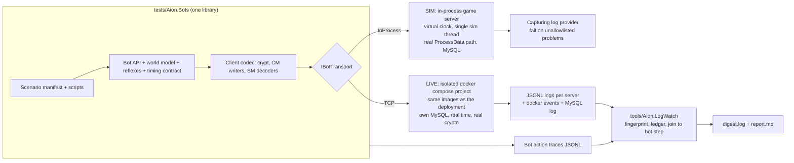

# End-to-end player simulation plan

**Goal.** Test the whole server the way a player uses it (log in, create a character, move, fight, quest,
gather, craft, trade, group, run instances) with no human in the loop, fast enough to run before every commit, and with
every server error surfaced the moment it happens, attributed to the bot action that caused it.

**Status.** Implementation in progress. Written 2026-09-17 against `main` at `488763e0c`;
every claim in §1, §7 and the appendices was re-checked against the code by an independent review pass.
The maintainer's decisions (§6) were applied the same day: no hosted CI and no schedulers; test runs are
local scripts. The `docker/` compose stack stays: it is how the emulator is deployed and run, and LIVE bot
runs use their own isolated compose project.

## How to use this document

- Phases are ordered by dependency. Inside a phase, TODOs run in order unless marked otherwise; explicit
  `Depends on` lines point across phases.
- Each TODO has an id (`P3-06`), a mode tag and a size. When one lands, tick the box and append the commit
  SHA: `- [x] P1-04 ... (a1b2c3d)`.
- Modes: **[SIM]** means in-process on a virtual clock. **[LIVE]** means real processes, sockets and MySQL in
  real time. **[BOTH]** means shared code or a fix both need.
- Sizes: **S** is under a day, **M** is 1–3 days, **L** is 1–2 weeks, **XL** is more.
- File and line references were correct at `488763e0c`. Re-grep before editing.
- Record decisions in [§6](#6-decision-log). Java ↔ C# divergences found along the way go in [§7](#7-parity-bugs-found-during-research)
  and are fixed the normal way: read the Java first, cite it in the commit.
- **The Java spec for this work is `upstream/4.8` at `lastCompletedJavaCommit`**
  (`docs/upstream-port-state.json`, currently `ce54b7931`). The local `../aion-server` branch `4.8` was
  fast-forwarded to it on 2026-09-17 (D8); keep it there as ports advance, because
  `scripts/parity/check_fidelity.py` and anyone reading Java side by side use that working tree.
- **Do not create branches or worktrees in this repo.** In `../aion-server` they are allowed when a TODO
  genuinely needs one (D12, for example P0-05).
- **No hosted CI, no schedulers** (D9). Every test run is a local script. The `docker/` compose stack is how
  the emulator is deployed and run; LIVE test runs use a separate compose project and never disturb it (D13).

---

## 1. Where we are today

### What already exists and will be reused

| Asset | Where | What it gives us |
|---|---|---|
| Boss AI harness | `tests/Aion.GameServer.Tests/Ai/BossAiHarness.cs` | One-map headless world on real static data and the real spawn path. It is an **NPC-decision** harness: its player has no connection, is invulnerable, has no DB, geo is off and movement is bypassed. |
| Virtual scheduler | `tests/Aion.GameServer.Tests/Ai/VirtualThreadPool.cs` | Replaces `ThreadPoolManager`; `Advance()` runs due timers synchronously. Needs hardening before a whole server can run on it (`P1-10`, `P5-00`). |
| Clock hook | `src/Aion.GameServer/Utils/SystemClock.cs` | AsyncLocal-over-process-wide overridable wall clock; mixed-clock pairs plus shared server, scheduler and quest time are routed through it. |
| Full in-process boot | `GameServerBootstrapTests.GameServerBootstrap_DbBackedFullBoot_RunsRealStartAsyncAgainstLiveMySql` | Real `StartAsync` against MySQL and real static data. Env-gated (`AION_GAMESERVER_DB_INTEGRATION=1`); runs only when that is set. |
| Login-server client | `tests/Aion.LoginServer.Tests/SocketServerSmokeTests.cs` | Blowfish frame crypto, first-packet decrypt, `CM_AUTH_GG`/`CM_LOGIN`/`CM_SERVER_LIST`/`CM_PLAY`/`CM_UPDATE_SESSION` builders, full handshake. Test-private. |
| Game bot codec | `tests/Aion.Bots/Protocol/GamePacketCodec.cs` | Stateful client encryption/server decryption, both opcode transforms, validated headers and u16 framing; interoperability is pinned against production crypt. |
| Chat client builders | `tests/Aion.ChatServer.Tests/Integration/ChatConnectionSmokeTests.cs` | Chat auth, channel join, channel message. |
| Socketless connection trick | `ChatAuthenticationBridgeTests.QueuedClientConnection`, `OutboundLinkLifecycleTests.RecordingAionConnection` | An `AionConnection` built by reflection over an unconnected socket. Brittle but proves the idea. |
| Golden server packets | `parity-artifacts/golden/packets/` | 181 Java-generated SM fixtures (364 cases; `payloadHex` is the body only): decoder test vectors. |
| Packet capture hook | `AionServerPacket.SetCaptureObserver` | Sees every serialized server packet (object and clear bytes). No callers today. C#-only. |
| Docker deployment | `docker/docker-compose.yml`, `docker/deploy.ps1`, `docker/.env` | MySQL 8.4 plus login, chat and game servers: the maintainer's only way of running the emulator. Test runs never touch its `aion` compose project, containers, images, databases or `aion_aion-mysql-data` volume; LIVE runs use their own compose project (P3-02). |
| Development MySQL | A MySQL 8.4 in Docker (the stack's `aion-mysql`, or `scripts/start-mixed-mode-db.ps1`) | SIM runs may freely create and drop their own throwaway databases (`aion_gs_sim_<run>_<shard>`). |
| GM commands | `src/Aion.GameServer/Handlers/AdminCommands` (101) | Fast scenario setup: `//add`, `//set level`, `//moveto`, `//quest`, `//kill`, `//siege`, `//rift`, `//instance`, ... |
| Account auto-create | `loginserver.accounts.autocreate` (default true) | Bots need no account seeding except GM access levels. |
| Admin HTTP API | `src/Aion.GameServer/Services/Admin/AdminHttpService.cs` | Token-protected player and storage state; a LIVE assertion oracle. C#-only. |
| Twin channels in starter zones | `world_maps.xml` (Poeta, Ishalgen `twin_count=5`), `CM_CHANGE_CHANNEL` | Isolates concurrent scenarios that would otherwise fight over the same mobs and nodes. |
| Open live journeys | `docs/Deep-Port-Audit-Remediation-Tracker.md` (release gates 1–2) | Five code-complete findings (two-GS transfer, chat auth, login bans, siege, hardware ban) that only a multi-process run can close (`P10-11`). |

### What blocks the goal

| # | Finding (verified 2026-09-17) | Why it matters | Evidence |
|---|---|---|---|
| B1 | **Resolved through P5-09.** P1 established scoped logging, stable fingerprints and the shared owner/reason/expiry allowlist; P5-09 added the previously named but not-yet-implemented in-memory capture provider and the SIM end-of-scenario failure policy. | A green instrumented run can no longer hide logged problems. | `CapturingLoggerProvider.cs`; `LogFingerprint.cs`; `LogProblemAllowlist.cs`; `SimulationLogPolicy.cs` |
| B2 | **Resolved in P1-04.** Each periodic iteration now runs through the Java-style `ExecuteWrapper`, so failures are logged without killing the schedule; deadlines advance at a fixed rate and pooled work emits Java's slow-task warning. | One bad NPC no longer stops all NPC movement for the rest of a LIVE run. | `ThreadPoolManager.cs`; `ExecuteWrapper.cs` |
| B3 | **Resolved through P4-10.** P4-01 put every identified mixed-clock pair on `SystemClock`; P4-02 added host-wide control and routed server-zone time, scheduled-task due metadata and quest timestamps; P4-03/P4-04 inventoried and migrated the remaining gameplay clocks and made direct `DateTime` wall-clock access an RS0030 error; P4-10 moved the last deferred retail-AI deadline comparison onto the shared clock. | Virtual combat, movement, item/effect expiry, services, persistence timestamps, shared time services and retail-AI timer ordering now advance together; the 20-read floor is reviewed infrastructure. | `SystemClock.cs`; `BannedSymbols.txt`; `check-clock-reads.ps1` |
| B4 | **Partly resolved through P5-00.** The virtual scheduler now surfaces faults, rejects backward time, reports virtual delay correctly, orders work through a due-time/insertion-order priority queue, guards re-entrant/concurrent advancement and cross-thread scheduling during advancement, and has strict disposal enabled throughout the existing boss-AI harness. Deterministic mode routes movement sequentially, periodic-manager rearming, `NetFlusher`, shutdown countdowns and cron jobs through it; the housing cron singletons construct under bounded wall time with a zero-delay drain and immediate fault propagation between each one. The earlier P4-08 text incorrectly claimed backward-time rejection before it was implemented; P5-00 added and pinned it. `PacketProcessor` still bypasses the deterministic path. | Whole-server SIM still needs the remaining deterministic-thread routing in Phase 5. | `VirtualThreadPool.cs`; `ThreadPoolManager.cs`; `MoveTaskManager.cs`; `NetFlusher.cs`; `ShutdownHook.cs`; `CronService.cs`; `SimulationCronTaskInitialization.cs` |
| B5 | **Resolved through P2-05.** `Aion.Bots` owns the real client crypt, framing, opcode transforms, all Appendix B CM writers and 45 bot-perception SM decoders. `AionXorCipher` is explicitly marked as an unrelated legacy helper. | Bots can now form actions and perceive the packet bodies needed by their world model. | `tests/Aion.Bots/Protocol/`; `BotGameClientPacketWriterTests.cs`; `BotServerPacketDecoderTests.cs` |
| B6 | **Resolved in P2-00.** A protected socketless connection path runs packets and disconnect cleanup inline without a selector, dispatcher, alive-check timer or eager packet-processor threads. | SIM can host an in-process game connection and exercise quit/drop cleanup. | `AConnection.cs`; `AionConnection.cs`; `SocketlessAionConnectionTests.cs` |
| B7 | **Persistence is 56 static MySQL DAOs with no seam** (244 public static methods), plus six C#-only `I*Repository` DI interfaces of which only `IUsedIdRepository`, `IServerVariablesRepository` and `ICharacterSelectionRepository` are consumed. Character create, enter world, recipes and mail only work after a DB write succeeds; failures are swallowed. | SIM needs a database; a DB-less SIM silently loses state. | `DatabaseFactory.cs:151-157`; `RecipeList.cs:26,37`; `Program.cs:115-120` |
| B8 | **Geodata is never loaded.** `GeoWorldLoader.Load` is a stub whose only action is a warning through `AionLog`, although `gameserver.geodata.enable` defaults to true; 230 geo files (158 MiB) are unused. `GetZ` returns NaN; `CanSee` is true within 80 m (false beyond, as in Java); fear, confuse, back-dash and random-move effects never displace; stagger, stumble, pull, dash and move-behind displace the full distance through walls at unchanged Z; NPCs chasing a jumping or flying target freeze. | Line of sight, Z, collision and NPC pathing are untestable in both modes and wrong in production. | `GeoEngine/GeoWorldLoader.cs`; `GeoMap.cs:126-156,217-221` |
| B9 | **Partly resolved through P4-06.** `Rnd` accepts execution-context and process-wide deterministic seeds while its production default remains thread-local. Deterministic mode also orders the replay-sensitive movement, world, known-list, aggro and nearby-message object maps by object id. | The S0-shaped core can replay, but scenarios touching the recorded effect/economy/social/siege/rift/base/housing/autogroup collection surfaces remain non-replayable until their scenario work adds stable packet and state ordering. | `Rnd.cs`; `DeterministicIteration.cs`; `KnownList.cs`; `AggroList.cs`; `WorldMapInstance.cs` |
| B10 | **Process-global state.** 93 `GetInstance` singletons (58 never-reset `SingletonHolder`s), a once-only `CronService`, a static `DatabaseFactory`, a static capture observer, and a bootstrap that changes the process CWD. | One world per test process; scenarios need isolation by account, channel and ordering (`P5-12`). | `CronService.cs:41-52`; `GameServerBootstrapService.cs:72` |
| B11 | **Resolved for Phase 1.** Env-gated DB/artifact tests report visible skips, and the real-time shutdown/socket suite passed ten consecutive local solution runs after stabilization. LIVE still needs its isolated compose project (P3-02) and SIM its Docker database script (P5-06). | Missing prerequisites and flakes are now distinguishable from regressions. | `Skip.IfNot`; `ShutdownHookTests.cs`; Phase 1 completion record |
| B12 | **Java reference drift partly fixed; fixture-generator drift resolved.** Local `../aion-server` `4.8` was fast-forwarded to `lastCompletedJavaCommit` (`ce54b7931`) on 2026-09-17 and falls behind again as ports land. The Java golden-fixture generators were forward-ported from `feature/object-spine-bigbang` onto that exact revision on ordinary branch `codex/e2e-fixture-generators`; the bot-perception generator and corrected NPC metadata bring the branch to `7d8cf6ab2`. | Side-by-side reading and `check_fidelity.py` still require keeping `4.8` at `lastCompletedJavaCommit`; new fixtures can now be generated from the dedicated branch without using the stale feature branch. | `git -C ../aion-server rev-list --count 4.8..upstream/4.8` |

### Useful baselines (re-measure as phases land)

| Metric | Value | How measured |
|---|---|---|
| Null-logger uses (game server + commons, outside `AionLog.cs`) | 0 after P1-02 (298 before) | `pwsh -NoProfile -File scripts/ci/check-null-loggers.ps1` |
| Direct wall/monotonic clock reads (game server) | 21 in 14 files after P4-05 (237 in 118 files before slice D): 8 `DateTime*`, 3 `TickCount64`, 10 `Stopwatch` | `scripts/ci/check-clock-reads.ps1`; direct `DateTime*` reads also enforced by RS0030 |
| `ThreadPoolManager.GetInstance()` call sites | 895 | `grep -rhoE "ThreadPoolManager\.GetInstance\(\)" src` |
| Registered client opcodes / server opcodes | 186 / 238 (same sets as `upstream/4.8`) | factory tables |
| Quests | 8043 in `quest_data.xml`; 5219 with a handler (4184 XML templates + 1035 C# = Java); 2824 with none | parse `quest_data.xml` and `quest_script_data/*.xml` |
| Obtainable quests a data-driven planner can run | 3,002 (70% of 4,315 obtainable handled quests); another 386 XML-template quests have unresolved collection-item sources, and 927 use custom handlers | `P7-02` checked-in classifier; excludes disabled, unreachable and no-handler quests |
| Game-server tests / test run time | 3060 / ~1.5 min | last hosted CI run, 2026-09-17 |
| Full static-data load | Cold merge + parse **11.30 s**, warm parse **8.29–9.05 s**; test-host peak working set **~515 MiB** | `P0-03`, measured on i7-14700K / 64 GiB / .NET 10.0.301 |
| Full DB-backed `StartAsync` / `SpawnAll` | **4.00–4.72 s** / **2.04–2.41 s**; **104,308** world objects; **1.57 GiB** test-host working set, **1.74 GiB** peak process tree | `P0-03`, Docker MySQL 8.4 on the same host |
| Booted-world periodic cost | Over 30 s idle: process CPU **35.9 ms/wall-s**; `MoveTaskManager` **1.331 ms/wall-s** (127 movers at sample end), `ZoneUpdateService` **0.582 ms/wall-s** (8,950 calls), AI think **<0.001 ms/wall-s** | `P0-03`; stopwatch instrumentation was measurement-only and removed |
| Extrapolated cost of one virtual minute | Named movement/zone/think work **~0.115 wall-s**; whole-process idle CPU upper bound **~2.16 CPU-s** before P5 deterministic-thread cleanup | `P0-03`; use the upper bound for the initial Fast-tier budget |

---

## 2. Target design



### Principles

1. **Two modes, one bot library.** Every scenario is declared once in a manifest and written once against
   `IBotTransport`.
   - **SIM** runs the game server in-process on a hardened virtual scheduler, on one sim thread. Bots feed
     real, client-encrypted bytes through the production `ProcessData` path, and every server packet is
     serialized and decoded by the same codec LIVE uses, so every SIM run tests the LIVE codec for free. A
     Fast tier runs before committing gameplay changes; the Full tier runs on demand.
   - **LIVE** runs the same Dockerfiles the emulator is deployed with, as an isolated docker compose project
     with its own MySQL (D13). Headless bots speak the real protocol over TCP in real time. All three servers write JSONL logs, and a watcher streams new
     problems as they happen. Full tier and soak, both run on demand.
2. **Fast-forward means deterministic discrete-event stepping, not time dilation.** Dilation breaks the
   `CM_PING` timer-cheat kick, Quartz cron, the other server processes and MySQL's own clock, and it stays
   non-deterministic. SIM jumps to the next bot action or next due timer, whichever is sooner.
3. **SIM and LIVE use a real MySQL, not fake DAOs.** SIM creates a throwaway database per run and shard on a
   Docker MySQL; LIVE gets a fresh MySQL inside its compose project. Fake DAOs or SQLite would be an XL rewrite that
   stops testing the real SQL.
4. **Problems are the primary oracle.** Any Error, swallowed exception, protocol or audit Warning, unexpected
   refusal system message, bot timeout or unexpected disconnect fails the scenario unless its
   **fingerprint** is allowlisted with a reason, an owner and an expiry.
5. **Bots behave like a real client.** Honest movement speed, the client timing contract, and the acks a
   real client sends. A server "too early" or audit line is a bot bug until proven otherwise.
6. **Setup may use GM powers; subjects may not be staff.** A GM *director* account sets state; subject bots
   are access level 0. Staff accounts auto-run `//invis //invul //enemy none //see` on login and hit 77
   staff-only branches, so they are never the subject of combat, PvP, trade or chat tests. Per-command
   `//access` grants do not work in Java either, so power is granted only through account access levels.
7. **Production changes are either parity fixes or gameplay-neutral seams.** Parity fixes cite
   `upstream/4.8`. Seams (logging bridge, clock routing, socketless connection, login-link interface, RNG
   seed, deterministic-mode switches) default to today's behaviour. See D4.
8. **Bot and scenario code never lives under `src/`.** An architecture test enforces it (no `src/**` project
   references `tests/` or `tools/`, no `src/` file declares `Aion.Bots` or `Aion.Simulation` namespaces).
   Seams added under `src/Aion.GameServer` must also avoid the tokens `scripts/parity/check_fidelity.py`
   bans in new file names (Plan, Bridge, Adapter, Composition, Outcome, Integration, Owner, Policy, Executor,
   Projection, Snapshot, Preview, Fact). New projects build with zero warnings so the baseline cannot grow.
9. **Ports keep landing during this work.** Before each codemod, record the new mapping in
   `docs/upstream-porting.md` and add a ratchet script to the pre-commit checks in `CLAUDE.md` (next to the
   warning baseline), so ported Java commits cannot reintroduce the old pattern.
10. **Everything runs locally** (D9). No hosted CI, no schedulers. The Fast and Full
    tiers are scripts under `scripts/e2e/`, started by hand or by a Claude Code session.

### Project layout

| Path | Contents | In `AionServer.slnx` |
|---|---|---|
| `tests/Aion.Bots/` | Codec, transports, world model, reflexes, timing, navigation, GM facade, scenario manifest and scripts | yes |
| `tests/Aion.GameServer.TestKit/` | `VirtualThreadPool`, `RealStaticData`, `TestAiEngine`, shared by both test projects | yes |
| `tests/Aion.Simulation.Tests/` | SIM host fixture, log policy, scenario test classes (own test process) | yes; DB scenarios report **Skipped** without MySQL |
| `tools/Aion.LiveBots/` | LIVE runner console app | yes (build only) |
| `tools/Aion.LogWatch/` | LIVE log watcher, problem ledger, run report | yes (build only) |
| `docker/docker-compose.bots.yml` | Isolated LIVE compose project: same Dockerfiles, own images, MySQL, ports and log mounts | n/a |
| `docker/bots/overlay/` | Bot-run `.properties` overlay mounted read-only into each server (P3-00) | n/a |
| `parity-artifacts/e2e/` | Shared allowlist, known-problem ledger, flaky ledger, coverage baselines | n/a |
| `scripts/sim/`, `scripts/live/` | Create and drop SIM databases; bring the LIVE compose project up and down, run the bots and the watcher | n/a |
| `scripts/e2e/run-fast.ps1`, `scripts/e2e/run-full.ps1` | Fast tier (before committing gameplay changes); Full tier (on demand) with the run report | n/a |
| `run/` (gitignored) | Local run output | n/a |

---

## 3. Phases

Phases 1 → 2 → 3 give a thin LIVE vertical slice with live error watching early. Phases
4 → 5 build the fast SIM mode. Phases 6–8 add breadth in both modes. Phase 9 is geodata. Phase 10 is scale,
operations and coverage. Phase 11 is group and scheduled content.

### Phase 0 — Decisions and ground truth

- [x] **P0-01** [BOTH] S — Walk through the decision log (§6) with the maintainer and set each status. Done
  2026-09-17. If D7 is revisited and approved, move P10-05 into Phase 5 before P5-13 so the SIM baseline is
  taken on the Java boot shape.
- [x] **P0-02** [BOTH] S — Settle the Java reference (D8). Done 2026-09-17 in `../aion-server` (no commit here):
  `4.8` fast-forwarded from `6ffedcd4f` to `lastCompletedJavaCommit` `ce54b7931`; its three stale worktrees and
  two `copilot/*` branches deleted. Keep `4.8` at `lastCompletedJavaCommit` as ports land, because
  `check_fidelity.py` and side-by-side reading use that working tree.
- [x] **P0-03** [SIM] S — Measure what SIM will cost: cold and warm `RealStaticData.LoadAsync` time and peak
  memory; `StartAsync` plus `SpawnAll` time and `World` object count; on a booted world, CPU per wall second
  spent in periodic managers (`MoveTaskManager`, `ZoneUpdateService`, AI think) and the number of moving
  creatures. Extrapolate the wall cost of one virtual minute. Put the numbers in §1; they size the Fast tier
  budget. (`fdef20696`)
- [x] **P0-04** [BOTH] S — Remove the two `update.sql` steps from `RUNNING.md` (lines 28-29). Verified:
  `aion_gs.sql` already has both columns `game-server/sql/update.sql` adds, and `aion_ls.sql` lacks the
  `toll` column and `account_rewards` table that `login-server/sql/update.sql` drops, so both fail on a fresh
  database. `docker/mysql/init/00-init.sh` also keeps going after a schema error, so LIVE readiness (P3-04) must
  verify the tables exist, and `new-sim-db.ps1` (P5-06) must stop on the first SQL error. (`f08bf4c5a`)
- [x] **P0-05** [BOTH] M — Bring the Java golden-fixture generators to the spec revision (D12 approved). They live
  only on `feature/object-spine-bigbang`, based at `f2f77fefe`, 87 commits behind `lastCompletedJavaCommit`.
  Carry the generator tests onto a branch or worktree of `../aion-server` at `lastCompletedJavaCommit` and
  confirm they reproduce today's fixtures byte for byte before generating new ones. P2-05, P6-01 and P9-02
  depend on this. The eleven generators now live on ordinary Java branch `codex/e2e-fixture-generators`, rooted
  at exact spec revision `ce54b7931`; their 42 test methods pass and regenerate all 211 packet/formula fixtures
  with zero Git-canonical byte differences from today's corpus. The harness uses JDBC proxies only—no local or
  Docker database is required. Java branch commit: `016bd7624`. Commit: `4f22e198c`.

### Phase 1 — See every server error

Nothing else is trustworthy until errors are visible. This phase restores Java's logging behaviour, makes
failures loud, and gets the test suite to a trustworthy green.

- [x] **P1-00** [BOTH] S — Stabilize the real-time tests behind recent red runs: `ShutdownHookTests`,
  `GameServerBridgeConnectorTests`, `OutboundLinkLifecycleTests` (inject delay sources or move into the
  `LoopbackSockets` collection). Done when `dotnet test AionServer.slnx` passes 10 times in a row locally.
  `ShutdownHookTests` now drives the existing delay seam with zero time and awaits a completion signal; the two
  socket classes were already in the non-parallel `LoopbackSockets` collection. Ten consecutive local solution
  runs passed on 2026-09-17. P1-03's later full-suite validation exposed the same class of race around
  `AdminConfig.NAME_TAGS`; the serialisation ratchet now covers that global too. (`82d810b7a`; follow-up in
  `25a65f3ac`)
- [x] **P1-01** [BOTH] S — Static logger bridge, `src/Aion.Commons/Logging/AionLog.cs`: `For(category)` returns
  a forwarding logger that resolves the factory **at call time** (safe in static initializers that run
  before the host exists); `SetFactory(ILoggerFactory)`; an AsyncLocal override for parallel tests (same
  pattern as `SystemClock`); caller type and member captured for fingerprints. Unit tests: a logger created
  before `SetFactory` still forwards; two parallel flows stay isolated. (`1936446b3`)
- [x] **P1-02** [BOTH] M — Codemod every null logger to `AionLog.For(...)`. First record
  `LoggerFactory.getLogger(X) → AionLog.For(...)` in `docs/upstream-porting.md` and add a ratchet script to the
  pre-commit checks in `CLAUDE.md` that fails on any new `NullLogger`/`NullLoggerFactory` under `src/`. Keep Java logger names as categories
  (`GAMECONNECTION_LOG`, `CRAFT_LOG`, `ITEM_LOG`, ...); `AuditLogger` becomes `AUDIT_LOG`. Done when the
  §1 baseline grep returns 0 outside `AionLog.cs`, the warning baseline holds and the suite is green.
  Depends on P1-01. (`2f12235a2`)
- [x] **P1-03** [LIVE] S — Bind the bridge in all three `Program.cs` files after `Build()`. Add
  `AionFileLoggerProvider` to the game server so `game-server/log/server_{console,warnings,errors}.log` exist,
  plus the per-category files Java's `logback.xml` routes (`craft.log`, `exchange.log`, `mail.log`,
  `kill.log`, `tampering.log`, `item.log`, `adminaudit.log`). (`25a65f3ac`)
- [x] **P1-04** [BOTH] S — Parity fix (B2): in `ThreadPoolManager.RunFixedRateAsync` catch and log **per
  iteration**, keep running, and schedule at a fixed rate (Java `RunnableWrapper(catchAndLogThrowables=true)`).
  Also port `ExecuteWrapper`'s slow-task warning (`MAXIMUM_RUNTIME_IN_MILLISEC_WITHOUT_WARNING`), which Java
  applies to every pooled `schedule`/`scheduleAtFixedRate`/`execute`. Test: a body that throws once still
  runs next period. (`b11a2416a`)
- [x] **P1-05** [LIVE] S — Install `AppDomain.UnhandledException` and `TaskScheduler.UnobservedTaskException`
  handlers in all three servers, mirroring Java's `UncaughtExceptionHandler` ("Critical Error - Thread ...
  terminated abnormally"). (`90991f317`)
- [x] **P1-06** [BOTH] S — Fix sites that lose exception detail. (`923f7ea14`)
  - (a) `CM_TELEPORT_ANIMATION_DONE` logs `e.InnerException`, but `ScheduledTask.Get` rethrows the original
    exception unwrapped, so nothing useful is logged. Log `e`, and correct the false "wrapped" comment at
    `ThreadPoolManager.cs:278-279`.
  - (b) Parity: `Dispatcher.Parse` drops Java's `, content: <hex>` (`Dispatcher.java:212`).
  - (c) Parity: the login `AionClientPacketFactory` swallowed read exceptions that Java logs as "Reading failed
    for packet" with a hex dump (`BaseClientPacket.java:89-95`), while the live `LoginClientConnection` also
    constructed its packet buffer with `strictReads: false`, preventing truncated reads from throwing at all.
    It then reported parse failures and unknown opcodes alike as "Unknown login packet" without Java's opcode,
    state and data.
  - (d) Infrastructure only: `Dispatcher`'s `LogError(e, "")` and `NetFlusher`'s `Console.Error` match Java
    (`log.error("", e)`, `printStackTrace()`); route them through the bridge with context as documented
    deviations.
- [x] **P1-07** [BOTH] S — Log scopes. (`f402ba4c0`) In `AionConnection.ProcessData`, open a scope (connection, account,
  player name and object id) around decrypt, `TryCreatePacket`, the flood check and `pck.Read()`, adding
  packet class and opcode once the packet exists: read-path errors such as `CM_EMOTION`'s unknown type and
  "was not fully read" happen there, not in `Run`. Open it again in `AionClientPacket.Run` (packet-processor
  thread), in the login `LoginClientConnection` and in the chat client handler. `ThreadPoolManager` opens a
  `timer` scope around every scheduled body with schedule time and kind. Scope values are strings, never
  live objects.
- [x] **P1-08** [BOTH] M — JSON-lines logger provider (`src/Aion.Commons/Logging/JsonLinesLoggerProvider.cs`), (`45753994c`)
  enabled by `AION_LOG_JSONL_DIR`. One JSON object per line with a fixed key order (§5), scopes included,
  flushed on Warning+. Writes `<srv>.events.jsonl` (everything) and `<srv>.problems.jsonl` (Warning+).
- [x] **P1-09** [BOTH] S — Log fingerprints (`LogFingerprint.cs`): (`09fc31bc2`) hash of exception type, normalized message
  template (object dumps → `<Type>`, digit runs → `#`, hex dumps stripped; 346 Warning/Error calls build
  messages by concatenation), and a stable code location. For exceptions, use the top in-repo frame with
  compiler-generated names normalized (`<>c__DisplayClass#_#`, `<Method>b__#`, `d__#` resolved to the
  enclosing method); without an exception, use the caller captured by `AionLog`. Unit tests on real messages,
  including "adding a lambda above the throwing one leaves the fingerprint unchanged".
- [x] **P1-10** [SIM] S — `VirtualThreadPool` first hardening: (`614f6f884`) record one-shot and fixed-rate faults without
  aborting `Advance` and report them through `AionLog`; a `Strict` flag (off for existing harness tests, on for
  SIM) fails the owning test on dispose if any were recorded; throw when `MaxTicksPerAdvance` is exhausted
  instead of moving the clock; give handles their virtual due time (a `Deferred(body, dueTime)` overload) so
  `GetDelay` is right.
- [x] **P1-11** [BOTH] S — Replace silent early returns with visible skips: (`91e5c078d`) add `Xunit.SkippableFact` and convert
  the 10 env-gated DB facts and the two artifact-guarded readers (`PetJavaVectorArtifactReaderTests`,
  `PlayerProtectionActiveTaskStopTriggerJavaTraceArtifactReaderTests`) to `[SkippableFact]` + `Skip.IfNot`.
  A move to xUnit v3 is out of scope.
- [x] **P1-12** [BOTH] M — Record-only boot baseline: boot the game server against a local MySQL with logs on,
  no client, idle for 5 minutes. Triage every Warning+ fingerprint as a bug (§7 or a fix) or an allowlist
  entry (P1-13). Completed 2026-09-17 against Docker MySQL 8.4 only: 5.59 minutes from application start
  through shutdown produced 169 valid event records and six problem records in three fingerprints. `2c206aaf`
  (one quest-handler source scan error) is §7 #18/P7-01; `f802a125` (one unimplemented geo-loader warning) and
  `39050e81` (four missing door-geometry warnings normalized across door ids) are §7 #22/P9-01. No fingerprint
  qualifies for the P1-13 allowlist. The run also exposed and fixed incomplete JSONL tails by flushing every
  event record and disposing all three server hosts. `game-server/log/server_errors.log` was written on boot.
  (`c0ec6d07c`)
- [x] **P1-13** [BOTH] S — Shared problem allowlist `parity-artifacts/e2e/log-allowlist.json`:
  `{fp, reason, owner, tracking, modes, servers, scenarios?, maxCount, expires}`. Optional `scenarios` scopes a
  SIM entry to exact scenario ids; LIVE keeps its separate per-run process boundary. The loader lives beside
  `LogFingerprint` and is used by P3-06 and P5-09. A check rejects entries with no owner or reason, expired
  entries, and entries that matched nothing in the last Full run. The checked-in list is deliberately empty:
  every P1-12 fingerprint is a tracked bug. `LogProblemAllowlist` rejects malformed, ownerless, unexplained,
  expired, duplicate and stale entries; the solution tests validate both the policy and the checked-in file.
  `PhaseOneLoggingAcceptanceTests` exercises the scoped throwing-CM path in this phase's acceptance contract.
  Depends on P1-09. (`2c033e6f9`)

**Done when:** a test runs a CM whose `RunImpl` throws through `AionClientPacket.Run` on a reflection-built
connection with an account, and asserts exactly one Error record with packet, opcode and account scope through
`AionLog` and `JsonLinesLoggerProvider`; the game server writes `game-server/log/server_errors.log` on boot; a
fixed-rate task survives a throw; a throwing one-shot timer is recorded by `VirtualThreadPool` and fails its
test in `Strict` mode; the solution test run has passed 10 times in a row locally.

Phase 1 completed 2026-09-17: all acceptance checks above pass, including 10 consecutive local solution runs
(102 Commons, 34 Chat + 1 visible skip, 128 Login + 5 visible skips, 3060 Game + 7 visible skips per run).

### Phase 2 — Bot protocol library (`tests/Aion.Bots`)

- [x] **P2-00** [BOTH] M — Socketless connection seam (infrastructure; needs D4). A protected `AConnection`
  constructor without a socket; a protected virtual enqueue hook replacing the `InterestOps`/`Selector.Wakeup`
  calls; `IsConnected`, `Close(T)` and `Disconnect` routed through the seam so a close clears the queue, marks
  the connection closed and runs `OnDisconnect` on the calling thread; `connectionAliveChecker` null-safe in
  `OnDisconnect`; an `AionConnection` constructor that does not arm the alive checker; an overridable
  `ExecutePacket` so SIM runs packets inline; the static `packetProcessor` made lazy so subclasses do not
  start threads. Add `InternalsVisibleTo` for the new projects. Tests: quit and abrupt drop both reach
  `PlayerLeaveWorldService`.
  Completed with a selector-free protected transport constructor, virtual packet enqueue/execution hooks,
  synchronous socketless close/drop cleanup, lazy packet-processor creation and an unarmed alive checker.
  `SocketlessAionConnectionTests` prove `CM_QUIT` and abrupt drop both reach the leave-world boundary on the
  calling thread while close discards earlier queued packets. Commit: `db9605e07`.
- [x] **P2-01** [BOTH] S — Create the project (`net10.0`, `TreatWarningsAsErrors`), add it to the solution, and
  add the `src/` isolation architecture test from Principle 8.
  Added `tests/Aion.Bots` as a warning-free `net10.0` library and solution project. Architecture tests now
  reject production project references outside `src/` and bot/simulation namespace declarations under `src/`.
  Commit: `79610c103`.
- [x] **P2-02** [BOTH] S — Client game crypt: key recovery from `SM_KEY`, client-encrypt and server-decrypt with
  per-packet key rotation, opcode encode/decode, the `0x65`/`~opcode` client header and `0x44` server header,
  u16 framing. Lift from `GameCryptTests.cs` and `GamePacketFrameCodec.cs`; test against the live
  `Crypt`/`EncryptionKeyPair`. Then delete or quarantine the unreferenced
  `GameCrypt.cs`/`GameEncryptionKeyPair.cs`/`GamePacketFrameCodec.cs` and mark `AionXorCipher` as not the game
  cipher.
  Added a stateful client codec with SM_KEY recovery, both opcode transforms and validated client/server
  headers inside u16 frames. Two rotating packets in each direction interoperate with production `Crypt` and
  its live `EncryptionKeyPair`; the three dead production mirrors were deleted and `AionXorCipher` is labeled
  as a legacy non-game helper. Commit: `6c7a9b026`.
- [x] **P2-03** [BOTH] S — Generate the bot's opcode and valid-state table by reflecting over
  `AionClientPacketFactory` and `ServerPacketsOpcodes`. A test fails when they drift or when a bot sends a
  packet in a state the table does not allow. This table is authoritative; do not hand-copy opcodes.
  `GamePacketRegistry` reflects immutable client/server definitions directly from both production tables;
  typed client encoding checks the reflected valid-state set before touching cipher state, and decoded server
  packets resolve their production type through the same registry. Tests pin table counts and exact reflected
  contents and prove invalid-state sends fail before a subsequent valid send. Commit: `10edce609`.
- [x] **P2-04** [BOTH] M — CM writers for the packets in Appendix B, plus `CM_EMOTION` (jump, sit, arbitrary type
  byte), `CM_FRIEND_STATUS` (arbitrary status byte), `CM_CHAT_AUTH` and `CM_CHANGE_CHANNEL`. Note
  `CM_L2AUTH_LOGIN_CHECK` is six int32s (24 bytes). Each writer round-trips through `TryCreatePacket` + `Read()`
  on a P2-00 connection with zero bytes left over and the expected fields. Depends on P2-00, P2-03.
  Added typed writers for all 56 Appendix B game-client packets, including conditional movement, spell,
  item, crafting, character-appearance and legion payloads. Fifty-eight representative bodies (separate
  jump/sit/arbitrary emotion cases) encrypt through the bot codec, decrypt through production `Crypt`, and
  round-trip through `TryCreatePacket`/`Read` on a socketless connection with exact fields and no bytes left.
  Commit: `abd3019f4`.
- [x] **P2-05** [BOTH] L — SM decoders for the packets bots perceive (~45; partial decoders are fine, item blobs
  are length-prefixed). Test against every golden fixture for a decoded packet (`payloadHex` is body only).
  Packets without fixtures: `SM_CASTSPELL_RESULT`, `SM_DIALOG_WINDOW`, `SM_LOOT_ITEMLIST`, `SM_DIE`,
  `SM_CHARACTER_LIST`, `SM_TRADELIST`, `SM_KEY`, `SM_VERSION_CHECK`, `SM_L2AUTH_LOGIN_CHECK`,
  `SM_PLAYER_SPAWN`, `SM_PLAY_MOVIE`, `SM_MAIL_SERVICE`, `SM_GROUP_INFO`. Generate their Java fixtures from the
  P0-05 branch before adding their decoder cases; do not use `JavaFixturePending`. Include an
  `SM_SYSTEM_MESSAGE` decoder with an id → `STR_` name table generated from `SM_SYSTEM_MESSAGE.cs` (4,115
  factories); a test fails when it drifts.
  Added bounds-checked little-endian body reading and a 45-packet decoder inventory covering login/world entry,
  objects and movement, stats, inventory, skills/combat, quests, loot/trade/group and mail. Item decoders consume
  Java's length-prefixed `ItemInfoBlob` boundary. Every Java fixture case for every decoded type is exercised;
  thirteen previously missing fixtures were generated on `codex/e2e-fixture-generators` (`f01bb5d1e`), and the
  fixture-wide test exposed and corrected `SM_NPC_INFO` metadata to its actually serialized live position
  (`7d8cf6ab2`). The generated system-message table covers all 4,115 factories (4,110 unique IDs) and its source
  hash test fails on catalog drift. Commit: `b6cf4242f`.
- [x] **P2-06** [LIVE] M — Login client: move the Blowfish, first-packet XOR undo and the existing
  `CM_AUTH_GG`/`CM_LOGIN`/`CM_SERVER_LIST`/`CM_PLAY`/`CM_UPDATE_SESSION` builders out of
  `SocketServerSmokeTests.cs`. Implement `UnscrambleModulus` (inverse of `LoginRsaKeyPair.ScrambleModulus`):
  the tests never needed it because they read the RSA key straight from `FixedLoginKeyGenerator` (fixed
  Blowfish key, random RSA pair) instead of from `SM_INIT`. Test against `LoginClientSocketServer` with the
  real `LoginKeyGenerator`.
  Added a reusable stateful login codec and all five packet writers to `Aion.Bots`; `SM_INIT` now supplies
  the session, negotiated Blowfish key and an unscrambled RSA modulus used to encrypt credentials. The main
  loopback handshake uses the real random `LoginKeyGenerator`, while the inverse transform has a direct
  generated-key round-trip test and the existing smoke suite exercises every moved writer. Commit: `7d0b1ef3a`.
- [x] **P2-07** [LIVE] S — Chat client (`CmChatIni`, `CmPlayerAuth`, channel request and message), lifted from
  `ChatConnectionSmokeTests.cs`, driven by `SM_CHAT_INIT`.
  Added an `SM_CHAT_INIT`-bound chat protocol with framed writers for initialization, player authentication,
  channel requests and channel messages. All four writers round-trip through the production chat packet
  factory, and the existing socket tests now use them for channel join and two-client broadcast. Commit:
  `dc88fe219`.
- [x] **P2-08** [BOTH] S — `IBotTransport`: send CM bytes, receive decoded SMs, close, crash (drop without
  `CM_QUIT`). Implementations arrive in P3-05 (TCP) and P5-07 (in-process).
  Defined the async transport boundary for complete framed/encrypted CM bytes, wire-ordered decoded SMs,
  graceful close and abrupt no-`CM_QUIT` crash. The interface deliberately leaves TCP and in-process behavior
  to their scheduled phases, and a contract test locks its operation types. Commit: `de005ad0f`.
- [x] **P2-09** [BOTH] M — Bot world model built only from decoded SMs: known objects (players, NPCs,
  gatherables, statics), self stats/HP/exp/level/flight time, inventory and kinah, skills and cooldowns, quest
  states, open dialog/question/loot/trade windows, system messages by `STR_` name. Depends on P2-05.
  Added a decoded-packet-only client world view covering object discovery/movement/removal, self resources and
  death state, inventory/kinah, skills/cooldowns, active and completed quests, interaction windows and named
  system-message history. The decoder now exposes Java's general item-blob count/mask/creator fields and the
  gatherable/static-door state word, with focused decoder and state-transition tests. Commit: `2ad907db8`.
- [x] **P2-10** [BOTH] S — Reflexes: `SM_PLAYER_SPAWN` → `CM_LEVEL_READY`; `SM_TELEPORT_LOC` →
  `CM_TELEPORT_ANIMATION_DONE`; `SM_PLAY_MOVIE` → `CM_PLAY_MOVIE_END` (every new character's first quest plays
  a movie and blocks movement until acked); `SM_DIE` → revive policy; `SM_QUESTION_WINDOW` → answer policy.
  LIVE only: `CM_PING` every 180–183 s, never under 178 s (three early pings get the client kicked).
  Added decoded-SM reflex dispatch for the three mandatory acknowledgements plus explicit death/question policy
  delegates whose safe defaults make no unsolicited choice. A wall-clock-only LIVE scheduler emits `CM_PING`
  on a validated 180–183 s cadence and never enters the Java server's under-178 s failure window. Commit:
  `74d96cfac`.
- [x] **P2-11** [BOTH] M — Client timing contract, one table keyed to the ported Java commit:
  - `CM_ATTACK` no faster than weapon attack speed minus 300 ms (`PlayerController.cs:420-426`).
  - `CM_TARGET_SELECT` before `CM_CASTSPELL` (the server uses the current target).
  - Next cast no sooner than 350 ms after cast start, and no sooner than the animation's last hit after
    `SM_CASTSPELL_RESULT`. Compute `clientHitTime` from `motion_times.xml` via `MotionData`.
  - Cooldowns from `SM_SKILL_COOLDOWN`; item use delays from item templates.
  - No `CM_MOVE` while casting, gathering or crafting (all three abort).
  - No `CM_ENTER_WORLD` within `gameserver.character.reentry.time` of leaving (10 s configured, 20 s code
    default), and after a crash also wait out the delayed leave-world (up to 10 s).
  - When `97927c65a` (today only on `upstream/attack-motion-gate`) reaches `upstream/4.8` and is ported,
    update the table in that port commit.
  Added a stateful timing gate and immutable rule table keyed to `ce54b7931`, covering attack/cast spacing,
  target ordering, decoded skill cooldowns, item-template use delays, movement-blocking activities and normal or
  crashed reentry. Client first-hit and post-result last-hit timings load `motion_times.xml` through the production
  `MotionData` XML model and mirror Java's speed/race/gender/weapon formulas. Commit: `c57ff09b6`.
- [x] **P2-12** [BOTH] M — Bot API facade (Appendix B maps each call to packets): `Login`, `ListCharacters`,
  `CreateCharacter`, `DeleteCharacter`, `RestoreCharacter`, `EnterWorld`, `ChangeChannel`, `Quit`, `Crash`,
  `MoveTo`, `Jump`, `Fly`, `Land`, `Glide`, `Rest`, `Emote`, `Target`, `Attack`, `Cast`, `SummonCommand`,
  `SummonAttack`, `SummonCast`, `UseItem`, `Equip`, `Loot`, `TalkTo`, `SelectDialog`, `CloseDialog`, `Answer`,
  `Teleport`, `Gather`, `Craft`, `Buy`, `Sell`, `Trade*`, `InviteToGroup`, `Say`, `Whisper`, `Duel`, `Revive`.
  Depends on P2-04, P2-05, P2-11.
  Added one intent-level facade over the login protocol, game-packet writers, decoded world model, reflexes and
  timing contract. Its lifecycle, movement, combat, item, dialog, gathering/crafting, economy, trade, social and
  revive methods expose every planned action name, while observation feeds decoded SMs through state, timing and
  automatic-response handling. Tests pin every intent name and representative packet mapping. Commit: `d0b27e52f`.
- [x] **P2-13** [BOTH] S — Per-bot action trace, JSONL: `{ts, vt, run, bot, account, step, dir, packet, fields}`
  for every action, sent CM and decoded SM; system messages carry the `STR_` name and parameters. This is what
  the watcher joins problems to.
  Added a fixed-order, immediately flushed per-bot JSONL writer for action, outgoing (`>`) and incoming (`<`)
  records. It accepts semantic CM fields with a body-hex fallback, preserves every decoded SM field, requires
  system-message `STR_` names and parameters, and records nullable virtual elapsed time alongside wall time.
  Tests pin the schema, values and live-tail visibility. Commit: `167a94879`.

**Done when:** every golden fixture for a packet the bot decodes decodes to its recorded inputs, every CM writer
round-trips with no leftover bytes, and the login client completes a handshake against an in-process login
server.

Phase 2 completed 2026-09-17: `BotServerPacketDecoderTests` covers every recorded input in every golden fixture
for all 45 decoded packet types, `BotGameClientPacketWriterTests` round-trips all Appendix B writers through the
production packet factory with no unread bytes, and `SocketServerSmokeTests` completes the encrypted handshake
against the in-process login server using the real random key generator.

### Phase 3 — LIVE walking skeleton and live log watching

The fastest route to "watch server logs and find errors as they happen", and it proves the codec on real
sockets before the large clock migration.

- [x] **P3-00** [LIVE] S — Entrypoint overlay: each `docker/*/entrypoint.sh` appends the `*.properties` files from an
  optional mounted overlay directory after the `my*.properties` it generates, so a bot run can change settings
  without editing the entrypoints. With no overlay mounted, the deployment behaves exactly as today.
  All three entrypoints now append lexically ordered `*.properties` files from
  `${AION_CONFIG_OVERLAY_DIR:-/app/config-overlay}` after their generated configuration. Disposable image tests
  verified the unchanged no-mount path and effective ordered overrides for login, chat and game. Commit:
  `9c8b9507e`.
- [x] **P3-01** [LIVE] S each — Parity fixes that break restarts and soaks:
  - [x] Call `PlayerDAO.SetAllPlayersOffline()` at boot (Java `GameServer.java:222`). Without it, a killed server
    leaves `players.online=1` and every re-login gets `REENTRY_TIME`. Production now calls the DAO through a
    DB-independent bootstrap seam before used object IDs load; a focused test pins that ordering. Commit:
    `1716e128c`.
  - [x] Stop `ThreadPoolManager._scheduledTasks` growing forever (C#-only leak). The append-only bag is now an
    active-task map: synchronous completion continuations remove finished one-shots and cancelled fixed-rate
    loops while shutdown still awaits a snapshot. A 100-task retention test returns the count to zero. Commit:
    `172bea01e`.
  - [x] Make `SocketChannel` read/write return 0 on `WouldBlock` as `java.nio` does, instead of throwing
    `IOException` and disconnecting. A deterministic slow-reader loopback test fills the nonblocking send
    window, observes zero progress and then verifies a distinct 1 MB burst byte-for-byte. Commit: `516e799ad`.
  - [x] Add Java's `if (GameServer.isShuttingDownSoon()) { safeLogout(); return; }` to
    `AionConnection.OnDisconnect` (`AionConnection.java:240-243`). A socketless regression test verifies that
    a final-countdown disconnect leaves the world synchronously rather than scheduling delayed cleanup. Commit:
    `7a56e31a5`.
  - [x] Replace the `List` + `Contains` dedupe in `AbstractFIFOPeriodicTaskManager.cs:14,39-40` with
    insertion-ordered set semantics (Java `LinkedHashSet`); today it is O(n²) per tick for `MovementNotifyTask`
    and `ZoneUpdateService`. The replacement couples a hash set with a first-insertion list; focused tests pin
    order, uniqueness, clearing and hash-scale lookup work across 10,000 tasks. Commit: `a7590ae18`.
- [x] **P3-02** [LIVE] M — Isolated bot stack (D13): `docker/docker-compose.bots.yml`, run as
  `docker compose -p aion-bots-<run>`. It builds the same Dockerfiles as `docker/docker-compose.yml` but tags the
  images `aion-bots-*`, sets no `container_name`, runs MySQL on tmpfs, publishes non-default host ports (admin API
  on `127.0.0.1` only), mounts `docker/bots/overlay/` read-only (P3-00) and bind-mounts per-run log directories.
  The maintainer's `aion` project, its containers, `aion-*` images, databases and `aion_aion-mysql-data` volume are
  never touched. Overlay: unknown and ignored packet logging on; domain logs on (`gameserver.log.craft`,
  `.player.exchange`, `.broker.exchange`, `.kill`, `.mail`, `.item`); gather and craft fail chance 0
  (deterministic profile, with a separate default-rates soak profile); captcha off; login-server brute-force
  protector off (bot connections arrive from the docker gateway, not 127.0.0.1); login/logout announcements
  off; admin HTTP API on with a token; `AION_LOG_JSONL_DIR` per run; custom XP/drop events off. Everything else,
  security checks included, stays at production defaults (D6). Depends on P3-00.
  The isolated compose contract and a disposable `aion-bots-p302` full-stack boot verified bot-only image and
  container names, tmpfs schema initialization, non-default ports, loopback-only admin access, read-only overlay
  precedence, per-run text/JSONL logs, the default-rate soak overlay and no interaction with the maintainer's
  containers or `aion_aion-mysql-data` volume. Commit: `7eb2f0f29`.
- [x] **P3-03** [LIVE] S — Seeds: the `gameservers` row; a director account with access level 9. Subject accounts
  are auto-created at level 0 with names that encode run and bot (`b01r0917`), which is how server log scopes
  join to bot traces without extra traffic. The bot compose project mounts its own idempotent MySQL seed after
  the shared schema initializer, creating game server 1 and `director` / `aion-bots` without changing the
  maintainer stack. Both bot profiles explicitly enable account auto-creation; the login service test pins new
  accounts to access level 0, and the compose contract pins the seed, hash and overlay settings. A fresh
  tmpfs-backed MySQL 8.4 container verified the registration, director row and account-time row. Commit:
  `f99a15085`.
- [x] **P3-04** [LIVE] S — Readiness: port Java's `Game server started in N seconds` line (`GameServer.java:186`).
  The bots project is ready when its ports answer, that line has been logged, the login server has logged that
  game server 1 registered, and the schema tables exist (P0-04). The compose file's login and chat healthchecks
  are 15-second pacing timers, not readiness checks. `scripts/live/wait-ready.ps1` now gates the four published
  ports, the Java startup and registration log lines, seven schema anchor tables, both post-migration game
  columns, and the absence of the obsolete login column/table. Its MySQL query runs only inside the isolated
  compose container. A rebuilt four-service `aion-bots-p304` stack passed the gate in 7.7 seconds after game
  service launch (`Game server started in 15 seconds.`), then was removed with its tmpfs database. Commit:
  `2390c1461`.
- [x] **P3-05** [LIVE] M — TCP transport and `tools/Aion.LiveBots`: per-bot async loop, ping scheduler,
  reconnect, manifest-driven scenario selection (P5-12 defines the manifest; until then a simple list), per-bot
  traces, non-zero exit on failure. Every step has a real-time timeout; a timeout, automatic reconnect or
  unexpected quit response is a problem record joined to bot and step. `TcpBotTransport` implements the shared
  contract over a real socket with exact-length u16 framing, the P2 game crypt, one ordered receive loop,
  decoded-or-raw known server packets, graceful close and RST crash. `Aion.LiveBots` supplies the temporary
  `connect` scenario list, parallel per-bot loops, 180-183-second in-world ping scheduling, bounded connect and
  step execution, one recovery attempt after unexpected disconnect, immediate JSONL traces/problems, required
  run provenance and failure exit codes. Loopback tests cover fragmented reads, key recovery, both encrypted
  directions, graceful EOF and unexpected EOF. Against `aion-bots-p305`, two bots each ran two sequential real
  connect/key/close scenarios (10 trace records apiece, no problems); a forced connect timeout exited 1 with one
  problem joined to `b01`/`s01`. The disposable stack was removed. Commit: `c1b2079ec`.
- [x] **P3-06** [LIVE] M — `tools/Aion.LogWatch`: tail `gs/ls/cs.problems.jsonl` from the run's start offset, the
  bot traces, the bots project's container logs, `docker compose events` (die, oom, restart) and the MySQL
  container's log. Fingerprint and
  consult the allowlist (P1-13) and ledger (P3-14). Join each problem to the latest bot step for the same
  account; mark it `inherited` when its `timer` scope is fixed-rate or was scheduled more than 30 s earlier.
  Also report as problems: server exit, stderr `Unhandled exception.`, a missing heartbeat (P3-12),
  unexpected bot disconnects, and system messages on a scenario's unexpected-refusal list (for example
  `STR_SKILL_NOT_READY` outside C2 and C4). Append one line per problem to `run/<id>/digest.log` (§5). Exit
  non-zero on anything new or regressed. Depends on P1-08, P1-09, P1-13, P3-12. Implemented the file and Docker
  followers, time-correct bot-step join, inherited-timer marker, allowlist count enforcement, optional ledger
  classification, unexpected-refusal/bot-failure/process/MySQL detection, malformed-input reporting and
  record/enforce summaries. Missing-heartbeat detection arms only after the server's first heartbeat, so it is
  ready for the P3-12 producer without treating its current absence as a failure. Focused tests cover NEW/KNOWN/
  REGRESSED, allowlisting, attribution, refusal, malformed input and heartbeat expiry. A Docker-only validation
  against `aion-bots-p306` captured the existing boot fingerprints and a forced login-server `die`/`restart`;
  the disposable stack was removed. Commit: `23e42fb35`.
- [x] **P3-07** [LIVE] S — Optional server-side packet tap behind `AION_PACKET_TAP`: register a
  `ServerPacketCaptureObserver` that copies clear frames **synchronously** (the buffer is encrypted in place
  right after the callback) into a bounded channel written as JSONL. Fix the false "Java parity" comments in
  `Capture/ServerPacketCaptureObserver.cs` and `Capture/NoOpServerPacketCaptureObserver.cs`: they are C#-only
  infrastructure, and fidelity cleanup must not delete them. The opt-in observer copies the complete clear frame
  before returning to the in-place encryptor, queues owned frames without blocking, records bounded-channel drops,
  flushes on host shutdown and is forwarded by the bots Compose stack. A focused test mutates the source buffer
  after capture and verifies the JSONL retained the original bytes. With Docker-only `aion-bots-p307`, a real bot
  connect produced one 11-byte clear `SM_KEY` record in the mounted packet tap; the disposable stack was removed.
  Java `ce54b7931` confirms there is no capture package and `AionServerPacket.write` goes directly from framing to
  encryption. Commit: `1bc7a5d0e`.
- [x] **P3-08** [LIVE] S — `scripts/live/run-live.ps1`: `docker compose -p aion-bots-<run> up -d --build` (P3-02) →
  wait ready (P3-04) → bots → watcher → collect container logs into `run/<id>/` → `down -v` on the bots project
  only (`-Keep` leaves it running for inspection). Runs go under `$AION_E2E_RUN_ROOT` (default `run/`, ignored
  since P3-02); keep the last 20 local runs; `events.jsonl` and the packet tap roll at 200 MB and are gzipped
  at run end; `problems.jsonl`, `digest.log` and `report.*` never roll. The runner builds the two local tools,
  propagates the run id, brings up and checks the isolated Docker/MySQL stack, watches while bots run, stops the
  watcher before intentional shutdown, gracefully stops the servers, collects all four container logs and Docker
  events, rolls/gzips only the large streams, removes only its exact Compose project, and retains 20 runs. `-Keep`
  leaves the project and live packet tap intact; `-WatcherMode record` supports pre-ledger baselines. Docker Desktop's
  `compose events --until` returns its complete stream with exit 1 plus `EOF`, so the collector accepts only that
  exact benign terminal pair. A Docker-only `p308-runner2` connect run passed, carried its run id in GS JSONL and the
  packet tap, produced validated gzip artifacts, and left no containers or volumes. Commit: `297ae87e8`.
- [x] **P3-09** [LIVE] S — Scenario **L0 walking skeleton**: login → game auth → create Elyos warrior → enter
  world → `CM_CHAT_AUTH` → `SM_CHAT_INIT` → chat-server auth → join the region channel → a second bot receives a
  channel message → walk 10 m → ping → quit → wait the re-entry time → log in again → character list shows the
  character, position persisted, `online=0` after quit. `Aion.LiveBots` now drives the complete coordinated
  two-player flow, decodes the full create/list character summaries, verifies offline and position state through
  the admin endpoint and relogin packet, and safely drains an in-flight receive during timeout cleanup. The bot
  overlay enables and authenticates the real game/chat bridge. The run exposed and fixed two production defects:
  concurrent chat joins could create duplicate region channels (§7 #26), and a nullable godstone LEFT JOIN aborted
  character-list equipment loading (§7 #27). Docker-only `p309-l0e` completed both bots with no bot problems and
  no recurrence of the inventory fingerprint; record-mode logging contained only the already scheduled §7 #18
  and #22 fingerprints. Commit: `efddb7a7b`.
- [x] **P3-10** [LIVE] S — Watcher canaries, one per server (a silent watcher looks identical to a broken one):
  `CM_FRIEND_STATUS` with undefined status 2 produces exactly one Warning; `CM_EMOTION` with type `0xFF` produces
  exactly one `NEW` error line with bot and step (it logs from `ReadImpl`, so it proves the read-path scope);
  a `CM_LOGIN` with a bad checksum produces exactly one `ls` problem; an unknown chat opcode produces exactly one
  `cs` problem; an allowlist entry suppresses each. The coordinated `canaries` LIVE scenario authenticates and
  enters one player, proves the GS run/read paths at `b01/s04` and `b01/s05`, confirms a corrupted encrypted login
  frame is rejected by closing the socket, and sends an unknown connected-state chat opcode. Docker-only
  `p310-canary2` recorded exactly fingerprints `834ce942`, `cf736122`, `e4a90da9` and `fd539a24`; `p310-canary3`
  matched and suppressed exactly those four through fingerprint-specific LIVE entries with owner, reason,
  tracking, `maxCount: 1` and a 2027-09-17 expiry. A focused watcher test proves a second occurrence exceeds the
  allowance and still fails. Commit: `7b0f1c13d`.
- [x] **P3-11** [LIVE] S — Document the local loop in `docker/README.md`: run `scripts/live/run-live.ps1`, then watch `digest.log`
  (§5 has the Claude Code Monitor recipe). The guide now covers Docker-only database isolation, L0 and canary
  commands, record versus enforce mode before P3-14, PowerShell and Claude Code digest monitoring, exact-project
  cleanup and `-Keep`, image rebuilds, the artifact layout, failure collection and 20-run retention. Commit:
  `5090e6b31`.
- [x] **P3-12** [LIVE] S — A 10-second heartbeat Information line in all three servers with connection count,
  packet-queue depth and armed-timer count (via the `ThreadPoolManager` schedule observer). A shared hosted service
  now emits the structured line immediately and every ten seconds; login and chat aggregate their two socket
  listeners and correctly report zero for their inline packet/timer paths, while game exposes the faithful packet
  processor backlog and counts live scheduled tasks through completion-aware schedule observations. Focused tests
  pin the log contract and one-shot/fixed-rate timer lifecycle. Docker-only L0 run `p312-heartbeat` passed with all
  three cadences observed and no missed heartbeat. Commit: `af6cb074c`.
- [x] **P3-13** [LIVE] S — Record-only login baseline: run L0 with the watcher in record mode and triage every new
  fingerprint as in P1-12. Depends on P3-09. Docker-only run `p313-baseline` at `6169e0d67` passed both L0 bots
  and recorded six problem records in the same three fingerprints as the Phase 1 boot baseline: `2c206aaf`
  (one quest-handler source scan error) remains §7 #18/P7-01; `f802a125` (one deferred geo-loader warning) and
  `39050e81` (four normalized missing-door-geometry warnings) remain §7 #22/P9-01. All are tracked bugs, so none
  belongs in the allowlist. All three server heartbeats were present and the isolated Docker stack was removed.
  Commit: `048b55138`.
- [x] **P3-14** [LIVE] M — Known-problem ledger and triage. `tools/Aion.LogWatch` maintains
  `parity-artifacts/e2e/known-problems.json` with `{fp, firstSeenSha, lastSeenSha, lastSeenRun, count, status:
  new|tracked|fixed, tracking}`, where `tracking` is a `docs/Full-Parity-Backlog.md` id or an issue URL.
  `digest.log` prints `NEW` only for fingerprints not in the ledger, `KNOWN` for tracked ones and `REGRESSED` for
  ones marked fixed. For each NEW problem the watcher writes `run/<id>/problems/<fp>/`: full stack, 200 lines of
  server log context, the bot's last 50 trace steps, seed, git SHA, config profile, and a draft backlog entry. A
  fix commit carries a `Fixes-Fingerprint: <fp>` trailer; the next green Full run marks it fixed. Tracked problems
  do not fail a run; new and regressed ones do. The ledger is validated and atomically replaced; run occurrences
  advance its last-seen provenance and cumulative count. Focused tests cover NEW bundle contents, tracked/fixed
  disposition, allowlist ordering and exact trailer parsing. Docker-only enforce run `p314-ledger` passed both L0
  bots, classified all three boot fingerprints as `KNOWN`, updated their ledger records, emitted no NEW bundle and
  removed its isolated stack. Commit: `00387df8d`.
- [x] **P3-15** [LIVE] S — `scripts/e2e/run-full.ps1` (LIVE part): one command that runs L0 and the canaries through
  `run-live.ps1` and leaves `run/<id>/` for inspection. Started by hand; there is no scheduler (D9). The command
  runs both child stacks in enforce/full-run mode, reuses the first child's images, and keeps their artifacts under
  one parent run directory. Docker-only run `p315-full3` passed L0 and all four canaries: the L0 watcher reported
  three tracked fingerprints plus their repeats, and the canary watcher reported those same tracked findings plus
  exactly four fingerprint-specific `ALLOWLISTED` lines. The `CM_EMOTION 0xFF` action at `b01/s05` appeared in the
  digest 266 ms later with the same bot and step; the game warning, login checksum rejection and chat unknown-opcode
  canaries each also appeared exactly once. Commit: `dde4b1ff3`.

**Done when:** `run-live.ps1 -Scenario L0` and `run-full.ps1` pass locally; the `CM_EMOTION 0xFF` canary
appears in `digest.log` within about 2 seconds attributed to its bot and step; each server's canary produces
exactly one problem.

### Phase 4 — One controllable clock and deterministic time

Production-neutral: `SystemClock`'s default is the same call Java makes (`System.currentTimeMillis()`).

- [x] **P4-01** [BOTH] S — Fix the mixed-clock pairs first (a C#-only defect of the partial migration):
  `SimpleAttackManager.cs:36,100`; `SkillAttackManager.cs:157,237`; `NpcSkillTemplateEntry.cs:73,232`;
  `NpcSkillEntry.cs:35`; `CM_CASTSPELL.cs:18,105`; `CM_USE_CHARGE_SKILL.cs:28`; `ChargeSkill.cs:41`;
  `CreatureMoveController.cs:18,78` and its elapsed-time readers in `NpcMoveController.cs:265`,
  `PlayableMoveController.cs:81,128`, `SiegeWeaponMoveController.cs:76`; `Creature.cs:43`;
  `Player.Part2.cs:338`; `Player.Part3.cs:370,407`;
  `SummonsService.cs:79`; `SkillCooltimeResetEffect.cs:28,36,37`; `ItemEquipmentListener.cs:45`;
  `AhserionAI.cs:51,191`; `CustomInstanceBossAI.cs:159,205,230`. All listed Java sites read
  `System.currentTimeMillis()`; their C# counterparts now use `SystemClock.CurrentMillis()`. Validation exposed
  that the movement inventory omitted three elapsed-time readers: leaving those on wall time made a virtual
  `LastMoveUpdate` produce enormous movement deltas and broke the Yamennes encounter pin, so the inventory and
  implementation now include them. The isolated regression and full game-server suite pass. Commit: `33ebe056c`.
- [x] **P4-02** [BOTH] S — Extend `SystemClock` (do not add a new type): `UtcNow()`, `CurrentSeconds()`, and a
  process-wide override beneath the AsyncLocal one. Route `ServerTime.Now/GetOffset/GetDaylightSavings`
  (39 current callers: quest resets, passports, events, arenas, housing), `ScheduledTask` due time and `GetDelay`, and
  `QuestState` through it. Scoped overrides now win over a volatile process-wide fallback, with the real UTC clock
  unchanged beneath both. Tests pin precedence across a suppressed execution context, UTC/seconds derivation,
  server-zone DST transitions, virtual scheduled-task delays and quest completion timestamps; all 39 `ServerTime`
  callers inherit the seam. Commit: `4cee6341e`.
- [x] **P4-03** [BOTH] S — Stop regressions before the codemod: record
  `System.currentTimeMillis() → SystemClock.CurrentMillis()` in `docs/upstream-porting.md`; add
  `scripts/ci/check-clock-reads.ps1` to the pre-commit checks in `CLAUDE.md` as a ratchet (count may only shrink). After P4-04 reaches its floor,
  switch to `Microsoft.CodeAnalysis.BannedApiAnalyzers` with RS0030 as an error and pragma allowlist entries only
  in `SystemClock`, `ThreadPoolManager` and infra files. The checked-in per-API baseline starts at 374 direct
  reads across 187 game-server files; both individual API counts and the total may only decrease. P4-04 owns the
  final analyzer switch after its codemod slices reach the infrastructure floor. Commit: `d3091cec7`.
- [x] **P4-04** [BOTH] L — Codemod the remaining gameplay reads, one commit per slice:
  - [x] **A** combat: `SkillEngine` (effects, chain and charge skills), `Controllers/Attack`, `Controllers/Effect`,
    cooldowns, item use delay, godstones. All 23 remaining direct reads in this slice now use `SystemClock`;
    the ratchet fell from 374 to 351 reads and a focused test advances chain and cooldown expiry through the
    virtual clock. Commit: `a2e44a070`.
  - [x] **B** movement, connection and lifecycle: `Controllers/Movement/*`, `PositionUtil`, `AntiHackService`,
    `FlyController`, the `AionConnection` idle checker, `CM_PING`, `FloodManager`, `PlayerEnterWorldService` and
    `PlayerLeaveWorldService` (re-entry time), `PlayerService` deletion. All 29 direct reads in this slice now
    use `SystemClock`; the ratchet fell from 351 to 322 reads, and a socketless connection test pins virtual
    connection and ping timestamps. Commit: `8477dad7f`.
  - [x] **C** content: `Handlers/Instance/*`, `Handlers/AI/*`, `InstanceService`, `WorldMapInstance`, instance
    cooldowns, `Taskmanager/Tasks/*` (item expiry), `IExpirable`, `Item*`, `RVController`, `CraftService`.
    The 85 direct reads in these content and expiration paths now use `SystemClock`, lowering the ratchet from
    322 to 237 reads. A timed-item test proves both expiration dispatch paths expire a one-minute item after
    `VirtualThreadPool.Advance(61 s)`. Commit: `01148e16b`.
  - [x] **D** the rest: services, `AbstractCronTask`, housing tasks, DAO cooldown filters and persistence
    timestamps. Gameplay/state reads now use `SystemClock`; six operation-duration/watchdog paths use monotonic
    `Stopwatch`. The direct-read inventory fell from 237 to its reviewed floor of 22 reads across 15 files, and
    `Microsoft.CodeAnalysis.BannedApiAnalyzers` makes new direct `DateTime` wall-clock access an RS0030 error.
    The floor retains NIO close/shutdown, process uptime/startup and capture-log timestamps, monotonic duration
    sources and the P4-10 `PatternAi` timer. A focused test pins housing registration and
    expiration helpers to the virtual clock. Commit: `266a83938`.

  Leave genuine infrastructure on real time and allowlist it: the NIO shutdown loop, `Stopwatch` durations,
  `PeriodicSaveService` `TickCount64`, logging timestamps. Depends on P4-03.
- [x] **P4-05** [BOTH] S — `Rnd` seed seam (AsyncLocal or process-wide; print the seed on failure; production
    default unchanged). Replace `Random.Shared` in `SpawnGroup.cs:157` with `Rnd` so the seed reaches it (Java
    uses `Rnd.get(list)`); review the other `new Random`/`Random.Shared` sites.
    Added execution-context and process-wide seed sources with scoped precedence, synchronized seeded access for
    flowed work, a seed diagnostic for failures, and the unchanged production `ThreadLocal<Random>` fallback.
    `SpawnGroup`, item bonus rolls and `FastMath` now use `Rnd`; Java's independent CAPTCHA `Math.random`, admin-only
    `Collections.shuffle` equivalent and injectable LIVE ping jitter remain independent after review. Replay tests
    pin the process fallback and seeded spawn-pool choices. Commit: `7ccce49bc`.
- [x] **P4-06** [SIM] M — Deterministic-mode switches, each a documented infrastructure deviation active only
  when the registered `ThreadPoolManager` reports deterministic: `MoveTaskManager.Run` sequential in object-id
  order instead of `AsParallel` (Java's `parallelStream` order is also unspecified); seedable periodic-manager
  initial delay; `NetFlusher` and `ShutdownHook` countdown scheduled through `ThreadPoolManager`; a rearm hook
  so `AbstractPeriodicTaskManager` singletons bind to the sim's pool. List gameplay loops that enumerate
  string-keyed or concurrent collections (8 `ConcurrentDictionary<string, …>`, 169 field-like `ConcurrentDictionary`
  fields in total); where order affects packets or target choice, sort in deterministic mode or record the
  scenario as non-replayable. Test: a harness world driven twice with the same seed records identical events (the full S0 replay check is in P5-13).
  Added the pool capability flag and SIM-only paths for sequential object-id movement, seed-driven periodic
  startup/rearming, fixed-rate network flushing and virtual-time shutdown countdowns. Central world, map,
  player, region, known-list, aggro and nearby-message traversals now sort by object id only in deterministic
  mode; production retains Java's unordered/parallel behavior. The earlier 12/309 estimate was stale: a current
  declaration inventory finds 8 string-keyed maps and 169 field-like concurrent dictionaries. The eight string
  maps are lookup/registry state (`ZoneName`, player-name index, spawn variables/server flags, runnable stats,
  effect force types, cron expressions and rift anchors), not packet/target enumeration. Remaining effect-map
  ordering and economy/social/siege/rift/base/housing/autogroup packet/state loops are explicitly non-replayable
  until the scenarios that exercise them add stable ordering. Focused tests replay the same seeded virtual trace,
  rebind an existing periodic manager, and prove net flush/shutdown work advances only with virtual time. Commit:
  `d3de0a7c8`.
- [x] **P4-07** [SIM] M — Virtual cron path in `CronService`: when the pool is virtual, skip Quartz and arm
  self-rearming one-shots at `CronExpression.GetTimeAfter(SystemClock now)` in the configured time zone. Keep
  the public API for its 25 callers (sieges, rifts, vortex, raids, abyss ranking, passports, events).
  Deterministic construction now starts no Quartz scheduler. Virtual jobs retain ordinary Quartz job/trigger
  objects and the existing schedule, cancel, lookup, trigger and next-fire APIs, while a private job store arms
  one virtual-pool one-shot at each configured-zone `GetTimeAfter` result and re-arms after every fire. The normal
  `RunnableRunner` contract remains intact, including pool versus current-thread and long-running dispatch. A
  UTC+02 daily-cron test pins the UTC conversion, initial boundary, trigger metadata, next-day rearm, default
  pool runner, public queries and both cancellation paths without creating Quartz. Commit: `ae14b07e8`.
- [x] **P4-08** [SIM] S — `AbstractCronTask` deadlocks on a virtual pool when a second cron singleton is built
  before `Advance` (a faithful Java structure that only a real pool releases). Construct `AuctionEndTask`,
  `AuctionAutoFillTask` and `MaintenanceTask` eagerly in SIM, draining zero-delay work between them, each with a
  wall-time timeout: a body that throws before `semaphore.Release()` (no `finally`, as in Java) must fail the
  fixture, not hang the next construction. `VirtualThreadPool.InitializeAndDrainAsync` now bounds singleton
  construction and the zero-delay drain independently and turns any newly recorded scheduled fault into an
  immediate fixture failure. The SIM initializer constructs the three real housing tasks in Java order; an
  execution-context-scoped deterministic `CronService` keeps that test isolated from the process singleton.
  A fault-injection task preserves Java's no-`finally` semaphore behavior and proves the next factory is never
  entered after its startup body throws. Commit: `01b2c8cff`.
- [x] **P4-09** [BOTH] S — Parity fix: wire game-hour consumers. `GameTimeService.HourChanged` has no subscribers,
  `TemporarySpawnEngine.OnHourChange` and `WeatherService.CheckWeathersTime` have no callers, and
  `SetWorldBroadcaster` is only called from a test, so day/night spawns, weather changes and the periodic
  `SM_GAME_TIME` never happen (Java `GameTime.java:150-154`, `GameTimeService.java:54-56`). `GameTimeService`
  now owns and returns Java's live mutable `GameTime`, whose callback seam preserves the exact order: refresh
  temporary spawns at every reached hour boundary, then schedule weather only when a natural one-minute tick
  changes daytime. Bootstrap wires both consumers once and supplies the production `PacketSendUtility` world
  broadcaster. The live clock also fixes the adjacent `//time` no-op divergence; a regression test pins live
  mutation, callback order and the admin-jump weather guard. Commit: `8df3cde9f`.
- [x] **P4-10** [BOTH] S — `PatternAi.cs:1374` reads `Environment.TickCount64` while its timer runs on the pool.
  Route it through `SystemClock`, and record the change in `docs/retail-ai-fidelity.md` (retail-AI code).
  `ArmTimer` now compares pending deadlines in the same `SystemClock` domain that the virtual pool advances;
  production retains the real-clock default. A regression pin advances eight virtual seconds between a ten-second
  arm and a five-second re-arm and proves the earlier ten-second deadline still wins. The retail fidelity log
  records that this is clock alignment, not a change to the measured take-the-shorter rule, and the clock-read
  baseline fell from 21 reads across 14 files to 20 across 13. Commit: `73cc314f5`.

**Done when:** on a `VirtualThreadPool` an NPC covers speed × virtual seconds; a recast after cooldown is accepted
and an early recast is rejected; a one-minute timed item (`100000895`) expires after `Advance(61 s)`; the
clock-read ratchet has reached its allowlist floor; the same-seed replay test passes.

Phase 4 completed 2026-09-17: the virtual movement/cooldown and timed-item checks pass, the direct-clock ratchet
is at its reviewed 20-read infrastructure floor, and `DeterministicModeTests.SameSeedAndVirtualTimelineReplayTheSameHarnessTrace`
replays the same seeded trace.

### Phase 5 — SIM host

- [x] **P5-00** [SIM] M — `VirtualThreadPool` second hardening: priority queue, owner-thread assertion,
  re-entrancy guard. Then turn `Strict` on for the existing ~276 harness test files and triage what turns red:
  AI bugs go to `docs/retail-ai-backlog.md`; an entry in `docs/retail-ai-fidelity.md` only when a fix makes a
  retail-data decision. Depends on P4-06. The scheduler now uses deterministic due-time/insertion-order priority,
  rejects backward time, serializes ownership acquisition with idle scheduling, rejects nested/concurrent
  advancement and cross-thread scheduling while an advance owns the clock, and retains bounded initializer
  support across successive worker threads. `BossAiHarness` now enables `Strict` for all 275 files that reference
  it. The full game-server suite passed with 3,186 tests and seven intentional skips; no scheduler faults surfaced,
  so no retail AI backlog or fidelity entry was needed. (`5b40fb9c4`)
- [x] **P5-01** [SIM] M — Login-link seam: an interface behind `LoginServer.SendPacket`, `IsAuthed`,
  `GetGameServerCount` and `OnDisconnect`, with a SIM link that answers account auth synchronously via
  `AccountAuthenticationResponse` with per-bot access level. Construct the `ChatServer` singleton too:
  `SM_VERSION_CHECK.WriteImpl` calls `ChatServer.GetInstance()` (so the first handshake packet throws without it)
  and `LeaveWorld` calls it before saving. The MAC address must match `^([0-9A-F]{2}-){5}[0-9A-F]{2}$`.
  `ILoginServerLink` now sits behind the four Java-shaped facade operations while the production connector remains
  their default implementation. `SimulationLoginServerLink` is always authenticated, records outbound LS packets,
  rejects unregistered accounts and invokes the real `AccountAuthenticationResponse` synchronously with each
  registered bot's access level and membership. Focused tests pin synchronous response ordering, facade delegation,
  unknown-account rejection, the exact uppercase-hyphen MAC shape and construction of both login and chat singleton
  bridges without starting either socket transport. (`5c2de8ecb`)
- [x] **P5-02** [SIM] S — Extract `Program.cs` composition into a reusable `AddGameServer(...)` extension and move
  `DatabaseFactory.Initialize` out of `ConfigureServices`, so the SIM host cannot drift from production.
  `GameServerServiceCollectionExtensions.AddGameServer` now owns the shared production/SIM object graph, including
  a concrete bootstrap registration that SIM can start without starting the NIO and outbound-link hosted services.
  Production loads the same options and calls that extension; it initializes `DatabaseFactory` only after the host
  is built. A descriptor-level regression test pins the complete hosted-service set and proves service registration
  accepts deliberately invalid database options without trying to initialize a pool. (`d1dbac475`)
- [x] **P5-03** [BOTH] S — Parity fix, config order: move `Config.Load()` to the top of `StartAsync`, before
  `LoadUsedIdsAsync` and the static-data load (Java `GameServer.java:219`). Today C# merges static data with the
  default `GSConfig.SERVER_COUNTRY_CODE` (`XmlMerger.cs:127`), builds world maps and inits `GameTimeService`
  before config applies. Correct the comment at `GameServerBootstrapService.cs:137-143`: `EventService` has no
  active events before `Start()`, so `Config.Load` does not need `DataManager`. Add a config-root override so
  SIM never reads a developer's gitignored `mygs.properties`, and a post-load override hook.
  `GameServerBootstrapService` now loads config before stale-online cleanup, used IDs and static data, matching
  Java's initialization order. Hosts can select an exact isolated config root and apply deterministic overrides
  after property processing; regression tests pin both ordering and checkout isolation. (`16350158f`)
- [x] **P5-04** [BOTH] S — Fix the static-data cache race: `XmlMerger` writes the 150 MB merged cache in place to a
  shared path. Use a per-process cache directory for SIM or write-temp-then-move under a mutex.
  `XmlMerger` now serializes rebuilds across processes by canonical cache path, rechecks freshness while holding
  the mutex, and atomically publishes complete same-directory cache and metadata temp files. Concurrent-writer and
  failed-rebuild regressions prove one complete publication and preservation of the last good pair. (`3c93e5a86`)
- [x] **P5-05** [SIM] M — Create `tests/Aion.GameServer.TestKit` with `VirtualThreadPool`, `RealStaticData`,
  `TestAiEngine`; update `SingletonIsolationTests` and extend its scan to `IDFactory.RegisterInstance`,
  `SetCaptureObserver` and config-static writes.
  The reusable TestKit project now owns those three public helpers; `RealStaticData` lets the first caller select
  a process-isolated cache directory. The existing tests consume the project, and the expanded isolation scan
  caught and serialized an unguarded `SecurityConfig` write in `GoldenPacketFixtureTests`. (`8e61d2ac6`)
- [x] **P5-06** [SIM] L — `tests/Aion.Simulation.Tests` (its own test process, so the 278 `GoldenDataManager` test
  classes and the assembly-wide "sieges disabled" module initializer cannot leak in). A collection fixture boots
  **one world per process**:
  - `scripts/sim/new-sim-db.ps1`: start the development MySQL container if it is stopped, create
    `aion_gs_sim_<run>_<shard>`, apply the schema (stop on the first error), drop it when the process ends.
  - `RealStaticData` (own cache directory), `VirtualThreadPool` in `Strict` mode, `SystemClock` at a fixed epoch
    and time zone (for example a Wednesday 08:59 so daily 09:00 resets and weekly jobs are reachable; only valid
    after P4-01).
  - `GameServerBootstrapService.StartAsync` without the NIO and outbound-link hosted services; virtual cron;
    `GSConfig.ANALYZE_QUESTHANDLERS=false` until P7-01; `gameserver.network.logging.unknown_packets` and
    `ignored_packets` on via the P5-03 hook; `DataManager` registered before anything touches `TradeService`
    (it captures holders statically).
  - No MySQL available → scenarios report **Skipped**, never Passed.

  Depends on P5-01..P5-05, P4-07, P4-08.
  The dedicated test assembly now owns one collection-fixture world, a strict virtual clock fixed at Wednesday
  08:59 UTC, an isolated real-static-data cache and config tree, and a bootstrap-only service provider with the
  NIO/outbound hosted services removed. Its database helper uses only Docker commands to start/create the
  development MySQL container, imports `aion_gs.sql` without `--force`, creates a per-run schema and drops it on
  fixture or process exit. The default solution run reports a visible skip unless Docker integration is enabled;
  an enabled Docker run boots the full world and passes. Runtime config scopes preserve the P5-03 root and hook
  across Java-shaped event reloads. (`8489e418f`)
- [x] **P5-07** [SIM] M — In-process transport: client-encrypted CM bytes → `AionConnection.ProcessData` (decrypt,
  fake-packet check, `lastClientMessageTime`, flood check, `TryCreatePacket`, `Read`) → the P2-00 `ExecutePacket`
  override runs `Run` inline on the sim thread. After every CM and every clock advance, drain the send queue
  through `AionServerPacket.Write` (this **serializes**, which matters because `SM_PLAY_MOVIE.WriteImpl` sets
  player state) and decode with the bot codec. Strict mode fails on an undecodable frame, leftover bytes or a bad
  header. Depends on P2-00, P2-08.
  `InProcessBotTransport` now consumes complete encrypted client frames through the faithful socketless
  connection, executes CMs inline, and drains all resulting server packets through `AionServerPacket.Write` into
  the bot decoder after each CM or injected virtual-clock advance. Its strict path rejects length/header failures
  and unread client bytes; graceful close and crash retain the `IBotTransport` semantics, with crash dropping
  queued output. Tests pin crypt establishment, CM ping/PONG, serializer-side movie state, strict failures and
  abrupt-drop behavior. (`69d16272e`)
- [x] **P5-08** [SIM] M — Sim driver: advance to `min(next bot action, next due timer)`; timeouts in virtual
  milliseconds; a wall-time budget per scenario, excluding the once-per-process boot. Fail a scenario whose
  virtual-minute cost exceeds the P0-03 budget and print the top periodic tasks by time.
  The driver now steps one virtual pool to the next bot/timer deadline, drains every in-process transport after
  each advance, and reports timeouts in virtual milliseconds. Scenario wall timing starts inside `RunUntilAsync`
  and resets the pool's callback metrics, excluding the process fixture boot. A 10 s absolute scenario ceiling
  and the P0-03 2.16 s/virtual-minute ceiling both fail with ranked fixed-rate callback timing. Focused tests pin
  deadline order, virtual timeout, completion-time budget enforcement and periodic-task diagnostics.
  (`da0754eb3`)
- [x] **P5-09** [SIM] M — Log policy: a capturing provider bound through the AsyncLocal override; scenario context
  `{run, scenario, bot, step}`; fail at scenario end on anything not in the shared allowlist (P1-13) for mode SIM:
  Error/Critical, `VirtualThreadPool` faults, and (opt-in per scenario) protocol Warnings, `AUDIT_LOG` entries and
  unexpected-refusal system messages. Failure output prints full exception text and the bot's last packets.
  Added a structured in-memory provider, scoped SIM policy, shared-allowlist enforcement, recent-packet diagnostics
  and explicit coverage for unconditional errors/timer faults plus opt-in warnings, audit and refusal messages.
  The B1 evidence had named `CapturingLoggerProvider.cs` before it existed; this TODO added it and corrected that
  stale completion claim. (`acc7ca8c6`)
- [x] **P5-10** [SIM] S — Reset hook for `BaseClientPacket`'s once-per-process "not fully read" set, so each
  scenario sees its own warnings. Added an internal clear hook invoked when a SIM log-policy scope starts; a
  regression runs the same partially read opcode in two consecutive scenarios and requires both scopes to fail on
  their own warning while production retains Java's once-per-process suppression. (`6791c731d`)
- [x] **P5-11** [SIM] S — Harness self-test: a probe AI that throws in `HandleSpawned`, plus a truncated `CM_MOVE`,
  must **fail** the scenario with full stack text; a non-throwing probe passes. The failure pin dispatches the real
  AI `Spawned` event through the virtual scheduler and drives `CM_MOVE` through its Java-shaped scalar readers; the
  policy reports both the timer fault's complete stack and the swallowed under-read logs. A matching passing probe
  and complete movement body stay clean. (`eeac8cd1f`)
- [x] **P5-12** [BOTH] M — Scenario manifest and isolation. Every scenario declares `{id, modes, tier:
  Fast|Full|Soak, race, map, channelNeeds, bots, virtualDuration, consumes: [npc/gatherable ids],
  requires: [geo, D7, chat, db], expectedFail: reason}`. The SIM xUnit theory source and `tools/Aion.LiveBots`
  both enumerate it, so the SIM and LIVE sets cannot drift. Scenarios on twin maps get their own channel via
  `CM_CHANGE_CHANNEL`; scenarios on maps without twins (capitals) run one at a time. In one SIM process scenarios
  run in a fixed order, and the driver advances past the longest respawn among consumed objects before the next
  starts; scenarios needing the reset epoch get their own process. The Full tier shards the manifest across N
  processes, each with its own database and cache directory. Added the strict shared JSON manifest and loader,
  cumulative tier/mode enumeration, deterministic process/channel/respawn planning, reset-epoch process boundaries,
  and per-shard database/cache identities. SIM's theory data and LiveBots now read that same source; LIVE validates
  mode membership and bot counts, records the resolved definitions, and sends `CM_CHANGE_CHANNEL` for dedicated
  scenarios. The deterministic Docker profile exposes five ordinary twins with FastTrack disabled. A rebuilt,
  Docker-only L0 run moved both bots to channel 1 (`worldChannel 210010001`) and completed with no new or regressed
  log fingerprints. (`503a0c3a6`)
- [x] **P5-13** [SIM] S — Scenario **S0 boot smoke** (world up, known NPCs present, zero unallowlisted problems
  after 60 virtual seconds) and **L0** in SIM, using the same script as LIVE (without the chat-server steps, which
  are LIVE-only). Run S0 twice with the same seed and assert identical SM streams. Depends on P5-06..P5-12.
  LIVE and SIM now execute one shared intent-level L0 script; the SIM actor drives the production encrypted packet
  path through authentication, character create, entry, channel isolation, movement, ping, quit persistence,
  virtual re-entry cooldown and relogin while omitting only the LIVE chat steps. S0 validates the booted world and
  known Poeta NPC, advances two same-seed 60-second windows and compares their serialized SM type streams under the
  shared zero-problem policy. The Docker-only integration run passed in 28.6 s including database creation, static
  data and boot; the combined S0/L0 test body reported 1 s, below the 10 s scenario budget. (`d20447be2`)
- [x] **P5-14** [SIM] S — `scripts/e2e/run-fast.ps1`: the Fast manifest tier in SIM, keeping transcripts and logs under
  `run/<id>/` on failure. Once it runs in a few minutes, add it to the pre-commit checks in `CLAUDE.md` for
  gameplay changes. The runner validates Docker up front, assigns an isolated SIM run/shard and deterministic
  seed, invokes the Fast scenario test, and preserves the console log, PowerShell transcript, TRX, Docker
  diagnostics and contract metadata under the guarded run directory on both success and failure. Its Docker-only
  validation run `p514-dev-20260917` passed S0 and L0 in 37.3 s and left no simulation database behind;
  `CLAUDE.md` now requires it before gameplay-change commits. (`ac9ad1078`)
- [x] **P5-15** [SIM] S — Add the SIM Full tier (sharded) to `scripts/e2e/run-full.ps1`. The combined runner now
  resolves fixed process keys from the cumulative SIM Full manifest, gives each process its own Docker database,
  cache, transcript, TRX, console log and run metadata, then runs the existing LIVE L0 and canary legs. The SIM
  scenario host reads the tier/process/shard contract and checks boot history in the first scenario of every
  process. L0 also emits its received-packet artifact; the Full run compares normalized per-bot SM multisets with
  LIVE, excluding login/auth setup, `SM_PONG`, LIVE-only chat setup, unsolicited known-list refreshes and decoded
  broadcasts about other object ids. Docker-only run `p515-full2-20260917` passed two SIM shards (S0 and L0), LIVE
  L0, the packet-multiset gate and all canaries, then removed every throwaway database and compose stack.
  (`898a2d0ab`)

**Done when:** L0's scenario body (boot excluded, boot time recorded in §1) finishes in under 10 s wall time in
SIM; the multiset of SM types answering the bot's own game-server CMs matches LIVE's, excluding login-server
packets, `SM_PONG` and broadcasts about other objects; the self-test proves a swallowed error fails the run;
`run-fast.ps1` passes. **Done 2026-09-17:** P5-13's Docker run measured the combined S0/L0 test body at 1 s;
P5-11 pins swallowed scheduler and packet-read failures; `p515-fast-regression-20260917` passed the Fast entry
point; and `p515-full2-20260917/l0-packet-parity.json` recorded the normalized SIM/LIVE SM multiset match.

### Phase 6 — Movement and combat

- [x] **P6-00** [BOTH] M — GM facade: SIM calls the same command classes' `Execute()` or the services directly;
  LIVE uses the director account sending `//...` chat and waiting for the reply. Subjects stay level 0. The shared
  contract now accepts structured commands and regular-player subjects. SIM resolves the registered handler,
  validates director access and invokes `Execute()` directly; LIVE only accepts the seeded `director`, sends target
  selection plus the real public-chat command and waits for a matching decoded `SM_MESSAGE`. Tests pin both paths,
  reject privileged subjects and validate the message decoder against the existing Java golden fixture; the SIM
  login link now exposes the same access-9 director identity as the Docker LIVE seed. (`734fa9ab5`)
- [x] **P6-01** [BOTH] S — Parity fix: `SM_MOVE.cs:68` tests `mc is PlayableMoveController<Creature>`, which is never
  true for players or summons (C# generics are invariant), so observers get the absolute target instead of the
  movement vector and lose glide and vehicle fields (Java uses `instanceof PlayableMoveController`). Add golden
  cases for player masks `0xC0`, `0xE0`, glide and vehicle. Java fixtures depend on P0-05. Java's erased wildcard is
  now represented by `IPlayableMoveController`, implemented by the generic player/summon base, so both concrete
  controllers reach the playable wire branches. Generator commit `8e4513d63` produced four new Java payloads for
  relative-vector `0xC0`, absolute-target `0xE0`, geyser glide and vehicle data; the C# golden test reconstructs the
  same player/controller state and matches every payload byte for byte. (`5ba44084e`)
- [x] **P6-02** [BOTH] M — Navigation: per-map waypoint graph from spawn spots, walker route steps, gather spots,
  portals, bind points and quest NPCs; edges up to 20 m; A*. Z comes from nodes until Phase 9. Take live NPC
  positions from `SM_NPC_INFO`/`SM_MOVE`, not spawn XML: more than 6,000 NPC templates (5,297 `passive_pattern`,
  881 `aggressive_pattern`, plus named `PatternAi` subclasses) run retail pattern AI and can move. The shared graph
  factory now consumes the loaded spawn, walker, gatherable, portal and bind-point holders, tags supplied registered
  quest NPCs, builds spatially indexed per-map edges at the inclusive 20 m limit and routes deterministically with
  A*. Route positions keep their source Z; live NPC endpoints come only from the bot world model's decoded
  `SM_NPC_INFO`/`SM_MOVE` state. Unit coverage pins source tagging, edge/map boundaries and packet retargeting, and
  an integration test builds Ishalgen from the checked-in real static data. (`ae5f69606`)
- [x] **P6-03** [BOTH] M — `BotMover`: realistic `CM_MOVE` streams (start with target, periodic position updates,
  stop; fall and jump), `CM_MOVE_IN_AIR` for flight, paced at or below speed from `SM_PLAYER_INFO` and
  `SM_EMOTION` (not `SM_STATS_INFO`, which the Java source shows does not carry movement speed). The mover emits
  Java-parity target/start, periodic position, and stop frames for ground, jump, and fall movement; produces paced
  `CM_MOVE_IN_AIR` flight samples; tracks the latest positive server-reported movement speed; and supports injectable
  LIVE wall-clock or SIM virtual delays. Decoder, world-model, stream-shape, pacing, and execution-order tests cover
  the contract. (`d7ae04e34`)
- **P6-04** — Dropped: no anti-cheat checks in bot runs (D6).
- [x] **P6-05** [BOTH] L — Movement scenarios (ids in Appendix A):
  - **M1** Ishalgen first steps: prologue movie (quest 2000), walk to Asak, report to Vandar (2101).
  - **M2** Out-of-region move (Java quirk: one `New MapRegion ... doesn't exist` Warning with stack; the player
    is despawned and repositioned to bind point or start but not respawned or told; later `CM_MOVE`s are ignored
    until relog). Allowlist that fingerprint for M2 only with `maxCount 1`.
  - **M3** Fall damage rules and bind revive to the start location.
  - **M4** NPC walker route observation near the Ishalgen start; `AIConfig.ACTIVE_NPC_MOVEMENT=false` stops it.
  - **M5** Teleport statue 730532 via `CM_DIALOG_SELECT` 10000 (Anturoon Crossing) and 10001 (Aldelle Village);
    teleporter 203679 refuses a level-1 player (`CM_DIALOG_SELECT` 44 → `SM_DIALOG_WINDOW` page 27, NO_RIGHT).
  - **M6** Fly up, flight-time drain (`SM_FLY_TIME`), land, glide off a ledge, pass a fly ring, ride a windstream.
  - **M7** Resting regeneration; walk and run toggles.
  Implemented M1-M7 in fixed manifest order with real packet ingress, bot-world assertions and scenario-scoped
  log enforcement. M1 is Fast in SIM and LIVE; M2-M7 are Full, with M6 also LIVE and exclusive. The shared mover
  now emits ground, jump, fall, flight and glide streams from explicit client positions; the decoder/world model
  cover windstreams and abnormal-state effects; LIVE M1 completes quests 2000/2101 and LIVE M6 uses the seeded
  director to validate flight drain, landing, fly-ring skill 265 and windstream entry/exit. M2's exact Java warning
  is limited to that scenario, and Java's valid-`START_GLIDE` logger quirk is limited to one M6 occurrence. The work
  also fixed §7 #29/#30, channel-reload object-id invalidation, and the observer-side class-change oracle. Docker-only
  LIVE runs `p605-m1b-dev-20260917` and `p605-m6c-dev-20260917` passed under enforce mode; the unsharded SIM Full
  M1-M7 run passed. (`22916f84d`)
- [x] **P6-06** [BOTH] L — Combat scenarios:
  - **C1** On a fresh level-1 warrior (only the 1 XP prologue; no quest turn-ins or gathering), kill Sprigg
    Workers to level 2: exactly 80 XP per kill (raw 343, capped at 20% of the 400 XP level-1 requirement),
    level 2 on kill 5. Deterministic despite damage rolls.
  - **C2** Cast cooldown gate: Ferocious Strike rejected until 10 s after the first cast.
  - **C3** Auto-attack rate gate (regression pin for `985992cdc`): a second swing within 1 s refused, a swing after
    1400 ms accepted, a skill in between does not reset the gate.
  - **C4** Mage Flame Bolt timing plus negatives: early recast gives `STR_SKILL_NOT_READY` and an audit line;
    moving cancels the cast.
  - **C5** Aggro on sight and leash (Paruru Slowlegs, Poeta).
  - **C6** Death at level 1 and bind revive: no exp loss at level ≤ 4, 25% HP/MP, soul sickness.
  - **C7** Potion use delay (30 s).
  - **C8** Kill, corpse decay (including decay after looting), respawn on schedule.
  - **C9** NPC keeps chasing after the target jumps. Expected-fail until Phase 9; it pins the geo fix.
  - **C10** Loot flow: `SM_LOOT_STATUS` → `CM_START_LOOT` → `SM_LOOT_ITEMLIST` → `CM_LOOT_ITEM`.
  - **C11** One bot per remaining starting class (scout, priest, engineer, artist) casts every autolearned skill
    once with zero problems.
  - **C12** Spiritmaster summon: spawn, attack, skill, dismiss, summon death.
  - **C13** Revive types: a priest resurrects a dead bot (skill), item self-revive, kisk placement and kisk
    revive, obelisk binding and obelisk revive.
  - **C14** Death at level 6 (Java's first loss level; level 5 is still exempt): exp loss, then recovery at the
    soul healer.
  - **C15** Class change at level 9, and learning from a skill book.
  Implemented C1-C15 in manifest order through real client-packet ingress and bot-world assertions. C1-C3 are in
  Fast; C1 is also LIVE and kills five distinct Sprigg Workers for exactly 80 XP each before reaching level 2;
  C4-C15 are Full, with C9 retained as the declared expected failure. Coverage includes cast/attack/item gates,
  aggro/leash, death/revive/recovery paths, corpse/loot/respawn, all remaining starter classes, spirit summons,
  kisk/obelisk resurrection, class change and skill-book learning. The Java XP-loss table corrected C14 from the
  plan's original "above level 4" wording to level 6. The longer LIVE combat path also exposed and fixed §7 #31:
  C# imposed a 30-second idle read timeout on persistent game-server links while Java's selector waits
  indefinitely. Docker-only combined run `p606-full-final2-20260917` passed unsharded SIM Full plus LIVE L0, M1,
  M6, C1 and canaries; `p606-fast-final-20260917` passed SIM Fast. (`3a18ef178`)
- [x] **P6-07** [BOTH] S — Deterministic profile disables the "Beyond Aion Server Buffs" custom event (random +100%
  XP day, drop buff) and bonus-item randomness. Production and soak retain Java's event and random quest-bonus
  behavior; deterministic SIM/LIVE profiles disable both through production-default-on configuration. Docker-only
  Fast run `p607-fast-20260917` passed. (`43cc2de5c`)
- [x] **P6-08** [SIM] S — `BossAiHarness.Kill` runs `OnDie` twice (`ReduceHp` to 0 already calls it); fix it before
  reusing it for reward or drop assertions. The helper now relies on Java's lethal-damage dispatch path, with a
  persistent death-observer regression pin proving one notification. (`b736fad55`)

**Done when:** M1–M7 and C1–C15 pass in the SIM Full tier (C9 expected-fail until Phase 9); C1, C2, C3 and M1 are in
the Fast tier; C1, M1 and M6 pass in the LIVE Full tier.

### Phase 7 — Questing

The quest engine is one of the most faithful parts of the port (all 1035 Java handlers exist; quest data is
byte-identical), so bots will mostly find bugs elsewhere through it.

- [x] **P7-01** [BOTH] S — Parity fix: `QuestSpawnAnalyzer` scans `*.java` under `./data/handlers/*`, which do not
  exist in C#, so `Directory.EnumerateFiles` throws and the analysis aborts. Scanning C# sources at runtime cannot
  work either: handlers are compiled, call PascalCase `Spawn(` (the Java regex matches none), and published server builds
  ship no `src/`. Generate the handler-spawned NPC id set at build time (a checked-in list produced from
  `Handlers/{Instance,Quest,AI}/**/*.cs`, verified by a test), feed it to the analyzer, log through the bridge, and
  expose the unreachable-quest list for the planner. The compiled table currently contains 821 IDs; analyzer results
  expose both administratively unobtainable and missing-spawn-unreachable quest sets. Docker-only Fast run
  `p701-fast-20260918` passed. (`782f63dae`)
- [x] **P7-02** [BOTH] M — Quest plan compiler (tool), with the obtainable-quest classifier checked in:
  `quest_data.xml` + `quest_script_data/*.xml` + `npc_templates.xml` + spawns + gatherables → per-quest JSON
  (gates, start trigger, start/end NPCs and positions, steps with item sources, rewards). The compiler also folds in
  NPC factions, event/town spawns, custom-handler identity and the P7-01 handler-spawn table. Its drift-tested
  classifier separates 4,315 obtainable, 3,008 disabled, 280 unreachable and 440 enabled/no-handler quests, then
  identifies 3,002 complete XML-template plans, 386 with unresolved item sources, and 927 custom handlers.
  (`492c4fb06`)
- [x] **P7-03** [BOTH] M — Template dialog protocol table from `QuestEngine/Handlers/Template/*`: the exact action →
  page sequences for `report_to`, `monster_hunt`, `item_collecting`, `report_to_many`, `item_order`,
  `kill_in_world`, `kill_in_zone`, `kill_spawned`, `work_order`, `skill_use`, `report_on_levelup`. The checked-in
  table pins 67 state/target/action transitions plus the shared base/start/end helpers to Java commit
  `ce54b7931`; its typed bot-side loader validates all action ids against `DialogAction`, the exact template set,
  reward pages, states, targets and response kinds. (`4d460392a`)
- [ ] **P7-04** [BOTH] S — Echo-fallback detector: when no handler takes an action, `DialogService` answers
  `SM_DIALOG_WINDOW` with page = action id. That is the normal next-page path for page-navigation actions
  (1011–9999 `SELECT*`), but for quest-control actions (31, 1002, 1003–1009, 39, 8–23, 10000+ `SETPRO`/`SET_SUCCEED`)
  with a non-zero quest id it means the handler rejected or threw. Fail the step only in that case.
- [ ] **P7-05** [BOTH] M — Scenario **Q1 Poeta chain**: 1000 → 1101 → 1102 → 1103 → 1104 → 1100 (locked at level 2,
  starts at 3) → 1105 → 1106. Assert the `SM_QUEST_ACTION` status sequence per quest, items consumed, no
  quest-control echoes. LIVE adds a relog and checks `SM_QUEST_COMPLETED_LIST` and `player_quests` rows.
- [ ] **P7-06** [BOTH] S — Scenario **Q2 Ishalgen chain**: 2000 → 2101 → 2102 → 2103 → 2104 → 2105 → 2100.
- [ ] **P7-07** [BOTH] M — Trigger probes (GM-levelled: 1146 needs level 12, 1149 level 14): zone entry (1123),
  timer expiry after 900 virtual seconds (1146), escort (1149), item-started (1114), level-up start (1100).
  Anti-exploit negatives: reward action before REWARD status, refuse, `CM_PLAY_MOVIE_END` twice, deleting a
  `cannot_giveup` quest. Depends on P6-00.
- [ ] **P7-08** [BOTH] XL — Generic data-driven quest runner for the 3,002 obtainable quests whose XML templates
  and declared item sources fully describe a plan (70% of obtainable handled quests), rolled out zone by zone
  (starter zones cover about 57–64%). Needs P6-02 graphs per zone and P6-00
  setup per zone.
- [ ] **P7-09** [BOTH] XL — The 927 obtainable custom C# scripts: a Roslyn extractor over
  `Handlers/Quest/**` for `Register()` calls and `OnDialogEvent` decision tuples → draft bot scripts; a SIM dialog
  explorer that learns working action sequences and saves them for LIVE; hand-written scripts for spawn, teleport
  and instance handlers. First investigate extracting the 4.8 client's quest dialog HTML with
  `tools/client-extract` as an authoritative page → button → action map.
- [ ] **P7-10** [BOTH] M — Quest coverage report and checked-in baseline under `parity-artifacts/e2e/`: per zone ×
  race, obtainable / accepted / completed / echo failures / stuck reasons; "no handler" (440) and "unreachable" (280)
  reported separately, not as failures. `run-full.ps1` fails when completed drops.
- [ ] **P7-11** [BOTH] S — Parity fix: `daevanion/_19638TroublewithTwos.cs:58-61` keeps a `USE_OBJECT` branch Java
  removed (upstream `1d6a2d8f7`).
- [ ] **P7-12** [SIM] S — Repeatable quests on the virtual clock and a test trigger for the daily 09:00 reset.
  Depends on P6-00.

**Done when:** Q1 and Q2 pass in the SIM Fast tier and the LIVE Full tier, and the coverage baseline is committed.

### Phase 8 — Gathering, crafting, economy, social, character life

Every economy scenario ends with invariants: kinah and item totals conserved across parties (cross-checked against
`exchange.log`, `craft.log` and `mail.log` in LIVE), no player left with an interaction task, no gatherable stuck
"occupied", recipe list consistent with quest state, zero unallowlisted problems.

- [ ] **P8-01** [BOTH] L — Gathering, crafting and vendors:
  - **E1** Gather Young Aria (Poeta) and Young Azpha (Ishalgen): three harvests, despawn, respawn after 295 s.
  - **E2** Gather negatives: skill too low, too far, cancel, move-abort, second bot on an occupied node, full cube.
  - **E3** Vendor buy, sell, repurchase. Compute expected prices from `PricesService` state (influence and taxes
    change them), never constants.
  - **E4** Learn Cooking: silent refusal below level 10, 3500 kinah cost, question window 900852, auto-learned
    recipe.
  - **E5** Work order 5500 (Elyos, Hestia) / 6500 (Asmodian, Lainita): accept (`QUEST_SELECT` 31, then
    `QUEST_ACCEPT_1` 1002 with the quest id), receive 4 issued items, craft 3 at the oven (the recipe consumes only
    the issued item), deliver 3; leftover issued item and work recipe removed. Salt variant: 5501/6501 (Cooking 10,
    8 issued items, salt 169400096 per craft).
  - **E6** Two-bot exchange with conservation, plus cancel.
  - **E7** Mail with item and kinah attachment.
  - At least one play-through route to a capital (ascension quests 1006/1007) instead of `//moveto`.
- [ ] **P8-02** [BOTH] L — Social:
  - **S1** Group invite, whisper (sender level ≥ 10), legion create and invite, duel.
  - **S2** Cross-race PvP in Reshanta (one account per race), reached by flight, asserting abyss points.
  - **S3** Friend add, accept, memo and delete; block list; online-status notice on relog.
  - **S4** Alliance built from two groups (question 70000), leader change, league of two alliances.
  - **S5** Group loot modes and a roll with three bots on one kill.
  - **S6** Quest shared into a group, with group kill credit.
  - **S7** Find-group post, apply and remove; recall to a party member; legion emblem, history and warehouse kinah.
- [ ] **P8-03** [BOTH] S each — Fixes found in this area:
  - Two `CraftSkillUpdateService` classes: `DialogService` resolves to the root `Services` copy (already
    `Profession?`); crafting quest handlers use `Services.Craft`, whose unused `GetProfessionByNpc` returns ordinal
    0 instead of null. Consolidate into `Services.Craft` (Java's package) with the nullable return.
  - `InventoryDAO.Store` catches `Exception`; Java catches `SQLException` only.
  - `WorkOrderRecipeTable` is C#-only with no runtime consumer: delete it or move it to tests.
  - Not a parity fix: `//access add` per-command grants never take effect in `upstream/4.8` either
    (`ChatProcessor.java:51,54,119-121` key commands as `//alias`, `AdminCommand.java:39` checks the bare alias).
    Keep Java's behaviour.
- [ ] **P8-04** [LIVE] S — After each LIVE economy scenario, compare the bot's inventory model with
  `/admin/player-storage-state`.
- [ ] **P8-05** [BOTH] L — Gear progression (add writers, decoders and API calls as needed; rolls pinned by the P4-05
  seed; invariant: no orphaned manastones):
  - **G1** Manastone socketing, success and failure; enchantment +1..+N with failure downgrade (`CM_MANASTONE`,
    `EnchantService`).
  - **G2** Godstone socketing (`CM_GODSTONE_SOCKET`) and its proc in combat.
  - **G3** Weapon fusion and break (`CM_FUSION_WEAPONS`, `CM_BREAK_WEAPONS`).
  - **G4** Equip with the soul-bind question; stigma equip, unequip and stigma skill learning (`StigmaService`).
  - **G5** Purification, remodel, tuning and conditioning (`CM_ITEM_PURIFICATION`, `CM_ITEM_REMODEL`, `CM_TUNE`,
    `CM_CHARGE_ITEM`).
  - **G6** Unwrap, decompose and selection boxes (`CM_UNWRAP_ITEM`, `CM_SELECT_DECOMPOSABLE`); cube expansion.
- [ ] **P8-06** [BOTH] L — Storage and player markets:
  - **E8** Character and account warehouse: deposit, withdraw, kinah, expansion (`WarehouseService`).
  - **E9** Broker: register, search, a second bot buys, settle, cancel, expiry on the virtual clock (`BrokerService`).
  - **E10** Private store: open, name, a sale to a second bot, close on move (`PrivateStoreService`).
  - **E11** Trade-in and limited-quantity vendor items (`CM_BUY_TRADE_IN_TRADE`, `LimitedItemTradeService`).
- [ ] **P8-07** [BOTH] M — Account and character lifecycle:
  - **L1** One character per race × starting class: create, delete, restore within the grace period, delete for good.
  - **L2** Appearance edit, title and bonus title, macro create and delete, UI settings; all verified after relog.
  - **L3** `CM_QUIT` with stayConnected=1 back to character select, then enter a different character.
  - **L4** Passkey profile on: set, lock out after wrong attempts, reset.
  - **L5** Pet adopt, summon, feed, dismiss.
  - **L6** Atreian passport reward on login, with `SystemClock` crossing the daily reset.
  - **L7** With `CustomConfig` limits on, sell to a vendor until `PlayerLimitService` refuses.
  - **L8** One event from `static_data/events` enabled on the virtual clock (quest, drop, buff); every player
    dot-command run once by a level-0 subject.
- [ ] **P8-08** [SIM] L — Full-tier data sweeps, each with a per-row coverage report and baseline: every gatherable
  template gathered once (GM teleport, GM-set skill); every recipe crafted once with GM-granted components and
  level; every trade list bought from and sold to once; every teleporter destination used once; every skill-tree
  skill learned and cast once per class; every bind point bound and revived at. A row fails on an unallowlisted
  problem, a quest-control echo or a missing product; a row with no spawn is "unreachable", not a failure.

**Done when:** E1–E11, S1–S5, G1–G6, L1–L8 and the capital play-through pass in the SIM Full tier (E1, E3, E6 in the
Fast tier); E1, E5, E6, S1 and S2 pass in the LIVE Full tier; P8-08 baselines are committed.

### Phase 9 — Geodata

P9-01 and P9-03 can start any time after Phase 1; P9-02 needs P0-05; P9-04 needs Phases 6–8. Landing P9-01 turns
real geodata on in production immediately, because geo is enabled by default; that is approved (D11).

- [ ] **P9-01** [BOTH] L — Parity fix (B8): port `GeoWorldLoader` (Java, 285 lines): `models.mesh`, `<mapId>.geo`, PNG
  heightmaps and material maps, despawnable nodes, material zones (`ZoneService.CreateMaterialZoneTemplate`, zero
  callers today), parallel collision preload. Add a map-id filter so SIM loads only the maps under test. The 16-bit
  PNG and mesh readers at `git -C ../ProjectObelisk show bd00c3c:tools/Obelisk.Import/Png16.cs` and `...:GeoReader.cs`
  (tests under `tests/Obelisk.Sim.Tests/Import/`) are a starting point; they are deleted in that repo's working tree.
- [ ] **P9-02** [BOTH] M — Java-generated golden geo fixtures: `GetZ` at every Poeta and Ishalgen spawn spot and walker
  step, `CanSee` pairs, collision rays for both `GetClosestCollision` and `FindMovementCollision`. The ported query
  code (`GeoMap`, BIH tree, terrain) has zero tests.
- [ ] **P9-03** [BOTH] S — Measure load time and memory for all maps and for a filtered set.
- [ ] **P9-04** [BOTH] M — Turn geo on in SIM and LIVE profiles; validate navigation edges with `GetZ` every 2 m plus
  collision; re-run Phases 6–8; retire C9's expected-fail; add scenarios for fear/knockback displacement against
  walls.

**Done when:** golden geo queries match Java for the starter zones and C9 passes.

### Phase 10 — Scale, operations, coverage

- [ ] **P10-01** [BOTH] M — Extend `scripts/e2e/run-full.ps1` with the soak and breadth suites.
- [ ] **P10-02** [LIVE] M — Soak and capacity: 50, 200 and 500 bots across the starter zones (and Reshanta for PvP)
  for 2 hours. Bots run a seeded "life" policy looping over the manifest scenarios allowed in their zone (quest,
  gather, craft, vendor, trade, group, duel, relog, crash-disconnect) with random think times. Watch dispatcher write
  latency (the selector shim does O(connections) work per wakeup), working-set plateau, heartbeat, timer-count growth
  and flood kicks.
- [ ] **P10-03** [LIVE] S — Crash and restart: kill the game server mid-session, restart, relog succeeds, delayed save is
  correct, a second login on the same account kicks the first.
- [ ] **P10-04** [LIVE] S — Hang detection on top of the P3-12 heartbeat: alert thresholds and diagnostics on a missed
  beat (Java's `DeadLockDetector` does not port 1:1).
- [ ] **P10-05** [LIVE] M — **Deferred (D7 declined for now; revisit later).** If approved, restore the Java boot
  tail the C# production boot skips: `HousingService` and the housing bid/auction/maintenance tasks, faction ratio counts,
  `SiegeService.InitSieges`, `PvpMapService.Init` (`GameServer.java:118-122,130-134,141,175`). Move the no-DB fixture
  that shaped today's boot off the production path.
- [ ] **P10-06** [LIVE] L — Differential Java-vs-C# runs, narrowly: build `../aion-server` `4.8` (kept at
  `lastCompletedJavaCommit`, P0-02) locally with JDK 25 and Maven; start the Java game server as a local process
  against its own throwaway databases; run the same bot scripts; compare normalized DB rows and per-request SM opcode multisets for roll-free,
  non-combat flows (character create, inventory, dialogs, trade, mail). Capture on the bot side so Java needs no
  patch. Allowlist the sanctioned retail-AI divergences. Do not attempt combat or NPC stream diffs.
- [ ] **P10-07** [BOTH] M — Real 4.8 client captures (needs a person with a client): `CM_MOVE` masks and cadence, auth
  packet order, `CM_CRAFT` first byte. Store under `parity-artifacts/` and validate bots against them.
- [ ] **P10-08** [SIM] S — Parameterize `tools/client-extract/run_mutations.py` (hardcoded test project and `Ai.` name
  filter) so seeded regressions prove the scenarios catch them.
- [ ] **P10-09** [LIVE] L — Turn the open journeys in `docs/Deep-Port-Audit-Remediation-Tracker.md` into LIVE
  scenarios and tick the tracker as each passes: BA-001 two-GS character transfer (the bots compose project gets a second
  game server service); BA-002 chat auth success, gagged, timeout/disconnect, duplicate request; BA-003 login-server kick,
  reconnect key, access grant, account ban, MAC/HDD ban sync, duplicate login; BA-005 in-world siege gate repair
  and assault (deferred with P10-05, D7); BA-006 hardware-ban persistence across a login-server restart.
- [ ] **P10-10** [BOTH] M — Run report. Every run writes `run/<id>/report.md` and `report.json`:
  each scenario as passed, failed, skipped or flaky with duration; NEW, KNOWN and REGRESSED fingerprints; coverage
  deltas; peak heartbeat, memory and timer counts. `run-fast.ps1` and `run-full.ps1` print the summary at the end
  and point at the P3-14 repro bundle for every NEW fingerprint.
- [ ] **P10-11** [BOTH] M — Coverage. (a) Packet coverage from bot traces and the P3-07 tap: client opcodes sent out
  of 186 and server opcodes decoded out of 238. (b) SIM line and branch coverage of `src/Aion.GameServer` with
  coverlet on `tests/Aion.Simulation.Tests`, per directory (`Services`, `Handlers/Instance`, `Handlers/AI`,
  `Handlers/AdminCommands`, `Network/Aion/ClientPackets`). (c) A system matrix appended to §1 (system → scenario ids
  → SIM and LIVE status). Baselines under `parity-artifacts/e2e/`; `run-full.ps1` fails when packet coverage drops.
- [ ] **P10-12** [LIVE] S — Flake policy: a failed LIVE scenario is rerun once; a pass on rerun is reported FLAKY with
  both traces and recorded in `parity-artifacts/e2e/flaky.json`; 3 flakes in the last 10 Full runs quarantines the scenario with
  an owner and an expiry. SIM is never retried: a SIM flake is a determinism bug.

**Done when:** `run-full.ps1` is green on 5 consecutive runs with `report.json` written; the 200-bot soak keeps
working set and timer count flat for 2 hours; P10-03 and P10-09 pass; every allowlist and flaky entry has an owner
and an unexpired date.

### Phase 11 — Group and scheduled content

GM commands force scheduled content without waiting for cron (`//siege`, `//rift`, `//vortexraid`, `//worldraid`,
`//instance`), and SIM's virtual cron (P4-07) covers the schedules themselves.

- [ ] **P11-01** [SIM] M — Instance entry matrix: for each of the 78 instance handlers, a GM-levelled group enters and the
  handler's create path runs with zero problems; the group leaves via `CM_INSTANCE_LEAVE`; the `instance_cooltimes`
  entry blocks re-entry, and re-entry succeeds once the cooldown passes on the virtual clock.
- [ ] **P11-02** [BOTH] L — Full clears of two low-level instances, one per race: boss kill, loot, exit.
- [ ] **P11-03** [BOTH] M — PvP arena and auto-group queue (`CM_AUTO_GROUP`) with 2–6 bots.
- [ ] **P11-04** [BOTH] M — Rift open, cross-race entry and close; vortex and world raid start and stop.
- [ ] **P11-05** [BOTH] L — Siege start, capture and end (deferred with P10-05, D7).
- [ ] **P11-06** [BOTH] L — Housing: register, bid, acquire, decorate, pay rent, house teleport (deferred with P10-05, D7).
- [ ] **P11-07** [SIM] S — Flight transporters, teleporters and day/night spawns (after P4-09).

**Done when:** P11-01 passes for all 78 handlers in the SIM Full tier, and P11-02 and P11-04 pass in the LIVE Full tier.

---

## 4. Harness contract

Rules every scenario and fixture follows. Most come from failures recorded in `docs/retail-ai-fidelity.md`, where a
swallowed exception or a hollow fixture made a mechanic look correctly absent.

1. **A logged or swallowed problem fails the scenario** unless its fingerprint is allowlisted with a reason, an owner
   and an expiry. Never allowlist a whole category (for example all DB errors).
2. **Print the whole exception** and the bot's recent packets, not only the assertion line.
3. **A missing prerequisite is Skipped, never Passed.** No "return if unavailable" helpers.
4. **Assert the count before iterating**; compare unordered collections as sets.
5. **Anything with a lifetime is watched across a window**, not sampled at the end (`BossAiHarness.Watch`).
6. **Setting a position is not moving.** Drive `CM_MOVE` and the notify path.
7. **Serialize every server packet.** Some packets change state inside `WriteImpl`.
8. **Register every AI handler a fight can spawn.** A spawn failure is an error, not a missing add.
9. **Fixtures never shape production boot.** The commented-out `InitSieges` is the cautionary example.
10. **Re-check any "the harness cannot observe X" claim** before writing it down; earlier ones were wrong.
11. **Bots are honest clients.** Too-early and audit lines are bot bugs until proven otherwise.
12. **Subjects of combat, PvP, trade and chat tests are never staff accounts.**
13. **Every run records** git SHA, seed, virtual epoch and time zone, config profile and scenario list.
14. **Scenarios declare what world state they consume** (P5-12). Scenarios that consume the same NPC or node never run
    at the same time, and in SIM the clock advances past the longest respawn before the next one starts.

---

## 5. Watching errors live

### SIM

A failing scenario prints each unallowlisted problem grouped by fingerprint:

```text
FAIL poeta-chain/Q1  step s14 (bot b01, CM_DIALOG_SELECT quest 1103 action 39)  vt=00:07:12.400
  ERROR QuestEngine fp=9f3c2a1b "QE: exception in onDialog"
  System.NullReferenceException: Object reference not set to an instance of an object.
     at Aion.GameServer.QuestEngine.Handlers.Template.ItemCollecting.OnDialogEvent(...) ...
  last packets: >CM_SHOW_DIALOG <SM_DIALOG_WINDOW(2375) >CM_DIALOG_SELECT(39) <SM_DIALOG_WINDOW(39)  [quest-control echo]
```

### LIVE

Every server writes `<srv>.problems.jsonl`, one object per line with keys in this fixed order so anchored regexes
work:

```json
{"lvl":"ERROR","ts":"2026-09-17T12:34:56.789Z","srv":"gs","run":"r0917a","acct":"b01r0917","player":"Botone","op":"CM_DIALOG_SELECT","cat":"QuestEngine","thr":"PacketProcessor:0","timer":null,"fp":"9f3c2a1b","tpl":"QE: exception in onDialog","msg":"...","exType":"System.NullReferenceException","exMsg":"...","frame":"Aion.GameServer.QuestEngine.Handlers.Template.ItemCollecting.OnDialogEvent","stack":"...escaped..."}
```

`tools/Aion.LogWatch` joins those to the bot traces and writes `run/<id>/digest.log`, where every line is new
information:

```text
2026-09-17T12:34:56.789Z NEW ERROR gs fp=9f3c2a1b bot=b01 step=s14 op=CM_DIALOG_SELECT cat=QuestEngine | QE: exception in onDialog | NullReferenceException @ ItemCollecting.OnDialogEvent
2026-09-17T12:35:40.002Z REPEAT gs fp=9f3c2a1b n=12
2026-09-17T12:36:10.410Z KNOWN WARN gs fp=41c0de77 tracking=FPB-A3 bot=b04 step=s02
2026-09-17T12:36:58.117Z REGRESSED ERROR gs fp=7a1e0b3c fixedIn=a1b2c3d bot=b02 step=s09
2026-09-17T12:37:02.500Z NEW PROCESS gs exited code=-532462766 stderr="Unhandled exception."
2026-09-17T12:37:12.500Z NEW HEARTBEAT gs missed for 20 s
```

**With Claude Code:** start `scripts/live/run-live.ps1` in the background, then use the Monitor tool on
`run/<id>/digest.log` filtered to lines containing ` NEW ` or ` REGRESSED `, so each new problem arrives as a
notification while the bots keep playing. Without Claude Code: `Get-Content run\<id>\digest.log -Wait`.

Beyond Errors, these count as problems: protocol Warnings (unknown opcode or wrong state, and "was not fully read",
all logged only when `unknown_packets`/`ignored_packets` logging is on); the "Missing D/C/H" read Errors; flood (PFF)
disconnects; any `AUDIT_LOG` line from a subject; login "Unknown login packet" / "Wrong checksum";
unexpected-refusal system messages; bot step timeouts and unexpected disconnects; missing heartbeats; container
exits (`docker compose events`) and MySQL errors.

### From error to fix

1. The watcher writes a repro bundle for the NEW fingerprint (`run/<id>/problems/<fp>/`) with a draft backlog entry.
2. Someone triages it: a real bug goes into `docs/Full-Parity-Backlog.md` (or an issue) and the ledger entry becomes
   `tracked`; a genuine non-bug becomes an allowlist entry with reason, owner and expiry.
3. The fix commit reads the Java first, as for any parity fix, and carries `Fixes-Fingerprint: <fp>`.
4. The next green Full run marks the fingerprint `fixed`; if it reappears it is reported `REGRESSED` and fails the run.

---

## 6. Decision log

| ID | Decision | Recommendation | Status |
|---|---|---|---|
| D1 | Two modes (SIM, LIVE) sharing one bot library and one scenario manifest | Yes | Proposed |
| D2 | SIM persistence | Real MySQL (throwaway databases on the development MySQL container), not fake DAOs or SQLite | Proposed |
| D3 | Meaning of fast-forward | Deterministic discrete-event stepping on a hardened virtual scheduler; no time dilation | Proposed |
| D4 | Allowed production changes | (a) parity fixes citing `upstream/4.8`; (b) gameplay-neutral seams: logging bridge, `SystemClock` routing, socketless connection, login-link interface, `Rnd` seed, deterministic-mode switches, virtual cron | **Approved** 2026-09-17: (b) counts as infrastructure under CLAUDE.md |
| D5 | GM usage | Director account (level 9) for setup; subjects at level 0; each system also gets at least one play-through scenario | Proposed |
| D6 | Anti-hack checks in bot runs | Test-only oracle profile | **Declined** 2026-09-17: no anti-cheat checks; bot runs keep production security defaults (P6-04 dropped) |
| D7 | Restore the skipped Java boot tail (housing tasks, ratio counts, sieges, PvP map) | Yes, as a parity fix, but it changes live-server behaviour | **Declined for now** 2026-09-17; revisit later (P10-05, P11-05, P11-06 and BA-005 deferred) |
| D8 | Java reference for this work | Keep local `../aion-server` `4.8` at `lastCompletedJavaCommit` | **Done** 2026-09-17 (`6ffedcd4f` → `ce54b7931`) |
| D9 | Where runs happen | Local scripts | **Decided** 2026-09-17: no GitHub Actions, no n8n or other schedulers (both removed from the repo). The `docker/` compose stack stays as the way the emulator is deployed and run. Runs may create and drop databases on a Docker MySQL freely |
| D13 | How LIVE mode starts the servers | An isolated docker compose project built from `docker/` | **Decided** 2026-09-17: LIVE runs as its own compose project (own name, images, ports, MySQL and logs), so it tests the same images the emulator is deployed with (P3-00, P3-02, P3-08) |
| D10 | Randomness in economy scenarios | Deterministic profile (fail chances 0) for pass/fail; separate soak profile with statistical assertions (gather success ≈ 74%, craft ≈ 79% at skill lead 0) | Proposed |
| D11 | Enable real geodata in production when P9-01 lands (geo defaults to on) | Yes as a parity fix, after P9-03 measures memory | **Approved** 2026-09-17 |
| D12 | How Java golden fixtures are generated against `lastCompletedJavaCommit` | Bring the generator tests forward onto the spec revision | **Approved** 2026-09-17: branches or worktrees in `../aion-server` are allowed when needed |

---

## 7. Parity bugs found during research

Each is a Java ↔ C# divergence (or a C#-only defect) found while preparing this plan, verified against
`upstream/4.8`. "Scheduled" points at the TODO that fixes it.

| # | Bug | Java reference | Scheduled |
|---|---|---|---|
| 1 | Static and inline loggers are `NullLogger`; nothing they log is visible | slf4j/logback everywhere | P1-01..03 |
| 2 | Fixed-rate tasks end on their first exception and run fixed-delay; no slow-task warning | `ThreadPoolManager.java:51-63`, `ExecuteWrapper.java:38-42` | P1-04 |
| 3 | No uncaught-exception handler in any server | `UncaughtExceptionHandler.java` | P1-05 |
| 4 | `CM_TELEPORT_ANIMATION_DONE` logs a null inner exception | `CM_TELEPORT_ANIMATION_DONE.java:41-43` logs `getCause()` | Resolved by P1-06 (`923f7ea14`) |
| 5 | `Dispatcher.Parse` drops the hex content from its error | `Dispatcher.java:212` | Resolved by P1-06 (`923f7ea14`) |
| 6 | Login packet factory swallowed read exceptions and the live connection disabled strict reads entirely; unknown packets were logged without opcode/state/data | `BaseClientPacket.java:89-95`, `AionPacketHandlerFactory.java:111-117` | Resolved by P1-06 (`923f7ea14`) |
| 7 | `PlayerDAO.SetAllPlayersOffline` never called at boot | `GameServer.java:222` | Resolved by P3-01 (`1716e128c`) |
| 8 | `SocketChannel` disconnects on `WouldBlock` | `Dispatcher.java:166,237,264` (java.nio returns 0) | Resolved by P3-01 (`516e799ad`) |
| 9 | `OnDisconnect` lacks the shutdown-soon immediate logout | `AionConnection.java:240-243` | Resolved by P3-01 (`7a56e31a5`) |
| 10 | `ThreadPoolManager._scheduledTasks` never pruned (C#-only leak) | n/a | Resolved by P3-01 (`172bea01e`) |
| 11 | `AbstractFIFOPeriodicTaskManager` dedupes with `List.Contains` (O(n²) per tick) | `LinkedHashSet` (`AbstractFIFOPeriodicTaskManager.java:18,39`) | Resolved by P3-01 (`a7590ae18`) |
| 12 | Server never logs "Game server started in N seconds" | `GameServer.java:186` | Resolved by P3-04 (`2390c1461`) |
| 13 | Mixed `SystemClock`/wall-clock comparisons (C#-only; harmless in production) | one clock throughout | P4-01 |
| 14 | `SpawnGroup` picks a random spot with `Random.Shared` (same distribution; unreachable by the seed) | `SpawnGroup.java:166` `Rnd.get(list)` | Resolved by P4-05 (`7ccce49bc`) |
| 15 | Game-hour consumers, weather check and `SM_GAME_TIME` broadcast unwired | `GameTime.java:150-154`, `GameTimeService.java:54-56` | Resolved by P4-09 (`8df3cde9f`) |
| 16 | `Config.Load` runs after static data, world maps and game time are initialized | `GameServer.java:219` | Resolved by P5-03 (`16350158f`) |
| 17 | `SM_MOVE` player/summon branch never taken | `SM_MOVE.java:36` `instanceof PlayableMoveController` | Resolved by P6-01 (`5ba44084e`) |
| 18 | `QuestSpawnAnalyzer` scans Java source folders and aborts (P1-12 baseline fingerprint `2c206aaf`, count 1) | `QuestSpawnAnalyzer.java:101-110` (Java ships those folders) | Resolved by P7-01 (`782f63dae`) |
| 19 | `_19638TroublewithTwos` extra dialog branch | `_19638TroublewithTwos.java:48-50` (removed upstream in `1d6a2d8f7`) | P7-11 |
| 20 | Duplicate `CraftSkillUpdateService`; the unused `Craft` copy returns ordinal 0 instead of null (latent) | `services/craft/CraftSkillUpdateService.java:79-81` | P8-03 |
| 21 | `InventoryDAO.Store` catch scope too wide | `InventoryDAO.java:232` catches `SQLException` | P8-03 |
| 22 | `GeoWorldLoader` is a stub, so boot reports both the loader warning (`f802a125`, count 1) and four normalized missing-door-geometry warnings (`39050e81`, count 4) | `GeoWorldLoader.java` (285 lines); `GeoMap.java:287-301` | P9-01 |
| 23 | Production boot skips `HousingService`/housing tasks, faction ratio counts, `InitSieges`, `PvpMapService.Init` | `GameServer.java:118-122,130-134,141,175` | Deferred (D7) |
| 24 | `BossAiHarness.Kill` calls `OnDie` twice (test bug) | n/a | Resolved by P6-08 (`b736fad55`) |
| 25 | The DB-backed full-boot test pre-registers test AIs before `StartAsync` initializes the real AI engine, and the assembly-wide `SiegeServiceTestInit` can construct the process-global siege singleton against empty fixture data; in isolation this produces duplicate-AI registration before boot or a stale-location NRE in the separately asserted deferred boot tail | n/a (C# test-process defect; production `StartAsync` completed for P0-03 after bypassing the test AI preload) | P1-12 / P5-12 |
| 26 | Concurrent chat clients can create separate channels for the same identifier, so neither receives the other's message | `ChatChannels.java:52-79` executes the scan/add path on the single NIO read/write dispatcher | Resolved by P3-09 (`efddb7a7b`) |
| 27 | Character-list equipment loading throws for every visible item without a godstone because the LEFT JOIN's null `godstone_item_id` is read with `GetInt32` | `InventoryDAO.java:97` uses `ResultSet.getInt`, whose SQL-null value is `0` | Resolved by P3-09 (`efddb7a7b`) |
| 28 | `GameTimeService.GetGameTime` returned a detached snapshot, so the ported `//time` command changed only that temporary object and server time stayed unchanged | `GameTimeService.java:31-33` returns its mutable field; `Time.java:55-69` mutates it directly | Resolved by P4-09 (`8df3cde9f`) |
| 29 | Out-of-region movement warnings omitted Java's attached throwable, so the M2 log fingerprint had no diagnostic stack | `World.java:187,194-195` passes `new Throwable()` to both warnings | Resolved by P6-05 (`22916f84d`) |
| 30 | `ChatProcessor` used .NET `Regex.Split` with Java's capturing group unchanged; .NET returns captures in the result, turning `set level 9` into `level`, empty, `9` | `ChatProcessor.java:85-90` uses `String.split`, which does not return capture groups | Resolved by P6-05 (`22916f84d`) |
| 31 | Persistent chat/login game-server links inherited a 30-second C# read timeout and disconnected when idle (LIVE fingerprint `06dfcdde`) | `chat-server/.../GsConnection.java`, `login-server/.../GsConnection.java`, and `AcceptReadWriteDispatcherImpl.java`: selector-driven reads have no idle timeout | Resolved by P6-06 (`3a18ef178`) |

Defects Java shares, kept as-is: per-command `//access` grants never take effect (see P8-03).

---

## 8. Known limits after all phases

| # | Stays untestable or partial | Covered instead by |
|---|---|---|
| 1 | Real-client behaviour: client-side validation, HTML dialogs, rendering, whether the real client accepts each server packet (about 45 of 238 server packets get decoders) | Golden packet suite, P10-07 client captures, a manual client session per release |
| 2 | Combat numbers and NPC AI against Java (differential runs exclude combat and NPC streams) | Golden formula fixtures and the retail-AI fidelity audits |
| 3 | Sieges and housing, because the Java boot tail stays skipped (D7 declined for now) | P10-05 if D7 is revisited |
| 4 | Mass PvP at realistic scale | Not covered; P10-02 soaks starter zones and a small Reshanta PvP set |
| 5 | Geodata outside the starter zones | Extend P9-02 map by map |
| 6 | External integrations (web shop token, web rewards, GameGuard, captcha) | Not covered |
| 7 | Long real-time schedules in LIVE (weekly resets, house auctions, abyss rank updates) | SIM virtual clock and virtual cron (P4-07) |
| 8 | Retail 5.8 AI content | A boundary by design (CLAUDE.md; `docs/retail-ai-backlog.md` §E) |
| 9 | Quests with no handler (503) and unreachable quest NPCs | P7-10 "no handler" and "unreachable" columns |

---

## Appendix A — Scenario id reference

Take NPC and object positions from server packets at run time; spawn XML positions are only starting hints.

### Elyos — Poeta (`210010000`)

| What | Id | Position / notes |
|---|---|---|
| Character start | — | (1212.9423, 1044.8516, 140.75568) h32 |
| Elpas (1101 start) | npc 203049 | (1204.29, 1053.18, 138.962) |
| Mires (1101 end, 1102–1104) | npc 203057 | (1141.0, 1032.0, 128.875) |
| Polinia (1104 end) | npc 203059 | (825.436, 1241.98, 118.839) |
| Kalio (1100) | npc 203067 | (820.908, 1241.05, 118.682) |
| Kales (1105, 1106 start) | npc 203050 | (984.994, 1133.94, 108.563) |
| Uno (1106 end) | npc 203061 | (847.263, 1256.88, 118.75) |
| Kerub Grain Sack (1103, item 182200201 ×3) | npc 700105 | (1024.9, 982.62, 129.603) |
| Striped Kerub (1102) | npc 210133 (L1) / 210134 (L2) | respawn 15 s; 1102 needs 3 kills of either |
| Juvenile Sparkie (mage target) | npc 210115 | (1234.05, 1042.47, 144.726) |
| Paruru Slowlegs (aggro on sight) | npc 210673 | (647.912, 891.657, 103.625), L4, respawn 1800 s |
| Young Aria gatherable | 400601 | (1198.3, 1066.82, 137.2875); gives 152000401; skill 30001 lvl 1; harvest 3 |
| Minalinerk vendor | npc 798007 | (851.671, 1252.67, 118.833); trade lists 132 and 720; dialog 2 buy, 3 sell |
| Daines (non-Daeva teleporter) | npc 203194 | (804.924, 1244.6, 118.986) |
| Quest chain | 1000, 1101, 1102, 1103, 1104, 1100, 1105, 1106 | 1100 locked at level 2, starts at 3 |

### Asmodian — Ishalgen (`220010000`)

| What | Id | Position / notes |
|---|---|---|
| Character start | — | (571.0388, 2787.3420, 299.8750) h32 |
| Asak (2101 start) | npc 203500 | (560.83, 2788.11, 299.062) |
| Vandar (2101 end, 2102, 2103 start) | npc 203504 | (526.99, 2775.67, 295.751) |
| Guheitun (2103 end) | npc 203501 | (223.975, 2679.86, 295.25) |
| Vanar (2104, 2105) | npc 203502 | (220.15, 2678.81, 295.25) |
| Ulgorn (2100) | npc 203516 | (589.35, 2450.09, 278.375) |
| Fruit Basket (2104, item 182203104 ×3) | npc 700124 | (135.39, 2643.84, 306.337) |
| Sprigg Worker (C1, 2102) | npc 210363 | L1, 143 HP, respawn 12 s, does not aggro; 2102 needs 4 kills of 210363 or 210364 |
| Bucktoothed Snuffler (C3, C9) | npc 210365 | (568.62, 2808.56, 302.85) |
| Hill Sparkie (2105 quest drop) | npc 210367 | respawn 10 s; drops 182203105 at 100% to the killer while 2105 is START and fewer than 3 are held; 210645/210646/210649 drop it too |
| Young Azpha gatherable | 400651 | (577.529, 2817.34, 303.613); gives 152000451 |
| hephe merchant | npc 203514 | (624.51, 2433.91, 280.731) |
| Teleport statue (M5) | npc 730532 | (859.03, 2215.85, 265.5593); dialog 10000 → Anturoon Crossing (527.04, 2449.68, 281.59), 10001 → Aldelle Village (940.78, 1707.34, 259.67) |
| Osmar (non-Daeva teleporter, M5 refusal) | npc 203679 | (525.529, 2450.73, 281.593); dialog 44 → page 27 (NO_RIGHT) |
| Quest chain | 2000, 2101, 2102, 2103, 2104, 2105, 2100 | 2100 locked at level 2, starts at 3 |

### Capitals

| What | Id | Position / notes |
|---|---|---|
| Sanctum cooking master Hestia | npc 203784 (`110010000`) | (1848.07, 1543.97, 590.158); learn cost 3500 kinah, level ≥ 10; dialogs 46, 58, 79, 80 |
| Sanctum salt vendor Luelas | npc 203785 | (1843.47, 1537.81, 590.158); salt 169400096 (for 5501 only) |
| Sanctum oven | static 150000009, static_id 103 | (1849.788, 1549.137, 590.026) |
| Elyos cooking work order | quest 5500 | recipe 155004206 (1 × 182290205 → 182290522); issued 182290205 ×4; collect 182290522 ×3 |
| Pandaemonium cooking master Lainita | npc 204100 (`120010000`) | (1167.16, 1540.53, 214.174) |
| Pandaemonium salt vendor Daraia | npc 204101 | (1173.63, 1528.79, 214.164); salt for 6501 only |
| Pandaemonium oven | static 150000009, static_id 111 | (1169.701, 1535.215, 214.105) |
| Asmodian cooking work order | quest 6500 | recipe 155009206 (1 × 182291205 → 182291522) |

### Skills and items

| What | Id | Notes |
|---|---|---|
| Ferocious Strike (warrior) | skill 2864 | level 1 autolearn; cooldown 10 s |
| Flame Bolt (mage) | skill 1282 | cast 2000 ms; cannot move while casting |
| Collection (gathering) | skill 30001 | level 1 autolearn |
| Cooking | skill 40001 | |
| Kinah | item 182400001 | new characters start with 1000 |
| Training Sword | item 100000094 | attack speed 1400 ms → minimum swing gap 1100 ms |
| Minor Life Potion | item 162000002 | use delay 30 s |
| Bandage | item 169300002 | starter ×20 |
| 1-minute timed sword | item 100000895 | expiry test (Phase 4 done-when) |

---

## Appendix B — Protocol cheat sheet

Opcode numbers come from the generated table (P2-03), never from this page.

**Login server:** `SM_INIT` (static Blowfish + XOR pass; carries session id, scrambled RSA modulus, Blowfish key) →
`CM_AUTH_GG` → `SM_AUTH_GG` → `CM_LOGIN` (RSA credential block) → `SM_LOGIN_OK` (account id, loginOk) →
`CM_SERVER_LIST` → `SM_SERVER_LIST` → `CM_PLAY` → `SM_PLAY_OK` (playOk1, playOk2).

**Game server auth and character select:** `SM_KEY` (unencrypted) → `CM_VERSION_CHECK` → `SM_VERSION_CHECK` →
`CM_L2AUTH_LOGIN_CHECK` (playOk2, playOk1, account id, loginOk, unk D, unk D; 24 bytes) → `CM_MAC_ADDRESS` (this
triggers authentication; uppercase dash-separated MAC) → `SM_L2AUTH_LOGIN_CHECK` (state AUTHED) →
`CM_CHARACTER_LIST` → `SM_CHARACTER_LIST` → `CM_CREATE_CHARACTER` (type 1 opens, type 0 creates) →
`SM_CREATE_CHARACTER` → `CM_ENTER_WORLD` → burst (`SM_ENTER_WORLD_CHECK`, quest list, skills, inventory,
`SM_PLAYER_SPAWN`, ...) → `CM_LEVEL_READY` (the player is only spawned here) → `CM_UI_SETTINGS` → `CM_CHAT_AUTH` →
`SM_CHAT_INIT` → chat-server connection (`CmChatIni`, `CmPlayerAuth` with the token).

**Acks a bot must send:** `CM_LEVEL_READY` after every `SM_PLAYER_SPAWN` (including cross-map teleports);
`CM_TELEPORT_ANIMATION_DONE` after `SM_TELEPORT_LOC`; `CM_PLAY_MOVIE_END` after `SM_PLAY_MOVIE`; `CM_PING` every
180–183 s (LIVE); `CM_QUESTION_RESPONSE` for question windows (group 60000, alliance 70000, legion 80001, trade 90001,
duel 50028, craft learn 900852).

**Bot API → packets:**

| API | Client packets |
|---|---|
| `MoveTo` / `Jump` | `CM_MOVE` stream / `CM_EMOTION` jump plus `CM_MOVE` |
| `Fly` / `Land` / `Glide` / flight path | `CM_EMOTION` FLY/LAND, `CM_MOVE_IN_AIR`, `CM_WINDSTREAM` |
| `Rest` / `Emote` | `CM_EMOTION` (sit, emotes) |
| `ChangeChannel` | `CM_CHANGE_CHANNEL` |
| `Target` / `Attack` / `Cast` | `CM_TARGET_SELECT` / `CM_ATTACK` / `CM_CASTSPELL` (and `CM_USE_CHARGE_SKILL`) |
| `Summon*` | `CM_SUMMON_COMMAND`, `CM_SUMMON_ATTACK`, `CM_SUMMON_CASTSPELL`, `CM_SUMMON_MOVE` |
| `UseItem` / `Equip` / item moves | `CM_USE_ITEM` / `CM_EQUIP_ITEM` / `CM_MOVE_ITEM`, `CM_SPLIT_ITEM`, `CM_DELETE_ITEM` |
| `Loot` | `CM_START_LOOT` (open/close) + `CM_LOOT_ITEM` |
| `TalkTo` / `SelectDialog` / `CloseDialog` | `CM_SHOW_DIALOG` / `CM_DIALOG_SELECT` (quest select 31, accept 1002, select reward 1009, check items 39, reward 8+i, no reward 23; buy 2, sell 3; teleport list 44; craft learn 46; work orders 58; portal statues 10000+) / `CM_CLOSE_DIALOG` |
| `Teleport` | `CM_TELEPORT_SELECT` after `CM_DIALOG_SELECT` 44 on a teleport or flight master; portal statues use `CM_DIALOG_SELECT` 10000/10001 instead |
| `Gather` / `Craft` | `CM_TARGET_SELECT` + `CM_GATHER` (0 start, -1 cancel) / `CM_CRAFT` |
| `Buy` / `Sell` / repurchase | `CM_BUY_ITEM` (action 13 buy, 1 sell, 2 repurchase) |
| `Trade*` | `CM_EXCHANGE_REQUEST`, `_ADD_ITEM`, `_ADD_KINAH`, `_LOCK`, `_OK`, `_CANCEL` |
| `Say` / `Whisper` / GM command | `CM_CHAT_MESSAGE_PUBLIC` / `CM_CHAT_MESSAGE_WHISPER` / `CM_CHAT_MESSAGE_PUBLIC` with `//...` |
| `InviteToGroup` / `Duel` / legion | `CM_INVITE_TO_GROUP` / `CM_DUEL_REQUEST` / `CM_LEGION` |
| `Revive` | `CM_REVIVE` (0 = bind point) |
| `DeleteCharacter` / `RestoreCharacter` | `CM_DELETE_CHARACTER` / `CM_RESTORE_CHARACTER` |
| `Quit` | `CM_QUIT` (stayConnected 0 closes, 1 returns to character select) |
| Canaries only | `CM_FRIEND_STATUS` (undefined status), `CM_EMOTION` (undefined type) |

---

## Appendix C — Where this plan came from

Ten read-only studies on 2026-09-17 covered timing and scheduling, boot/DI/database, the client protocol, movement
and geodata, combat, quests, gathering/crafting/economy, logging, test infrastructure and CI, and the player
lifecycle and GM tooling. Six independent reviewers then checked §1, §7, the phase claims, the appendices, and the
plan's completeness and sequencing against the code and `upstream/4.8`; their corrections are folded in, as are the maintainer's decisions. Counts were
measured with grep at `488763e0c`. When a number here disagrees with the code, the code wins: update this document.
